<properties
    pageTitle="使用多租户支持将 VMware VM 复制到 Azure（CSP 计划）| Azure"
    description="介绍如何使用 Azure 门户在多租户环境中部署 Azure Site Recovery，以便通过 CSP 计划协调从本地 VMware 虚拟机到 Azure 的复制、故障转移和恢复"
    services="site-recovery"
    documentationcenter=""
    author="mayanknayar"
    manager="jwhit"
    editor="" />
<tags
    ms.assetid=""
    ms.service="site-recovery"
    ms.workload="backup-recovery"
    ms.tgt_pltfrm="na"
    ms.devlang="na"
    ms.topic="article"
    ms.date="12/06/2016"
    wacn.date="02/15/2017"
    ms.author="manayar" />  

# Azure Site Recovery 中通过 CSP 计划将 VMware 虚拟机复制到 Azure 的多租户支持

Azure Site Recovery 支持适用于租户订阅的多租户环境。通过 CSP 计划创建和管理的租户订阅也支持多租户。本文详述了实现和管理多租户 VMware 到 Azure 方案的指南。此外还详述了如何通过 CSP 创建和管理租户订阅。

请注意，本指南大量引用了现有文档中关于如何将 VMware 虚拟机复制到 Azure 的内容。使用本指南时，应结合使用该[文档](/documentation/articles/site-recovery-vmware-to-azure/)。

## 多租户环境
有三种主要的多租户模型：

1.	**共享托管服务提供程序 (HSP)** – 合作伙伴拥有物理基础结构，并使用共享资源（vCenter、数据中心、物理存储等）在同一基础结构上托管多个租户的 VM。DR 管理可由合作伙伴以托管服务的形式提供，也可由租户以自助服务 DR 解决方案的形式拥有。
2.	**专用托管服务提供程序** – 合作伙伴拥有物理基础结构，但使用专用资源（多个 vCenter、物理数据存储等）在单独的基础结构上托管每个租户的 VM。同样，DR 管理可由合作伙伴以托管服务的形式提供，或由租户以自助服务的形式进行。
3.	**托管服务提供程序 (MSP)** – 客户拥有托管 VM 的物理基础结构，合作伙伴提供 DR 启用和管理功能。

## 共享托管多租户指南
本指南详细介绍共享托管方案。另外两种方案也属于共享托管方案，并使用相同的原则。共享托管指南结尾对其中的差异进行了说明。

多租户方案的基本要求是对不同的租户进行隔离，也就是说，不允许一个租户观察另一个租户托管的内容。在完全由合作伙伴管理的环境中，此要求不那么重要，而在自助服务环境中，此要求相当重要。本指南假定租户隔离是必需的。

体系结构如下所示：

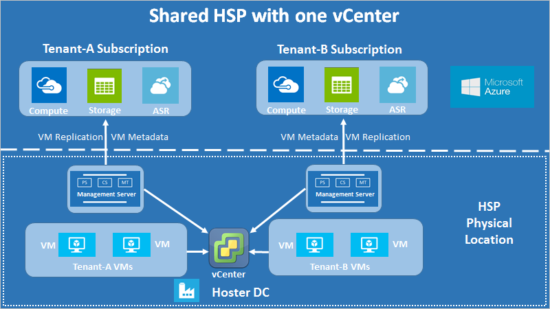  

**图 1：一个 vCenter 的共享托管方案**

从上面的示意图来看，每个客户都会有单独的管理服务器。这样做是为了确保租户只能访问特定于租户的 VM，以便启用租户隔离。VMware 虚拟机复制方案使用配置服务器来管理帐户，以便发现 VM 和安装代理。我们遵循多租户环境的相同原则，只是增加了通过 vCenter 访问控制限制 VM 发现这一规定。

根据数据隔离要求，所有敏感的基础结构信息（例如访问凭据）都不能披露给租户。因此，我们建议由合作伙伴全权控制管理服务器的所有组件（配置服务器 (CS)、处理服务器 (PS) 以及主目标服务器 (MT)）。其中包括横向扩展 PS。

### 在多租户方案中，每个 CS 使用两个帐户：

- **vCenter 访问帐户**：此帐户用于发现租户 VM，是为其分配了 vCenter 访问权限的帐户（详见下一部分）。建议合作伙伴亲自在配置工具中输入这些凭据，避免意外泄露访问权限。
- **虚拟机访问帐户**：此帐户用于通过自动推送在租户 VM 上安装移动代理。此帐户通常为域帐户，可以由租户提供给合作伙伴，也可以由合作伙伴直接管理。如果不希望将详细信息直接共享给合作伙伴，租户可以在进行有时间限制的 CS 访问时输入凭据，也可以在合作伙伴的协助下，手动安装移动代理。

### vCenter 访问帐户的要求

CS 需要配置一个分配了特殊角色的帐户，这一点前面部分已详述过。必须注意，此角色分配需要针对 vCenter 访问帐户的每个 vCenter 对象来完成，不能传播到子对象。这样做是为了确保租户隔离，因为传播访问权限也可能会导致意外访问其他对象

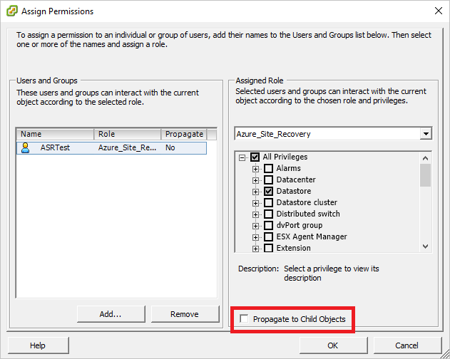  

替代方法是在“数据中心”对象上分配用户帐户和角色，然后将其传播到子对象；这样就必须为该帐户的每个对象（例如其他租户的 VM）提供“禁止访问”角色，禁止特定租户对其进行访问。这样既繁琐又会意外公开访问控制，因为系统会自动为每个新建的子对象授予从父对象继承的访问权限。因此建议使用第一种方法。

vCenter 帐户访问过程如下所示：

1.	通过克隆预定义的“只读”角色创建新角色，并为其提供一个方便的名称（例如此示例中使用的 Azure\_Site\_Recovery）。
2.	将以下权限分配给该角色：
 *	数据存储 -> 分配空间、浏览数据存储、低级别文件操作、删除文件、更新虚拟机文件
 *	网络 -> 网络分配
 *	资源 -> 将 VM 分配到资源池、迁移已关机的 VM、迁移已开机的 VM
 *	任务 -> 创建任务、更新任务
 *	虚拟机 -> 配置
 *	虚拟机 -> 交互 -> 回答问题、设备连接、配置 CD 介质、配置软盘介质、关机、开机、VMware 工具安装
 *	虚拟机 -> 清单 -> 创建、注册、取消注册
 *	虚拟机 -> 预配 -> 允许虚拟机下载、允许虚拟机文件上载
 *	虚拟机 -> 快照 -> 删除快照。

	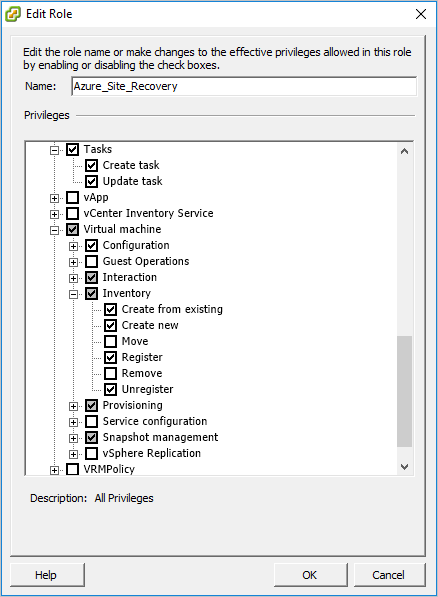  

3.	将访问级别分配给不同对象的 vCenter 帐户（在租户 CS 中使用），如下所示：

| **对象** | **角色** | **备注** |
| --- | --- | --- |
| vCenter | 只读 | 需要获取 vCenter 访问权限来管理不同对象时，才需要此项。如果不需要将此帐户提供给租户，或者不需要使用此帐户在 vCenter 进行任何管理操作，则可删除此权限。 |
| 数据中心 | Azure\_Site\_Recovery | |
| 主机和主机群集 | Azure\_Site\_Recovery | 请再次确保访问权限为对象级别，因此只能访问那些在故障转移之前和之后都会有租户 VM 的主机。 |
| 数据存储和数据存储群集 | Azure\_Site\_Recovery | 同上 |
| 网络 | Azure\_Site\_Recovery | |
| 管理服务器 | Azure\_Site\_Recovery | 这包括对所有组件（CS、PS 和 MT）的访问权限（如果某个组件位于 CS 计算机外部）。 |
| 租户 VM | Azure\_Site\_Recovery | 确保特定租户的任何新租户 VM 也会获得此访问权限，否则无法通过 Azure 门户发现这些 VM。 |

vCenter 帐户访问现已完成。这样可满足完成故障回复操作的最低权限要求。请注意，这些访问权限也可与现有策略结合使用。只需修改现有权限集，包括上面详述的第 2 点中的角色权限即可。

若要限制 DR 操作直至出现故障转移状态（即没有故障回复功能），请按上述过程操作，但只能向 vCenter 访问帐户分配“只读”角色，而不能向该帐户分配“Azure\_Site\_Recovery”角色。此权限集允许 VM 复制和故障转移，不允许故障回复。请注意，上述过程中的所有其他内容保留原样。每个权限仍然只在对象级别分配，不传播到子对象，以便确保租户隔离并限制 VM 发现。

## 其他多租户环境

上述指南详述了如何设置共享托管解决方案的多租户环境。其他两个主要解决方案为专用托管解决方案和托管服务解决方案。这些解决方案的体系结构如下所示：

### 专用托管解决方案

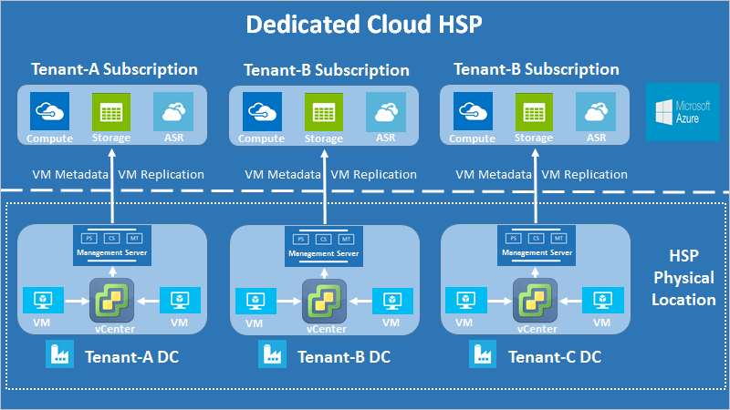  

**图 2：多个 vCenter 的专用托管方案**

此处的体系结构差异是，每个租户的基础结构只是针对该租户预配的。托管提供者仍需遵循共享托管的详细 CSP 步骤，但不需担心租户隔离，因为租户是通过单独的 vCenter 隔离的。CSP 预配保持不变。

### 托管服务解决方案

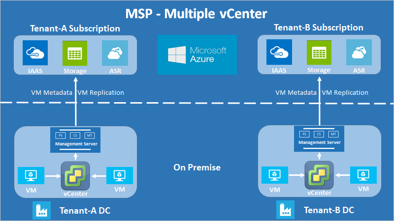  

**图 3：多个 vCenter 的托管服务方案**

此处的体系结构差异是，每个租户的基础结构在物理上也是与其他租户隔离的。当租户拥有基础结构且只需解决方案提供商管理 DR 时，通常使用此方案。合作伙伴仍需遵循共享托管的详细 CSP 步骤，但不需担心租户隔离，因为租户是通过不同的基础结构进行物理隔离的。CSP 预配保持不变。

## CSP 计划概述
Microsoft 的云解决方案提供商 (CSP) [计划](https://partner.microsoft.com/zh-CN/cloud-solution-provider)提供包括 O365、EMS 和 Microsoft Azure 在内的所有 Microsoft 云服务，适合希望通过产品组合充分发挥产品功能的合作伙伴使用。合作伙伴可以通过该计划与客户建立端到端关系，并在建立关系的过程中充当主要联络点。合作伙伴可以通过 CSP 为客户部署 Azure 订阅，并将这些订阅与自己的增值型自定义产品/服务相结合。

就 Azure Site Recovery 来说，合作伙伴可以通过 CSP 为客户直接管理完整的灾难恢复解决方案，或者使用 CSP 设置 Azure Site Recovery 环境，让客户以自助服务方式管理其自身的 DR 需求。在这两种方案中，合作伙伴是 Azure Site Recovery 和最终客户之间的纽带，致力于维护客户关系，同时向客户收取 Azure Site Recovery 使用费。

## 创建和管理租户帐户

### 步骤 0：先决条件检查

VM 先决条件与 Azure Site Recovery [文档](/documentation/articles/site-recovery-vmware-to-azure/)所述相同。除了这些先决条件，在通过 CSP 进行租户管理之前，还应将上述访问控制准备到位。为每个租户创建单独的管理服务器，以便与租户 VM 以及合作伙伴的 vCenter 通信。仅合作伙伴具有该服务器的访问权限。

### 步骤 1：创建租户帐户

1.	通过[合作伙伴中心](https://partnercenter.microsoft.com/)登录到 CSP 帐户。从左侧的仪表板菜单中，选择“客户”选项。

	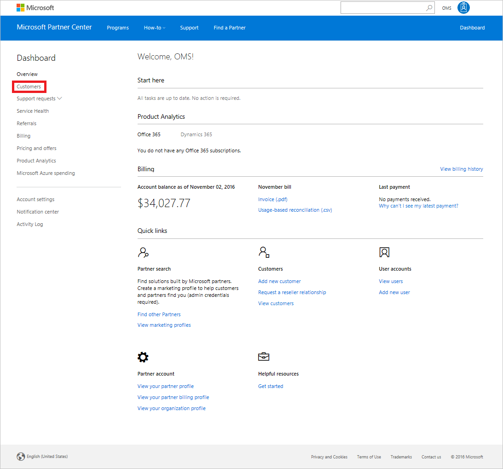  

2.	在打开的网页上，单击“添加客户”按钮。

	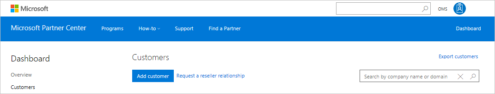  

3.	在“新建客户”页上，填写租户的所有帐户信息细节，然后单击“下一步: 订阅”。

	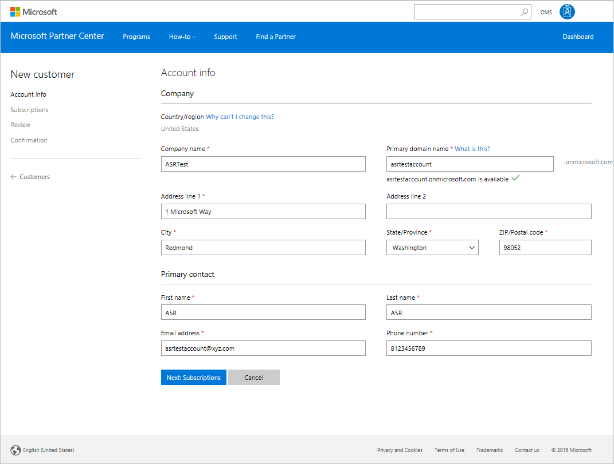  

4.	在订阅选择页上向下滚动，添加“Microsoft Azure”订阅。可以在现在或未来的某个时刻添加其他订阅。

	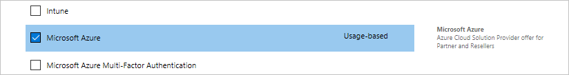  

5.	转到下一页，查看为租户输入的所有详细信息，然后单击“提交”按钮。

	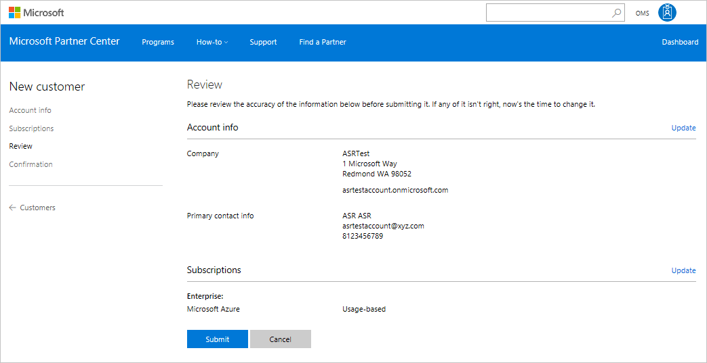  

6.	创建客户以后，将会显示一个确认页，其中包含该订阅的默认帐户和密码等详细信息。保存信息，以后可根据需要通过 Azure 门户登录名更改密码。可以将此信息原样与租户共享，也可根据需要创建和共享单独的帐户。

### 步骤 2：访问租户帐户

1.	可以根据步骤 1 中的说明，通过仪表板从“客户”页访问租户的订阅。导航到该处，单击刚创建的租户帐户的名称。
2.	此时会打开租户帐户的“订阅”部分，然后即可在该处监视帐户的现有订阅，并根据需要添加更多订阅。若要管理租户的 DR 操作，请选择页面右侧的“所有资源(Azure 门户)”选项。

	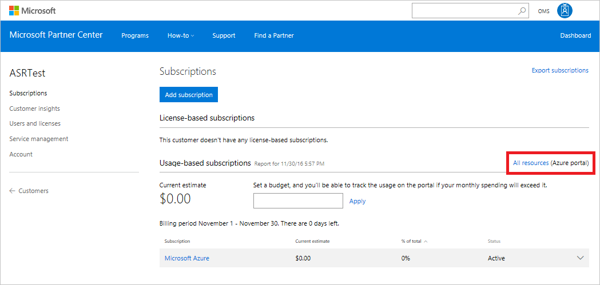  

3.	单击“所有资源”按钮，系统就会授予用户访问租户的 Azure 订阅的权限，而用户则可通过查看显示在 Azure 门户右上角的 AAD 来验证这一点。

	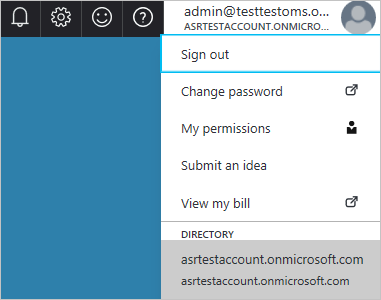  

用户现在可以通过 Azure 门户执行针对租户的所有 Site Recovery 操作，以及管理 DR 操作。每次通过 CSP 访问租户订阅以实现托管 DR 时，都必须遵循上述详细过程。

### 步骤 3：将资源部署到租户订阅
1.	在 Azure 门户中，按照常规过程创建资源组并部署恢复服务保管库。下载保管库注册密钥。
2.	使用保管库注册密钥为租户注册 CS。
3.	输入两个访问帐户（vCenter 访问帐户和 VM 访问帐户）的凭据。

	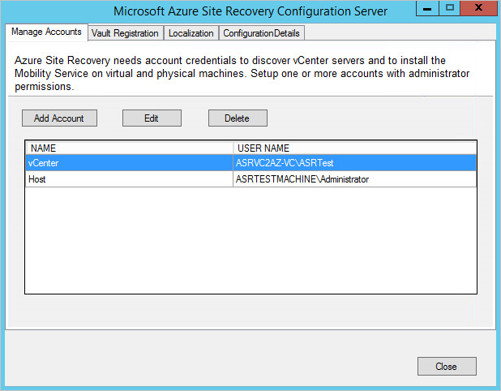  

### 步骤 4：将站点恢复基础结构注册到恢复服务保管库
1.	打开 Azure 门户，在此前创建的保管库上，将 vCenter 服务器注册到在上一步注册的 CS。将 vCenter 访问帐户用于此目的。
2.	按照常规过程完成 Site Recovery 的“准备基础结构”过程。
3.	VM 现在可以进行复制了。确保在“复制”选项的 VM 选择边栏选项卡上，只有租户的 VM 可见。

	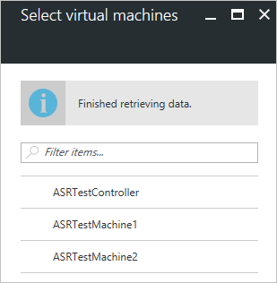  

### 步骤 5：分配租户对订阅的访问权限

对于自助服务 DR，必须向租户提供步骤 1 第 6 项中提到的帐户详细信息。该操作应在合作伙伴设置 DR 基础结构后完成。不管 DR 类型是什么（托管或自助服务），合作伙伴都只能通过 CSP 门户访问租户订阅，同时设置保管库并将所拥有的基础结构注册到租户订阅。

合作伙伴也可通过 CSP 门户将新用户添加到租户订阅，如下所示：

1.	转到特定租户的 CSP 订阅页并选择“用户和许可证”选项。
	
	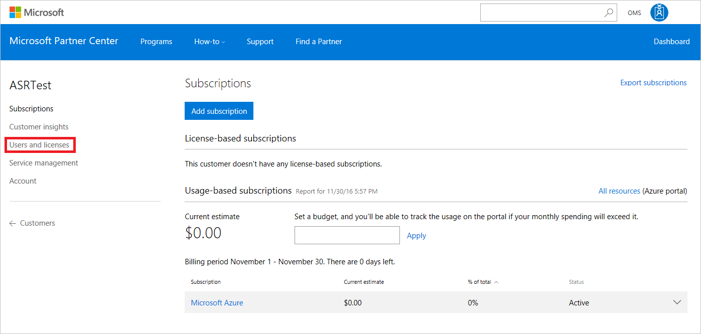  

	你现在可以创建新的用户，只需输入相关详细信息并选择权限，或者通过 CSV 文件上载用户列表即可。
2.	创建用户之后，请返回到 Azure 门户，然后在“订阅”边栏选项卡下选择相关订阅。
3.	在打开的新边栏选项卡上选择“访问控制(IAM)”，然后单击“+添加”添加具有相关访问级别的用户。通过 CSP 门户创建的用户将自动显示在单击一种访问级别后打开的边栏选项卡上。

	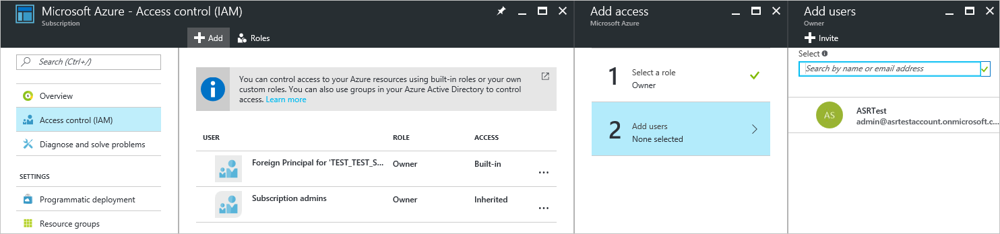  

	对于大多数管理操作，“参与者”角色已足够。具有此访问级别的用户可以对订阅执行所有操作，更改访问级别除外（此操作需要“所有者”级别访问权限）。还可以根据需要微调访问级别。

<!---HONumber=Mooncake_0206_2017-->