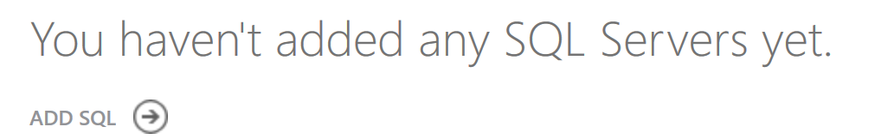
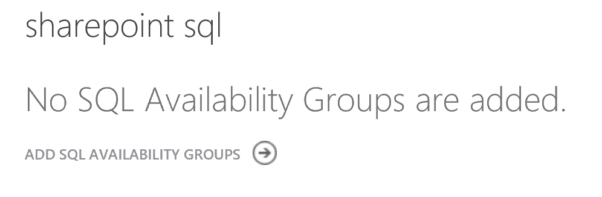
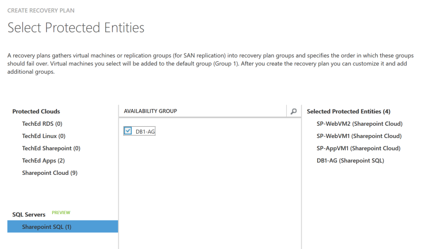
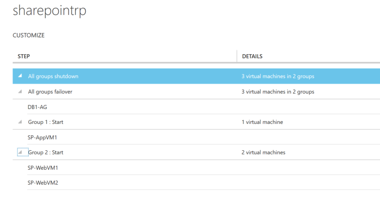

<properties
    pageTitle="使用 SQL Server 和 Azure Site Recovery 复制应用 | Azure"
    description="本文介绍如何使用 Azure Site Recovery 的 SQL Server 灾难功能来复制 SQL Server。"
    services="site-recovery"
    documentationcenter=""
    author="prateek9us"
    manager="gauravd"
    editor="" />
<tags
    ms.assetid="9126f5e8-e9ed-4c31-b6b4-bf969c12c184"
    ms.service="site-recovery"
    ms.workload="backup-recovery"
    ms.tgt_pltfrm="na"
    ms.devlang="na"
    ms.topic="article"
    ms.date="02/22/2017"
    wacn.date="03/31/2017"
    ms.author="pratshar" />

# 使用 SQL Server 灾难恢复和 Azure Site Recovery 来保护 SQL Server

本文介绍如何结合使用 SQL Server 业务连续性和灾难恢复 (BCDR) 技术和 [Azure Site Recovery](/documentation/articles/site-recovery-overview/) 来保护应用程序的 SQL Server 后端。

在开始之前，请确保了解 SQL Server 灾难恢复功能，包括故障转移群集、AlwaysOn 可用性组、数据库镜像和日志传送。

## SQL Server 部署

许多工作负荷使用 SQL Server 作为基础。可将 SQL Server 与 SharePoint、Dynamics 和 SAP 等应用集成来实现数据服务。可通过多种方式部署 SQL Server：

* **独立 SQL Server**：SQL Server 和所有数据库都承载于单台计算机（物理或虚拟）上。虚拟化时，主机群集用于本地高可用性。不会实现来宾级别的高可用性。
* **SQL Server 故障转移群集实例 (AlwaysOn FCI)**：在一个 Windows 故障转移群集中配置两个或更多个运行带共享磁盘的 SQL Server 实例的节点。如果某个节点关闭，群集可将 SQL Server 故障转移到其他实例。此设置通常用于在主站点上实现高可用性。此部署不能防止共享存储层中出现故障或中断。共享磁盘可以使用 iSCSI、光纤通道或共享 vhdx 来实现。
* **SQL AlwaysOn 可用性组**：使用同步复制与自动故障转移在可用性组中配置 SQL Server 数据库时，在不共享任何内容的群集中设置两个或更多个节点。

 本文利用以下本机 SQL 灾难恢复技术将数据库恢复到远程站点：

* SQL AlwaysOn 可用性组，针对 SQL Server 2012 或 2014 Enterprise Edition 提供灾难恢复。
* SQL Server Standard Edition（任何版本）或 SQL Server 2008 R2 高安全性模式下的 SQL 数据库镜像。

## Site Recovery 支持

### 支持的方案
Site Recovery 可以保护下表中汇总的 SQL Server。

**方案** | **到辅助站点** | **到 Azure**
--- | --- | ---
**Hyper-V** | 是 | 是
**物理服务器** | 是 | 是

### 支持的 SQL Server 版本
支持的方案支持以下 SQL Server 版本：

* SQL Server 2014 Enterprise 和 Standard
* SQL Server 2012 Enterprise 和 Standard
* SQL Server 2008 R2 Enterprise 和 Standard

### 支持的 SQL Server 集成

Site Recovery 可与表中汇总的本机 SQL Server BCDR 技术集成，以提供灾难恢复解决方案。

**功能** |**详细信息** | **SQL Server** 
---|---|---
**AlwaysOn 可用性组** |
 SQL Server 的多个独立实例，每个实例在包含多个节点的故障转移群集中运行。

数据库可以分组到可在 SQL Server 实例上复制（镜像）的故障转移组，因此不需要任何共享存储。

在主站点与一个或多个辅助站点之间提供灾难恢复。使用同步复制与自动故障转移在可用性组中配置 SQL Server 数据库时，可以在不共享任何内容的群集中设置两个节点。 
| SQL Server 2014 和 2012 Enterprise 版本
**故障转移群集 (AlwaysOn FCI)** | 
SQL Server 利用 Windows 故障转移群集实现本地 SQL Server 工作负载的高可用性。

使用共享磁盘运行 SQL Server 实例的节点是在故障转移群集中配置的。如果实例关闭，群集将故障转移到另一个节点。

群集无法防止共享存储中的故障或中断。共享磁盘可以使用 iSCSI、光纤通道或共享 VHDX 来实现。 
|
 SQL Server Enterprise 版本

SQL Server Standard 版本（仅限两个节点）

**数据库镜像（高安全性模式）** | 在单个辅助副本中保护单一数据库。提供高安全性（同步）和高性能（异步）复制模式。不需要故障转移群集。 |
 SQL Server 2008 R2

SQL Server Enterprise 的所有版本

**独立 SQL Server** | SQL Server 和数据库托管在单个服务器（物理或虚拟）上。如果是虚拟服务器，则主机群集用于高可用性。没有来宾级别的高可用性。 | Enterprise 或 Standard 版本

## 部署建议
下表汇总了有关将 SQL Server BCDR 技术与 Site Recovery 集成的建议。

| **版本** | **版本** | **部署** | **本地到本地** | **本地到 Azure** |
| --- | --- | --- | --- | --- |
| SQL Server 2014 或 2012 |Enterprise |故障转移群集实例 |AlwaysOn 可用性组 |AlwaysOn 可用性组 |
|| Enterprise |实现高可用性的 AlwaysOn 可用性组 |AlwaysOn 可用性组 |AlwaysOn 可用性组 | |
|| Standard |故障转移群集实例 (FCI) |使用本地镜像进行 Site Recovery 复制 |使用本地镜像进行 Site Recovery 复制 | |
|| Enterprise 或 Standard |独立 |Site Recovery 复制 |Site Recovery 复制 | |
| SQL Server 2008 R2 |Enterprise 或 Standard |故障转移群集实例 (FCI) |使用本地镜像进行 Site Recovery 复制 |使用本地镜像进行 Site Recovery 复制 |
|| Enterprise 或 Standard |独立 |Site Recovery 复制 |Site Recovery 复制 | |
| SQL Server（任何版本） |Enterprise 或 Standard |故障转移群集实例：DTC 应用程序 |Site Recovery 复制 |不支持 |

## 部署先决条件

* 运行受支持 SQL Server 版本的本地 SQL Server 部署。通常还需要为 SQL Server 安装 Active Directory。
* 要部署的方案所要满足的要求。详细了解有关[复制到 Azure](/documentation/articles/site-recovery-support-matrix-to-azure/) 和[本地](/documentation/articles/site-recovery-support-matrix/)的支持要求以及[部署先决条件](/documentation/articles/site-recovery-prereq/)。
* 若要在 Azure 中设置恢复，请在 SQL Server 虚拟机上运行 [Azure 虚拟机准备情况评估](http://www.microsoft.com/download/details.aspx?id=40898)工具，确保虚拟机与 Azure 和 Site Recovery 兼容。

## 设置 Active Directory

在辅助恢复站点上安装 Active Directory，使 SQL Server 能够正常运行。

* **小型企业**：如果使用少量的应用程序和适用于本地站点的单个域控制器，并且需要故障转移整个站点，则建议使用 Site Recovery 复制将域控制器复制到辅助数据中心或 Azure。
* **中大型企业**：如果使用大量的应用程序和 Active Directory 林，并且需要按应用程序或工作负荷进行故障转移，则建议在辅助数据中心或 Azure 中设置附加的域控制器。如果使用 AlwaysOn 可用性组恢复到远程站点，则建议在辅助站点或 Azure 上设置附加的域控制器，供已恢复的 SQL Server 实例使用。

本文中的说明假设辅助位置中提供了域控制器。[详细了解](/documentation/articles/site-recovery-active-directory/)如何使用 Site Recovery 保护 Active Directory。

## 与 SQL Server AlwaysOn 集成以便复制到 Azure（在经典管理门户中使用 VMM/配置服务器）

Site Recovery 本身支持 SQL AlwaysOn。如果已创建 SQL 可用性组并已将 Azure 虚拟机设置为辅助位置，则可以使用 Site Recovery 来管理可用性组的故障转移。

> [AZURE.NOTE] 此功能目前以预览版提供。当主站点中的 Hyper-V 主机服务器在 System Center VMM 云中管理时，可以使用此功能。
>
>

#### 开始之前

若要将 SQL AlwaysOn 与 Site Recovery 集成，需要：

* 本地 SQL Server（独立服务器或故障转移群集）。
* 一个或多个装有 SQL Server 的 Azure 虚拟机。
* 已在本地 SQL Server 和 Azure 中运行的 SQL Server 之间设置 SQL Server 可用性组。
* 在本地 SQL Server 上启用 PowerShell 远程控制。VMM 服务器或配置服务器应该能够对 SQL Server 计算机进行远程 PowerShell 调用。
* 应该向本地 SQL Server 计算机添加用户帐户。添加一个至少具有以下权限的 SQL Server 组：
  * ALTER AVAILABILITY GROUP：[此处](https://msdn.microsoft.com/zh-cn/library/hh231018.aspx)和[此处](https://msdn.microsoft.com/zh-cn/library/ff878601.aspx#Anchor_3)的权限
  * ALTER DATABASE - [此处](https://msdn.microsoft.com/zh-cn/library/ff877956.aspx#Security)的权限
* 如果运行 VMM，应在 VMM 服务器上创建 RunAs 帐户
* 应在本地运行的 SQL Server 上和 Azure VM 上安装 SQL PS 模块。
* 应在 Azure VM 上安装 VM 代理。
* NTAUTHORITY\\System 应该对 Azure VM 上运行的 SQL Server 具有以下权限。
  * ALTER AVAILABILITY GROUP：[此处](https://msdn.microsoft.com/zh-cn/library/hh231018.aspx)和[此处](https://msdn.microsoft.com/zh-cn/library/ff878601.aspx#Anchor_3)的权限
  * ALTER DATABASE - [此处](https://msdn.microsoft.com/zh-cn/library/ff877956.aspx#Security)的权限

### 添加 SQL Server
1. 单击“添加 SQL”以添加新的 SQL Server。

      

2. 在“配置 SQL 设置”>“名称”中，为 SQL Server 提供一个友好名称。
3. 在“SQL Server (FQDN)”中，指定要添加的源 SQL Server 的 FQDN。如果 SQL Server 安装在故障转移群集上，请提供群集的 FQDN，而不是群集节点的 FQDN。
4. 在“SQL Server 实例”中，选择默认实例或提供自定义名称。
5. 在“管理服务器”中，选择在保管库中注册的 VMM 服务器或配置服务器。Site Recovery 使用此服务器来与 SQL Server 通信。
6. 在“运行方式帐户”中，提供 VMM RunAs 帐户或配置服务器帐户的名称。此帐户用于访问 SQL Server，并且应该对 SQL Server 计算机上的可用性组具有读取和故障转移权限。

      

添加 SQL Server 之后，它会显示在“SQL Server”选项卡中。

  

### 添加 SQL 可用性组

1. 在添加的 SQL Server 中，单击“添加 SQL 可用性组”。

      

2. 可用性组可以复制到一个或多个 Azure VM。添加该组时，需要提供希望 Site Recovery 将该组故障转移到的 Azure VM 的名称和订阅。

      

3. 在本示例中，可用性组 DB1-AG 在故障转移之后，会变成订阅 DevTesting2 中运行的虚拟机 SQLAGVM2 上的主节点。

> [AZURE.NOTE] 只能将用作所添加的 SQL Server 上的主节点的可用性组添加到 Site Recovery。如果已在 SQL Server 上将可用性组设为主节点，或者在添加可用性组后在 SQL Server 上添加了更多可用性组，请刷新 SQL Server 上的组。
>
>

### 创建恢复计划

使用虚拟机和可用性组创建恢复计划。选择 VMM 服务器或配置服务器作为源，选择 Azure 作为目标。

  

  

在本示例中，Sharepoint 应用包含 3 个虚拟机，这些虚拟机使用 SQL 可用性组作为后端。在此恢复计划中，可以选择可用性组和应用 VM。可以通过将 VM 移到不同的故障转移组来排列故障转移的顺序，从而进一步自定义恢复计划。始终先故障转移可用性组，因为它用作应用后端。

  

### 故障转移

将可用性组添加到恢复计划后，可以使用不同的故障转移选项。

**故障转移** | **详细信息**
--- | ---
**计划的故障转移** | 计划的故障转移意味着不会丢失数据的故障转移。若要实现该故障转移，应先将 SQL 可用性组模式设置为同步，然后触发故障转移，使可用性组在提供的虚拟机上成为主节点，同时将该组添加到 Site Recovery。完成故障转移之后，可用性模式会设置为触发计划故障转移之前的相同值。
**未计划的故障转移** | 未计划的故障转移可能会造成数据丢失。触发未计划的故障转移时，组的可用性模式不会更改。该组会成为提供的虚拟机上的主节点，同时将可用性组添加到 Site Recovery。完成未计划的故障转移并且运行 SQL Server 的本地服务器再次可用之后，必须在可用性组上触发反向复制。可以在“SQL Server”>“SQL 可用性组”中执行此操作，但不能针对恢复计划执行此操作。
**测试故障转移** |不支持对 SQL 可用性组执行测试故障转移。如果触发测试故障转移，将跳过可用性组的故障转移。

请尝试以下故障转移选项。

| 选项 | 详细信息 |
| --- | --- |
| **选项 1** |
1\.执行应用程序层和前端层的测试故障转移。

2.更新应用程序层，以便在只读模式下访问副本，并执行应用程序的只读测试。
 |
| **方法 2** |
1\.创建副本 SQL Server 虚拟机实例的副本（使用 VMM 克隆进行站点到站点备份或 Azure 备份），并在测试网络中启动该副本

 2.使用恢复计划执行测试故障转移。
 |

### 故障回复

如果需要再次在本地 SQL Server 上使可用性组成为主节点，可以通过针对恢复计划触发计划的故障转移，并选择从 Azure 到本地服务器的方向来实现。

>[AZURE.NOTE] 在执行未计划的故障转移之后，应在可用性组上触发反向复制以继续复制。在完成此操作之前，复制会保持暂停状态。

## 与 SQL Server AlwaysOn 集成以便复制到 Azure（在 Azure 经典管理门户中操作，不要使用 VMM/配置服务器）

如果在不使用 VMM 服务器或配置服务器的情况下使用经典管理门户进行这种集成，则可以参考这些说明。在本方案中，可以使用 Azure 自动化 Runbook 来配置 SQL 可用性组的脚本化故障转移。

需执行的操作如下：

1. 为用于故障转移可用性组的脚本创建本地文件。此示例脚本在 Azure 副本上指定可用性组的路径，并将其故障转移到该副本实例。此脚本通过使用自定义脚本扩展传递，在 SQL Server 副本虚拟机上运行。

    	Param(
    	[string]$SQLAvailabilityGroupPath
    	)
    	import-module sqlps
    	Switch-SqlAvailabilityGroup -Path $SQLAvailabilityGroupPath -AllowDataLoss -force

2.	将脚本上传到 Azure 存储帐户中的 Blob。使用以下示例：

    	$context = New-AzureStorageContext -Environment AzureChinaCloud -StorageAccountName "Account" -StorageAccountKey "Key"
    	Set-AzureStorageBlobContent -Blob "AGFailover.ps1" -Container "script-container" -File "ScriptLocalFilePath" -context $context

3. 创建 Azure 自动化 Runbook，以便在 Azure 中调用 SQL Server 副本虚拟机上的脚本。使用此示例脚本来实现此目的。[详细了解](/documentation/articles/site-recovery-runbook-automation/)如何在恢复计划中使用自动化 Runbook。

1. 创建应用程序的恢复计划时，请添加可调用自动化 Runbook 的“pre-Group 1 boot”脚本步骤以故障转移可用性组。

5. SQL AlwaysOn 原本不支持测试故障转移。因此，我们建议：
	1. 在虚拟机上设置 [Azure 备份](/documentation/articles/backup-azure-vms/)，该虚拟机在 Azure 中托管可用性组副本。
	1. 触发对恢复计划进行测试故障转移之前，请从上一步骤中进行的备份恢复虚拟机。
	1. 对恢复计划进行测试故障转移。

> [AZURE.NOTE]以下脚本假定 SQL 可用性组托管在经典 Azure VM 中，在步骤 2 中还原的虚拟机的名称为 SQLAzureVM-Test。根据已恢复虚拟机的所用名称修改脚本。

    	workflow SQLAvailabilityGroupFailover
    	{
    		param (
        		[Object]$RecoveryPlanContext
    		)

    		$Cred = Get-AutomationPSCredential -name 'AzureCredential'
	
    		#Connect to Azure
    		$AzureAccount = Add-AzureAccount -Environment AzureChinaCloud -Credential $Cred
    		$AzureSubscriptionName = Get-AutomationVariable –Name ‘AzureSubscriptionName’
    		Select-AzureSubscription -SubscriptionName $AzureSubscriptionName
    
    		InLineScript
    		{
     		#Update the script with name of your storage account, key and blob name
     		$context = New-AzureStorageContext -StorageAccountName "Account" -StorageAccountKey "Key";
     		$sasuri = New-AzureStorageBlobSASToken -Container "script-container"- Blob "AGFailover.ps1" -Permission r -FullUri -Context $context;
     
     		Write-output "failovertype " + $Using:RecoveryPlanContext.FailoverType;
               
     		if ($Using:RecoveryPlanContext.FailoverType -eq "Test")
       			{
	                    Write-output "tfo"
                    
	                    Write-Output "Creating ILB"
	                    Add-AzureInternalLoadBalancer -InternalLoadBalancerName SQLAGILB -SubnetName Subnet-1 -ServiceName SQLAzureVM-Test -StaticVNetIPAddress #IP
	                    Write-Output "ILB Created"

						#Update the script with name of the virtual machine recovered using Azure Backup
	                    Write-Output "Adding SQL AG Endpoint"
	                    Get-AzureVM -ServiceName "SQLAzureVM-Test" -Name "SQLAzureVM-Test"| Add-AzureEndpoint -Name sqlag -LBSetName sqlagset -Protocol tcp -LocalPort 1433 -PublicPort 1433 -ProbePort 59999 -ProbeProtocol tcp -ProbeIntervalInSeconds 10 -InternalLoadBalancerName SQLAGILB | Update-AzureVM

	                    Write-Output "Added Endpoint"
        
	                    $VM = Get-AzureVM -Name "SQLAzureVM-Test" -ServiceName "SQLAzureVM-Test" 
                       
	                    Write-Output "UnInstalling custom script extension"
	                    Set-AzureVMCustomScriptExtension -Uninstall -ReferenceName CustomScriptExtension -VM $VM |Update-AzureVM 
	                    Write-Output "Installing custom script extension"
	                    Set-AzureVMExtension -ExtensionName CustomScriptExtension -VM $vm -Publisher Microsoft.Compute -Version 1.*| Update-AzureVM   
                    
	                    Write-output "Starting AG Failover"
	                    Set-AzureVMCustomScriptExtension -VM $VM -FileUri $sasuri -Run "AGFailover.ps1" -Argument "-Path sqlserver:\sql\sqlazureVM\default\availabilitygroups\testag"  | Update-AzureVM
	                    Write-output "Completed AG Failover"
       			}
     		else
       			{
           		Write-output "pfo/ufo";
           		#Get the SQL Azure Replica VM.
           		#Update the script to use the name of your VM and Cloud Service
           		$VM = Get-AzureVM -Name "SQLAzureVM" -ServiceName "SQLAzureReplica";     
       
           		Write-Output "Installing custom script extension"
           		#Install the Custom Script Extension on teh SQL Replica VM
                	Set-AzureVMExtension -ExtensionName CustomScriptExtension -VM $VM -Publisher Microsoft.Compute -Version 1.*| Update-AzureVM;
                    
           		Write-output "Starting AG Failover";
           		#Execute the SQL Failover script
           		#Pass the SQL AG path as the argument.
       
           		$AGArgs="-SQLAvailabilityGroupPath sqlserver:\sql\sqlazureVM\default\availabilitygroups\testag";
       
           		Set-AzureVMCustomScriptExtension -VM $VM -FileUri $sasuri -Run "AGFailover.ps1" -Argument $AGArgs | Update-AzureVM;
       
           		Write-output "Completed AG Failover";

       			}
        
    		}
    	}

## 与 SQL Server AlwaysOn 集成以便复制到辅助本地站点

如果 SQL Server 使用可用性组（或 FCI）实现高可用性，则建议也在恢复站点上使用可用性组。请注意，这适用于不使用分布式事务的应用。

1. 在可用性组中[配置数据库](https://msdn.microsoft.com/zh-cn/library/hh213078.aspx)。
2. 在辅助站点上创建虚拟网络。
3. 在该虚拟网络与主站点之间配置站点到站点 VPN 连接。
4. 在恢复站点上创建虚拟机，并在其上安装 SQL Server。
5. 将现有的 AlwaysOn 可用性组扩展为新的 SQL Server VM。将此 SQL Server 实例配置为异步副本。
6. 创建可用性组侦听器，或更新现有的侦听器，以包含异步副本虚拟机。
7. 确保应用程序场是使用侦听器设置的。如果它是使用数据库服务器名称设置的，请将其更新为使用侦听器，以便不需要在故障转移后重新配置该场。

对于使用分布式事务的应用程序，建议使用 [SAN 复制](/documentation/articles/site-recovery-vmm-san/)部署 Site Recovery。

### 恢复计划注意事项
1. 将此示例脚本添加到主站点和辅助站点上的 VMM 库。

    	Param(
    	[string]$SQLAvailabilityGroupPath
    	)
    	import-module sqlps
    	Switch-SqlAvailabilityGroup -Path $SQLAvailabilityGroupPath -AllowDataLoss -force

2. 创建应用程序的恢复计划时，请添加可调用脚本的 "pre-Group 1 boot" 脚本化步骤来故障转移可用性组。

## 保护独立 SQL Server

在此方案中，建议使用 Site Recovery 复制来保护 SQL Server 计算机。确切步骤取决于 SQL Server 是 VM 还是物理服务器，以及是要复制到 Azure 还是辅助本地站点。了解 [Site Recovery 方案](/documentation/articles/site-recovery-overview/)。

## 保护 SQL Server 群集 (Standard Edition/Windows Server 2008 R2)

对于运行 SQL Server Standard Edition 或 SQL Server 2008 R2 的群集，建议使用 Site Recovery 复制来保护 SQL Server。

### 本地到本地

- 如果应用使用分布式事务，则建议针对 Hyper-V 环境使用 [SAN 复制](/documentation/articles/site-recovery-vmm-san/)。
- 对于非 DTC 应用程序，可以使用上述方法通过利用本地高安全性 DB 镜像将群集恢复为独立服务器。

### 本地到 Azure

复制到 Azure 时，Site Recovery 不支持来宾群集。SQL Server 也不会为 Standard 版本提供低成本灾难恢复解决方案。在此方案中，建议在独立 SQL Server 中保护本地 SQL Server 群集，并在 Azure 中恢复它。

1. 在本地站点中配置其他独立 SQL Server 实例。
2. 将此实例配置为需要保护的数据库的镜像。在高安全模式下配置镜像。
3. 在本地站点上为 [Hyper-V](/documentation/articles/site-recovery-hyper-v-site-to-azure/) 配置 Site Recovery。
4. 使用 Site Recovery 复制将新的 SQL Server 实例复制到 Azure。由于该实例是高安全性镜像副本，因此会将它与主群集同步，但会使用 Site Recovery 复制将它复制到 Azure。

### 故障回复注意事项

对于 SQL Server Standard 群集，未计划的故障转移后的故障回复需要从镜像实例 SQL Server 备份并还原到原始群集，然后重新建立镜像。

## 后续步骤
[详细了解](/documentation/articles/site-recovery-components/) Site Recovery 体系结构。

<!---HONumber=Mooncake_0327_2017-->
<!--Update_Description: content refine-->