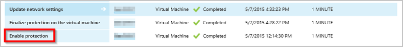
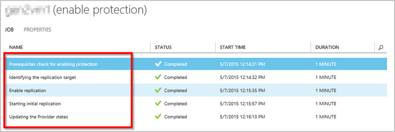
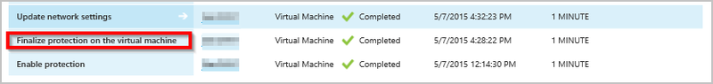

<properties
	pageTitle="了解站点到 Azure 保护" 
	description="使用本文来了解帮助你成功安装、配置和管理 Azure Site Recovery 的技术概念。" 
	services="site-recovery" 
	documentationCenter="" 
	authors="anbacker" 
	manager="mkjain" 
	editor=""/>

<tags 
	ms.service="site-recovery" 
	ms.date="12/14/2015" 
	wacn.date="01/14/2016"/>

# 了解如何通过 Azure Site Recovery 进行 Hyper-V 复制

本文介绍帮助你使用 Azure Site Recovery 成功配置和管理 Hyper-V 站点或 VMM 站点到 Azure 保护的技术概念。

## 了解组件

### 用于在本地与 Azure 之间进行复制的 Hyper-V 站点或 VMM 站点部署。

在本地和 Azure 之间设置 DR 的一部分操作；下载 Azure Site Recovery 提供程序并将其安装在 VMM 服务器上，此外还需要在每个 Hyper-V 主机上安装 Azure 恢复服务代理。

Hyper-V 站点部署与 VMM 部署相同 – 唯一区别在于提供程序和代理都安装在 Hyper-V 主机本身上。

## 了解工作流程

### 启用保护
一旦从门户或本地保护一个虚拟机，则系统将启动一个名为 *启用保护*的 ASR 作业，并在 JOBS 选项卡下进行监视。

*启动保护*作业在调用 [CreateReplicationRelationship](https://msdn.microsoft.com/zh-cn/library/hh850036.aspx)（使用在保护期间配置的输入创建到 Azure 的复制）之前检查先决条件。*启用保护*作业通过调用 [StartReplication](https://msdn.microsoft.com/zh-cn/library/hh850303.aspx)（将虚拟机的虚拟磁盘发送到 Azure），从本地开始初始复制。

### 完成保护
当触发初始复制时，系统会拍摄一个 [Hyper-V 虚拟机快照](https://technet.microsoft.com/zh-cn/library/dd560637.aspx)。系统逐个处理虚拟硬盘，直到所有硬盘都被上载到 Azure。根据磁盘大小和带宽，这通常要花一段时间才能完成。请参阅[如何管理本地到 Azure 保护网络带宽使用](https://support.microsoft.com/zh-cn/kb/3056159)以优化你的网络使用。在初始复制完成时，*在虚拟机上完成保护*作业配置网络和复制后设置。当初始复制正在进行时，对磁盘做出的所有更改都会被记录下来，如下面的“增量复制”所述。当初始复制正在进行时，快照和 HRL 文件会占用额外的磁盘存储空间。在初始复制完成后，Hyper-V 虚拟机快照将被删除，导致系统将初始复制之后发生的数据变更合并到父磁盘中。

### 增量复制
Hyper-V 副本复制跟踪器是 Hyper-V 副本复制引擎的一部分，以 Hyper-V 复制日志 (*.hrl) 的形式记录对虚拟磁盘做出的变更。HRL 文件将位于关联磁盘的相同目录中。为复制配置的每个磁盘有一个关联的 HRL 文件。在初始复制完成后，此日志被发送到客户的存储帐户中。当日志正处于传输到 Azure 的过程中时，主站点中的变更被记录到同一目录中的另一日志文件中。

可以在虚拟机视图中监视初始复制或增量复制期间虚拟机复制的运行状况，如[监视虚拟机的复制运行状况](/documentation/articles/site-recovery-monitoring-and-troubleshooting/#monitor-replication-health-for-virtual-machine)所述。

### 重新同步 
当增量复制失败或完整初始复制占用大量网络带宽（或完成完整初始复制要用很长时间）时，虚拟机会标记为重新同步。例如，当 HRL 文件的大小累积到总磁盘大小的 50% 时，则虚拟机会标记为重新同步。重新同步通过计算源虚拟机磁盘和目标虚拟机磁盘的校验和并只发送差异来最大程度地减小通过网络发送的数据量。

在重新同步完成后，应恢复常规的增量复制。可以在发生中断（例如网络中断、VMMS 崩溃等）的情况下恢复重新同步。

默认情况下，*自动计划的重新同步*配置为非办公时间。如果虚拟机需要手动重新同步，请从门户选择虚拟机，然后单击“重新同步”。

重新同步使用固定块分块算法，其中源文件和目标文件被分为固定区块；生成每个区块的校验和，然后进行比较以确保来自源文件中的哪些块需要应用到目标文件。

### 重试逻辑
当出现复制错误时，可以使用内置的重试逻辑。错误可以分为如下所述的两类：

| 类别 | 方案 |
|---------------------------|----------------------------------------------|
| 不可恢复的错误 | 将不会重试。虚拟机复制状态将显示为“严重”，并且需要管理员干预。示例包括 <ul><li>VHD 链中断</li><li>副本虚拟机处于无效状态</li><li>网络身份验证错误</li><li>身份验证错误</li><li>在独立 Hyper-V 服务器的情况下如果找不到虚拟机</li></ul>|
| 可恢复的错误 | 使用从第一次尝试开始增大重试间隔时间（1、2、4、8、10 分钟）的指数退避算法，在到达复制间隔时间后重试。如果错误仍然存在，则每隔 30 分钟重试一次。示例包括 <ul><li>网络错误</li><li>磁盘空间不足</li><li>内存不足</li></ul>|

## 了解 Hyper-V 虚拟机保护和恢复生命周期

## 其他参考资料

- [监视 VMware、VMM、Hyper-V 和物理站点的保护以及对其进行故障排除](/documentation/articles/site-recovery-monitoring-and-troubleshooting/)
- [联系 Microsoft 技术](/documentation/articles/site-recovery-monitoring-and-troubleshooting/#reaching-out-for-microsoft-support)
- [常见 ASR 错误及其解决方法](/documentation/articles/site-recovery-monitoring-and-troubleshooting/#common-asr-errors-and-their-resolutions)

<!---HONumber=Mooncake_0104_2016-->