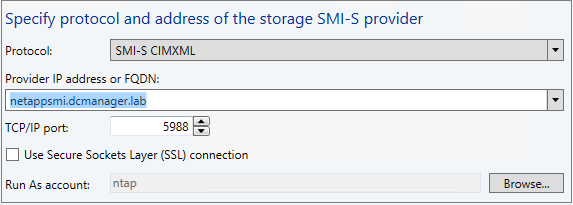
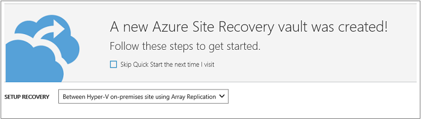
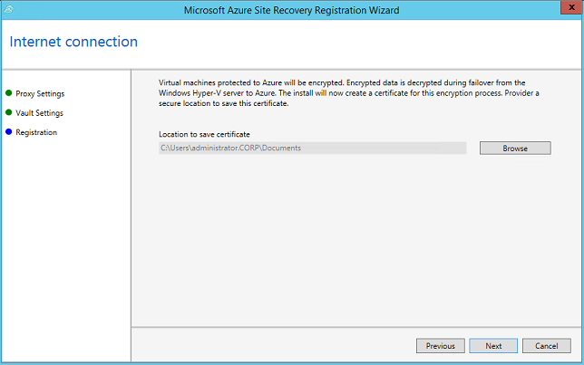
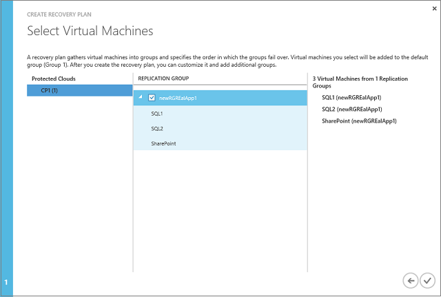

<properties
    pageTitle="通过 Azure Site Recovery 使用 SAN 复制 VMM 中的 Hyper-V VM | Azure"
    description="本文介绍如何通过 Azure Site Recovery 使用 SAN 复制在两个站点之间复制 Hyper-V 虚拟机。"
    services="site-recovery"
    documentationcenter=""
    author="rayne-wiselman"
    manager="jwhit"
    editor="" />
<tags
    ms.assetid="eb480459-04d0-4c57-96c6-9b0829e96d65"
    ms.service="site-recovery"
    ms.workload="backup-recovery"
    ms.tgt_pltfrm="na"
    ms.devlang="na"
    ms.topic="article"
    ms.date="02/19/2017"
    wacn.date="03/31/2017"
    ms.author="raynew" />

# 使用 Azure Site Recovery 和 SAN 将 VMM 云中的 Hyper-V VM 复制到辅助站点

如果需要部署 [Azure Site Recovery](/documentation/articles/site-recovery-overview/) 以便在经典管理门户中使用 Azure Site Recovery 来管理从 Hyper-V VM（在 System Center Virtual Machine Manager 云中管理）到辅助 VMM 站点的复制，请参考本文。在新 Azure 门户中无法使用此方案。

## 为什么要使用 SAN 和 Site Recovery 进行复制？

* SAN 提供一个可缩放的企业级复制解决方案，以便包含 Hyper-V 且具有 SAN 的主站点可通过 SAN 将 LUN 复制到辅助站点。存储由 VMM 管理，而复制和故障转移通过 Site Recovery 进行协调安排。
* Site Recovery 与多个 [SAN 存储合作伙伴](http://social.technet.microsoft.com/wiki/contents/articles/28317.deploying-azure-site-recovery-with-vmm-and-san-supported-storage-arrays.aspx)协作，可跨光纤通道和 iSCSI 存储提供复制。
* 使用现有的 SAN 基础结构来保护 Hyper-V 群集中部署的任务关键型应用。VM 可作为一个组进行复制，从而使 N 层应用可一致地进行故障转移。
* SAN 复制确保在不同的应用程序层实现复制一致性，其中使用同步复制以实现较低的 RTO 和 RPO，使用异步复制实现较高的灵活性（具体取决于存储阵列功能）。
* 可在 VMM 结构中管理 SAN 存储，并在 VMM 中使用 SMI-S 来发现现有存储。

请注意：

- 通过 SAN 实现的站点到站点复制在 Azure 门户中不可用。这种复制仅在经典管理门户中可用。无法在经典管理门户中创建新的保管库。可保留现有保管库。
- 不支持从 SAN 复制到 Azure。
- 无法复制通过 iSCSI 或光纤通道直接连接到 VM 的共享 VHDX 或逻辑单元 (LUN)。可以复制来宾群集。

## 体系结构

  

- **Azure**：在 Azure 门户中设置 Site Recovery 保管库。
- **SAN 存储**：在 VMM 结构中管理 SAN 存储。添加存储提供程序、创建存储分类和设置存储池。
- **VMM 和 Hyper-V**：建议在每个站点中设一个 VMM 服务器。设置 VMM 私有云，并将 Hyper-V 群集放置在这些云中。部署期间，会在每个 VMM 服务器上安装 Azure Site Recovery 提供程序，且服务器会在保管库中进行注册。此提供程序与 Site Recovery 服务进行通信，以管理复制、故障转移和故障回复。
- **复制**：在 VMM 中设置存储并在 Site Recovery 中配置复制后，将在主 SAN 存储和辅助 SAN 存储间发生复制。不会向 Site Recovery 发送任何复制数据。
- **故障转移**：在 Site Recovery 门户中启用故障转移。由于复制为同步复制，因此故障转移期间不会发生数据丢失。
- **故障回复**：若要进行故障回复，请启用反向复制，以便将增量更改从辅助站点转移到主站点。反向复制完成后，运行已计划的从辅助站点到主站点的故障转移。此计划的故障转移会停止辅助站点上的副本 VM，并在主站点上启动它们。

## 开始之前

**先决条件** | **详细信息** 
--- | ---
**Azure**| 需要一个 [Azure](https://azure.cn/) 帐户。你可以从 [1rmb 试用版](/pricing/1rmb-trial/)开始。[详细了解](/pricing/details/site-recovery/) 站点恢复定价。 
**VMM** | 
可使用单个 VMM 服务器并在不同的云之间进行复制，但建议在主站点和辅助站点中各使用一个 VMM。可将 VMM 部署为物理或虚拟独立服务器，或者部署为群集。

VMM 服务器应当运行具有最新累积更新的 System Center 2012 R2 或更高版本。

 需在要保护的主 VMM 服务器上和要用于故障转移的辅助 VMM 服务器上各至少配置一个云。

 源云必须包含一个或多个 VMM 主机组。

 所有 VMM 云都必须设置 Hyper-V 容量配置文件。

 有关设置 VMM 云的详细信息，请参阅[部署专用 VM 云](https://technet.microsoft.com/zh-cn/system-center-docs/vmm/scenario/cloud-overview)。

**Hyper-V** | 
主 VMM 云和辅助 VMM 云中需要一个或多个 Hyper-V 群集。

 源 Hyper-V 群集必须包含一个或多个 VM。

 主站点和辅助站点中的 VMM 主机组必须至少包含一个 Hyper-V 群集。

主机和目标 Hyper-V 服务器必须运行具有 Hyper-V 角色且安装了最新更新程序的 Windows Server 2012 或更高版本。

 如果在群集中运行 Hyper-V 并使用基于静态 IP 地址的群集，则不会自动创建群集代理。必须手动对其进行配置。有关详细信息，请参阅[为 Hyper-V 副本准备主机群集](https://www.petri.com/use-hyper-v-replica-broker-prepare-host-clusters)。

**SAN 存储** | 
可通过 iSCSI 或通道存储，或使用共享虚拟硬盘 (vhdx) 复制来宾群集虚拟机。

 需要两个 SAN 阵列，一个在主站点中，一个在辅助站点中。

 应在阵列之间设置网络基础结构。应该配置对等互连和复制。应该配置对等互连和复制。应该根据存储阵列要求设置复制许可证。

在 Hyper-V 主机服务器与存储阵列之间设置网络，使主机能够使用 iSCSI 或光纤通道与存储 LUN 通信。

 请参阅[支持的存储阵列](http://social.technet.microsoft.com/wiki/contents/articles/28317.deploying-azure-site-recovery-with-vmm-and-san-supported-storage-arrays.aspx)。

 应安装 SMI-S 提供程序（由存储阵列制造商提供），并且 SAN 阵列应由提供程序管理。根据制造商说明设置提供程序。

确保阵列的 SMI-S 提供程序位于 VMM 服务器可以使用 IP 地址或 FQDN 通过网络访问的服务器上。

 每个 SAN 阵列应具有一个或多个可用的存储池。

 主 VMM 服务器应管理主阵列，辅助 VMM 服务器应管理辅助阵列。

**网络映射** | 
设置网络映射，以便在故障转移后使复制的虚拟机以最佳方式放置在辅助 Hyper-V 主机服务器上，并使其连接到适当的 VM 网络。如果不配置网络映射，则故障转移之后，副本 VM 将不会连接到任何网络。

 确保 VMM 网络配置正确，以便在 Site Recovery 部署期间设置网络映射。在 VMM 中，源 Hyper-V 主机上的 VM 应连接到 VMM VM 网络。该网络应链接到与该云相关联的逻辑网络。

 目标云应具有相应的 VM 网络，而该网络应链接到与目标云关联的相应逻辑网络。

## 步骤 1：准备 VMM 基础结构
若要准备 VMM 基础结构，需要：

1. 验证 VMM 云。
2. 集成并分类 VMM 中的 SAN 存储。
3. 创建 LUN 并分配存储。
4. 创建复制组。
5. 设置 VM 网络。

### 验证 VMM 云

开始部署 Site Recovery 之前，请确保 VMM 云设置正确。

### 集成并分类 VMM 结构中的 SAN 存储

1. 在 VMM 控制台中，转到“结构”>“存储”>“添加资源”>“存储设备”。
2. 在“添加存储设备”向导中，选择“选择存储提供程序类型”，然后选择“SMI-S 提供程序发现和管理的 SAN 与 NAS 设备”。

	

3. 在“指定存储 SMI-S 提供程序的协议和地址”页上，选择“SMI-S CIMXML”，并指定用于连接提供程序的设置。
4. 在“提供程序 IP 地址或 FQDN”和“TCP/IP 端口”中，指定用于连接提供程序的设置。只能对 SMI-S CIMXML 使用 SSL 连接。

	

5. 在“运行方式帐户”中，指定可以访问提供程序的 VMM 运行方式帐户，或创建一个帐户。
6. 在“收集信息”页上，VMM 会自动尝试发现并导入存储设备信息。若要重试发现，请单击“扫描提供程序”。如果发现过程成功，发现的存储阵列、存储池、制造商、型号和容量将列在页中。

	

7. 在“选择要接受管理的存储池并分配分类”中，选择 VMM 将要管理的存储池，并为其分配一个分类。将从存储池导入 LUN 信息。根据需要保护的应用程序、其容量要求以及需要同时复制的内容创建 LUN。

	

### 创建 LUN 并分配存储

根据需要保护的应用程序、容量要求以及需要同时复制的内容创建 LUN。

1. VMM 结构中出现存储后，可[预配 LUN](https://technet.microsoft.com/zh-cn/system-center-docs/vmm/manage/manage-storage-host-groups#create-a-lun-in-vmm)。

     > [AZURE.NOTE]
     不要为被启用以实现到 LUN 的复制的 VM 添加 VHD。如果这些 LUN 不在 Site Recovery 复制组中，Site Recovery 将检测不到它们。
     >

2. 向 Hyper-V 主机群集分配存储容量，使 VMM 能够将虚拟机数据部署到设置的存储中：

   * 在向群集分配存储之前，需要向群集所在的 VMM 主机组分配存储。有关详细信息，请参阅[如何向 VMM 中的主机组分配存储逻辑单元](https://technet.microsoft.com/zh-cn/library/gg610686.aspx)和[如何向 VMM 中的主机组分配存储池](https://technet.microsoft.com/zh-cn/library/gg610635.aspx)。
   * 根据[如何在 VMM 中的 Hyper-V 主机群集上配置存储](https://technet.microsoft.com/zh-cn/library/gg610692.aspx)中所述，向群集分配存储容量。

      

3. 在“指定存储 SMI-S 提供程序的协议和地址”中，选择“SMI-S CIMXML”。指定用于连接到提供程序的设置。只能对 SMI-S CIMXML 使用 SSL 连接。

      

4. 在“运行方式帐户”中，指定可以访问提供程序的 VMM 运行方式帐户，或创建一个帐户。
5. 在“收集信息”中，VMM 会自动尝试发现并导入存储设备信息。如需重试，请单击“扫描提供程序”。发现过程成功后，存储阵列、存储池、制造商、型号和容量将在页中列出。

      

7. 在“选择要接受管理的存储池并分配分类”中，选择 VMM 将要管理的存储池，并为其分配一个分类。将从存储池导入 LUN 信息。

      

### 创建复制组

创建一个复制组，其中包含需要一起复制的所有 LUN。

1. 在 VMM 控制台中，打开存储阵列属性的“复制组”选项卡，然后单击“新建”。
2. 创建复制组。

	

### 设置网络

如果需要配置网络映射，请执行以下操作：

1. 请参阅“Site Recovery 网络映射”。
2. 在 VMM 中准备 VM 网络：

   * [设置逻辑网络](https://technet.microsoft.com/zh-cn/system-center-docs/vmm/manage/manage-network-logical-networks)。
   * [设置 VM 网络](https://technet.microsoft.com/zh-cn/system-center-docs/vmm/manage/manage-network-vm-networks)。

## 步骤 2：创建保管库

1. 从你要注册的 VMM 服务器登录到[管理门户](https://manage.windowsazure.cn)。

2. 展开“数据服务”>“恢复服务”，然后单击“Site Recovery 保管库”。
3. 单击“新建”>“快速创建”。
4. 在“名称”中，输入一个友好名称以标识此保管库。
5. 在“区域”中，为保管库选择地理区域。若要查看受支持的区域，请参阅 [Azure Site Recovery 定价详细信息](/pricing/details/site-recovery/)。
6. 单击“创建保管库”。

	

检查状态栏，确认保管库已成功创建。保管库将以“活动”状态列在主要的“恢复服务”页上。

### 注册 VMM 服务器

1. 从“恢复服务”页打开“快速启动”页。也可随时选择相应的图标打开“快速启动”。

	

2. 在下拉框中，选择“在 Hyper-V 本地站点之间使用阵列复制”。

	

3. 在“准备 VMM 服务器”中，下载最新版的 Azure Site Recovery 提供程序安装文件。
4. 在源 VMM 服务器上运行此文件。如果 VMM 部署到群集中并且你是首次安装该提供程序，请将提供程序安装在一个活动节点上并完成安装，以便在保管库中注册 VMM 服务器。然后，在其他节点上安装该提供程序。如果要升级提供程序，则需要在所有节点上进行升级，使所有节点上的提供程序版本相同。
5. 安装程序将检查要求，并请求授权停止 VMM 服务以开始安装提供程序。服务将在安装完成时自动重新启动。如果在 VMM 群集上安装，系统会提示停止群集角色。
6. 在“Microsoft 更新”中，可以选择进行更新，这样就会根据 Microsoft 更新策略安装提供程序更新。

	

7. 提供程序的默认安装位置为 <SystemDrive>\\Program Files\\Microsoft System Center 2012 R2\\Virtual Machine Manager\\bin。单击“安装”开始安装。

      

8. 安装提供程序后，请单击“注册”，在保管库中注册 VMM 服务器。

      

9. 在“Internet 连接”中，指定提供程序如何连接到 Internet。若要使用服务器上的默认 Internet 连接设置，请选择“使用默认系统代理设置”。

	

   * 如果要使用自定义代理，请在安装提供程序之前进行设置。当配置自定义代理设置时，会运行测试来检查代理连接。
   * 如果确定要使用自定义代理，或者默认代理要求进行身份验证，则应输入代理详细信息，包括地址和端口。
   * 应当可从 VMM 服务器访问必需的 URL。
   * 如果使用自定义代理，系统将使用指定的代理凭据自动创建一个 VMM 运行方式帐户 (DRAProxyAccount)。对代理服务器进行配置以便该帐户可以通过身份验证。可在 VMM 控制台中修改运行方式帐户设置（“设置”>“安全”>“运行方式帐户”>“DRAProxyAccount”）。必须重新启动 VMM 服务才能让更改生效。
10. 在“注册密钥”中，选择从门户下载并复制到 VMM 服务器的密钥。
11. 在“保管库名称”中，验证将要在其中注册服务器的保管库的名称。

	

12. 加密设置仅用于 VMM 到 Azure 的复制。可将其忽略。

	

13. 在“服务器名称”中，指定一个友好名称以在保管库中标识该 VMM 服务器。在群集配置中，指定 VMM 群集角色名称。
14. 在“初始云元数据同步”中，选择是否要同步 VMM 服务器上所有云的元数据。此操作在每个服务器上只需执行一次。如果不希望同步所有云，可以将此设置保留为未选中状态，并在 VMM 控制台的云属性中分别同步各个云。

	

15. 单击“下一步”以完成此过程。注册后，Azure Site Recovery 将检索 VMM 服务器中的元数据。服务器显示在保管库中的“服务器”>“VMM 服务器”中。

### 命令行安装

也可使用以下命令行安装 Azure Site Recovery 提供程序。使用此命令可将提供程序安装在 Server Core for Windows Server 2012 R2 上。

1. 将提供程序安装文件和注册密钥下载到某个文件夹中。例如 C:\\ASR。
2. 停止 VMM 服务。
3. 解压缩提供程序安装程序。以管理员身份运行以下命令：

    	C:\Windows\System32> CD C:\ASR
    	C:\ASR> AzureSiteRecoveryProvider.exe /x:. /q

4. 安装提供程序：

		C:\ASR> setupdr.exe /i

5. 注册提供程序：

    	CD C:\Program Files\Microsoft System Center 2012 R2\Virtual Machine Manager\bin
    	C:\Program Files\Microsoft System Center 2012 R2\Virtual Machine Manager\bin> DRConfigurator.exe /r  /Friendlyname <friendly name of the server> /Credentials <path of the credentials file> /EncryptionEnabled <full file name to save the encryption certificate>         

参数：

* **/Credentials**：必需的参数，表示注册密钥文件所在的位置。
* **/FriendlyName**：必需的参数，表示在 Azure Site Recovery 门户中显示的 Hyper-V 主机服务器名称。
* **/EncryptionEnabled**：可选参数，只会在从 VMM 复制到 Azure 时用到。
* **/proxyAddress**：可选参数，用于指定代理服务器的地址。
* **/proxyport**：可选参数，用于指定代理服务器的端口。
* **/proxyUsername**：可选参数，用于指定代理用户名（如果代理要求身份验证）。
* **/proxyPassword**：可选参数，用于指定密码，以便通过代理服务器进行身份验证（如果代理服务器要求身份验证）。

## 步骤 3：映射存储阵列和池

映射主阵列和辅助阵列，指定哪个辅助存储池要从主池接收复制数据。之所以要在配置复制之前映射存储，是因为对复制组启用保护时要使用映射信息。

开始操作前，请检查 VMM 云是否已显示在保管库中。在提供程序安装期间同步所有云或在 VMM 控制台中同步特定云时都会检测到云。

1. 单击“资源”>“服务器存储”>“映射源和目标阵列”。

2. 选择主站点上的存储阵列，并将其映射到辅助站点上的存储阵列。在“存储池”中选择要映射的源和目标存储池。

	

## 步骤 4：配置复制设置

注册 VMM 服务器后，请配置云保护设置。

1. 在“快速启动”页上，单击“为 VMM 云设置保护”。
2. 在“受保护的项”选项卡中，选择“云”>“配置”。
3. 在“目标”中，选择“VMM”。
4. 在“目标位置”中，选择管理要用于恢复的云的 VMM 服务器。
5. 在“目标云”中，选择要用于 VM 故障转移的目标云。
   * 建议选择可满足要保护的虚拟机的恢复要求的目标云。
   * 一个云只能属于一个云对 - 主云或目标云。
6. Site Recovery 将验证云是否具有 SAN 存储访问权限以及存储阵列是否经过映射。
7. 如果验证成功，请在“复制类型”中选择“SAN”。

保存设置后会创建一个作业，可在“作业”选项卡中监视该作业。可在“配置”选项卡上修改设置。如果希望修改目标位置或目标云，必须删除云配置，然后重新配置该云。

## 步骤 5：启用网络映射

1. 在“快速启动”页上，单击“映射网络”。
2. 选择源 VMM 服务器，然后选择要将网络映射到的目标 VMM 服务器。此时将显示源网络及其关联的目标网络的列表。对于未映射的网络，将显示空值。单击源和目标网络名称旁的信息图标以查看每个网络的子网。
3. 在“源的网络”中选择一个网络，然后单击“映射”。服务将检测目标服务器上的 VM 网络并显示它们。

	

4. 从目标 VMM 服务器上选择一个 VM 网络。

	

5. 选择某个目标网络时，会显示使用源网络的受保护云。另外还会显示可用的目标网络。建议选择一个可供用于复制的所有云使用的目标网络。
6. 单击复选标记以完成映射过程。作业将开始跟踪进度。你可以在“作业”选项卡上查看该作业。

## 步骤 6：为复制组启用复制

为虚拟机启用保护之前，需要为存储复制组启用复制。

1. 在 Site Recovery 门户中，在主云的“属性”页上打开“虚拟机”选项卡，然后单击“添加复制组”。
2. 选择与云关联的一个或多个 VMM 复制组，验证源和目标阵列，然后指定复制频率。

Site Recovery、VMM 和 SMI-S 提供程序会设置目标站点存储 LUN，并启用存储复制。如果复制组已复制，Site Recovery 将重用现有的复制关系并更新信息。

## 步骤 7：为虚拟机启用保护

存储组开始复制后，请在 VMM 控制台中使用以下方法之一为 VM 启用保护：

* **新建虚拟机**：创建 VM 时，请启用复制，并将此 VM 与复制组关联。如果选择此选项，VMM 将使用智能定位以最佳方式将 VM 存储放置在复制组的 LUN 上。Site Recovery 将安排在辅助站点上创建阴影 VM 并分配容量，以便故障转移后可启动副本 VM。
* **现有虚拟机**：如果已在 VMM 中部署虚拟机，则可启用复制，并执行到复制组的存储迁移。完成后，VMM 和 Site Recovery 将检测新的 VM，并开始在 Site Recovery 中对其进行管理。将在辅助站点上创建阴影 VM 并分配容量，以便故障转移后可启动副本 VM。

	

为复制启用 VM 后，它们会出现在 Site Recovery 控制台中。可以查看 VM 属性、跟踪状态，以及跟踪包含多个 VM 的故障转移复制组。在 SAN 复制中，所有与复制组关联的 VM 必须一起进行故障转移。这是因为，故障转移会先在存储层发生。务必正确组合复制组并仅将关联的 VM 放置在一起。

>[AZURE.NOTE] 为 VM 启用复制后，请不要将它的 VHD 添加到不在 Site Recovery 复制组中的 LUN。仅当这些 LUN 位于 Site Recovery 复制组中时，Site Recovery 才能检测到 VHD。

可在“作业”选项卡中跟踪进度，包括初始复制。“完成保护”作业运行后，虚拟机可以故障转移。

## 步骤 8：测试部署

测试部署，确保 VM 按预期方式故障转移。为此，请创建恢复计划并运行测试故障转移。

1. 在“恢复计划”选项卡上，单击“创建恢复计划”。
2. 为恢复计划指定一个名称，并选择源和目标 VMM 服务器。源服务器必须具有启用了故障转移和恢复的 VM。选择“SAN”，以仅查看为 SAN 复制配置的云。

	

3. 在“选择虚拟机”中选择复制组。与组关联的所有 VM 将添加到恢复计划中。这些 VM 将添加到恢复计划的默认组（组 1）中。如果需要，可添加更多的组。复制后，VM 将根据恢复计划组的顺序编号。

      

4. 创建恢复计划后，它将出现在“恢复计划”选项卡上的列表中。选择计划，然后选择“测试故障转移”。
5. 在“确认测试故障转移”页面上，选择“无”。启用此选项后，故障转移副本 VM 不会连接到任何网络。这会测试 VM 是否按预期方式进行故障转移，但不会测试网络环境。有关其他网络选项的详细信息，请参阅 [Site Recovery 故障转移](/documentation/articles/site-recovery-failover/)。

	

6. 将在副本 VM 所在的同一主机上创建测试 VM。不会将其添加到副本 VM 所在的云中。
2. 复制后，副本 VM 将具有与主虚拟机不同的 IP 地址。如果通过 DHCP 发出地址，系统会自动将其更新。如果没有使用 DHCP，并且希望地址相同，则需要运行两个脚本。
3. 运行以下脚本来检索 IP 地址：

    	$vm = Get-SCVirtualMachine -Name <VM_NAME>
		$na = $vm[0].VirtualNetworkAdapters>
		$ip = Get-SCIPAddress -GrantToObjectID $na[0].id
		$ip.address  

4. 运行此示例脚本来更新 DNS。指定检索的 IP 地址。

		[string]$Zone,
		[string]$name,
		[string]$IP
		)
		$Record = Get-DnsServerResourceRecord -ZoneName $zone -Name $name
		$newrecord = $record.clone()
		$newrecord.RecordData[0].IPv4Address  =  $IP
		Set-DnsServerResourceRecord -zonename $zone -OldInputObject $record -NewInputObject $Newrecord

## 后续步骤

运行测试性故障转移检查环境是否按预期运行之后，请参阅 [Site Recovery 故障转移](/documentation/articles/site-recovery-failover/)，了解不同类型的故障转移。

<!---HONumber=Mooncake_0327_2017-->
<!--Update_Description: wording update-->