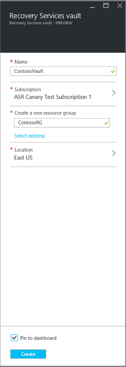
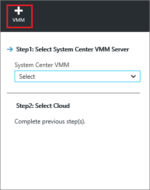
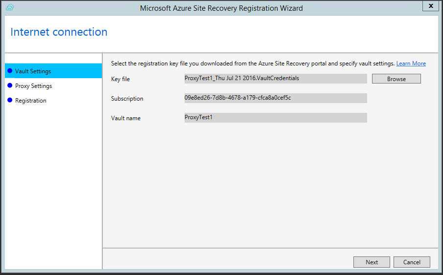
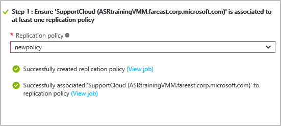
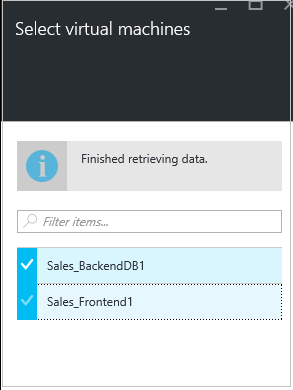

<properties
    pageTitle="使用 Azure Site Recovery 将 Hyper-V VM 复制到辅助站点 | Azure"
    description="介绍如何使用 Azure 门户将 VMM 云中的 Hyper-V VM 复制到辅助 VMM 站点"
    services="site-recovery"
    documentationcenter=""
    author="rayne-wiselman"
    manager="jwhit"
    editor="" />
<tags
    ms.assetid="b33a1922-aed6-4916-9209-0e257620fded"
    ms.service="site-recovery"
    ms.workload="backup-recovery"
    ms.tgt_pltfrm="na"
    ms.devlang="na"
    ms.topic="article"
    ms.date="02/12/2017"
    wacn.date="03/10/2017"
    ms.author="raynew" />

# 使用 Azure 门户将 VMM 云中的 Hyper-V 虚拟机复制到辅助 VMM 站点

> [AZURE.SELECTOR]
- [Azure 门户](/documentation/articles/site-recovery-vmm-to-vmm/)
- [经典门户](/documentation/articles/site-recovery-vmm-to-vmm-classic/)
- [PowerShell - Resource Manager](/documentation/articles/site-recovery-vmm-to-vmm-powershell-resource-manager/)

本文介绍如何在 Azure 门户中使用 [Azure Site Recovery](/documentation/articles/site-recovery-overview/) 将 System Center Virtual Machine Manager (VMM) 云中管理的本地 Hyper-V 虚拟机复制到辅助站点。详细了解此[方案体系结构](/documentation/articles/site-recovery-components/#replicate-hyper-v-vms-to-a-secondary-site)。

## 先决条件

**先决条件** | **详细信息**
--- | ---
**Azure** | 需要一个 [Azure](http://azure.cn/) 帐户。你可以从 [1rmb 试用版](/pricing/1rmb-trial/)开始。[详细了解](/pricing/details/site-recovery/) Site Recovery 定价。
**本地 VMM** | 
建议在主站点和辅助站点中各提供一个 VMM 服务器。

 可在单个 VMM 服务器上的云之间复制。

 VMM 服务器应当至少运行具有最新更新的 System Center 2012 SP1。

 VMM 服务器需要 Internet 访问权限。

**VMM 云** | 
每个 VMM 服务器必须包含一个或多个云，所有云中必须设置了 Hyper-V 容量配置文件。

云必须包含一个或多个 VMM 主机组。

 如果只有一台 VMM 服务器，它至少需要包含两个云，分别充当主云和辅助云。

**Hyper-V** | 
Hyper-V 服务器必须至少运行具有 Hyper-V 角色且安装了最新更新的 Windows Server 2012。

 Hyper-V 服务器应包含一个或多个 VM。

 Hyper-V 主机服务器应位于主要和辅助 VMM 云中的主机组内。

 如果在 Windows Server 2012 R2 的群集中运行 Hyper-V，请安装更新 [2961977](https://support.microsoft.com/zh-cn/kb/2961977)

如果在 Windows Server 2012 的群集中运行 Hyper-V，并且使用基于静态 IP 地址的群集，则系统不会自动创建群集代理。请手动配置群集代理。[了解详细信息](http://social.technet.microsoft.com/wiki/contents/articles/18792.configure-replica-broker-role-cluster-to-cluster-replication.aspx)。

 Hyper-V 服务器需要访问 Internet。

**URL** | 
VMM 服务器和 Hyper-V 主机应能够访问以下 URL：

 [AZURE.INCLUDE [site-recovery-URLS](../../includes/site-recovery-URLS.md)]

## 步骤

下面是需要执行的操作：

1. 验证先决条件。
2. 准备 VMM 服务器和 Hyper-V 主机。
3. 创建恢复服务保管库。保管库包含配置设置，并协调复制。
4. 指定源、目标和复制设置。
5. 在要复制的 VM 上部署移动服务。
6. 准备进行复制，并为 Hyper-V VM 启用复制。
7. 运行测试故障转移，确保一切按预期运行。

## 准备 VMM 服务器和 Hyper-V 主机

准备部署：

1. 确保 VMM 服务器和 Hyper-V 主机符合上述先决条件并可访问所需的 URL。
2. 设置 VMM 网络，以便可以配置[网络映射](#network-mapping-overview)。

    - 确保源 Hyper-V 主机服务器上的 VM 已连接到 VMM VM 网络。该网络应当该链接到与该云相关联的逻辑网络。验证用于恢复的辅助云中是否配置了相应的 VM 网络。该 VM 网络应该链接到与辅助云关联的逻辑网络。
    
3. 如果要在同一 VMM 服务器上的云之间复制 VM，请准备进行[单一服务器部署](#single-vmm-server-deployment)。

## 创建恢复服务保管库
1. 登录到 [Azure 门户](https://portal.azure.cn)。
2. 单击“新建”>“管理”>“恢复服务”。
3. 在“名称”中，指定一个友好名称以标识该保管库。如果你有多个订阅，请选择其中一个。
4. [创建一个资源组](/documentation/articles/resource-group-template-deploy-portal/)或选择现有的资源组。指定 Azure 区域。计算机将复制到此区域。若要查看受支持的区域，请参阅 Azure Site Recovery 价格详细信息中的“地域可用性”。
5. 如果要从仪表板快速访问保管库，请单击“固定到仪表板”>“创建保管库”。

      

新保管库将显示在“仪表板”上的“所有资源”中，以及“恢复服务保管库”主边栏选项卡上。

## 选择保护目标

选择要复制的内容以及要复制到的位置。

2. 单击“Site Recovery”>“步骤 1: 准备基础结构”>“保护目标”。
3. 选择“到恢复站点”，然后选择“是，使用 Hyper-V”。
4. 选择“是”，指明要使用 VMM 管理 Hyper-V 主机。
5. 如果使用辅助 VMM 服务器，请选择“是”。如果要在单个 VMM 服务器上的云之间部署复制，请单击“否”。然后，单击“确定”。

      

## 设置源环境

在 VMM 服务器上安装 Azure Site Recovery 提供程序，在保管库中发现和注册这些服务器。

1. 单击“步骤 1: 准备基础结构”>“源”。

      

2. 在“准备源”中单击“+ VMM”添加 VMM 服务器。

      

3. 在“添加服务器”中，检查“System Center VMM 服务器”是否出现在“服务器类型”中，以及 VMM 服务器是否符合[先决条件](#prerequisites)。
4. 下载 Azure Site Recovery 提供程序安装文件。
5. 下载注册密钥。运行安装程序时需要用到此密钥。生成的密钥有效期为 5 天。

      

6. 在 VMM 服务器上安装 Azure Site Recovery 提供程序。不需要在 Hyper-V 主机服务器上显式安装任何组件。

### 安装 Azure Site Recovery 提供程序

1. 在每个 VMM 服务器上运行提供程序安装文件。如果在群集中部署 VMM，请在首次安装时执行以下操作：
    -  在活动节点上安装提供程序，并完成安装以在保管库中注册 VMM 服务器。
    - 然后在其他节点上安装该提供程序。所有群集节点应运行相同版本的提供程序。
2. 安装程序将运行几项先决条件检查，并请求停止 VMM 服务的权限。VMM 服务将在安装程序完成时自动重新启动。如果在 VMM 群集上进行安装，系统会提示停止群集角色。
3. 在“Microsoft 更新”中，可以选择指定根据 Microsoft 更新策略安装提供程序更新。
4. 在“安装”中接受或修改默认安装位置，然后单击“安装”。

      

5. 安装完成后，单击“注册”，以便在保管库中注册服务器。

      

6. 在“保管库名称”中，验证将要在其中注册服务器的保管库的名称。单击*“下一步”*。

      

7. 在“Internet 连接”中，指定在 VMM 服务器上运行的提供程序如何连接到 Azure。

      

   - 可以指定提供程序是要直接连接到 Internet 还是通过代理连接。
   - 根据需要指定代理设置。
   - 如果使用代理，系统会使用指定的代理凭据自动创建一个 VMM RunAs 帐户 (DRAProxyAccount)。对代理服务器进行配置以便该帐户可以成功通过身份验证。可通过 VMM 控制台 >“设置”>“安全性”>“运行方式帐户”修改 RunAs 帐户设置。重新启动 VMM 服务以更新更改。
8. 在“注册密钥”中，选择从 Azure Site Recovery 下载并复制到 VMM 服务器的密钥。
9. 仅当要将 VMM 云中的 Hyper-V VM 复制到 Azure 时，才使用加密设置。如果要复制到辅助站点，则不使用加密设置。
10. 在“服务器名称”中，指定一个友好名称以在保管库中标识该 VMM 服务器。在群集配置中，请指定 VMM 群集角色名称。
11. 在“同步云元数据”中，选择是否要将 VMM 服务器上所有云的元数据与保管库进行同步。此操作在每台服务器上只需执行一次。若不希望同步所有云，可以让此设置保持未选中状态并在 VMM 控制台的云属性中分别同步各个云。
12. 单击“下一步”以完成此过程。注册后，Azure Site Recovery 将检索 VMM 服务器中的元数据。服务器显示在保管库中“服务器”页上的“VMM 服务器”选项卡中。

    
13. 当服务器出现在站点恢复控制台中后，请在“源”>“准备源”中选择 VMM 服务器，然后选择 Hyper-V 主机所在的云。然后，单击“确定”。

也可以从命令行安装提供程序：

[AZURE.INCLUDE [site-recovery-rw-provider-command-line](../../includes/site-recovery-rw-provider-command-line.md)]

## 设置目标环境

选择目标 VMM 服务器和云。

1. 单击“准备基础结构”>“目标”，然后选择要使用的目标 VMM 服务器。
2. 此时会显示该服务器上已与 Site Recovery 同步的云。选择目标云。

     

## 设置复制设置

- 创建复制策略时，使用策略的所有主机都必须具有相同的操作系统。VMM 云可包含运行不同 Windows Server 版本的 Hyper-V 主机，但此情况下需要多个复制策略。
- 可脱机执行初始复制。[了解详细信息](#prepare-for-initial-offline-replication)

1. 若要创建新的复制策略，请单击“准备基础结构”>“复制设置”>“+创建和关联”。

      

2. 在“创建和关联策略”中指定策略名称。源和目标类型应为 **Hyper-V**。
3. 在“Hyper-V 主机版本”中，选择主机上运行的操作系统。
4. 在“身份验证类型”和“身份验证端口”中，指定如何对主 Hyper-V 主机服务器和恢复 Hyper-V 主机服务器之间的流量进行身份验证。除非你有正常运行的 Kerberos 环境，否则请选择“证书”。Azure Site Recovery 将为 HTTPS 身份验证自动配置证书。无需手动执行任何操作。默认情况下，端口 8083 和 8084（用于证书）在 Hyper-V 主机服务器上的 Windows 防火墙中将处于打开状态。如果你选择了“Kerberos”，则将使用 Kerberos 票证执行主机服务器的相互身份验证。请注意，此设置仅适用于在 Windows Server 2012 R2 上运行的 Hyper-V 主机服务器。
5. 在“复制频率”中，指定要在初始复制后复制增量数据的频率（每隔 30 秒、5 或 15 分钟）。
6. 在“恢复点保留期”中，针对每个恢复点指定保留期的时长（以小时为单位）。受保护的计算机可以恢复到某个时段内的任意时间点。
7. 在“应用一致性快照频率”中，指定创建包含应用程序一致性快照的恢复点的频率（1-12 小时）。Hyper-V 使用两种类型的快照 — 标准快照，它提供整个虚拟机的增量快照；应用程序一致性快照，它生成虚拟机内的应用程序数据的时间点快照。应用程序一致性快照使用卷影复制服务 (VSS) 确保应用程序在拍摄快照时处于一致状态。如果启用了应用程序一致性快照，它将影响在源虚拟机上运行的应用程序的性能。请确保你设置的值小于你配置的额外恢复点的数目。
8. 在“数据传输压缩”中，指定是否应压缩所传输的复制数据。
9. 选择“删除副本 VM”，以指定如果禁用对源 VM 的保护，则应删除副本虚拟机。如果启用此设置，当你禁用对源 VM 的保护时，将从站点恢复控制台中删除该 VM、在 VMM 控制台中删除 VMM 的站点恢复设置，并删除副本。
10. 如果要通过网络进行复制，请在“初始复制方法”中指定是要启动还是计划初始复制。若要节省网络带宽，可以将它计划在非高峰时间运行。然后，单击“确定”。

     
11. 当创建新策略时，该策略自动与 VMM 云关联。在“复制策略”中单击“确定”。可以在“设置”>“复制”> 策略名称 >“关联 VMM 云”中，将其他 VMM 云（及其中的 VM）与此复制策略相关联。

       

### 配置网络映射

- 开始之前，请先了解[网络映射](#prepare-for-network-mapping)。
- 验证 VMM 服务器上的虚拟机是否已连接到 VM 网络。

1. 在“设置”>“Site Recovery 基础结构”>“网络映射”>“网络映射”中，单击“+网络映射”。

      

2. 在“添加网络映射”选项卡中，选择源和目标 VMM 服务器。系统将检索与 VMM 服务器关联的 VM 网络。
3. 在“源网络”中，从与主 VMM 服务器关联的 VM 网络列表中选择要使用的网络。
4. 在“目标网络”中，选择要在辅助 VMM 服务器上使用的网络。然后，单击“确定”。

    

下面是网络映射开始时发生的事情：

* 与源 VM 网络对应的任何现有副本虚拟机都将连接到目标 VM 网络。
* 复制后，连接到源 VM 网络的新虚拟机将连接到目标映射网络。
* 如果修改了与新网络之间的映射，则会使用新设置来连接副本虚拟机。
* 如果目标网络具有多个子网，并且其中一个子网与源虚拟机所在的子网同名，则在故障转移后副本虚拟机将连接到该目标子网。如果没有具有匹配名称的目标子网，虚拟机将连接到网络中的第一个子网。

### 配置存储映射。

新的 Azure 门户不支持[存储映射](#prepare-for-storage-mapping)。但是，可以使用 Powershell 启用存储映射。[了解详细信息](/documentation/articles/site-recovery-vmm-to-vmm-powershell-resource-manager/#step-7-configure-storage-mapping)。

## 步骤 5：容量规划

你已经设置了基本基础结构，请考虑容量计划并确定是否需要额外的资源。

- 下载并运行 [Azure Site Recovery Capacity Planner](/documentation/articles/site-recovery-capacity-planner/) 来收集有关复制环境的信息，包括 VM、每个 VM 的磁盘以及每个磁盘的存储。
- 收集实时复制信息后，可以修改 NetQos 策略以控制用于 VM 的复制带宽。阅读 Thomas Maurer 的博客文章 [Throttling Hyper-V Replica Traffic](http://www.thomasmaurer.ch/2013/12/throttling-hyper-v-replica-traffic/)（限制 Hyper-V 复本流量）了解详细信息。获取有关 [New-NetQosPolicy cmdlet](https://technet.microsoft.com/zh-cn/library/hh967468.aspx.) 的详细信息。

## 启用复制

1. 单击“步骤 2: 复制应用程序”>“源”。首次启用复制后，请在保管库中单击“+复制”，对其他计算机启用复制。

      

2. 在“源”中，选择 VMM 服务器和要复制的 Hyper-V 主机所在的云。然后，单击“确定”。

      

3. 在“目标”中，确认辅助 VMM 服务器和云。
4. 在“虚拟机”中，从列表中选择要保护的 VM。

      

可以在“设置”>“作业”>“Site Recovery 作业”中，跟踪“启用保护”操作的进度。在“完成保护”作业完成后，虚拟机便可以故障转移了。

请注意：

- 还可以在 VMM 控制台中为虚拟机启用保护。在工具栏上的虚拟机属性的“Azure Site Recovery”选项卡中单击“启用保护”。
- 启用复制后，可以在“设置”>“复制的项”中查看 VM 的属性。在“概要”仪表板中，可以看到有关 VM 复制策略及其状态的信息。单击“属性”可查看详细信息。

### 将现有虚拟机加入进来
如果在 VMM 中已有使用 Hyper-V 副本进行复制的虚拟机，可以将它们加入到 Azure Site Recovery 复制中，如下所述：

1. 确保托管现有 VM 的 Hyper-V 服务器位于主云中，托管副本虚拟机的 Hyper-V 服务器位于辅助云中。
2. 确保为主 VMM 云配置了复制策略。
3. 为主虚拟机启用复制。Azure Site Recovery 和 VMM 将确保检测相同的副本主机和虚拟机，并且 Azure Site Recovery 将使用指定的设置重用并重新建立复制。

## 测试部署

若要对部署进行测试，可以针对单个虚拟机运行[测试故障转移](/documentation/articles/site-recovery-test-failover-vmm-to-vmm/)，或者创建包含一个或多个虚拟机的[恢复计划](/documentation/articles/site-recovery-create-recovery-plans/)。

## 后续步骤

测试部署后，请详细了解其他类型的[故障转移](/documentation/articles/site-recovery-failover/)

## 为脱机初始复制做准备

可以使用脱机复制来执行初始数据复制。可按如下所述做好准备：

* 在源服务器上，指定要从中进行数据导出的路径位置。在导出路径上，分配对 NTFS 的“完全控制”权限和对 VMM 服务的“共享”权限。在目标服务器上，指定要从中进行数据导入的路径位置。在此导入路径上分配同样的权限。
* 如果导入或导出路径是共享的，请为共享路径所在的远程计算机上的 VMM 服务帐户分配 Administrator、Power User、Print Operator 或 Server Operator 组成员资格。
* 如果使用任何运行方式帐户来添加主机，请在 VMM 中导入和导出路径上为运行方式帐户分配读取和写入权限。
* 导入和导出共享不应当位于用作 Hyper-V 主机服务器的任何计算机上，因为 Hyper-V 不支持环回配置。
* 在 Active Directory 中包含要保护的虚拟机的每个 Hyper-V 主机服务器上，启用并配置约束委派以信任导入和导出路径所在的远程计算机，如下所述：
  1. 在域控制器上，打开“Active Directory 用户和计算机”。
  2. 在控制台树中，单击“域名”>“计算机”。
  3. 右键单击 Hyper-V 主机服务器名称 >“属性”。
  4. 在“委派”选项卡上，单击“仅信任此计算机来委派指定的服务”。
  5. 单击“使用任意身份验证协议”。
  6. 单击“添加”>“用户和计算机”。
  7. 键入托管导出路径的计算机的名称，然后单击“确定”。在可用服务列表中，按住 CTRL 键的同时单击“cifs”，然后单击“确定”。针对托管导入路径的主机的名称重复该步骤。根据需要针对其他 Hyper-V 主机服务器重复该步骤。

## 准备网络映射
网络映射在主要和辅助 VMM 服务器上的 VMM VM 网络之间进行映射：

* 故障转移后，以最佳方式在辅助 Hyper-V 主机上放置副本 VM。
* 故障转移后，将副本 VM 连接到适当的 VM 网络。

请注意：
- 可以在两个 VMM 服务器上的 VM 网络之间配置网络映射；如果两个站点由同一个服务器管理，则在可以在单个 VMM 服务器上的两个对应 VM 网络之间配置网络映射。
- 在正确地配置映射且启用复制后，位于主位置的 VM 将连接到网络，其位于目标位置的副本将连接到其映射网络。
- 如果已经在 VMM 中正确地设置了网络，则在网络映射期间选择目标 VM 网络时，将显示使用源 VM 网络的 VMM 源云以及用于保护的目标云上的可用目标 VM 网络。
- 如果目标网络具有多个子网，并且其中一个子网与源虚拟机所在的子网同名，则在故障转移后副本虚拟机将连接到该目标子网。如果没有具有匹配名称的目标子网，虚拟机将连接到网络中的第一个子网。

以下示例演示了此机制。假设某家组织有两个运营地点：北京和上海。

| **位置** | **VMM 服务器** | **VM 网络** | **映射到** |
| --- | --- | --- | --- |
| 上海 |VMM-Shanghai |VMNetwork1-Shanghai |映射到 VMNetwork1-Beijing |
| VMNetwork2-Shanghai |未映射 | | |
| 北京 |VMM-Beijing |VMNetwork1-Beijing |映射到 VMNetwork1-Shanghai |
| VMNetwork2-Beijing |未映射 | | |

在此示例中：

* 当为任何连接到 VMNetwork1-Shanghai 的虚拟机创建副本虚拟机时，副本虚拟机将连接到 VMNetwork1-Beijing
* 当为 VMNetwork2-Shanghai 或 VMNetwork2-Beijing 创建副本虚拟机时，副本虚拟机将不会连接到任何网络。

这是本示例组织中 VMM 云的设置方式，以及逻辑网络与云关联的方式。

### 云保护设置
| **受保护的云** | **提供保护的云** | **逻辑网络（上海）** |
| --- | --- | --- |
| GoldCloud1 |GoldCloud2 | |
| SilverCloud1 |SilverCloud2 | |
| GoldCloud2 |
NA

 |
LogicalNetwork1-Shanghai

LogicalNetwork1-Beijing
 |
| SilverCloud2 |
NA

 |
LogicalNetwork1-Shanghai

LogicalNetwork1-Beijing
 |

### 逻辑和 VM 网络设置
| **位置** | **逻辑网络** | **关联的 VM 网络** |
| --- | --- | --- |
| 上海 |LogicalNetwork1-Shanghai |VMNetwork1-Shanghai |
| 北京 |LogicalNetwork1-Beijing |VMNetwork1-Beijing |
| LogicalNetwork2Beijing |VMNetwork2-Beijing | |

### 目标网络
根据这些设置，在选择目标 VM 网络时，下表显示将可用的选项。

| **选择** | **受保护的云** | **提供保护的云** | **可用目标网络** |
| --- | --- | --- | --- |
| VMNetwork1-Beijing |SilverCloud1 |SilverCloud2 |可用 |
| GoldCloud1 |GoldCloud2 |可用 | |
| VMNetwork2-Beijing |SilverCloud1 |SilverCloud2 |不可用 |
| GoldCloud1 |GoldCloud2 |可用 | |

### 故障回复
若要查看在故障恢复情况下发生的情况（反向复制），我们假设 VMNetwork1-Shanghai 已映射到 VMNetwork1-Beijing，设置如下。

| **虚拟机** | **连接到 VM 网络** |
| --- | --- |
| VM1 |VMNetwork1-Network |
| VM2（VM1 的副本） |VMNetwork1-Beijing |

在采用这些设置的条件下，我们看看在一些可能的方案中会发生什么情况。

| **方案** | **结果** |
| --- | --- |
| 在故障转移后，VM-2 的网络属性没有发生任何变化。 |VM-1 保持连接到源网络。 |
| 故障转移且断开连接后，VM-2 的网络属性已更改。 |VM-1 已断开连接。 |
| VM-2 的网络属性在故障转移后发生更改并连接到 VMNetwork2-Beijing。 |如果未映射 VMNetwork2-Beijing，则 VM-1 将断开连接。 |
| VMNetwork1-Beijing 的网络映射已更改。 |VM-1 将连接到现已映射到 VMNetwork1-Beijing 的网络。 |

## 准备单一服务器部署

如果只有一个 VMM 服务器，可以在 VMM 云中将 Hyper-V 主机上的 VM 复制到 [Azure](/documentation/articles/site-recovery-vmm-to-azure/)，或复制到辅助 VMM 云。建议选择前者，因为云之间复制不是无缝复制。如果想要在云之间进行复制，可通过单个独立 VMM 服务器，或通过 Windows 延伸群集的单个 VMM 服务器进行复制

### 独立 VMM 服务器

在此方案中，需要在主站点中部署单个 VMM 服务器作为虚拟机，然后使用 Site Recovery 和 Hyper-V 副本将此 VM 复制到辅助站点。

1. **在 Hyper-V VM 上设置 VMM**。为此，建议将 VMM 所用的 SQL Server 实例共置到同一 VM 上。这可以节省时间，因为只需创建一个 VM。如果希望使用 SQL Server 的远程实例，而此时发生了中断，则需先恢复该实例，然后再恢复 VMM。
2. **确保该 VMM 服务器至少配置了两个云**。一个云将包含想要复制的 VM，另一个云充当辅助位置。包含要保护的 VM 的云应该满足[先决条件](#prerequisites)。
3. 如本文中所述设置 Site Recovery。在保管库中创建并注册 VMM 服务器、设置复制策略，然后启用复制。源和目标 VMM 名称是相同的。指定要通过网络进行初始复制。
4. 设置网络映射时，应将主云的 VM 网络映射到辅助云的 VM 网络。
5. 在 Hyper-V 管理器控制台中，在包含 VMM VM 的 Hyper-V 主机上启用 Hyper-V 副本，并在 VM 上启用复制。请确保不将 VMM 虚拟机添加到受 Site Recovery 保护的云中，使得 Hyper-V 副本设置不会被 Site Recovery 重写。
6. 如果为故障转移创建恢复方案，应为源和目标使用同一个 VMM 服务器。
7. 若出现完全中断，请按如下所述进行故障转移和恢复：

   1. 在辅助站点的 Hyper-V 管理器控制台中，运行未计划的故障转移，将主 VMM VM 故障转移到辅助站点。
   2. 验证 VMM VM 是否已启动并正在运行，并在保管库中运行未计划的故障转移，将 VM 从主云故障转移到辅助云。提交故障转移，并根据需要选择备用恢复点。
   3. 完成未计划的故障转移之后，可再次通过主站点访问所有资源。
   4. 主站点在辅助站点的 Hyper-V 管理器控制台中重新可用时，为 VMM VM 启用反向复制。这将为 VM 启动从辅助站点到主站点的复制。
   5. 在辅助站点的 Hyper-V 管理器控制台中，运行未计划的故障转移，将 VMM VM 故障转移到主站点。提交故障转移。然后启用反向复制，再次将 VMM VM 从主站点复制到辅助站点。
   6. 在恢复服务保管库中，启用工作负荷 VM 的反向复制，开始将它们从辅助站点复制到主站点。
   7. 在恢复服务保管库中，运行计划的故障转移将工作负荷 VM 故障回复到主站点。提交故障转移即可完成。然后，启用反向复制，开始将工作负荷 VM 从主站点复制到辅助站点。

### 外延式 VMM 群集

不必将单独的 VMM 服务器部署为将内容复制到辅助站点的 VM，而只需将其部署为 Windows 故障转移群集中的 VM 来提高 VMM 的可用性。这可以为工作负荷提供弹性并防止硬件故障。若要通过 Site Recovery 进行部署，应将 VMM VM 部署在一个外延式群集中，该群集在地理位置上跨多个单独的站点。为此，请按以下步骤操作：

1. 将 VMM 安装在 Windows 故障转移群集的虚拟机上，在安装过程中请选择合适的选项，确保该服务器在运行时具有高可用性。
2. 应该使用 SQL Server AlwaysOn 可用性组来复制 VMM 所用的 SQL Server 实例，使得辅助站点中存在数据库的副本。
3. 按照本文中的说明创建保管库、注册服务器并设置保护。需要在恢复服务保管库中注册群集中的每个 VMM 服务器。若要执行此操作，请在活动节点上安装提供程序并注册 VMM 服务器。然后在其他节点上安装提供程序。
4. 发生中断时，VMM 服务器及其相应的 SQL Server 数据库会故障转移，可从辅助站点进行访问。

## 准备存储映射

设置存储映射时，可在源和目标 VMM 服务器上映射存储分类来实现以下功能：

  * **标识用于副本虚拟机的目标存储** - 源 VM 硬盘将复制到目标位置中指定的存储（SMB 共享或群集共享卷 (CSV)）。
  * **放置副本虚拟机** - 使用存储映射能以最佳方式在 Hyper-V 主机服务器上放置副本虚拟机。副本虚拟机将放置在可访问映射存储分类的主机上。
  * **无存储映射** - 如果未配置存储映射，虚拟机将复制到与副本虚拟机关联的 Hyper-V 主机服务器上指定的默认存储位置。

请注意：
- 可设置单个服务器上两个 VMM 云之间的映射。
- 存储分类必须可供源和目标云中的主机组使用。
- 分类不需要具有相同类型的存储。例如，可将包含 SMB 共享的源分类映射到包含 CSV 的目标分类。

### 示例
如果已在 VMM 中正确配置分类，则在执行存储映射期间选择源和目标 VMM 服务器时，会显示源和目标分类。下面是在上海和北京这两个位置设立了运营地点的组织的存储文件共享与分类示例。

| **位置** | **VMM 服务器** | **文件共享（源）** | **分类（源）** | **映射到** | **文件共享（目标）** |
| --- | --- | --- | --- | --- | --- |
| 上海 |VMM\_Source |SourceShare1 |GOLD |GOLD\_TARGET |TargetShare1 |
| SourceShare2 |SILVER |SILVER\_TARGET |TargetShare2 | | |
| SourceShare3 |BRONZE |BRONZE\_TARGET |TargetShare3 | | |
| 北京 |VMM\_Target | |GOLD\_TARGET |未映射 | |
| |SILVER\_TARGET |未映射 | | | |
| |BRONZE\_TARGET |未映射 | | | |

在此示例中：

* 为 GOLD 存储 (SourceShare1) 上的任何虚拟机创建副本虚拟机时，它将会复制到 GOLD\_TARGET 存储 (TargetShare1)。
* 为 SILVER 存储 (SourceShare2) 上的任何虚拟机创建副本虚拟机时，它将会复制到 SILVER\_TARGET (TargetShare2) 存储，依此类推。

### 多个存储位置
如果将目标分类分配到了多个 SMB 共享或 CSV，则在保护虚拟机时，将自动选择最佳存储位置。如果指定的分类没有合适的目标存储，则使用 Hyper-V 主机上指定的默认存储位置来放置副本虚拟硬盘。

下表显示了本示例中的存储分类和群集共享卷是如何设置的。

| **位置** | **分类** | **关联的存储** |
| --- | --- | --- |
| 上海 |GOLD |
C:\\ClusterStorage\\SourceVolume1

\\FileServer\\SourceShare1
 |
| SILVER |
C:\\ClusterStorage\\SourceVolume2

\\FileServer\\SourceShare2
 | |
| 北京 |GOLD\_TARGET |
C:\\ClusterStorage\\TargetVolume1

\\FileServer\\TargetShare1
 |
| SILVER\_TARGET |
C:\\ClusterStorage\\TargetVolume2

\\FileServer\\TargetShare2
 | |

下表汇总了在此示例环境中为虚拟机 (VM1 - VM5) 启用保护时的行为。

| **虚拟机** | **源存储** | **源分类** | **映射的目标存储** |
| --- | --- | --- | --- |
| VM1 |C:\\ClusterStorage\\SourceVolume1 |GOLD |
C:\\ClusterStorage\\SourceVolume1

\\\FileServer\\SourceShare1

两个 GOLD\_TARGET
 |
| VM2 |\\FileServer\\SourceShare1 |GOLD |
C:\\ClusterStorage\\SourceVolume1

\\FileServer\\SourceShare1
 
两个 GOLD\_TARGET
 |
| VM3 |C:\\ClusterStorage\\SourceVolume2 |SILVER |
C:\\ClusterStorage\\SourceVolume2

\\FileServer\\SourceShare2
 |
| VM4 |\\FileServer\\SourceShare2 |SILVER |
C:\\ClusterStorage\\SourceVolume2

\\FileServer\\SourceShare2

两个 SILVER\_TARGET
 |
| VM5 |C:\\ClusterStorage\\SourceVolume3 |不适用 |无映射，因此将使用 Hyper-V 主机的默认存储位置 |

### 数据隐私概述

下表汇总了如何在此方案中存储数据：

- - -
| 操作 | **详细信息** | **收集的数据** | **使用** | **必选** |
| --- | --- | --- | --- | --- |
| **注册** | 在恢复服务保管库中注册 VMM 服务器。如果以后想要取消注册服务器，可通过从 Azure 门户删除服务器信息来实现此目的。 | 注册 VMM 服务器之后， Site Recovery 将收集、处理和传输有关 VMM 服务器的元数据以及 Site Recovery 检测到的 VMM 云的名称。 | 数据用于识别相应的 VMM 服务器并与其通信，以及配置相应 VMM 云的设置。 | 这是必需的功能。如果不想将此信息发送到 Site Recovery，则不应使用 Site Recovery 服务。 |
| **启用复制** | Azure Site Recovery 提供程序安装在 VMM 服务器上，是用于与 Site Recovery 服务通信的通道。该提供程序是 VMM 进程中承载的一个动态链接库 (DLL)。安装该提供程序后，会在 VMM 管理员控制台中启用“数据中心恢复”功能。新的和现有的 VM 可以启用此功能来为 VM 提供保护。 |设置此属性后，提供程序会将 VM 的名称和 ID 发送到 Site Recovery。复制是通过 Windows Server 2012 或 Windows Server 2012 R2 Hyper-V 副本启用的。虚拟机数据将从一台 Hyper-V 主机复制到另一台主机（通常位于一个不同的“恢复”数据中心内）。 |Site Recovery 使用元数据填充 Azure 门户中的 VM 信息。 | 此功能是服务必不可少的组成部分，不可关闭。如果不想发送此信息，请不要为 VM 启用 Site Recovery 保护。请注意，该提供程序发送到 Site Recovery 的所有数据都是通过 HTTPS 发送的。 |
| **恢复计划** | 恢复计划可帮助你为恢复数据中心构建业务流程计划。你可以定义多个 VM 或一组虚拟机在恢复站点上启动时应当遵循的顺序。还可以指定在恢复每个 VM 时要运行的任何自动脚本，或者要采取的任何手动操作。通常会在恢复计划级别触发故障转移以实现协调的恢复。 | Site Recovery 将收集、处理和传输恢复计划的元数据，包括虚拟机元数据以及任何自动化脚本和手动操作说明的元数据。 |元数据用于在 Azure 门户中构建恢复计划。 |此功能是服务必不可少的组成部分，不可关闭。如果不想将此信息发送到 Site Recovery，请不要创建恢复服务。 |
| **网络映射** | 将主数据中心内的网络信息映射到恢复数据中心。在恢复站点上恢复 VM 时，网络映射可帮助建立网络连接。 |Site Recovery 将收集、处理和传输每个站点（主站点和数据中心）的逻辑网络的元数据。 |元数据用于填充网络设置，以便可以映射网络信息。 | 此功能是服务必不可少的组成部分，不可关闭。如果不想要将此信息发送到 Site Recovery，请不要使用网络映射。 |
| **故障转移（计划内/计划外/测试）** | 故障转移将 VM 从 VMM 管理的一个数据中心故障转转到另一个数据中心。故障转移操作是在 Azure 门户中手动触发的。 |VMM 服务器上的提供程序将从 Site Recovery 处收到故障转移事件通知，并通过 VMM 接口在 Hyper-V 主机上运行故障转移操作。VM 的实际故障转移是从一台 Hyper-V 主机到另一台主机，通过 Windows Server 2012 或 Windows Server 2012 R2 Hyper-V 副本来处理。Site Recovery 使用发送的信息来填充 Azure 门户中故障转移操作信息的状态。 | 此功能是服务必不可少的组成部分，不可关闭。如果不想将此信息发送到 Site Recovery，请不要使用故障转移。 |

<!---HONumber=Mooncake_0306_2017-->