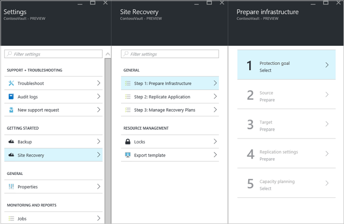
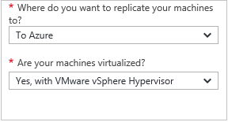
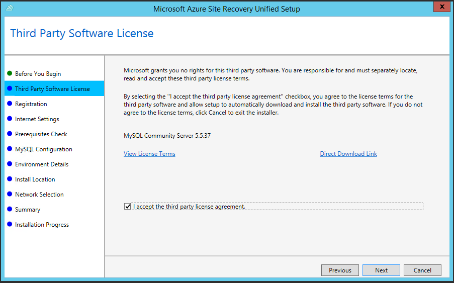
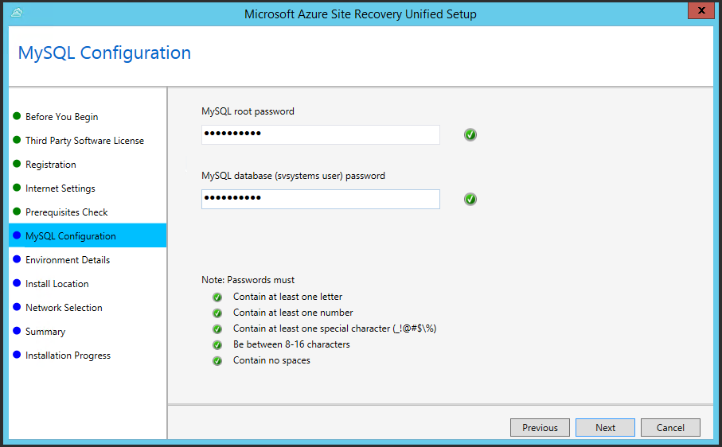
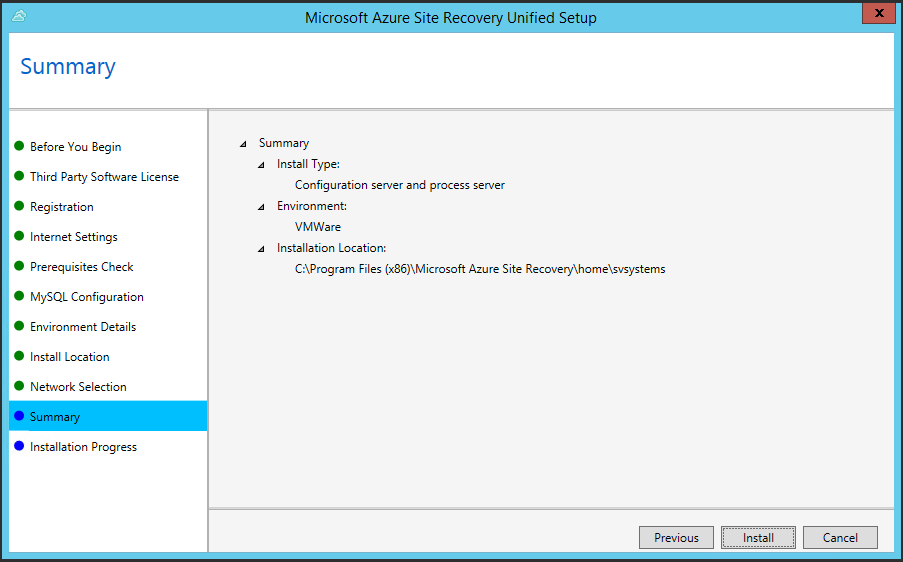
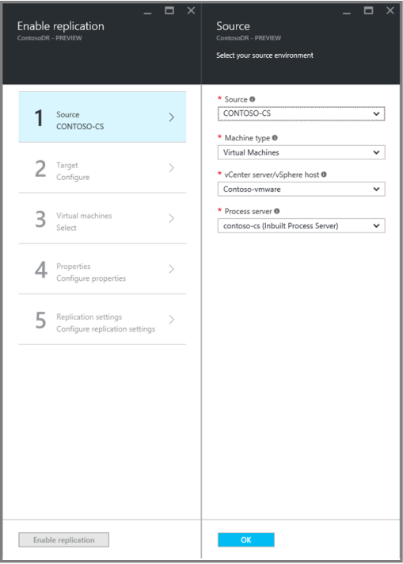

<properties
    pageTitle="将 VMware VM 复制到 Azure | Azure"
    description="汇总了将 VMware VM 上运行的工作负荷复制到 Azure 存储所要执行的步骤"
    services="site-recovery"
    documentationcenter=""
    author="rayne-wiselman"
    manager="jwhit"
    editor="" />
<tags
    ms.assetid="dab98aa5-9c41-4475-b7dc-2e07ab1cfd18"
    ms.service="site-recovery"
    ms.workload="backup-recovery"
    ms.tgt_pltfrm="na"
    ms.devlang="na"
    ms.topic="article"
    ms.date="02/15/2017"
    wacn.date="03/10/2017"
    ms.author="raynew" />  

# 使用 Azure Site Recovery 将 VMware 虚拟机复制到 Azure
> [AZURE.SELECTOR]
- [Azure 门户预览](/documentation/articles/site-recovery-vmware-to-azure/)
- [Azure 经典管理门户](/documentation/articles/site-recovery-vmware-to-azure-classic/)

本文介绍如何在 Azure 门户中使用 [Azure Site Recovery](/documentation/articles/site-recovery-overview/) 服务将本地 VMware 虚拟机复制到 Azure。

 如果只是想要通过简单的故障转移来迁移 VMware VM，而不执行完整复制（复制、故障转移、故障回复），请参阅[此文](/documentation/articles/site-recovery-migrate-to-azure/)。

## 步骤

下面是需要执行的操作：

1. 验证先决条件和限制。
2. 设置 Azure 网络和存储帐户。
3. 准备要部署为配置服务器的本地计算机。
4. 准备要用于自动发现 VM 以及（可选）对移动服务进行推送安装的 VMware 帐户。
4. 创建恢复服务保管库。保管库包含配置设置，并协调复制。
5. 指定源、目标和复制设置。
6. 将移动服务部署到想要复制的 VM 上。
7. 为 VM 启用复制。
7. 运行测试故障转移，确保一切按预期运行。

## 先决条件

**支持要求** | **详细信息**
--- | ---
**Azure** | 了解 [Azure 要求](/documentation/articles/site-recovery-prereq/#azure-requirements)
**本地配置服务器** | 
需要一个运行 Windows Server 2012 R2 或更高版本的 VMware VM。将在 Site Recovery 部署过程中设置此服务器。

 默认情况下，进程服务器和主目标服务器也安装在此 VM 上。进行扩展时，可能需要使用单独的进程服务器。如果是这样，该服务器的要求与配置服务器相同。

 [详细信息](/documentation/articles/site-recovery-components/#replicate-vmware-vmsphysical-servers-to-azure)这些组件。

**本地 VMware 服务器** | 
一台或多台 VMware vSphere 服务器，运行装有最新更新的 6.0、5.5 或 5.1。服务器应位于配置服务器（或单独的进程服务器）所在的同一网络。

 建议使用一台 vCenter 服务器（运行装有最新更新的 6.0 或 5.5）来管理主机。部署版本 6.0 时，只有 5.5 版中提供的功能才受支持。

**本地 VM** | 想要复制的虚拟机应该运行[受支持的操作系统](/documentation/articles/site-recovery-support-matrix-to-azure/#support-for-replicated-machine-os-versions)，并且符合 [Azure 先决条件](/documentation/articles/site-recovery-support-matrix-to-azure/#failed-over-azure-vm-requirements)。VM 应该运行 VMware 工具。
**URL** | 
配置服务器需要以下 URL 的访问权限：

 [AZURE.INCLUDE [site-recovery-URLS](../../includes/site-recovery-URLS.md)]

如果设置了基于 IP 地址的防火墙规则，请确保这些规则允许与 Azure 通信。

 允许 [Azure 数据中心 IP 范围](https://www.microsoft.com/download/confirmation.aspx?id=41653)和 HTTPS (443) 端口。

 允许订阅的 Azure 区域的 IP 地址范围以及美国西部的 IP 地址范围（用于访问控制和标识管理）。

 允许使用以下 URL 下载 MySQL：http://cdn.mysql.com/archives/mysql-5.5/mysql-5.5.37-win32.msi。

**移动服务** | 已安装在每个复制的 VM 上。

## 限制

**限制** | **详细信息**
--- | ---
**Azure** | 
存储帐户和网络帐户必须与保管库位于同一区域

如果使用高级存储帐户，还需要一个用于存储复制日志的标准存储帐户

不能复制到位于印度中部和印度南部的高级帐户。

**本地配置服务器** | 
VMware VM 适配器类型应为 VMXNET3。否则，请[安装此更新](https://kb.vmware.com/selfservice/microsites/search.do?cmd=displayKC&docType=kc&externalId=2110245&sliceId=1&docTypeID=DT_KB_1_1&dialogID=26228401&stateId=1)

应安装 vSphere PowerCLI 6.0。

 该计算机不应是域控制器，应使用静态 IP 地址。

 主机名长度不应超过 15 个字符，操作系统应为英文版。

**VMware** | 只有 5.5 版的功能才在 vCenter 6.0 中受支持。Site Recovery 不支持新的 vCenter 和 vSphere 6.0 功能，例如跨 vCenter vMotion、虚拟卷和存储 DRS。
**VM** | 
验证 [Azure VM 限制](/documentation/articles/site-recovery-prereq/#azure-requirements)

不能复制包含加密磁盘的 VM 或带有 UEFI/EFI 引导系统的 VM。

 不支持共享的磁盘群集。如果源 VM 具有 NIC 组合，那么在故障转移后，它将转换为单个 NIC。

 如果 VM 有一个 iSCSI 磁盘，那么在故障转移后，Site Recovery 会将其转换为 VHD 文件。如果 Azure VM 可以访问 iSCSI 目标，它将连接到该目标，并且会发现该目标和 VHD。如果发生这种情况，请断开与 iSCSI 目标的连接。

 如果想要启用多 VM 一致性，从而使运行相同工作负荷的 VM 一起恢复到一个一致数据点，请打开 VM 上的端口 20004。

 必须在 C 驱动器上安装 Windows。OS 磁盘应是基本磁盘而不是动态磁盘。数据磁盘可以是动态的。

 VM 上的 Linux /etc/hosts 文件应包含将本地主机名映射到与所有网络适配器相关联的 IP 地址的条目。主机名、装载点、设备名称、系统路径和文件名（/etc/；/usr）只能采用英文形式。

 支持特定类型的 [Linux 存储](/documentation/articles/site-recovery-support-matrix-to-azure/#support-for-storage)。

在 VM 设置中创建或设置 **disk.enableUUID=true**。这会向 VMDK 提供一致的 UUID，以便它正确进行装载，并确保在故障回复期间仅将增量更改传输回本地而不执行完全复制。

## 设置 Azure

1. [设置 Azure 网络](/documentation/articles/virtual-networks-create-vnet-arm-pportal/)。

    - 在故障转移后创建 Azure VM 时，Azure VM 将置于此网络中。
    - 可以在 [Resource Manager](/documentation/articles/resource-manager-deployment-model/) 中设置网络，也可以在经典模式下设置网络。

2. 为复制的数据设置 [Azure 存储帐户](/documentation/articles/storage-create-storage-account/#create-a-storage-account)。

    - 该帐户可以是标准帐户或[高级](/documentation/articles/storage-premium-storage/)帐户。
    - 可以在 Resource Manager 中设置帐户，也可以在经典模式下设置帐户。

3. 在 vCenter 服务器或 vSphere 主机上[准备一个帐户](#prepare-for-automatic-discovery-and-push-installation)，以便 Site Recovery 可以自动检测到 VMware VM。

## 准备配置服务器

1. 在 VMware VM 上安装 Windows Server 2012 R2 或更高版本。
2. 确保该 VM 有权访问[先决条件](#prerequisites)中列出的 URL。
3. 安装 [VMware vSphere PowerCLI 6.0](https://developercenter.vmware.com/tool/vsphere_powercli/6.0)。

## 为自动发现和推送安装做好准备

- **为自动发现准备一个帐户**：Site Recovery 进程服务器将自动发现 VM。为此，Site Recovery 需要凭据，以便可以访问 vCenter 服务器/vSphere ESXi 主机。

    1. 若要使用专用帐户，请创建一个角色（在 vCenter 级别创建，拥有这些[权限](#vmware-account-permissions)）。为其指定一个名称，例如 **Azure\_Site\_Recovery**。
    2. 然后在 vSphere 主机或 vCenter 服务器上创建一个用户，并向其分配该角色。在 Site Recovery 部署过程中指定此用户帐户。

- **准备一个用于推送移动服务的帐户**：如果要将移动服务推送到 VM，则需要一个可由进程服务器用来访问 VM 的帐户。该帐户仅用于推送安装。可以使用域或本地帐户：

    - 对于 Windows，如果你使用的不是域帐户，则需在本地计算机上禁用远程用户访问控制。为此，请在注册表中的 **HKEY\_LOCAL\_MACHINE\\SOFTWARE\\Microsoft\\Windows\\CurrentVersion\\Policies\\System** 下添加值为 1 的 DWORD 项 **LocalAccountTokenFilterPolicy**。
    - 如果想要从 CLI 为 Windows 添加注册表项，请键入：``REG ADD HKEY_LOCAL_MACHINE\SOFTWARE\Microsoft\Windows\CurrentVersion\Policies\System /v LocalAccountTokenFilterPolicy /t REG_DWORD /d 1.``
    - 对于 Linux，该帐户应是源 Linux 服务器上的root 用户。

## 创建恢复服务保管库
1. 登录到 [Azure 门户](https://portal.azure.cn) >“Site Recovery”
2. 单击“新建”>“管理”>
3. 在“名称”中，指定一个友好名称以标识该保管库。如果你有多个订阅，请选择其中一个。
4. [创建一个资源组](/documentation/articles/resource-group-template-deploy-portal/)或选择现有的资源组。指定 Azure 区域。若要查看受支持的区域，请参阅 [Azure Site Recovery 价格详细信息](/pricing/details/site-recovery/)中的“上市地区”。
5. 若要从仪表板快速访问保管库，请单击“固定到仪表板”，然后单击“创建”。

      

新保管库将显示在“仪表板”>“所有资源”中，以及“恢复服务保管库”主边栏选项卡上。

## 选择保护目标

选择要复制的内容以及要复制到的位置。

1. 单击“恢复服务保管库”> 保管库。
2. 在“资源”菜单中，单击“Site Recovery”>“步骤 1: 准备基础结构”>“保护目标”。

      

3. 在“保护目标”中选择“到 Azure”，然后选择“是，使用 VMware vSphere 虚拟机监控程序”。

      

## 设置源环境

设置配置服务器，将它注册到保管库中，然后发现 VM。

1. 单击“Site Recovery”>“步骤 1: 准备基础结构”>“源”。
2. 如果没有配置服务器，请单击“+ 配置服务器”。

      

3. 在“添加服务器”中，检查“配置服务器”是否已显示在“服务器类型”中。
4. 下载站点恢复统一安装程序安装文件。
5. 下载保管库注册密钥。运行统一安装程序时需要用到此密钥。生成的密钥有效期为 5 天。

     

6. 在配置服务器 VM 上，确保系统时钟与[时间服务器](https://technet.microsoft.com/windows-server-docs/identity/ad-ds/get-started/windows-time-service/windows-time-service)同步，然后运行统一安装程序安装配置服务器、进程服务器和主目标服务器。

## 运行站点恢复统一安装程序

开始之前：

- 请确保 VM 上的时间与本地时区中的时间相同。它应与之匹配。如果它提前或落后 15 分钟，安装程序可能会失败。
- 在配置服务器 VM 上以本地管理员身份运行安装程序。
- 确保在 VM 上启用 TLS 1.0。

然后在配置服务器上运行统一安装程序安装文件。

1. 在“统一安装程序”>“开始之前”中选择“安装配置服务器和进程服务器”。

     

2. 在“第三方软件许可协议”中单击“我接受”，下载并安装 MySQL。

      

3. 在“注册”中，通过浏览查找并选择从保管库下载的注册密钥。

      

4. 在“Internet 设置”中，指定配置服务器上运行的提供程序如何通过 Internet（端口 443）连接到 Site Recovery。

   * 如果希望提供程序直接进行连接，请选择“不使用代理服务器直接连接 Azure Site Recovery”。
   * 如果想要使用代理，请选择“使用代理服务器连接到 Azure Site Recovery”并指定设置。

       

5. 在“先决条件检查”中，安装程序将验证设置。如果出现时间警告，请检查“日期和时间”设置中的时间是否与时区相同。

      

6. 在“MySQL 配置”中，指定用于登录到要安装的 MySQL 服务器实例的凭据。

      

7. 在“环境详细信息”中，选择是否要复制 VMware VM。如果要复制，则安装程序会检查 PowerCLI 6.0 是否已安装。

      

8. 在“安装位置”中，选择要安装二进制文件和存储缓存的位置。可以选择有 5 GB 可用存储空间的任何驱动器，但我们建议选择至少有 600 GB 可用空间的缓存驱动器。

      

9. 在“网络选择”中，指定侦听器（网络适配器和 SSL 端口），以便配置服务器在其上发送和接收复制数据。你可以修改默认端口 (9443)。除了此端口以外，还要使用端口 443 来协调复制。请不要将端口 443 用于复制流量。

      

10. 在“摘要”中复查信息，然后单击“安装”。安装完成后，将生成通行短语。启用复制时需要用到它，因此请复制并将它保存在安全的位置。注册完成后，该服务器将显示在保管库的“服务器”中。

     

### 添加用于自动发现的帐户

 添加为自动发现 VMware VM 而创建的帐户。

1. 在配置服务器上运行 **CSPSConfigtool.exe**。桌面上已提供该工具的快捷方式，在 **[安装位置]\\home\\svsystems\\bin** 文件夹中也可以找到它。
2. 单击“管理帐户”>“添加帐户”。

      

3. 在“帐户详细信息”中，添加用于自动发现的帐户。帐户名称出现在门户中可能需要 15 分钟或更长时间。若要立即更新，请单击“配置服务器”> 服务器名称 >“刷新服务器”。

      

### 连接到 VMware 服务器

连接到 vSphere ESXi 主机或 vCenter 服务器以发现 VMware VM。

- 如果在服务器上使用没有管理员权限的帐户添加 vCenter 服务器或 vSphere 主机，该帐户需要启用以下权限：
    - 数据中心、数据存储、文件夹、主机、网络、资源、虚拟机、vSphere 分布式交换机。
    - vCenter 服务器需要“存储视图”特权。
- 添加 VMware 服务器之后，可能需要 15 分钟或更长时间，这些服务器才会显示在门户中。

1. 检查配置服务器是否能够通过网络访问 vSphere 主机和 vCenter 服务器。
2. 单击“准备基础结构”>“源”。在“准备源”中选择配置服务器。单击“+ vCenter”添加 vSphere 主机或 vCenter 服务器。
3. 在“添加 vCenter”中，指定服务器的友好名称及其 IP 地址或 FQDN。除非已将 VMware 服务器配置为在不同的端口上侦听请求，否则请保留端口 443 设置。然后，选择为自动发现创建的帐户并单击“确定”。

      

Site Recovery 将使用指定的设置连接到 VMware 服务器并发现 VM。

## 设置目标

设置目标环境之前，请检查是否已创建 [Azure 存储帐户和网络](#set-up-azure)

1. 单击“准备基础结构”>“目标”，然后选择要使用的 Azure 订阅。
2. 指定目标部署模型是基于 Resource Manager 还是基于经典部署。
3. Site Recovery 将检查是否有一个或多个兼容的 Azure 存储帐户和网络。

     

4. 如果尚未创建存储帐户或网络，请单击“+存储帐户”或“+网络”，创建 Resource Manager 帐户或内联网络。

## 设置复制设置

1. 若要创建新的复制策略，请单击“Site Recovery 基础结构”>“复制策略”>“+复制策略”。
2. 在“创建复制策略”中指定策略名称。
3. 在“RPO 阈值”中：指定 RPO 限制。此值指定创建数据恢复点的频率。如果连续复制超出此限制，将生成警报。
4. 在“恢复点保留期”中，针对每个恢复点指定保留期限的长度（以小时为单位）。可将复制的虚拟机恢复到某个期限内的任意时间点。复制到高级存储的计算机最多支持 24 小时的保留期，复制到标准存储的计算机最多支持 72 小时的保留期。
5. 在“应用一致性快照频率”中，指定创建包含应用程序一致性快照的恢复点的频率（以分钟为单位）。单击“确定”以创建该策略。

      

8. 当你创建新策略时，该策略将自动与配置服务器关联。默认情况下将自动创建一个匹配策略用于故障回复。例如，如果复制策略是 **rep-policy**，则故障回复策略将是 **rep-policy-failback**。从 Azure 启动故障回复之前，不会使用此策略。

## 规划容量

1. 设置基本的基础结构后，可以考虑容量计划并确定是否需要额外的资源。[了解详细信息](/documentation/articles/site-recovery-plan-capacity-vmware/)。
2. 完成容量规划后，请在“是否已完成容量规划?”中选择“是”。

     

## 准备用于复制的 VM

必须在要复制的所有计算机上安装移动服务。可通过多种方式安装移动服务：

1. 从进程服务器使用推送安装进行安装。需要准备好 VM 才能使用此方法。
2. 使用 System Center Configuration Manager 或 Azure Automation DSC 等部署工具进行安装。
3.  手动安装。

[了解详细信息](/documentation/articles/site-recovery-vmware-to-azure-install-mob-svc/)

## 启用复制

开始之前：

- 添加或修改 VM 之后，可能需要 15 分钟或更长时间，更改才会生效并显示在门户中。
- 可以在“配置服务器”>“上次联系位置”查看上次发现 VM 的时间。
- 若要添加 VM 而不想要等待执行计划的发现，请突出显示配置服务器（不要单击它），然后单击“刷新”。
* 如果已为推送安装准备了 VM，那么在启用复制时，进程服务器将自动安装移动服务。

### 从复制中排除磁盘

默认情况下将复制计算机上的所有磁盘。你可以从复制中排除磁盘。例如，你可能不想要复制包含临时数据，或者每当重新启动计算机或应用程序时刷新的数据（例如 pagefile.sys 或 SQL Server tempdb）的磁盘。

### 复制 VM

1. 单击“步骤 2: 复制应用程序”>“源”。
2. 在“源”中选择配置服务器。
3. 在“计算机类型”中选择“虚拟机”。
4. 在“vCenter/vSphere 虚拟机监控程序”中，选择管理 vSphere 主机的 vCenter 服务器，或选择该主机。
5. 选择进程服务器。如果未创建任何额外的进程服务器，该进程服务器将是配置服务器。然后，单击“确定”。

      

6. 在“目标”中，选择要创建故障转移 VM 的订阅和资源组。为故障转移的 VM 选择要在 Azure 中使用的部署模型（经典或资源管理）。

7. 选择要用于复制数据的 Azure 存储帐户。如果不想要使用已设置的帐户，可以创建一个新帐户。

8. 选择 Azure VM 在故障转移后创建时所要连接的 Azure 网络和子网。选择“立即为选定的计算机配置”，将网络设置应用到选择保护的所有计算机。选择“稍后配置”以选择每个计算机的 Azure 网络。如果不想要使用现有网络，可以创建一个网络。

      

9. 在“虚拟机”>“选择虚拟机”中，单击并选择要复制的每个计算机。只能选择可以启用复制的计算机。然后，单击“确定”。

    
10. 在“属性”>“配置属性”中，选择进程服务器在计算机上自动安装移动服务时使用的帐户。
11. 默认情况下会复制所有磁盘。单击“所有磁盘”并清除不想要复制的所有磁盘。然后，单击“确定”。可以稍后再设置其他 VM 属性。

      

11. 在“复制设置”>“配置复制设置”中，检查是否选择了正确的复制策略。如果修改策略，更改将应用到复制计算机和新计算机。
12. 如果要将计算机集合到复制组，请启用“多 VM 一致性”并指定组的名称。然后，单击“确定”。请注意：

    * 复制组中的计算机将一起复制，并在故障转移时获得崩溃一致且应用一致的共享恢复点。
    * 我们建议你将 VM 和物理服务器集合在一起，使其镜像你的工作负荷。启用多 VM 一致性可能会影响工作负荷性能，因此，仅当计算机运行相同的工作负荷并且你需要一致性时，才应使用该设置。

    
13. 单击“启用复制”。可以在“设置”>“作业”>“Site Recovery 作业”中，跟踪“启用保护”作业的进度。在“完成保护”作业运行之后，计算机就可以进行故障转移了。

启用复制后，将安装移动服务（如果设置了推送安装）。在 VM 上对移动服务进行推送安装后，保护作业将启动并失败。发生这种失败后，需要手动重新启动每台计算机。然后，保护作业将重新开始，初始复制将会进行。

### 查看和管理 VM 属性

我们建议验证 VM 属性，并进行任何所需的更改。

1. 单击“复制的项”，然后选择计算机。“概要”边栏选项卡显示有关计算机设置和状态的信息。
2. 在“属性”中，可以查看 VM 的复制和故障转移信息。
3. 在“计算和网络”>“计算属性”中，可以指定 Azure VM 名称和目标大小。根据需要修改名称，使其符合 [Azure 要求](/documentation/articles/site-recovery-support-matrix-to-azure/#failed-over-azure-vm-requirements)。
4. 修改要分配给 Azure VM 的目标网络、子网和 IP 地址的设置：

   - 可以设置目标 IP 地址。

    - 如果未提供地址，故障转移的计算机将使用 DHCP。
    - 如果设置了无法用于故障转移的地址，故障转移将不会正常工作。
    - 如果地址可用于测试故障转移网络，则同一个目标 IP 地址可用于测试故障转移。

   - 网络适配器数目根据你为目标虚拟机指定的大小来确定：

     - 如果源计算机上的网络适配器数小于或等于目标计算机大小允许的适配器数，则目标的适配器数将与源相同。
     - 如果源虚拟机的适配器数目大于目标大小允许的数目，则使用目标大小允许的最大数目。
     - 例如，如果源计算机有两个网络适配器，而目标计算机大小支持四个，则目标计算机将有两个适配器。如果源计算机有两个适配器，但支持的目标大小只支持一个，则目标计算机只有一个适配器。
   - 如果虚拟机有多个网络适配器，它们将全部连接到同一个网络。
   - 如果虚拟机有多个网络适配器，列表中显示的第一个适配器将成为 Azure 虚拟机中的*默认*网络适配器。
5. 在“磁盘”中，可以看到 VM 操作系统，以及要复制的数据磁盘。

## 运行测试故障转移

完成全部设置后，运行测试故障转移，确保一切按预期运行。

1. 选择“恢复计划”> *恢复计划名称* >“测试故障转移”。
2. 选择要故障转移到的恢复点。可以使用以下选项之一：
	- **最新处理的恢复点**：此选项可将所有 VM 故障转移到 Site Recovery 服务处理的最新恢复点。
        - 如果故障转移 VM，则系统还会显示最新处理的恢复点的时间戳。
        - 如果故障转移恢复计划，可以转到单个 VM >“最新的恢复点”查看该计划。
        - 最新的恢复点提供较低的 RTO（恢复时间目标）选项。
	- **最新的应用一致性恢复点**：此选项可将所有 VM 故障转移到最新的应用程序一致性恢复点。
	- **最新**：此选项首先处理已发送到 Site Recovery 服务的所有数据，以便为每个 VM 创建恢复点，然后将这些数据故障转移到该恢复点。此选项提供最低的 RPO（恢复点目标）。故障转移后创建的 VM 中的所有数据将在触发故障转移时复制到 Site Recovery。
	- **自定义**：若要故障转移 VM，可以使用此选项故障转移到特定的恢复点。
3. 选择 **Azure 虚拟网络**。这是在其中创建了测试 VM 的网络。
    - Site Recovery 将使用在 VM 的“计算和网络”设置中指定的同一个 IP，在同名的子网中创建测试 VM。
    - 如果在用于测试故障转移的 Azure 虚拟网络中没有同名的子网，将按字母顺序在第一个子网中创建测试 VM。
    - 如果子网中没有相同的 IP 地址，VM 将从子网获取另一个 IP 地址。
4. 在“加密密钥”中，选择在安装提供程序期间启用数据加密时颁发的证书。如果未启用加密，请忽略此步骤。
5. 在“作业”选项卡上跟踪故障转移进度。在 Azure 门户中，应当能够看到测试副本计算机。
6. 故障转移完成后，请在恢复计划中单击“清理测试故障转移”。在“说明”中，记录并保存与测试故障转移相关联的任何观测结果。清理过程将删除在测试性故障转移期间创建的 VM。

[详细了解]((/documentation/articles/site-recovery-test-failover-to-azure/) 如何准备测试故障转移和连接到副本 Azure VM。

## VMware 帐户权限

Site Recovery 需要 VMware 的访问权限，以便进程服务器可以自动发现 VM，以及实现 VM 的故障转移和故障回复。

- **迁移**：如果只想要将 VMware VM 迁移到 Azure，而不对其进行故障回复，可以使用具有只读角色的 VMware 帐户。此类角色可以运行故障转移，但无法关闭受保护的源计算机。执行迁移不需要关闭受保护的源计算机。
- **复制/恢复**：如果想要部署完整复制（复制、故障转移和故障回复），该帐户必须能够运行创建和删除磁盘、打开 VM 等操作。
- **自动发现**：至少需要一个只读帐户。

**任务** | **所需的帐户/角色** | **权限** | **详细信息**
--- | --- | --- | ---
**进程服务器自动发现 VMware VM** | 至少需要一个只读用户 | 数据中心对象 –> 传播到子对象，角色=Read-only | 
用户在数据中心级别分配，因此有权访问数据中心内的所有对象。

 若要限制访问权限，请将“禁止访问”角色（包含“传播到子对象”）分配给子对象（vSphere 主机、数据存储、VM 和网络）。

**故障转移** | 至少需要一个只读用户 | 数据中心对象 –> 传播到子对象，角色=Read-only | 
用户在数据中心级别分配，因此有权访问数据中心内的所有对象。

 若要限制访问权限，请将“禁止访问”角色（包含“传播到子对象”）分配给子对象（vSphere 主机、数据存储、VM 和网络）。

 用于迁移，但不用于完整复制、故障转移和故障回复。

**故障转移和故障回复** | 建议创建一个拥有所需权限的角色 (Azure\_Site\_Recovery)，然后将它分配到 VMware 用户或组。 | 
数据中心对象 –> 传播到子对象，角色=Azure\_Site\_Recovery

数据存储 -> 分配空间、浏览数据存储、低级别文件操作、删除文件、更新虚拟机文件

网络 -> 网络分配

资源 -> 将 VM 分配到资源池、迁移关闭的 VM、迁移打开的 VM

任务 -> 创建任务、更新任务

虚拟机 -> 配置

虚拟机 -> 交互 -> 回答问题、设备连接、配置 CD 介质、配置软盘介质、关机、开机、VMware 工具安装

虚拟机 -> 清单 -> 创建、注册、取消注册

虚拟机 -> 预配 -> 允许虚拟机下载、允许虚拟机文件上载

虚拟机 -> 快照 -> 删除快照 | 用户在数据中心级别分配，因此有权访问数据中心内的所有对象。

 若要限制访问权限，请将“禁止访问”角色（包含“传播到子对象”）分配给子对象（vSphere 主机、数据存储、VM 和网络）。

## 后续步骤

启动并运行复制后，如果发生中断，可以故障转移到 Azure，并可以基于复制的数据创建 Azure VM。然后可以在 Azure 中访问工作负荷和应用。主要位置恢复正常后，可以故障转移回到主要位置。

- [详细了解](/documentation/articles/site-recovery-failover/)不同类型的故障转移及其运行方式。
- 若要迁移计算机而不执行复制和故障回复，请[阅读详细信息](/documentation/articles/site-recovery-migrate-to-azure/#migrate-on-premises-vms-and-physical-servers)。
- [阅读有关故障回复的文章](/documentation/articles/site-recovery-failback-azure-to-vmware/)，了解如何从 Azure 故障回复和复制 Azure VM，以及将它复制回到本地主站点。

## 第三方软件通知和信息
Do Not Translate or Localize

The software and firmware running in the Microsoft product or service is based on or incorporates material from the projects listed below (collectively, “Third Party Code”).Microsoft is the not original author of the Third Party Code.The original copyright notice and license, under which Microsoft received such Third Party Code, are set forth below.

The information in Section A is regarding Third Party Code components from the projects listed below.Such licenses and information are provided for informational purposes only.This Third Party Code is being relicensed to you by Microsoft under Microsoft's software licensing terms for the Microsoft product or service.

The information in Section B is regarding Third Party Code components that are being made available to you by Microsoft under the original licensing terms.

The complete file may be found on the [Microsoft Download Center](http://go.microsoft.com/fwlink/?LinkId=529428).Microsoft reserves all rights not expressly granted herein, whether by implication, estoppel or otherwise.

<!---HONumber=Mooncake_0306_2017-->