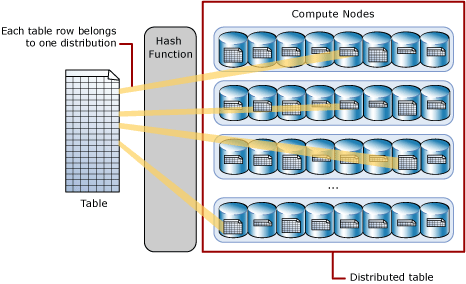
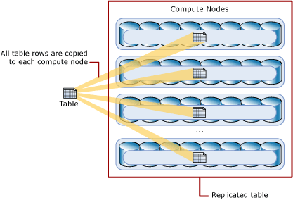

<properties
    pageTitle="分布式数据在 Azure SQL 数据仓库中的工作原理 | Azure"
    description="了解如何分布数据以便进行大规模并行处理 (MPP)，以及在 Azure SQL 数据仓库和并行数据仓库中分布表的选项。"
    services="sql-data-warehouse"
    documentationcenter="NA"
    author="barbkess"
    manager="jhubbard"
    editor="" />
<tags
    ms.assetid="bae494a6-7ac5-4c38-8ca3-ab2696c63a9f"
    ms.service="sql-data-warehouse"
    ms.devlang="NA"
    ms.topic="article"
    ms.tgt_pltfrm="NA"
    ms.workload="data-services"
    ms.date="10/31/2016"
    wacn.date="03/20/2017"
    ms.author="barbkess" />  

# 适用于大规模并行处理 (MPP) 的分布式数据和分布式表
了解用户数据在 Azure SQL 数据仓库和并行数据仓库中是如何分布的，这些仓库是 Microsoft 的大规模并行处理 (MPP) 系统。设计数据仓库时，需考虑到有效使用分布式数据，充分利用 MPP 体系结构的查询处理优势。某些数据库设计选择可能会对查询性能有着重大影响。

> [AZURE.NOTE]
Azure SQL 数据仓库和并行数据仓库使用相同的大规模并行处理 (MPP) 设计，但由于基础平台的不同，也存在一些区别。SQL 数据仓库是在 Azure 上运行的平台即服务 (PaaS)。并行数据仓库运行在分析平台系统 (APS) 上，后者是运行在 Windows Server 上的本地设备。
> 
> 

## 什么是分布式数据？
在 SQL 数据仓库和并行数据仓库中，分布式数据是指存储在 MPP 系统的多个位置的用户数据。每个这样的位置都可以充当独立的存储和处理单元，对部分数据运行查询。若要并行运行查询以提高查询性能，则分布式数据是基础。

进行数据分布时，数据仓库会将用户表的每一行都分配到一个分布式位置。可以通过哈希分布方法或轮询方法对表进行分布。分布方法在 CREATE TABLE 语句中指定。

## 哈希分布表
下图说明了如何将完整的非分布式表存储为哈希分布表。通过确定性函数对每个行进行分配，使之属于某个分布区。在表定义中，可以将一个列指定为分布列。哈希函数使用分布列中的值将一个行分配到一个分布区。

选择分布列时需考虑到性能，例如特异性、数据偏斜，以及在系统上运行的查询的类型。

  

* 一个行属于一个分布区。
* 通过确定性哈希算法将一个行分配到一个分布区。
* 不同大小的表显示，每个分布区的表行的数目各不相同。

## 轮循分布表
轮循分布表在分布行时，会以顺序方式将一个行分配给一个分布区。将数据加载到轮循表速度很快，但查询执行速度可能较慢。加入轮循表时，通常需要重新组织行才能使查询产生准确的结果，这需要时间。

## 分布式存储位置称为分布区
一个分布式位置称为一个分布区。以并行方式运行查询时，每个分布区都会对区内数据执行 SQL 查询。SQL 数据仓库使用 SQL 数据库运行查询。并行数据仓库使用 SQL Server 运行查询。此非共享式体系结构设计是进行向外缩放并行计算的基础。

### 能否查看分布区？
每个分布区都有一个分布 ID，可以在与 SQL 数据仓库和并行数据仓库相关的系统视图中查看。可以使用分布 ID 排查查询性能问题和其他问题。如需系统视图的列表，请参阅 [MPP 系统视图](/documentation/articles/sql-data-warehouse-reference-tsql-statements/)。

## 分布区和计算节点的差异
分布区是存储分布式数据和处理并行查询的基本单位。可以将分布区组合到计算节点中。每个计算节点跟踪一个或多个分布区。

* 分析平台系统使用计算节点作为硬件体系结构和向外缩放功能的中心组件。该系统始终对每个计算节点使用 8 个分布区，如哈希分布表的对应图所示。计算节点数（即分布区数）取决于为设备购买的计算节点数。例如，如果购买 8 个计算节点，则会获得 64 个分布区（8 个计算节点 x 8 个分布区/节点）。
* SQL 数据仓库的分布区数是固定的，即 60 个，而计算节点数则是可变的。计算节点使用 Azure 计算和存储资源实现。计算节点数可能会根据用户为数据仓库指定的后端服务工作负荷和计算能力 (DWU) 而变化。计算节点数变化时，每个计算节点的分布区数也变化。

### 能否查看计算节点？
每个计算节点都有一个节点 ID，可在与 SQL 数据仓库和并行数据仓库相关的系统视图中查看。在名称以 sys.pdw\_nodes 开头的系统视图中找到 node\_id 列即可查看计算节点。如需系统视图的列表，请参阅 [MPP 系统视图](/documentation/articles/sql-data-warehouse-reference-tsql-statements/)。

## 并行数据仓库的复制表
适用于：并行数据仓库

除了使用分布式表，并行数据仓库还提供了复制表的选项。*复制表*是指整个存储在每个计算节点上的表。复制表以后，就不需要在用表进行联接或聚合操作之前在计算节点中传输表行。复制表仅适用于小型表，因为将整个表存储在每个计算节点上需要额外的存储。

下图显示了一个存储在每个计算节点上的复制表。复制表存储在分配给计算节点的所有磁盘上。此磁盘策略通过 SQL Server 文件组实现。

  

## 后续步骤
若要有效地使用分布式表，请参阅 [Distributing tables in SQL Data Warehouse](/documentation/articles/sql-data-warehouse-tables-distribute/)（在 SQL 数据仓库中分布表）

<!---HONumber=Mooncake_0313_2017-->
<!--Update_Description:update meta properties-->