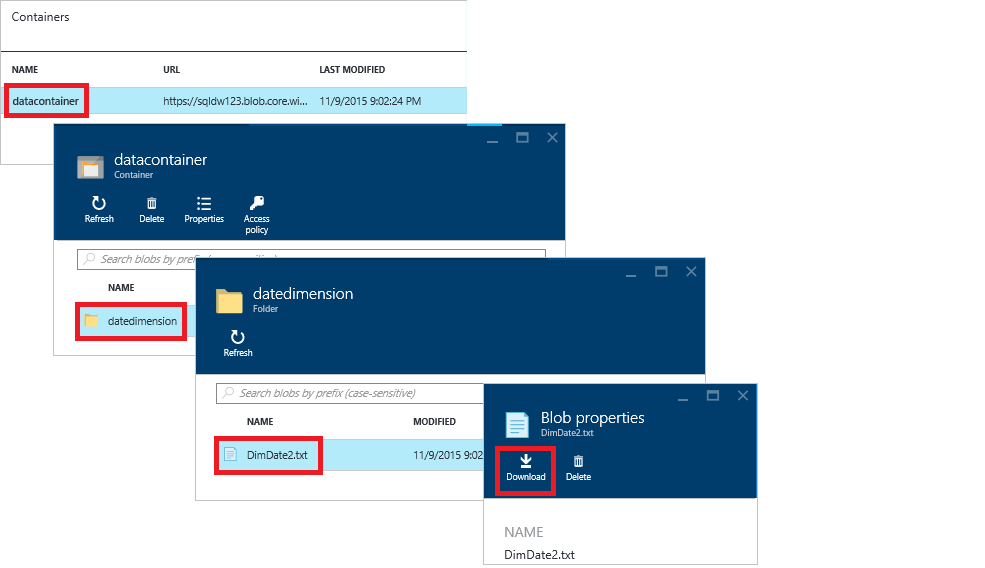

<properties
   pageTitle="SQL 数据仓库中的 PolyBase 教程 | Azure"
   description="了解什么是 PolyBase，以及如何将其用于数据仓库方案。"
   services="sql-data-warehouse"
   documentationCenter="NA"
   authors="ckarst"
   manager="barbkess"
   editor=""/>  

<tags
   ms.service="sql-data-warehouse"
   ms.devlang="NA"
   ms.topic="get-started-article"
   ms.tgt_pltfrm="NA"
   ms.workload="data-services"
   ms.date="10/10/2016"
   wacn.date="10/31/2016"/>  

# 在 SQL 数据仓库中使用 PolyBase 加载数据

> [AZURE.SELECTOR]
- [Redgate](/documentation/articles/sql-data-warehouse-load-with-redgate/)
- [PolyBase](/documentation/articles/sql-data-warehouse-get-started-load-with-polybase/)
- [BCP](/documentation/articles/sql-data-warehouse-load-with-bcp/)

本教程说明如何使用 AzCopy 和 PolyBase 将数据载入 SQL 数据仓库。完成后，你将了解如何：

- 使用 AzCopy 将数据复制到 Azure Blob 存储
- 创建数据库对象以定义数据
- 运行 T-SQL 查询以加载数据

## 先决条件

若要逐步完成本教程中，你需要：

- 一个 SQL 数据仓库数据库。
- 一个标准本地冗余存储 (Standard-LRS)、标准异地冗余存储 (Standard-GRS) 或标准读取访问权限异地冗余存储 (Standard-RAGRS) 类型的 Azure 存储帐户。
- AzCopy 命令行实用程序。下载并安装 Microsoft Azure 存储空间工具随附的[最新版本的 AzCopy][]。

      

## 步骤 1：将示例数据添加到 Azure Blob 存储

为了加载数据，我们需要将一些示例数据放入 Azure Blob 存储。在此步骤中，我们会将示例数据填入 Azure 存储 Blob。稍后我们会使用 PolyBase 将这些示例数据载入 SQL 数据仓库数据库。

### A.准备一个示例文本文件

若要准备示例文本文件，请执行以下操作：

1. 打开记事本并将以下数据行复制到一个新文件。将此文件保存到本地临时目录，路径为 %temp%\\DimDate2.txt。

	20150301,1,3
	20150501,2,4
	20151001,4,2
	20150201,1,3
	20151201,4,2
	20150801,3,1
	20150601,2,4
	20151101,4,2
	20150401,2,4
	20150701,3,1
	20150901,3,1
	20150101,1,3

### B.查找你的 Blob 服务终结点

若要查找你的 Blob 服务终结点，请执行以下操作：

1. 在 Azure 门户中，选择“浏览”>“存储帐户”。
2. 单击你要使用的存储帐户。
3. 在“存储帐户”边栏选项卡中，单击“Blob”

      

1. 保存你的 Blob 服务终结点供稍后使用。

      

### C.查找你的 Azure 存储密钥

若要查找你的 Azure 存储密钥，请执行以下操作：

1. 在 Azure 门户中，选择“浏览”>“存储帐户”。
2. 单击你要使用的存储帐户。
3. 选择“所有设置”>“访问密钥”。
4. 单击复制框，将你的访问密钥之一复制到剪贴板。

      

### D.将示例文件复制到 Azure Blob 存储

若要将数据复制到 Azure Blob 存储，请执行以下操作：

1. 打开命令提示符，然后将目录切换到 AzCopy 安装目录。此命令可将你切换到 64 位 Windows 客户端上的默认安装目录。

    	cd /d "%ProgramFiles(x86)%\Microsoft SDKs\Azure\AzCopy"

1. 运行以下命令以上载该文件。指定 <blob service endpoint URL> 的 Blob 服务终结点 URL，以及 <azure\_storage\_account\_key> 的 Azure 存储帐户密钥。

    	.\AzCopy.exe /Source:C:\Temp\ /Dest:<blob service endpoint URL> /datacontainer/datedimension/ /DestKey:<azure_storage_account_key> /Pattern:DimDate2.txt

另请参阅 [AzCopy 命令行实用程序入门][]。

### E.浏览 Blob 存储容器

若要查看已上载到 Blob 存储的文件，请执行以下操作：

1. 返回你的 Blob 服务边栏选项卡。
2. 在“容器”下，双击“datacontainer”。
3. 若要浏览数据的路径，请单击文件夹 **datedimension**，你将看到已上载的文件 **DimDate2.txt**。
4. 若要查看属性，请单击“DimDate2.txt”。
5. 请注意，在 Blob 属性边栏选项卡中，你可以下载或删除该文件。

    

## 步骤 2：为示例数据创建外部表

在本部分，我们将创建一个用于定义示例数据的外部表。

PolyBase 使用外部表来访问 Azure Blob 存储中的数据。由于数据不是存储在 SQL 数据仓库中，PolyBase 将使用数据库范围的凭据来处理对外部数据的身份验证。

本步骤中的示例使用这些 Transact-SQL 语句来创建外部表。

- [Create Master Key (TRANSACT-SQL)][]：加密数据库范围凭据的机密。
- [Create Database Scoped Credential (Transact-SQL)][]：指定 Azure 存储帐户的身份验证信息。
- [Create External Data Source (Transact-SQL)][]：指定 Azure Blob 存储的位置。
- [Create External File Format (Transact-SQL)][]：指定数据的格式。
- [Create External Table (Transact-SQL)][]：指定表定义和数据的位置。

请针对你的 SQL 数据仓库数据库运行此查询。它将在 dbo 架构中创建指向 Azure Blob 存储中 DimDate2.txt 示例数据的、名为 DimDate2External 的外部表。

	-- A：创建主密钥。
	-- 仅当主密钥不存在时才是必要的。
	-- 若要在下一步中加密凭据机密，则该步骤是必需的。

	CREATE MASTER KEY;

	-- B：创建数据库范围的凭据 
	-- IDENTITY：提供任何字符串，它不用于 Azure 存储的身份验证。
	-- SECRET：提供 Azure 存储帐户密钥。

	CREATE DATABASE SCOPED CREDENTIAL AzureStorageCredential
	WITH
	    IDENTITY = 'user',
	    SECRET = '<azure_storage_account_key>'
	;

	-- C：创建外部数据源 
	-- TYPE：HADOOP - PolyBase 使用 Hadoop API 访问 Azure Blob 存储中的数据。
	-- LOCATION：提供 Azure 存储帐户名称和 Blob 容器名称。
	-- CREDENTIAL：提供上一步中创建的凭据。

	CREATE EXTERNAL DATA SOURCE AzureStorage
	WITH (
	    TYPE = HADOOP,
	    LOCATION = 'wasbs://<blob_container_name>@<azure_storage_account_name>.blob.core.chinacloudapp.cn',
	    CREDENTIAL = AzureStorageCredential
	);

	-- D：创建外部文件格式 
	-- FORMAT\_TYPE：Azure 存储中文件格式的类型（支持：DELIMITEDTEXT、RCFILE、ORC、PARQUET）。
	-- FORMAT\_OPTIONS：为带分隔符的文本文件指定字段终止符、字符串分隔符、日期格式等。
	-- 在数据被压缩的情况下指定 DATA\_COMPRESSION 方法。

	CREATE EXTERNAL FILE FORMAT TextFile
	WITH (
	    FORMAT_TYPE = DelimitedText,
	    FORMAT_OPTIONS (FIELD_TERMINATOR = ',')
	);

	-- E：创建外部表 
	-- 指定列名和数据类型。这需要与示例文件中的数据匹配。
	-- LOCATION：指定包含数据的文件路径或目录（相对于 Blob 容器）。
	-- 若要指向 Blob 容器下的所有文件，请使用 LOCATION='.'

	CREATE EXTERNAL TABLE dbo.DimDate2External (
	    DateId INT NOT NULL,
	    CalendarQuarter TINYINT NOT NULL,
	    FiscalQuarter TINYINT NOT NULL
	)
	WITH (
	    LOCATION='/datedimension/',
	    DATA_SOURCE=AzureStorage,
	    FILE_FORMAT=TextFile
	);

	-- 对外部表运行查询

	SELECT count(*) FROM dbo.DimDate2External;

在 Visual Studio 的 SQL Server 对象资源管理器中，你可以看到外部文件格式、外部数据源和 DimDate2External 表。

  

## 步骤 3：将数据载入 SQL 数据仓库

创建外部表后，你可以将数据载入新表，或将其插入到现有表。

- 若要将数据载入新表，请运行 [CREATE TABLE AS SELECT (Transact-SQL)][] 语句。新表将包含查询中指定的列。列的数据类型将与外部表定义中的数据类型匹配。
- 若要将数据载入现有表，请使用 [INSERT...SELECT (Transact-SQL)][] 语句。

	-- 将数据从 Azure Blob 存储载入 SQL 数据仓库。

	CREATE TABLE dbo.DimDate2
	WITH
	(   
	    CLUSTERED COLUMNSTORE INDEX,
	    DISTRIBUTION = ROUND_ROBIN
	)
	AS
	SELECT * FROM [dbo].[DimDate2External];

## 步骤 4：基于新加载的数据创建统计信息

SQL 数据仓库不会自动创建或自动更新统计信息。因此，若要实现较高的查询性能，必须在首次加载后基于每个表的每个列创建统计信息。此外，在对数据做出重大更改后，必须更新统计信息。

本示例将基于新的 DimDate2 表创建单列统计信息。

	CREATE STATISTICS [DateId] on [DimDate2] ([DateId]);
	CREATE STATISTICS [CalendarQuarter] on [DimDate2] ([CalendarQuarter]);
	CREATE STATISTICS [FiscalQuarter] on [DimDate2] ([FiscalQuarter]);

## 后续步骤
有关在开发使用 PolyBase 的解决方案时应了解的其他信息，请参阅 [PolyBase 指南][]。

<!--Image references-->

<!--Article references-->
[PolyBase in SQL Data Warehouse Tutorial]: /documentation/articles/sql-data-warehouse-get-started-load-with-polybase/
[Load data with bcp]: /documentation/articles/sql-data-warehouse-load-with-bcp/
[统计信息]: /documentation/articles/sql-data-warehouse-develop-statistics/
[PolyBase 指南]: /documentation/articles/sql-data-warehouse-load-polybase-guide/
[AzCopy 命令行实用程序入门]: /documentation/articles/storage-use-azcopy/
[最新版本的 AzCopy]: /documentation/articles/storage-use-azcopy/

<!--External references-->
[supported source/sink]: https://msdn.microsoft.com/zh-cn/library/dn894007.aspx
[copy activity]: https://msdn.microsoft.com/zh-cn/library/dn835035.aspx
[SQL Server destination adapter]: https://msdn.microsoft.com/zh-cn/library/ms141095.aspx
[SSIS]: https://msdn.microsoft.com/zh-cn/library/ms141026.aspx

[Create External Data Source (Transact-SQL)]: https://msdn.microsoft.com/zh-cn/library/dn935022.aspx
[Create External File Format (Transact-SQL)]: https://msdn.microsoft.com/zh-cn/library/dn935026.aspx
[Create External Table (Transact-SQL)]: https://msdn.microsoft.com/zh-cn/library/dn935021.aspx

[DROP EXTERNAL DATA SOURCE (Transact-SQL)]: https://msdn.microsoft.com/zh-cn/library/mt146367.aspx
[DROP EXTERNAL FILE FORMAT (Transact-SQL)]: https://msdn.microsoft.com/zh-cn/library/mt146379.aspx
[DROP EXTERNAL TABLE (Transact-SQL)]: https://msdn.microsoft.com/zh-cn/library/mt130698.aspx

[CREATE TABLE AS SELECT (Transact-SQL)]: https://msdn.microsoft.com/zh-cn/library/mt204041.aspx
[INSERT...SELECT (Transact-SQL)]: https://msdn.microsoft.com/zh-cn/library/ms174335.aspx
[Create Master Key (TRANSACT-SQL)]: https://msdn.microsoft.com/zh-cn/library/ms174382.aspx
[CREATE CREDENTIAL (Transact-SQL)]: https://msdn.microsoft.com/zh-cn/library/ms189522.aspx
[Create Database Scoped Credential (Transact-SQL)]: https://msdn.microsoft.com/zh-cn/library/mt270260.aspx
[DROP CREDENTIAL (Transact-SQL)]: https://msdn.microsoft.com/zh-cn/library/ms189450.aspx

<!---HONumber=Mooncake_1024_2016-->