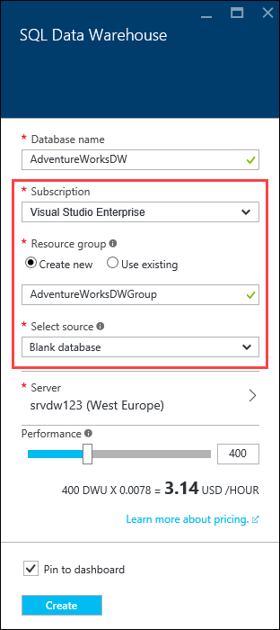
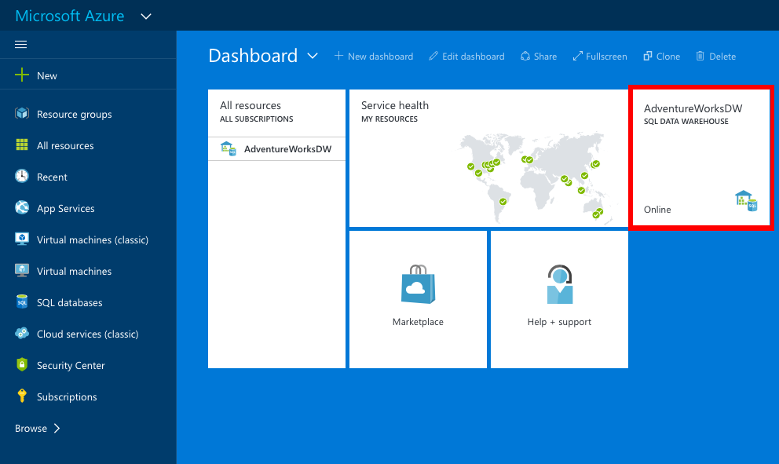

<properties
    pageTitle="在 Azure 门户中创建 SQL 数据仓库 | Azure"
    description="了解如何在 Azure 门户中创建 Azure SQL 数据仓库"
    services="sql-data-warehouse"
    documentationcenter="NA"
    author="barbkess"
    manager="jhubbard"
    editor=""
    tags="azure-sql-data-warehouse" />
<tags
    ms.assetid="552e496e-d560-419c-9996-6bbc80c521cb"
    ms.service="sql-data-warehouse"
    ms.devlang="NA"
    ms.topic="hero-article"
    ms.tgt_pltfrm="NA"
    ms.workload="data-services"
    ms.date="10/31/2016"
    wacn.date="02/20/2017"
    ms.author="barbkess" />  

# 创建 Azure SQL 数据仓库

> [AZURE.SELECTOR]
- [Azure 门户](/documentation/articles/sql-data-warehouse-get-started-provision/)
- [TSQL](/documentation/articles/sql-data-warehouse-get-started-create-database-tsql/)
- [PowerShell](/documentation/articles/sql-data-warehouse-get-started-provision-powershell/)

本教程使用 Azure 门户来创建包含 AdventureWorksDW 示例数据库的 SQL 数据仓库。

## 先决条件
若要开始，您需要：

* **Azure 帐户**：访问 [Azure 免费试用版][Azure Free Trial]，以创建帐户。
* **Azure SQL Server**：有关详细信息，请参阅[使用 Azure 门户创建 Azure SQL 数据库逻辑服务器][]。

> [AZURE.NOTE]
创建 SQL 数据仓库可能会导致新的计费服务。有关详细信息，请参阅 [SQL 数据仓库定价][SQL Data Warehouse pricing]。
>
>

## 创建 SQL 数据仓库

1. 登录到 [Azure 门户](https://portal.azure.cn)。

2. 单击“+ 新建” >“数据库” >“SQL 数据仓库”。

      

3. 在“SQL 数据仓库”边栏选项卡中，填写所需的信息，然后按“创建”进行创建。

      

    * **服务器**：建议先选择服务器。
    
    * **数据库名称**：用于引用 SQL 数据仓库的名称。对服务器而言，它必须是唯一的。
    
    * **性能**：建议从 400 [DWU][DWU] 开始。可以将滑块向左或向右移动以调整数据仓库的性能，也可以在创建之后增加或减少。若要了解有关 DWU 的详细信息，请参阅[缩放](/documentation/articles/sql-data-warehouse-manage-compute-overview/)文档或者[定价页面][SQL Data Warehouse pricing]。
    
    * **订阅**：选择此 SQL 数据仓库将会计费的[订阅]。
    
    * **资源组**：[资源组][Resource group]是旨在帮助管理 Azure 资源集合的容器。了解有关[资源组](/documentation/articles/resource-group-overview/)的详细信息。
    
    * **选择源**：单击“选择源”>“示例”。Azure 使用 AdventureWorksDW 自动填充“选择示例”选项。

    > [AZURE.NOTE]
    SQL 数据仓库的默认排序规则是 SQL\_Latin1\_General\_CP1\_CI\_AS。如果需要其他排序规则，则可使用 [T-SQL][T-SQL] 通过其他排序规则创建数据库。
    >
    >

4. 单击“创建”以创建 SQL 数据仓库。

5. 请稍等几分钟。数据仓库准备就绪后，应返回到 [Azure 门户](https://portal.azure.cn)。你可以在仪表板上找到你的 SQL 数据仓库，它列于 SQL 数据库之下，或在用来创建它的资源组中。

    

<!-- Not for Mooncake with sql-database-create-new-server-firewall-portal.md -->
## 后续步骤

创建 SQL 数据仓库后，便可以[连接](/documentation/articles/sql-data-warehouse-connect-overview/)并开始查询。

若要将数据加载到 SQL 数据仓库中，请参阅[加载概述](/documentation/articles/sql-data-warehouse-overview-load/)。

如果尝试将现有数据库迁移到 SQL 数据仓库，请参阅[迁移概述](/documentation/articles/sql-data-warehouse-overview-migrate/)或使用[迁移实用工具](/documentation/articles/sql-data-warehouse-migrate-migration-utility/)。

还可以使用 Transact-SQL 配置防火墙规则。有关详细信息，请参阅 [sp\_set\_firewall\_rule][sp_set_firewall_rule] 和 [sp\_set\_database\_firewall\_rule][sp_set_database_firewall_rule]。

查看[最佳实践][Best practices]也是一个很好的想法。

<!--Article references-->
[使用 Azure 门户创建 Azure SQL 数据库逻辑服务器]: /documentation/articles/sql-database-get-started/#create-logical-server-bk
[Create an Azure SQL Database logical server with PowerShell]: /documentation/articles/sql-database-get-started-powershell/#database-setup-create-a-resource-group-server-and-firewall-rule
[resource groups]: /documentation/articles/resource-group-template-deploy-portal/
[Best practices]: /documentation/articles/sql-data-warehouse-best-practices/
[DWU]: /documentation/articles/sql-data-warehouse-overview-what-is/#data-warehouse-units
[订阅]: /documentation/articles/azure-glossary-cloud-terminology/#subscription/
[resource group]: /documentation/articles/azure-glossary-cloud-terminology/#resource-group
[T-SQL]: /documentation/articles/sql-data-warehouse-get-started-create-database-tsql/
 
<!--MSDN references-->
[sp_set_firewall_rule]: https://msdn.microsoft.com/zh-cn/library/dn270017.aspx
[sp_set_database_firewall_rule]: https://msdn.microsoft.com/zh-cn/library/dn270010.aspx

<!--Other Web references-->

[SQL Data Warehouse pricing]: /pricing/details/sql-data-warehouse/
[Azure Free Trial]: /pricing/1rmb-trial/?WT.mc_id=A261C142F

<!---HONumber=Mooncake_0213_2017-->
<!-- Update_Description: meta data; words updating; update link reference  -->