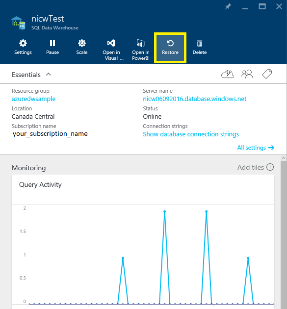

<properties
   pageTitle="还原 Azure SQL 数据仓库（门户）| Azure"
   description="用于还原 SQL 数据仓库的 Azure 门户任务。"
   services="sql-data-warehouse"
   documentationCenter="NA"
   authors="sonyam"
   manager="barbkess"
   editor=""/>  

<tags
   ms.service="sql-data-warehouse"
   ms.date="06/28/2016"
   wacn.date="08/22/2016"/>

# 还原 Azure SQL 数据仓库（门户）

> [AZURE.SELECTOR]
- [概述][]
- [门户][]
- [PowerShell][]
- [REST][]

在本文中，你会学习如何使用 Azure 门户预览还原 Azure SQL 数据仓库。

## 开始之前

**验证 DTU 容量。** 每个 SQL 数据仓库都由 SQL Server 逻辑服务器来承载。此逻辑服务器具有以 DTU 单位进行度量的容量限制。请务必确保承载数据库的 SQL Server 逻辑服务器对于所还原的数据库具有足够 DTU 容量，然后才能还原 SQL 数据仓库。有关[如何查看和提高 DTU 配额][]的详细信息，请参阅此博客文章。

## 还原活动或暂停的数据库

还原数据库：

1. 登录到 [Azure 门户预览][]
2. 在屏幕左侧选择“浏览”，然后选择“SQL Sever”
    
    
    
3. 导航到你的服务器并选择它
    
    

4. 查找要从中还原的 SQL 数据仓库，然后选择它
    
    
5. 在数据仓库边栏选项卡顶部，单击“还原”
    
    

6. 指定新的“数据库名称”
7. 选择最新“还原点”
    1. 请确保选择最新还原点。由于还原点以 UTC 进行显示，因为有时显示的默认选项不是最新还原点。
    
    

8. 单击**“确定”**
9. 数据库还原过程随即将会开始，你可以使用“通知”监视还原进度

>[AZURE.NOTE] 完成还原后，你可以根据[确认已恢复的数据库][]指南来配置已恢复的数据库。

## 还原已删除的数据库

还原已删除的数据库：

1. 登录到 [Azure 门户预览][]
2. 在屏幕左侧选择“浏览”，然后选择“SQL Sever”
    
    

3. 导航到你的服务器并选择它
    
    

4. 向下滚动到服务器边栏选项卡上的“操作”部分
5. 单击“已删除的数据库”磁贴
    
    

6. 选择要还原的已删除数据库
    
    

7. 指定新的“数据库名称”
    
    
    
8. 单击**“确定”**
9. 数据库还原过程随即将会开始，你可以使用“通知”监视还原进度

>[AZURE.NOTE] 完成还原后，你可以根据[确认已恢复的数据库][]指南来配置已恢复的数据库。

## 后续步骤
若要了解 Azure SQL 数据库版本的业务连续性功能，请阅读 [Azure SQL 数据库业务连续性概述][]。

<!--Image references-->

<!--Article references-->
[Azure SQL 数据库业务连续性概述]: /documentation/articles/sql-database-business-continuity/
[概述]: /documentation/articles/sql-data-warehouse-restore-database-overview/
[门户]: /documentation/articles/sql-data-warehouse-restore-database-portal/
[PowerShell]: /documentation/articles/sql-data-warehouse-restore-database-powershell/
[REST]: /documentation/articles/sql-data-warehouse-restore-database-rest-api/
[确认已恢复的数据库]: /documentation/articles/sql-database-recovered-finalize/

<!--MSDN references-->

<!--Blog references-->
[如何查看和提高 DTU 配额]: https://azure.microsoft.com/blog/azure-limits-quotas-increase-requests/

<!--Other Web references-->

[Azure 门户预览]: https://portal.azure.cn/

<!---HONumber=Mooncake_0815_2016-->