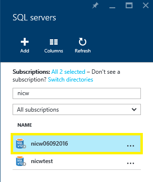

<properties
    pageTitle="还原 Azure SQL 数据仓库（Azure 门户）| Azure"
    description="用于还原 SQL 数据仓库的 Azure 门户任务。"
    services="sql-data-warehouse"
    documentationcenter="NA"
    author="Lakshmi1812"
    manager="barbkess"
    editor="" />
<tags
    ms.assetid="b0aef539-7657-4b0e-9899-74098f5c21bc"
    ms.service="sql-data-warehouse"
    ms.devlang="NA"
    ms.topic="article"
    ms.tgt_pltfrm="NA"
    ms.workload="data-services"
    ms.date="09/21/2016"
    wacn.date="02/20/2017"
    ms.author="lakshmir;barbkess;sonyama" />  

# 还原 Azure SQL 数据仓库（门户）

> [AZURE.SELECTOR]
- [概述][Overview]
- [门户][Portal]
- [PowerShell][PowerShell]
- [REST][REST]

本文介绍如何使用 Azure 门户还原 Azure SQL 数据仓库。

## 开始之前

**验证 DTU 容量。** 每个 SQL 数据仓库的实例都由一个具有默认数据吞吐量单位 (DTU) 配额的 SQL Server（例如 myserver.database.chinacloudapi.cn）托管。在还原 SQL 数据仓库之前，请验证 SQL Server 的剩余 DTU 配额是否足够进行数据库还原。若要了解如何计算 DTU 配额或请求更多的 DTU，请参阅[请求 DTU 配额更改][Request a DTU quota change]。

## 还原活动或暂停的数据库

还原数据库：

1. 登录到 [Azure 门户][Azure portal]。

2. 在左窗格中选择“浏览”，然后选择“SQL Sever”。
    
      

3. 查找服务器，然后选择它。
    
      

4. 查找要从中还原的 SQL 数据仓库的实例，然后选择它。
    
    
    
5. 在数据仓库边栏选项卡顶部，选择“还原”。
    
      

6. 指定新的“数据库名称”。

7. 选择最新“还原点”。

    请确保选择最新还原点。由于还原点是按协调世界时 (UTC) 显示的，因此默认选项可能不是最新还原点。
    
        

8. 选择“确定”。

9. 数据库还原过程随即会开始，可以使用“通知”监视该过程。

> [AZURE.NOTE]
> 完成还原后，即可按[在恢复后配置数据库][Configure your database after recovery]中的说明配置恢复的数据库。
>
>

## 还原已删除的数据库

还原已删除的数据库：

1. 登录到 [Azure 门户][Azure portal]。

2. 在左窗格中选择“浏览”，然后选择“SQL Sever”。
    
      

3. 查找服务器，然后选择它。
    
      

4. 向下滚动到服务器边栏选项卡上的“操作”部分。
5. 选择“已删除的数据库”磁贴。
    
      

6. 选择要还原的已删除数据库。
    
      

7. 指定新的“数据库名称”。
    
      
    
8. 选择“确定”。

9. 数据库还原过程随即会开始，可以使用“通知”监视该过程。

> [AZURE.NOTE]
> 若要在完成还原后配置数据库，请参阅[在恢复后配置数据库][Configure your database after recovery]。
>
>

## 后续步骤
若要了解 Azure SQL 数据库版本的业务连续性功能，请阅读 [Azure SQL 数据库业务连续性概述][Azure SQL Database business continuity overview]。

<!--Image references-->

<!--Article references-->
[Azure SQL Database business continuity overview]: /documentation/articles/sql-database-business-continuity/
[Overview]: /documentation/articles/sql-data-warehouse-restore-database-overview/
[Portal]: /documentation/articles/sql-data-warehouse-restore-database-portal/
[PowerShell]: /documentation/articles/sql-data-warehouse-restore-database-powershell/
[REST]: /documentation/articles/sql-data-warehouse-restore-database-rest-api/
[Configure your database after recovery]: /documentation/articles/sql-database-disaster-recovery/#configure-your-database-after-recovery
<!-- Not available for sql-data-warehouse-get-started-create-support-ticket/#request-quota-change -->

<!--MSDN references-->

<!--Blog references-->

<!--Other Web references-->

[Azure 门户预览]: https://portal.azure.cn/

<!---HONumber=Mooncake_0213_2017-->
<!-- Update_Description: meta data; words updating; update link reference -->