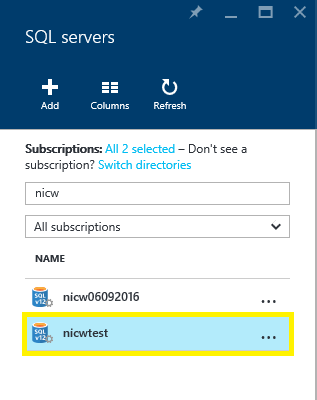
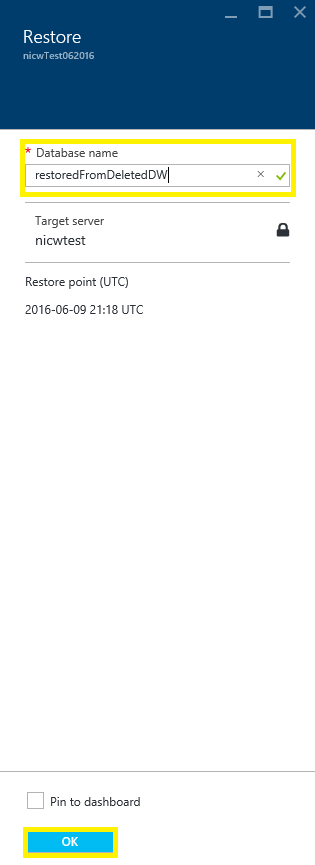

<properties
   pageTitle="还原 Azure SQL 数据仓库（门户）| Azure"
   description="用于还原 SQL 数据仓库的 Azure 门户任务。"
   services="sql-data-warehouse"
   documentationCenter="NA"
   authors="Lakshmi1812"
   manager="barbkess"
   editor=""/>  

<tags
   ms.service="sql-data-warehouse"
   ms.devlang="NA"
   ms.topic="article"
   ms.tgt_pltfrm="NA"
   ms.workload="data-services"
   ms.date="09/21/2016"
   wacn.date="10/31/2016"/>

# 还原 Azure SQL 数据仓库（门户）

> [AZURE.SELECTOR]
- [概述][]
- [门户][]
- [PowerShell][]
- [REST][]

在本文中，你会学习如何使用 Azure 门户预览还原 Azure SQL 数据仓库。

## 开始之前

**验证 DTU 容量。** 每个 SQL 数据仓库都由一个具有默认 DTU 配额的 SQL 服务器（例如 myserver.database.chinacloudapi.cn）托管。在还原 SQL 数据仓库之前，请确保 SQL Server 的剩余 DTU 配额足够进行数据库还原。若要了解如何计算所需 DTU 或请求更多的 DTU，请参阅[请求 DTU 配额更改][]。

## 还原活动或暂停的数据库

还原数据库：

1. 登录到 [Azure 门户预览][]
2. 在屏幕左侧选择“浏览”，然后选择“SQL Sever”
    
    
    
3. 导航到你的服务器并选择它
    
    

4. 查找要从中还原的 SQL 数据仓库，然后选择它
    
    
5. 在数据仓库边栏选项卡顶部，单击“还原”
    
    

6. 指定新的“数据库名称”
7. 选择最新“还原点”
    1. 请确保选择最新还原点。由于还原点以 UTC 进行显示，因为有时显示的默认选项不是最新还原点。
    
    

8. 单击**“确定”**
9. 数据库还原过程随即将会开始，你可以使用“通知”监视还原进度

>[AZURE.NOTE] 完成还原后，即可按 [Configure your database after recovery][]（在恢复后配置数据库）中的说明配置恢复的数据库。

## 还原已删除的数据库

还原已删除的数据库：

1. 登录到 [Azure 门户预览][]
2. 在屏幕左侧选择“浏览”，然后选择“SQL Sever”
    
    

3. 导航到你的服务器并选择它
    
    

4. 向下滚动到服务器边栏选项卡上的“操作”部分
5. 单击“已删除的数据库”磁贴
    
    

6. 选择要还原的已删除数据库
    
    

7. 指定新的“数据库名称”
    
    
    
8. 单击**“确定”**
9. 数据库还原过程随即将会开始，你可以使用“通知”监视还原进度

>[AZURE.NOTE] 若要在完成还原后配置数据库，请参阅 [Configure your database after recovery][]（在恢复后配置数据库）。

## 后续步骤
若要了解 Azure SQL 数据库版本的业务连续性功能，请阅读 [Azure SQL 数据库业务连续性概述][]。

<!--Image references-->

<!--Article references-->
[Azure SQL 数据库业务连续性概述]: /documentation/articles/sql-database-business-continuity/
[概述]: /documentation/articles/sql-data-warehouse-restore-database-overview/
[门户]: /documentation/articles/sql-data-warehouse-restore-database-portal/
[PowerShell]: /documentation/articles/sql-data-warehouse-restore-database-powershell/
[REST]: /documentation/articles/sql-data-warehouse-restore-database-rest-api/
[Configure your database after recovery]: /documentation/articles/sql-database-disaster-recovery#configure-your-database-after-recovery
[请求 DTU 配额更改]: /documentation/articles/sql-data-warehouse-get-started-create-support-ticket#request-quota-change

<!--MSDN references-->

<!--Blog references-->

<!--Other Web references-->

[Azure 门户预览]: https://portal.azure.cn/

<!---HONumber=Mooncake_1024_2016-->