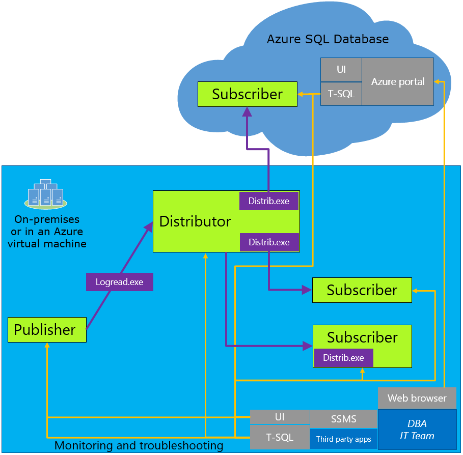

<properties
   pageTitle="使用事务复制迁移到 SQL 数据库"
   description="Azure SQL 数据库，数据库迁移，导入数据库，事务复制"
   services="sql-database"
   documentationCenter=""
   authors="carlrabeler"
   manager="jeffreyg"
   editor=""/>

<tags
   ms.service="sql-database"
   ms.date="03/14/2016"
   wacn.date="04/06/2016"/>

# 使用事务复制将 SQL Server 数据库迁移到 SQL 数据库

如果在发生迁移时你无法承受从生产中删除 SQL Server 数据库的后果，可以使用 SQL Server 事务复制作为你的迁移解决方案。使用事务复制，开始迁移和完成迁移之间发生的数据或架构的所有更改都出现在 Azure SQL 数据库中。迁移完成后，你只需要更改应用程序的连接字符串，将其指向 Azure SQL 数据库，而不是指向本地数据库。一旦事务复制清空保留在本地数据库中的任何更改，并且所有应用程序指向 Azure DB，你就可以安全地卸载复制，使 Azure SQL 数据库作为生产系统。

 

事务复制是一种内置技术，与 SQL Server 6.5 和更高版本的 SQL Server 集成。它是非常成熟且经过证实的技术，大多数 DBA 运用现有的经验就能操作。现在，可以使用 [SQL Server 2016 预览版](http://www.microsoft.com/server-cloud/products/sql-server-2016)将 Azure SQL 数据库配置为本地发布的[事务复制订阅者](https://msdn.microsoft.com/zh-cn/library/mt589530.aspx)。从 Management Studio 设置的体验与在本地服务器上设置事务复制订阅者完全相同。当发布服务器和分发服务器至少是以下 SQL Server 版本之一时，支持此方案：

 - SQL Server 2016 CTP3（预览版）和更高版本 
 - SQL Server 2014 SP1 CU3 和更高版本
 - SQL Server 2014 RTM CU10 和更高版本
 - SQL Server 2012 SP2 CU8 和更高版本
 - SQL Server 2013 SP3（发行时）

还可以使用事务复制来迁移本地数据库的子集。复制到 Azure SQL 数据库的发布可以限制为复制的数据库中表的子集。此外，对于所复制的每一个表，可以将数据限制为行的子集和/或列的子集。

<!---HONumber=Mooncake_0328_2016-->
