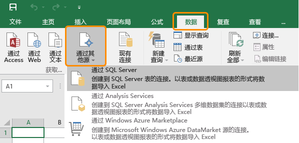
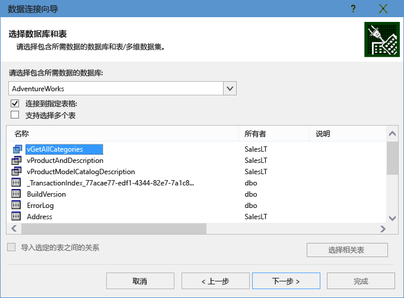
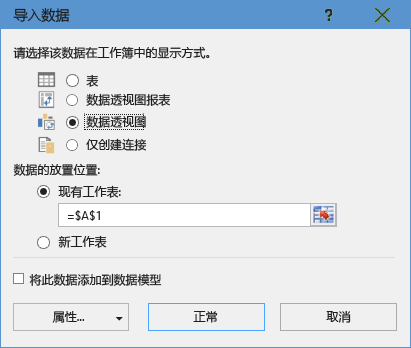
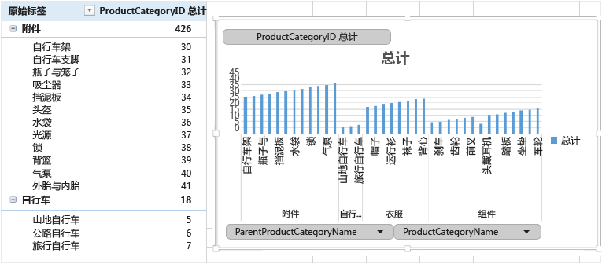

<properties
	pageTitle="将 Excel 连接到 SQL 数据库 | Azure"
	description="了解如何将 Microsoft Excel 连接到在云中的 Azure SQL 数据库。将数据导入 Excel 以进行报告和数据探索。"
	services="sql-database"
	keywords="将 excel 连接到 sql, 将数据导入 excel"
	documentationCenter=""
	authors="joseidz"
	manager="jhubbard"
	editor=""/>

<tags
	ms.service="sql-database"
	ms.date="03/25/2016"
	wacn.date="05/16/2016"/>

# SQL 数据库教程：将 Excel 连接到 Azure SQL 数据库并创建报表

> [AZURE.SELECTOR]
- [C#](/documentation/articles/sql-database-connect-query/)
- [SSMS](/documentation/articles/sql-database-connect-query-ssms/)
- [Excel](/documentation/articles/sql-database-connect-excel/)

了解如何将 Excel 连接到云中的 SQL 数据库，以便导入数据并根据数据库中的值来创建表和图表。在本教程中，你将设置 Excel 与数据库表之间的连接，保存用于存储 Excel 的数据和连接信息的文件，然后根据数据库值创建分析数据透视图。

在开始之前，需要在 Azure 中创建一个 SQL 数据库。如果你没有，请参阅[创建你的第一个 SQL 数据库](/documentation/articles/sql-database-get-started/)，以在几分钟内获取数据库，并让其中的示例数据正常运行。在本文中，你可以从那篇文章中的示例数据导入 Excel，但你可以对自己的数据执行类似的步骤。

你还需要 Excel 的副本。本文使用 [Microsoft Excel 2016](https://products.office.com/zh-cn)。

## 将 Excel 连接到 SQL 数据库并创建 odc 文件

1.	若要将 Excel 连接到 SQL 数据库，请打开 Excel，然后创建新的工作簿或打开现有的 Excel 工作簿。

2.	在页面顶部的菜单栏中单击“数据”，单击“从其他源”，然后单击“从 SQL Server”。

	

	此时将打开“数据连接”向导。

3.	在“连接到数据库服务器”对话框中，以格式 <服务器名称>**.database.chinacloudapi.cn** 键入你要连接到的 SQL 数据库的**服务器名称**。例如 **adworkserver.database.chinacloudapi.cn**。

4.	在“登录凭据”下，单击“使用以下用户名和密码”，键入在创建 SQL 数据库服务器时为其设置的**用户名**和**密码**，然后单击“下一步”。

    

	> [AZURE.TIP] 根据你的网络环境，你可能无法连接；如果 SQL 数据库服务器不允许来自客户端 IP 地址的流量，你可能会断开连接。转到 [Azure 管理门户](https://manage.windowsazure.cn)，依次单击“SQL 服务器”、你的服务器、“设置”下面的“防火墙”，然后添加你的客户端 IP 地址。

5. 在“选择数据库和表”对话框中，从列表中选择要使用的数据库，然后单击要使用的表或视图（我们选择了 **vGetAllCategories**），然后单击“下一步”。

	

    此时将打开“保存数据连接文件并完成”对话框，请在其中提供 Excel 使用的 Office 数据库连接 (*.odc) 文件的相关信息。你可以保留默认值，或自定义选择项。

6. 你可以保留默认值，但要特意记下“文件名”。“说明”、“友好名称”和“搜索关键字”可帮助你和其他用户记住要连接的项和查找连接。如果你希望将连接信息存储在 odc 文件中以便在连接时进行更新，请单击“始终尝试使用此文件来刷新数据”，然后单击“完成”。

    

    此时将显示“导入数据”对话框。

## 将数据导入 Excel 并创建数据透视图
创建连接并创建包含数据与连接信息的文件后，便可以导入数据。

1. 在“导入数据”对话框中，单击要在工作表中呈现数据的选项，然后单击“确定”。我们选择了“数据透视图”。你也可以选择创建**新工作表**或**将此数据添加到数据模型**。有关数据模型的详细信息，请参阅 [Create a data model in Excel（在 Excel 中创建数据模型）](https://support.office.com/article/Create-a-Data-Model-in-Excel-87E7A54C-87DC-488E-9410-5C75DBCB0F7B)。 单击“属性”浏览在上一个步骤中创建的 odc 文件的相关信息，并选择用于刷新数据的选项。

	

    工作表现在包含空白的数据透视表和图表。

8. 在“数据透视表字段”下，选中你要查看的所有字段的复选框。

	

> [AZURE.TIP] 如果要将其他 Excel 工作簿和工作表连接到数据库，请依次单击“数据”、“连接”、“添加”，从列表中选择你创建的连接，然后单击“打开”。
> 

## 后续步骤

- 了解如何[使用 SQL Server Management Studio 连接到 SQL 数据库](/documentation/articles/sql-database-connect-query-ssms/)，以进行高级查询和分析。
- 了解[弹性池](/documentation/articles/sql-database-elastic-pool/)的优点。
- 了解如何[创建与后端 SQL 数据库连接的 Web 应用程序](/documentation/articles/web-sites-dotnet-deploy-aspnet-mvc-app-membership-oauth-sql-database/)。

<!---HONumber=Mooncake_0503_2016-->
