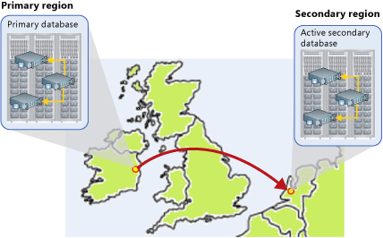

<properties
	pageTitle="Azure SQL 数据库的活动异地复制"
	description="本主题介绍 SQL 数据库的活动异地复制及其用法。"
	services="sql-database"
	documentationCenter="na"
	authors="rothja"
	manager="jeffreyg"
	editor="monicar" />

<tags
	ms.service="sql-database"
	ms.date="10/21/2015"
	wacn.date="12/22/2015" />

# Azure SQL 数据库的活动异地复制

## 概述
活动异地复制功能实现了一个机制，用于在同一 Azure 区域或不同区域中提供数据库冗余（异地冗余）。活动异地复制以异步方式将已提交的事务从数据库复制到不同服务器上的最多四个数据库副本中。原始数据库将变成连续副本的主数据库。每个连续副本称为联机辅助数据库。主数据库以异步方式将已提交的事务复制到每个联机辅助数据库。尽管在任意给定时间，联机辅助数据可能略微滞后于主数据库，但系统可以保证联机辅助数据在事务处理上始终与提交到主数据库的更改相一致。活动异地复制最多支持四个联机辅助数据库，或最多支持三个联机辅助数据库和一个脱机辅助数据库。

活动异地复制的主要优势之一在于能够提供数据库级别的灾难恢复解决方案。使用活动异地复制，可以将高级服务层中的某个用户数据库配置为向相同或不同区域中不同 Azure SQL 数据库服务器上的数据库复制事务。跨区域冗余使应用程序能够在自然灾害、灾难性人为失误或恶意行为导致数据中心永久性数据丢失后得以恢复。

另一个关键优势在于可以读取联机辅助数据库。因此，联机辅助数据库可以充当读取工作负荷（例如报告）的负载平衡器。你可以在不同的区域中为实现灾难恢复创建联机辅助数据库，同时，你也可以在同一区域中的不同服务器上创建联机辅助数据库。可以使用这两个联机辅助数据库，来平衡针对分散在不同区域的客户端提供服务的只读工作负荷。

可以用到活动异地复制的其他场合包括：

- **数据库迁移**：可以使用活动异地复制将数据库从一台服务器联机迁移到另一台服务器，且只会造成极少量的停机时间。
- **应用程序升级**：可以将联机辅助数据库用作故障回复选项。

若要真正实现业务连续性，只需将数据中心之间的冗余性添加到相关的存储即可，这只是该解决方案的一部分功能。在发生灾难性故障后，端对端地恢复应用程序（服务）需要恢复构成该服务的所有组件以及所有依赖服务。这些组件的示例包括客户端软件（例如，使用自定义 JavaScript 的浏览器）、Web 前端、存储和 DNS。所有组件必须能够弹性应对相同的故障，并在应用程序的恢复时间目标 (RTO) 值内变为可用，这一点非常关键。因此，你需要识别所有依赖服务，并了解它们提供的保证和功能。然后，必须执行适当的步骤来确保对你的服务所依赖的服务执行故障转移期间，你的服务能够正常运行。有关设计用于灾难恢复的解决方案的详细信息，请参阅[使用活动异地复制设计灾难恢复云解决方案](/documentation/articles/sql-database-designing-cloud-solutions-for-disaster-recover)。

## 活动异地复制的功能
活动异地复制提供以下基本功能：

- **自动异步复制**：设定联机辅助数据库的种子后，自动以异步方式将主数据库发生的更新复制到联机辅助数据库。也就是说，会先在主数据库上提交事务，然后将事务复制到联机辅助数据库。但是，在完成种子设定后，联机辅助数据库在任意给定时间点的事务处理方式都将保持一致。
	>[AZURE.NOTE]异步复制能够适应连接远程数据中心所用的广域网通常存在的延迟情况。

- **多个联机辅助数据库**：创建两个或更多个联机辅助数据库可以针对主数据库和应用程序提高冗余和保护能力。如果存在多个联机辅助数据库，即使其中一个联机辅助数据库发生故障，应用程序仍会受到保护。如果只有一个联机辅助数据库，一旦它发生故障，应用程序就会遭受更高的风险，直到创建了新的联机辅助数据库。

- **可读的联机辅助数据库**：应用程序可以使用访问主数据库时所用的相同安全主体来访问联机辅助数据库以执行只读操作。联机辅助数据库上的连续复制操作优先于应用程序访问。另外，如果联机辅助数据库上的查询导致表锁定时间延长，则事务最终可能会在主数据库上失败。

- **用户控制的故障转移终止**：在将应用程序故障转移到联机辅助数据库之前，必须终止与主数据库的连续复制关系。终止连续复制关系需要由应用程序执行显式操作，或者通过门户手动运行管理脚本。终止后，联机辅助数据库将变成独立数据库。除非主数据库是只读数据库，否则，活动辅助数据库将变成读写数据库。本主题的后面将介绍[终止连续复制关系](/documentation/articles/#termination-of-a-continuous-copy-relationship)的两种方式。

>[AZURE.NOTE]活动异地复制仅支持高级服务层中的数据库。这适用于主数据库和联机辅助数据库。必须将联机辅助数据库配置为使用与主数据库相同的或者比主数据库更高的性能级别。对主数据库的性能级别所做的更改不会自动复制到辅助数据库。任何升级应首先在辅助数据库上完成，最后在主数据库上进行。有关更改性能级别的详细信息，请参阅[更改性能级别](sql-database-scale-up)。联机辅助数据库的大小应该至少与主数据库相同的主要原因有两个：辅助数据库必须有足够的容量，以便能够以同于主数据库的速度处理复制的事务。如果辅助数据库最起码不能提供相同的容量用于处理传入的事务，则它的工作可能会滞后，最终影响主数据库的可用性。如果辅助数据库没有与主数据库相同的容量，故障转移可能会降低应用程序的性能和可用性。

## 连续复制关系的概念
本地数据冗余和操作恢复是 Azure SQL 数据库的标准功能。每个数据库拥有一个主数据库以及驻留在同一数据中心内的两个本地副本数据库，它们可在该数据中心内提供高可用性。也就是说，活动异地复制数据库也有冗余副本。主数据库和联机辅助数据库有两个辅助副本。但是，辅助数据库的主副本由连续复制机制直接更新，并且无法接受应用程序启动的任何更新。下图演示了活动异地复制如何跨两个 Azure 区域扩展数据库冗余。托管主数据库的区域称为主要区域。托管联机辅助数据库的区域称为次要区域。在此图中，North Europe 是主要区域。West Europe 是次要区域。

如果主数据库不可用，终止给定的联机辅助数据库的连续复制关系会使该联机辅助数据库成为独立数据库。联机辅助数据库将继承主数据库的只读/读写模式，而终止操作不会更改这种模式。例如，如果主数据库是只读数据库，在终止后，联机辅助数据库将成为只读数据库。此时，应用程序可以故障转移，并继续使用该联机辅助数据库。若要在数据中心发生灾难性故障或者主要区域长时间服务中断的情况下提供弹性，另一个区域中至少需要有一个联机辅助数据库。

## 创建连续副本
只能创建现有数据库的连续副本。创建现有数据库的连续副本对于添加异地冗余非常有用。创建连续复制还可以将现有数据库复制到其他 Azure SQL 数据库服务器。创建完成之后，辅助数据库将填充从主数据库复制的数据。这个过程称为种子设定。种子设定完成之后，每个新事务都会先在主数据库上提交，然后进行复制。

有关如何创建现有数据库的连续副本的信息，请参阅[如何启用异地复制](/documentation/articles/sql-database-business-continuity-design#how-to-enable-geo-replication)。

## 防止丢失关键数据
由于广域网的延迟时间较长，连续复制使用了异步复制机制。这样，在发生故障时，会不可避免地丢失某些数据。但是，某些应用程序可能要求不能有数据丢失。为了保护这些关键更新，应用程序开发人员可以在提交事务后立即调用 [sp\_wait\_for\_database\_copy\_sync](https://msdn.microsoft.com/zh-cn/library/dn467644.aspx) 系统过程。调用 **sp\_wait\_for\_database\_copy\_sync** 会阻止调用线程，直到已将上次提交的事务复制到联机辅助数据库。该过程会等到联机辅助数据库确认所有排队的事务为止。**sp\_wait\_for\_database\_copy\_sync** 将划归到特定的连续复制链接。对主数据库具有连接权限的任何用户都可以调用此过程。

>[AZURE.NOTE]**sp\_wait\_for\_database\_copy\_sync** 过程调用导致的延迟可能会很明显。具体的延迟取决于队列长度以及可用带宽。除非绝对必要，否则请避免调用此过程。

## 终止连续复制关系
可随时终止连续复制关系。终止连续复制关系不会删除辅助数据库。可通过两种方法终止连续复制关系：

- **计划的终止**用于不可接受数据丢失的有计划操作。只有在设定联机辅助数据库的种子后，才能在主数据库上执行计划的终止。执行计划的终止时，会先将提交到主数据库的所有事务复制到联机辅助数据库，然后终止连续复制关系。这可以防止辅助数据库中发生数据丢失。
- **非计划的（强制）终止**旨在应对主数据库或其某个联机辅助数据库发生丢失。可以在主数据库或辅助数据库上执行强制终止。每次执行强制终止都会导致主数据库与关联的联机辅助数据库之间的复制关系出现不可逆的丢失。此外，强制终止会导致尚未从主数据库中复制的所有事务丢失。强制终止会立即终止连续复制关系。正在提交的事务将不会复制到联机辅助数据库。因此，强制终止会导致尚未从主数据库中复制的所有事务出现不可逆的丢失。

>[AZURE.NOTE]如果主数据库只有一种连续复制关系，在终止后，对主数据库所做的更新将不再受到保护。

有关如何终止连续复制关系的详细信息，请参阅[在中断后恢复 Azure SQL 数据库](/documentation/articles/sql-database-disaster-recovery)。

## 后续步骤
有关 SQL 数据库的活动异地复制和其他业务连续性功能的详细信息，请参阅[业务连续性概述](/documentation/articles/sql-database-business-continuity)。

<!---HONumber=Mooncake_1207_2015-->