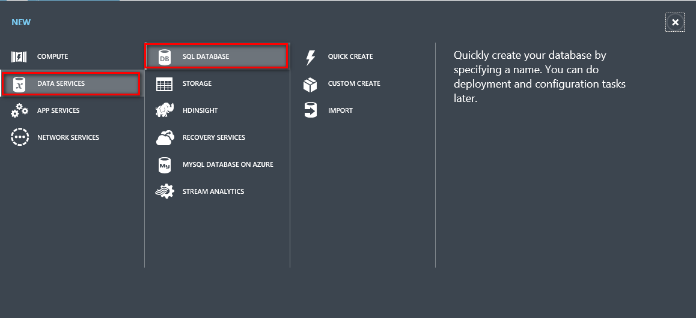
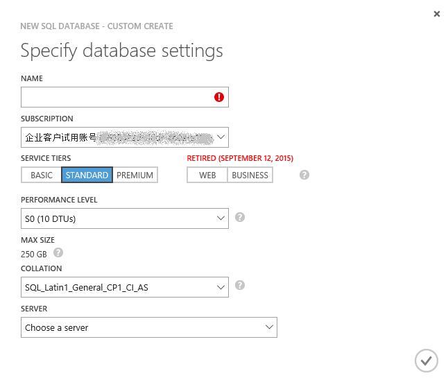
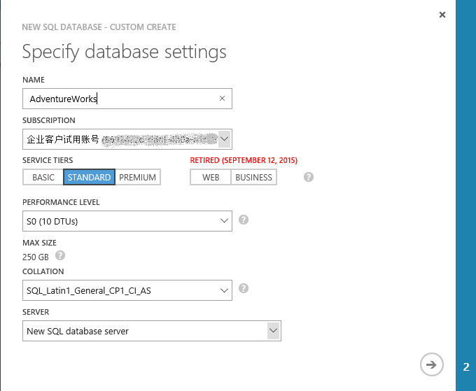
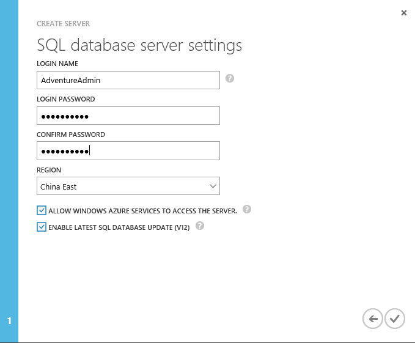
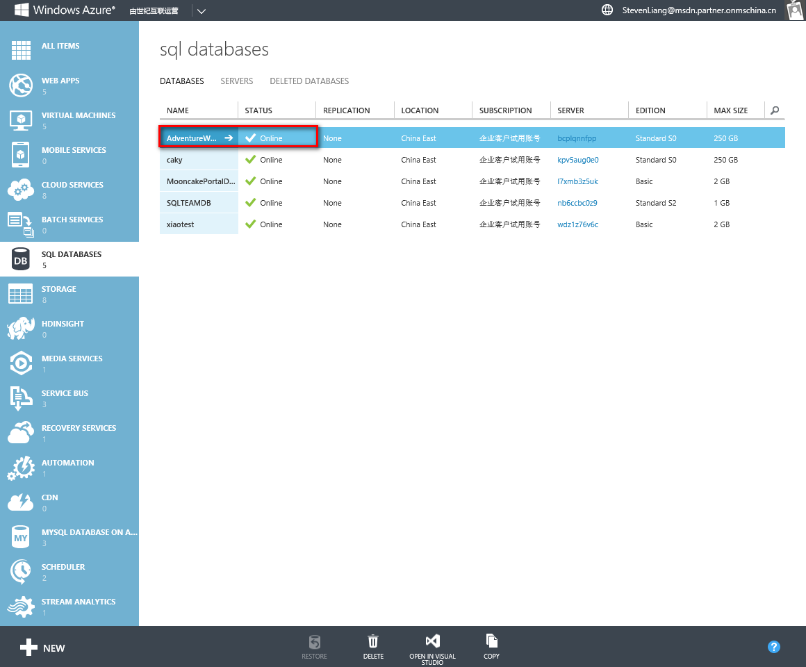
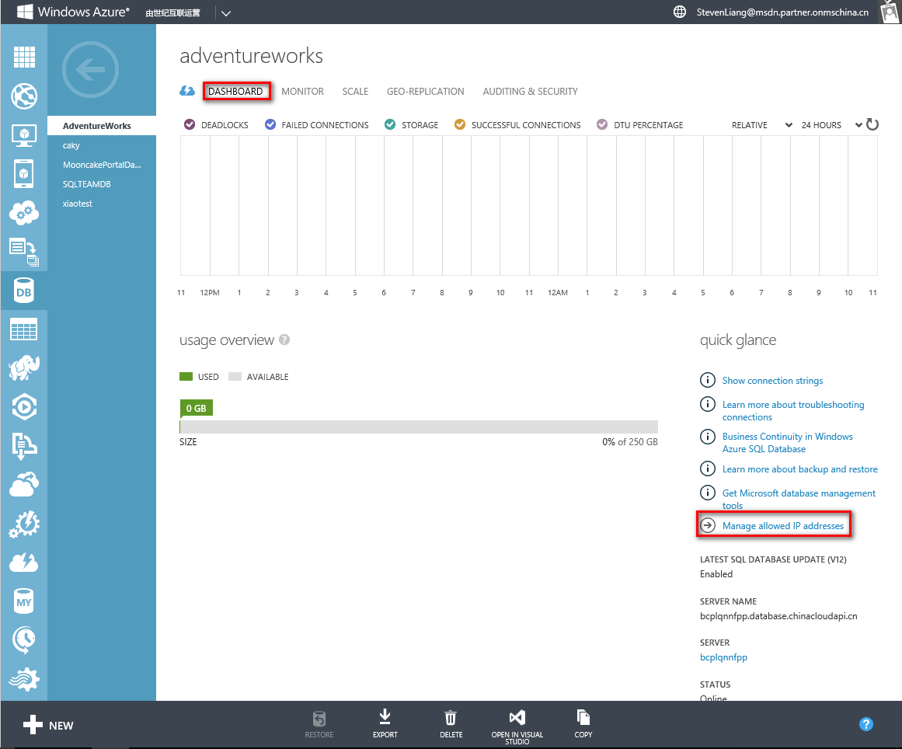
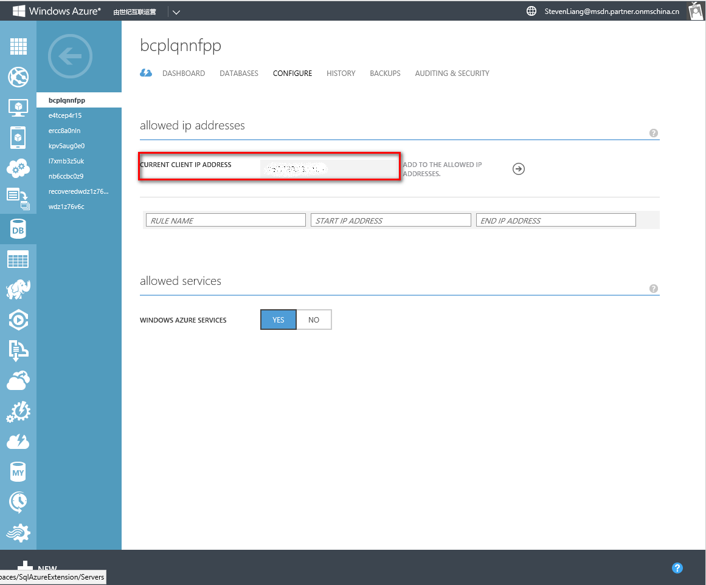
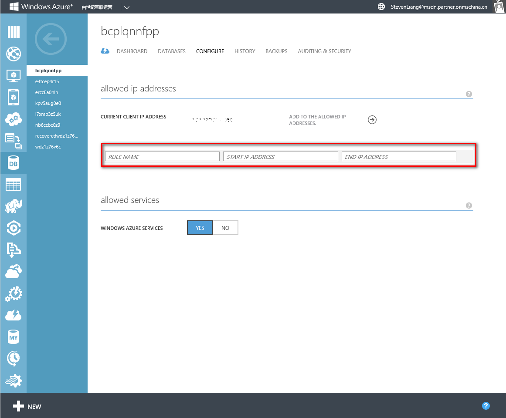

<properties
	pageTitle="SQL 数据库入门 | Windows Azure"
	description="使用 Azure 门户和 AdventureWorks 示例数据库，在几分钟内创建第一个采用 Azure SQL 数据库（Microsoft 在云中的关系数据库管理服务 (RDBMS)）的云数据库。"
	services="sql-database"
	documentationCenter=""
	authors="MightyPen"
	manager="jeffreyg"
	editor=""/>

<tags
	ms.service="sql-database"
	ms.date="09/01/2015"
	wacn.date="10/17/2015"/>

# 创建你的第一个 Azure SQL 数据库

**单一数据库**

> [AZURE.SELECTOR]
- [Azure 门户](/documentation/articles/sql-database-get-started)
- [C#](/documentation/articles/sql-database-get-started-csharp)
- [PowerShell](/documentation/articles/sql-database-get-started-powershell)

本文介绍如何使用 Azure 门户在短短几分钟内创建一个示例 SQL 数据库。你将了解如何执行以下操作：

- 创建服务器来托管所创建的数据库，然后为其设置防火墙规则
- 通过 AdventureWorks 示例创建数据库，该示例中有你可以试用的数据

在开始之前，你需要有 Azure 帐户和订阅。如果没有，请注册[免费试用版](/pricing/1rmb-trial/)。

## 步骤 1：登录并开始设置 SQL 数据库
1. 登录到 [Azure 门户](http://manage.windowsazure.cn/)。
2. 单击“新建”>“数据 + 存储”>“SQL 数据库”。

	
	
	系统将显示“SQL 数据库”设置边栏选项卡，你可以利用该边栏选项卡设置服务器和数据库详细信息。

	

## 步骤 2：选择服务器设置
Azure 中的 SQL 数据库位于数据库服务器上。一个服务器可以托管多个数据库。在你设置数据库时，还可以创建和设置用于托管该数据库的服务器，也可以使用之前创建的服务器。我们将设置一个新服务器。

1. 为数据库键入“名称”（我们使用的是“AdventureWorks”）。我们稍后将返回来介绍其他数据库设置。
2. 在“服务器”下，单击“配置所需的设置”，然后单击“创建新服务器”。

	

3. 在“新建服务器”边栏选项卡中，键入在整个 Azure 中唯一且易记的“服务器名称”。稍后在连接并使用数据库时，将要用到此名称。
4. 键入易记的“服务器管理员登录名”（我们使用的是“AdventureAdmin”）。然后键入安全的“密码”，并在“确认密码”中再次键入。

	

	 将“创建 V12 服务器（最新更新）”的设置保留为“是”，以使用最新功能。“位置”决定了创建服务器的数据中心区域。

	>[AZURE.TIP]请在临近将使用数据库的应用程序的位置创建数据库服务器。若想要更改位置，只需单击“位置”，选取一个不同的位置，然后单击“确定”。

5. 单击“确定”以返回到“SQL 数据库”边栏选项卡。

此时数据库和服务器尚未创建完成。需要完成下一步才可以完成创建，在下一步中，你选择通过 AdventureWorks 示例创建数据库并确认设置。

## 步骤 4：设置和创建数据库
1. 在“SQL 数据库”边栏选项卡中，单击“选择源”，然后单击“示例”。 

	

2. 将返回到“SQL 数据库”边栏选项卡，在该边栏选项卡中，“选择示例”现在显示“AdventureWorks LT [V12]”。单击“创建”开始创建服务器和数据库。

	

	>[AZURE.NOTE]对于本快速操作指南，我们并没有更改“定价层”、“排序规则”和“资源组”的设置。。你随时可以更改数据库的定价层以及进行扩展和缩减，且没有停机时间。有关详细信息，请参阅 [SQL 数据库定价](/pricing/details/sql-database/)<!--和 [SQL 数据库定价层](/documentation/articles/sql-database-service-tiers)-->。数据库的排序规则一经设置不能更改。有关排序规则的详细信息，请参阅[排序规则和 Unicode 支持](https://msdn.microsoft.com/zh-cn/library/ms143726.aspx)。有关 Azure 资源组的详细信息，请参阅 [Azure 资源管理器概述](/documentation/articles/resource-group-overview)。

将跳转回 Azure 启动板，其中一个磁贴显示进度，直到数据库创建完成并处于联机状态。也可以单击“浏览全部”，然后单击“SQL 数据库”，以确认数据库处于联机状态。
	
祝贺你！ 你现在拥有一个在云中运行的数据库。操作即将完成。只剩最后一个关键步骤。你需要在数据库服务器上创建规则，以便可以连接到数据库。

## 步骤 5：配置防火墙

你需要在服务器上设置允许从客户端计算机 IP 地址连接到数据库的防火墙规则，以便可以使用数据库。这不仅有助于确保可以连接，还是一种极佳的方法，让你可以看到能够从中获取有关 Azure 中 SQL 服务器更多详细信息的区域。

1. 单击“浏览全部”，向下滚动，单击“SQL 服务器”，然后从“SQL 服务器”列表中单击之前创建的服务器的名称。

	

	
3. 在右侧显示的数据库属性边栏选项卡中，单击“设置”，然后从列表中单击“防火墙”。

	

	“防火墙设置”显示当前的“客户端 IP 地址”。

	

4. 单击“添加客户端 IP”，让 Azure 创建用于该 IP 地址的规则，然后单击“保存”。

	

	>[AZURE.IMPORTANT]你的 IP 地址可能会不定时地更改，你可能需要创建新的防火墙规则，才能访问数据库。你可以使用 [Bing](http://www.bing.com/search?q=my%20ip%20address) 检查自己的 IP 地址，然后添加单个 IP 地址或 IP 地址范围。有关详细信息，请参阅[如何配置防火墙设置](/documentation/articles/sql-database-configure-firewall-settings)。

## 后续步骤
现在，你已拥有一个带有部分示例数据的数据库，可以尝试使用自己喜欢的工具。

- 如果你熟悉 Transact-SQL 和 SQL Server Management Studio，请学习如何[使用 SSMS 连接和查询 SQL 数据库](/documentation/articles/sql-database-connect-query-ssms)。

- 如果你了解 Excel，请学习如何[使用 Excel 连接到 Azure SQL 数据库](/documentation/articles/sql-database-connect-excel)。

- 如果你已经准备好开始编码，请参阅[使用 C# 连接和查询 SQL 数据库](/documentation/articles/sql-database-connect-query)和[从 .NET (C#) 使用 SQL 数据库](/documentation/articles/sql-database-develop-dotnet-simple)。请参阅 [SQL 数据库的快速入门代码示例](/documentation/articles/sql-database-develop-quick-start-client-code-samples)，了解 Node.js、Python、Ruby、Java、PHP 和 C++ 示例和操作说明以及 C#。

- 如果你想要将本地 SQL Server 数据库移到 Azure，请参阅[将数据库迁移到 Azure SQL 数据库](/documentation/articles/sql-database-cloud-migrate)了解详细信息。

<!---HONumber=74-->