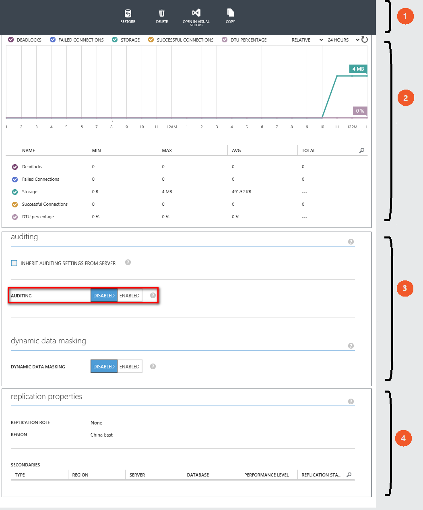
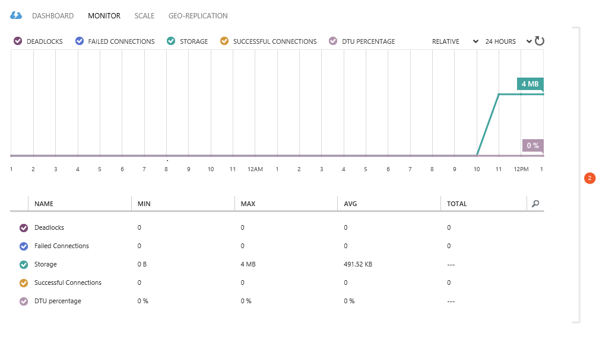
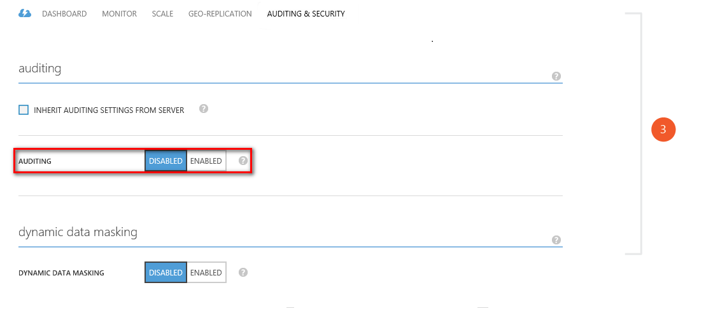
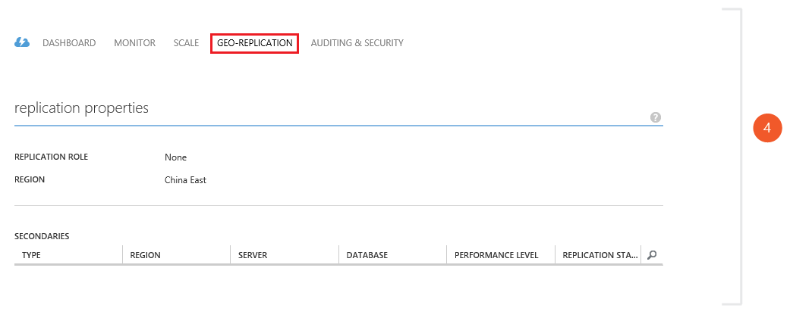

<properties
	pageTitle="使用 Azure 管理门户管理 Azure SQL 数据库"
	description="了解如何使用 Azure 管理门户管理云中的关系数据库。"
	services="sql-database"
	documentationCenter=""
	authors="stevestein"
	manager="jeffreyg"
	editor=""/>

<tags
	ms.service="sql-database"
	ms.date="09/11/2015" 
	wacn.date="10/17/2015"/>

# 使用 Azure 管理门户管理 Azure SQL 数据库

> [AZURE.SELECTOR]
- [SSMS](/documentation/articles/sql-database-manage-azure-ssms)
- [PowerShell](/documentation/articles/sql-database-command-line-tools)

在 [Azure 管理门户][Management Portal]中，你可以创建、监视和管理 Azure SQL 数据库与服务器。本文重点介绍使用管理门户可以实现的数据库操作。

## 1\.数据库管理操作

Azure 管理门户提供了一系列的通用数据库操作，你可以在数据库边栏选项卡的顶部访问这些操作选项。你可以将数据库还原到以前的某个时间点，在 Visual Studio 中打开数据库，将数据库复制到新服务器，以及将该数据库导出到 Azure 存储帐户。

- [还原 SQL 数据库](/documentation/articles/sql-database-point-in-time-restore-tutorial-management-portal)
- [在 Visual Studio 中打开 SQL 数据库](/documentation/articles/sql-database-connect-query)
- [导出 SQL 数据库](/documentation/articles/sql-database-export)

## 2\.数据库监视

默认情况下，Azure SQL 数据库会根据数据库吞吐量单位 (DTU)、数据库大小和连接运行状况提供监视图表。你可以自定义和扩展这些监视图表，以进一步绘制 CPU 百分比、数据 IO 百分比、死锁、日志 IO 百分比甚至防火墙阻止的请求百分比图表。<!--在[此处][Azure part monitoring]可找到有关如何自定义监视图表的详细信息。-->

此外，可以设置警报规则以监视指定的指标，并在达到预设的阈值时通知指定的管理员和协同管理员。<!--在[此处][Azure part monitoring]可找到有关如何在 Azure 管理门户中设置警报规则的详细信息。-->

## 3\.数据库安全和审核

可将Azure SQL 数据库配置为跟踪所有数据库事件，并将这些事件写入 Azure 存储帐户中的审核日志。此功能可帮助你一直保持遵从法规、了解数据库活动，以及深入了解可以指明业务考量因素或疑似安全违规的偏差。

- [SQL 数据库审核](/documentation/articles/sql-database-auditing-get-started)

还可以将 Azure SQL 数据库配置为向非特权用户屏蔽敏感数据。

- [动态数据屏蔽](/documentation/articles/sql-database-dynamic-data-masking-get-started)

## 4\.地域复制

可将 Azure SQL 数据库配置为以异步方式将提交的事务复制到辅助数据库。在管理门户上的地域复制部分中，你可以选择辅助数据库所在的 Azure 区域。

- [异地复制](https://msdn.microsoft.com/zh-cn/library/azure/dn783447.aspx)

## 其他资源
* [SQL 数据库](/documentation/articles/sql-database-technical-overview)   
* [使用动态管理视图监控 SQL 数据库][]   
* [Transact-SQL 参考 (SQL 数据库)][]

  [Management Portal]: https://manage.windowsazure.cn
  [Azure part monitoring]: /documentation/articles/documentdb-monitor-accounts
  [AzureDb management overview]: http://azure.microsoft.com/blog/2014/12/22/client-tooling-updates-for-azure-sql-database/
  [Introducing SQL Database]: /documentation/services/sql-databases
  [Database geo-replication]: http://azure.microsoft.com/blog/2014/07/12/spotlight-on-sql-database-active-geo-replication/
  [Managing Azure SQL Database using SQL Server Management Studio]: /documentation/articles/sql-database-manage-azure-ssms
  [使用动态管理视图监控 SQL 数据库]: /documentation/articles/sql-database-monitoring-with-dmvs
  [Transact-SQL 参考 (SQL 数据库)]: http://msdn.microsoft.com/zh-cn/library/bb510741(v=sql.120).aspx
  [AzureDb Auditing]: /documentation/articles/sql-database-auditing-get-started
  [AzureDb datamasking]: /documentation/articles/sql-database-dynamic-data-masking-get-started/

<!---HONumber=74-->