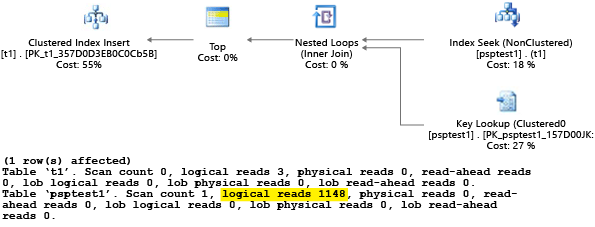

<properties
	pageTitle="Azure SQL 数据库的单一数据库性能指导"
	description="本主题提供了一些指导，帮助你确定此预览版提供的哪个服务层适合你的应用程序，并提供了一些应用程序优化建议，让你充分利用 Azure SQL 数据库。"
	services="sql-database"
	documentationCenter="na"
	authors="carlrabeler"
	manager="jhubbard"
	editor="" />

<tags
	ms.service="sql-database"
	ms.date="04/11/2016"
	wacn.date="06/14/2016" />

# Azure SQL 数据库的单一数据库性能指导

## 概述 

Azure SQL 数据库具有三个[服务层](/documentation/articles/sql-database-service-tiers/)：基本、标准和高级。所有这些服务层都会将提供给 Azure SQL 数据库的资源进行严格隔离，确保你获得可预知的性能。从“基本”层到“标准”层再到“高级”层，数据库能够确保实现的吞吐量是上升的。

>[AZURE.NOTE] 企业和 Web 版服务层将于 2015 年 9 月停用。有关详细信息，请参阅 [Web 和 Business Edition 版停用常见问题](/documentation/articles/sql-database-web-business-sunset-faq/)。

本文提供了一些指导，帮助你确定此预览版提供的哪个服务层适合你的应用程序，并提供了一些应用程序优化建议，让你充分利用 Azure SQL 数据库。

>[AZURE.NOTE] 本文侧重于 SQL 数据库中单一数据库的性能指导。有关弹性数据库池的性能指导，请参阅[弹性数据库池的价格和性能注意事项](/documentation/articles/sql-database-elastic-pool-guidance/)。但请注意，本文中许多单一数据库的微调建议适用于具有类似性能优势的弹性池中的数据库。

**作者：**Conor Cunningham、Kun Cheng、Jan Engelsberg

**技术审校：**Morgan Oslake、Joanne Marone、Keith Elmore、José Batista-neto、Rohit Nayak

## Azure SQL 数据库背景

若要了解基本、标准和高级服务层如何增强现有的 Azure SQL 数据库服务，你可以借助本文从整体上充分了解 Azure SQL 数据库。你可能因为多个原因选择 Azure SQL 数据库。其中一个原因是为了避免采购和安装硬件的冗长周期。通过 Azure SQL 数据库，可随时创建和删除数据库，而不必等待采购订单获批、设备到达、电源和散热系统升级或安装完毕。Microsoft 通过根据我们每个数据中心内的总需求预配硬件，全盘处理这些难题，可大大缩短从创意到解决方案的时间。与手动采购和部署硬件相比，这样可为业务节省数周或数月时间。

Microsoft 还在 Azure SQL 数据库中加入许多自动管理功能，如自动 HA 和内置管理。

### 自动高可用性 (HA) 
 Azure SQL 数据库为每个用户数据库保留至少三个副本，并具有一种逻辑，可自动将每个更改同步地提交到副本仲裁。这样可确保任何单计算机故障均不会导致数据丢失。此外，每个副本均放在不同的硬件机架上，以使断电或网络交换机停运不会影响你的数据库。最后，还有一种逻辑，如果失去计算机，则自动重建副本，以使系统自动保留所需的运行状况属性，即使计算机的运行状况变得不正常也是如此。这些机制可避免当前在安装和配置高可用性解决方案时所需的漫长过程。通过为你的数据预先配置 HA 解决方案，可消除在使用传统方法生成任务关键型数据库解决方案时的另一个重大难题。

### 内置管理 
 Azure SQL 数据库以服务的形式运行。这意味着为每个数据库定义了运行时间目标，避免产生漫长的维护停机时间。Microsoft 对于服务提供单供应商解决方案，这意味着如有任何问题，只需致电一家公司即可。另外，Microsoft 不断更新服务、添加功能、提高容量并寻找在我们进行的每次更新中改善体验的方法。更新以透明方式进行，不产生停机时间，这意味着更新集成在我们正常的 HA 故障转移机制内。这样，我们一宣布推出新功能，你即可使用这些功能，而不必等待在未来某个停机时间内升级服务器。

所有服务层都提供所有这些功能，并且起点价格低廉，每月只需几美元。这远远低于采购并运行自有服务器的成本，意味着即使是最小的项目也可利用 Azure 而不必花费大量资金。

## 服务层有哪些不同之处？
一共有三个服务层：基本、标准和高级。每个服务层都具有一个或多个性能级别，使你拥有以可预测方式运行数据库的能力。这种能力以[数据库事务单位 (DTU)](/documentation/articles/sql-database-technical-overview/#understand-dtus) 表示。

基本服务层旨在针对每个数据库提供各小时内的良好性能可预测性。基本数据库的 DTU 旨在提供充足的资源，使不存在多个并发请求的小型数据库能够正常工作。

标准服务层改进了存在多个并发请求的数据库（例如工作组和 Web 应用程序）的性能可预测性并使之更通畅地运行。通过使用标准服务层数据库，你可以根据每分钟的可预测性能调整数据库应用程序的规模。

高级服务层在性能方面提供的先进功能就是使每个高级数据库在每秒都拥有可预测的性能。通过使用高级服务层，你可以根据数据库的峰值负载调整数据库应用程序的规模，并消除在易受延迟影响的操作中性能变动可导致小型查询耗时超出预期的情况。此模型可大大简化需要明确表明最大资源需求、性能变动或查询延迟的应用程序所需的开发和产品验证环节。

与标准服务层一样，高级服务层允许客户根据所需的隔离情况选择不同的性能级别。

通过标准和高级服务层中的性能级别设置，你只需为所需容量付费，并可根据工作负荷变化情况扩展或缩减容量。例如，如果数据库工作负荷在返校购物季期间繁忙，则可在这段时间内提高数据库的性能级别，而在高峰期结束之后降低性能级别。这样一来，你就可以按业务的季节性因素优化云环境，将支出降至最低。此模型也很适合软件产品发布环节。测试团队可在进行测试运行时分配容量，一旦测试完毕，即释放该容量。这些容量请求很适合只为所需容量付款而避免在很少使用的专用资源上支出的模型。这样产生的体验与许多 Microsoft 客户曾用于 SQL Server 的传统专用式硬件模型非常接近。这样应可在 Azure SQL 数据库上更轻松地运行规模更大的一组应用程序。

有关服务层、性能级别和 DTU 的详细信息，请参阅 [Azure SQL 数据库服务层和性能级别](/documentation/articles/sql-database-service-tiers/)。

## 使用服务层的原因

尽管每个工作负荷可能各不相同，但服务层的目的就是在不同的性能级别下提供较高的性能可预测性。这样，资源要求繁杂的客户可以在更专用的计算环境中运行其数据库。

### 基本服务层功能的常见应用场合：

- **Azure SQL 数据库入门**：开发中的应用程序通常不需要很高的性能级别。基本数据库以较低的价位为数据库开发提供理想的环境。
- **包含单个用户的数据库**：将单个用户与某个数据库进行关联的应用程序通常在并发能力和性能方面不会提出很高的要求。对于提出这种要求的应用程序，可以考虑选择基本服务层。

### 标准服务层功能的常见应用场合：

- **存在多个并发请求的数据库**：标准服务层非常适用于需要每次为多个用户提供服务的应用程序（例如，流量适中的网站），或者资源需求更大的部门应用程序。

### 高级服务层功能的常见应用场合：

- **峰值负载较高**：需要大量 CPU、内存或 IO 才能完成其操作的应用程序。例如，如果已知某个数据库操作长时间占用多个 CPU 内核，则可考虑使用高级数据库。
- **并发请求数较多**：某些数据库应用程序需要为许多并发请求提供服务（例如，在为流量较高的网站提供服务时）。基本和标准服务层在并发请求数量上存在限制。需要更多连接的应用程序需要选取相应的预留大小以处理最大数量的所需请求。
- **延迟较低**：某些应用程序需要确保在最短时间内从数据库获得响应。如果在更大范围的客户操作期间调用了给定存储过程，则有 99% 的时间可能要求在 20 毫秒内从该调用返回。此类应用程序将从高级数据库受益 - 可确保有计算能力可用。

所需的确切级别取决于每个资源维度的峰值负载要求。某些应用程序可能对于某种资源仅少量使用，但对于另一种资源需要大量使用。

有关服务层的详细信息，请参阅 [Azure SQL 数据库服务层和性能级别](/documentation/articles/sql-database-service-tiers/)。

## 服务层功能和限制
每个服务层和性能级别都与不同的限制和性能特征相关联。下表描述单个数据库的这些特征。

[AZURE.INCLUDE [SQL 数据库服务层表](../includes/sql-database-service-tiers-table.md)]

以下部分提供了上表中每个区域的详细信息。

### 最大数据库大小

**最大数据库大小**简单说来就是对数据库大小的限制（以 GB 为单位）。

### DTU

**DTU** 是指数据库事务单位。它是 SQL 数据库中的度量单位，表示数据库基于实际度量（数据库事务）的相对性能。这包括通常需要针对联机事务处理 (OLTP) 请求执行的一组操作，按照在全部加载的条件下每秒可以完成多少个事务进行度量。若要获取有关 DTU 的详细信息，请参阅[了解 DTU](/documentation/articles/sql-database-technical-overview/#understand-dtus)。有关如何度量 DTU 的详细信息，请参阅[基准概述](/documentation/articles/sql-database-benchmark-overview/)。

### 时间点还原

**时间点还原**是指能够将你的数据库及时还原到以前的点。你的服务层决定了你可以在时间上回退多少天。有关详细信息，请参阅[在发生用户错误后恢复 Azure SQL 数据库](/documentation/articles/sql-database-user-error-recovery/)。

### 灾难恢复

**灾难恢复**是指在主 SQL 数据库上从中断中恢复的能力。

异地还原适用于所有服务层，不需支付额外的费用。发生中断时，你可以使用最新的地域冗余备份将数据库还原到任何 Azure 区域。

标准和活动异地复制提供的灾难恢复功能是类似的，但恢复点目标 (RPO) 要低得多。例如，使用异地还原，RPO 只需不到 1 小时的时间（换句话说，备份最多只需从 1 小时前开始）。但对于异地复制来说，RPO 只需不到 5 秒的时间。

有关详细信息，请参阅[业务连续性概述](/documentation/articles/sql-database-business-continuity/)。

>[AZURE.NOTE] 内存中 OLTP 预览版目前仅适用于单一数据库，不适用于弹性数据库池中的数据库。

### 最大并发请求数

**最大并发请求数**是指在数据库中同时执行的最大并发用户/应用程序请求数。若要查看并发请求数，请在 SQL 数据库中运行以下 Transact-SQL 查询：

	SELECT COUNT(*) AS [Concurrent_Requests] 
	FROM sys.dm_exec_requests R

如果你要分析本地 SQL Server 数据库的工作负荷，则应修改此查询，以便针对所要分析的特定数据库进行筛选。例如，如果你有一个名为 MyDatabase 的本地数据库，则以下 Transact-SQL 查询会返回该数据库中并发请求的计数。

	SELECT COUNT(*) AS [Concurrent_Requests] 
	FROM sys.dm_exec_requests R
	INNER JOIN sys.databases D ON D.database_id = R.database_id
	AND D.name = 'MyDatabase'

请注意，这只是某一时刻的快照。为了更好地了解你的工作负荷，你需要在一定的时间内收集多个样本，以便了解并发请求的需求。

### 最大并发登录数

**最大并发登录数**表示尝试同时登录到数据库的用户或应用程序的数量限制。请注意，即使这些客户端使用相同的连接字符串，该服务也会对每个登录名进行身份验证。因此，如果 10 个用户全都使用相同的用户名和密码同时连接到数据库，则会有 10 个并发登录名。此限制仅针对使用登录名进行身份验证的那段时间。因此，如果这 10 个相同的用户依次连接到数据库，则并发登录名数就始终不会超过 1。

>[AZURE.NOTE] 此限制目前不适用于弹性数据库池中的数据库。

没有任何查询或 DMV 可以显示并发登录名计数或历史记录。你可以通过分析用户和应用程序模式来了解登录频率。你还可以在测试环境中运行实际负荷，确保不会超过本主题所描述的这样或那样的限制。

### 最大会话数

**最大会话数**是指已打开的连接到数据库的最大并发连接数。当用户登录时，系统将建立一个会话，该会话始终保持活动状态，直至用户注销或会话超时。若要查看当前的活动会话数，请在 SQL 数据库中运行以下 Transact-SQL 查询：

	SELECT COUNT(*) AS [Sessions]
	FROM sys.dm_exec_connections

如果你要分析本地 SQL Server 工作负荷，可以对查询进行修改，使之专注于特定的数据库。这样即可确定该数据库可能的会话需求（如果你要将其移至 Azure SQL 数据库）。

	SELECT COUNT(*)  AS [Sessions]
	FROM sys.dm_exec_connections C
	INNER JOIN sys.dm_exec_sessions S ON (S.session_id = C.session_id)
	INNER JOIN sys.databases D ON (D.database_id = S.database_id)
	WHERE D.name = 'MyDatabase'

同样，这些查询会返回时间点计数，因此在一定的时间内收集多个样本可以更好地了解会话使用情况。

对于 SQL 数据库分析，你也可以使用 **active\_session\_count** 列通过查询 **sys.resource\_stats** 来获取会话的历史统计信息。在下面的监视部分中提供了有关如何使用此视图的更多信息。

## 监视资源使用情况
有两个视图可用于监视 SQL 数据库相对于其服务层的资源使用情况：

- [sys.dm\_db\_resource\_stats](https://msdn.microsoft.com/zh-cn/library/dn800981.aspx)
- [sys.resource\_stats](https://msdn.microsoft.com/zh-cn/library/dn269979.aspx)

>[AZURE.NOTE] 也可以使用 Azure 管理门户来查看资源使用状况。有关示例，请参阅[服务层 - 监视性能](/documentation/articles/sql-database-service-tiers/#monitoring-performance)。

### 使用 sys.dm\_db\_resource\_stats
[sys.dm\_db\_resource\_stats](https://msdn.microsoft.com/zh-cn/library/dn800981.aspx) 视图存在于每个 SQL 数据库中，提供了最近的相对于服务层的资源使用数据。CPU 平均百分比、数据 IO、日志写入以及内存每 15 秒记录一次，持续记录 1 小时。

由于此视图提供了资源使用方面的更细致的信息，你应该首先使用 **sys.dm\_db\_resource\_stats** 进行当前状态分析或故障排除。例如，以下查询显示了当前数据库在过去 1 小时的平均资源使用率和最大资源使用率：

	SELECT  
	    AVG(avg_cpu_percent) AS 'Average CPU Utilization In Percent', 
	    MAX(avg_cpu_percent) AS 'Maximum CPU Utilization In Percent', 
	    AVG(avg_data_io_percent) AS 'Average Data IO In Percent', 
	    MAX(avg_data_io_percent) AS 'Maximum Data IO In Percent', 
	    AVG(avg_log_write_percent) AS 'Average Log Write Utilization In Percent', 
	    MAX(avg_log_write_percent) AS 'Maximum Log Write Utilization In Percent', 
	    AVG(avg_memory_usage_percent) AS 'Average Memory Usage In Percent', 
	    MAX(avg_memory_usage_percent) AS 'Maximum Memory Usage In Percent' 
	FROM sys.dm_db_resource_stats;  

对于其他查询，请参阅 [sys.dm\_db\_resource\_stats](https://msdn.microsoft.com/zh-cn/library/dn800981.aspx) 中的示例。

### 使用 sys.resource\_stats

**master** 数据库中的 [sys.resource\_stats](https://msdn.microsoft.com/zh-cn/library/dn269979.aspx) 视图所提供的其他信息可用于监视 SQL 数据库在其特定服务层和性能级别的资源使用情况。数据每 5 分钟收集一次，持续大约 14 天。此视图更适用于对 SQL 数据库资源使用情况进行更长期的历史分析。

下图显示了性能级别为 P2 的高级数据库在一周内每小时的 CPU 资源使用率。这张特定的图形从周一开始，显示 5 个工作日，然后显示周末，其中应用程序使用的资源少得多。

从数据来看，此数据库当前的峰值 CPU 负载相对于 P2 性能级别刚好超过 50% 的 CPU 使用率（周二午间）。如果 CPU 是应用程序资源分布曲线中的决定因素，则你可以判定 P2 就是适当的性能级别，它能够保证工作负荷始终正常运行。如果应用程序预期资源使用率将随时间增大，则留出一些额外的资源缓冲以使应用程序从不超限即有其意义。这样可帮助避免因数据中心能力不足以有效处理请求而导致客户可见的错误，尤其是在易受延迟影响的环境下（如一个数据库，它支持一个应用程序，该应用程序根据数据库调用的结果绘制网页）。

值得注意的是，其他应用程序类型对同一图形可能有不同的解释。例如，如果某个应用程序尝试每天处理工资数据并使用相同的图表，则仅使用 P1 性能级别也许就能让此类“批处理作业”模型正常工作。P1 性能级别有 100 个 DTU，而 P2 性能级别有 200 个 DTU。这意味着，P1 性能级别提供的性能是 P2 性能级别的一半。因此，P2 中 50% 的 CPU 使用率就相当于 P1 中 100% 的 CPU 使用率。只要该应用程序没有超时，且只要今天完成，则即使有大型作业耗时 2 小时或 2.5 小时才完成也无关紧要。此类别的应用程序也许只需使用 P1 性能级别。你可利用这样一个事实：白天有几个时期的资源使用量较低，意味着可能有“大峰值”在当天晚些时候溢出到其中某个低谷。只要作业每天可按时完成，P1 性能级别就可能很适合此类应用程序（并可节省资金）。

Azure SQL 数据库在每个服务器的 **master** 数据库的 **sys.resource\_stats** 视图中公开每个活动数据库使用的资源信息。表中的数据以 5 分钟为间隔收集而得。使用基本、标准和高级服务层，可能要在超过 5 分钟后表中才会出现数据，意味着这些数据更适合进行历史分析而非接近实时分析。查询 **sys.resource\_stats** 视图可以显示数据库的最近历史记录，以便验证所选取的保留是否在需要时提供所需的性能。

>[AZURE.NOTE] 在以下示例中，你必须连接到逻辑 SQL 数据库服务器的 **master** 数据库才能查询 **sys.resource\_stats**。

以下示例演示如何公开此视图中的数据：

	SELECT TOP 10 * 
	FROM sys.resource_stats 
	WHERE database_name = 'resource1' 
	ORDER BY start_time DESC

以下示例演示了如何使用 **sys.resource\_stats** 目录视图通过不同方式来了解 SQL 数据库的资源使用率。

>[AZURE.NOTE] **sys.resource\_stats** 的某些列在当前的 V12 数据库中已更改，因此以下示例中的示例性查询可能会生成错误。以后对本主题进行更新时，将会提供新版本的查询来解决此问题。

1. 例如，若要查看过去一周数据库“userdb1”的资源用量，可运行以下查询。
	
		SELECT * 
		FROM sys.resource_stats 
		WHERE database_name = 'userdb1' AND 
		      start_time > DATEADD(day, -7, GETDATE())
		ORDER BY start_time DESC;
	
2. 若要评估你的工作负荷在相应性能级别的适合情况，必须向下钻取资源度量指标的每个不同方面：CPU、读取次数、写入次数、辅助进程数和会话数。下面是修订后的查询，其中使用 sys.resource\_stats 报告这些资源度量指标的平均值和最大值。
	
		SELECT 
		    avg(avg_cpu_percent) AS 'Average CPU Utilization In Percent',
		    max(avg_cpu_percent) AS 'Maximum CPU Utilization In Percent',
		    avg(avg_physical_data_read_percent) AS 'Average Physical Data Read Utilization In Percent',
		    max(avg_physical_data_read_percent) AS 'Maximum Physical Data Read Utilization In Percent',
		    avg(avg_log_write_percent) AS 'Average Log Write Utilization In Percent',
		    max(avg_log_write_percent) AS 'Maximum Log Write Utilization In Percent',
		    avg(active_session_count) AS 'Average # of Sessions',
		    max(active_session_count) AS 'Maximum # of Sessions',
		    avg(active_worker_count) AS 'Average # of Workers',
		    max(active_worker_count) AS 'Maximum # of Workers'
		FROM sys.resource_stats 
		WHERE database_name = 'userdb1' AND start_time > DATEADD(day, -7, GETDATE());
	
3. 使用每个资源度量指标的上述平均值和最大值信息，可以评估你的工作负荷在所选性能级别的适合情况。在大多数情况下，来自 sys.resource\_stats 的平均值可提供一个用于目标大小的良好基准。它应该是你的主要测量标杆。例如，如果使用性能级别为 S2 的标准服务层，CPU、读取和写入操作的平均使用率百分比低于 40%，平均辅助进程数低于 50，平均会话数低于 200，则你的工作负荷可能适合 S1 性能级别。很轻松就能判断你的数据库是否在辅助进程和会话限制范围内。若要判断数据库在 CPU、读取和写入操作方面是否适合更低的性能级别，请将更低性能级别的 DTU 数量除以当前性能级别的 DTU 数量，再乘以 100：
	
	**S1 DTU / S2 DTU * 100 = 20 / 50 * 100 = 40**
	
	该结果是两个性能级别之间的相对性能差异（百分比）。如果你的使用率不超过此百分比，则你的工作负荷可能适合更低性能级别。但是，你需要查看资源用量值的所有范围，并确定数据库工作负荷适合更低性能级别的频率（以百分比计）。以下查询将会根据上面计算得出的阈值 40%，输出每个资源维度的适合性百分比。
	
		SELECT 
		    (COUNT(database_name) - SUM(CASE WHEN avg_cpu_percent >= 40 THEN 1 ELSE 0 END) * 1.0) / COUNT(database_name) AS 'CPU Fit Percent'
		    ,(COUNT(database_name) - SUM(CASE WHEN avg_log_write_percent >= 40 THEN 1 ELSE 0 END) * 1.0) / COUNT(database_name) AS 'Log Write Fit Percent'
		    ,(COUNT(database_name) - SUM(CASE WHEN avg_physical_data_read_percent >= 40 THEN 1 ELSE 0 END) * 1.0) / COUNT(database_name) AS 'Physical Data Read Fit Percent'
		FROM sys.resource_stats
		WHERE database_name = 'userdb1' AND start_time > DATEADD(day, -7, GETDATE());
	
	你可以根据数据库服务级别目标 (SLO) 来确定工作负荷是否适合更低性能级别。如果你的数据库工作负荷 SLO 为 99.9%，而上述查询针对所有三个资源维度返回的值大于 99.9，则你的工作负荷很可能适合更低性能级别。
	
	查看适合性百分比还可以深入分析是否需要转到下一个更高的性能级别以满足 SLO。例如，“userdb1”显示过去一周的使用率如下。
	
	| 平均 CPU 百分比 | 最大 CPU 百分比 |
	|---|---|
	| 24\.5 | 100\.00 |
	
	平均 CPU 大约是性能级别限制的四分之一，这意味着它很适合数据库的性能级别。但是，最大值显示该数据库达到了性能级别的限制。在这种情况下，是否需要转到下一个更高的性能级别呢？ 如前所述，你需要查看工作负荷达到 100% 的次数，并将这种情况与数据库工作负荷 SLO 进行比较。
	
		SELECT 
		(COUNT(database_name) - SUM(CASE WHEN avg_cpu_percent >= 100 THEN 1 ELSE 0 END) * 1.0) / COUNT(database_name) AS 'CPU Fit Percent'
		,(COUNT(database_name) - SUM(CASE WHEN avg_log_write_percent >= 100 THEN 1 ELSE 0 END) * 1.0) / COUNT(database_name) AS 'Log Write Fit Percent’
		,(COUNT(database_name) - SUM(CASE WHEN avg_physical_data_read_percent >= 100 THEN 1 ELSE 0 END) * 1.0) / COUNT(database_name) AS 'Physical Data Read Fit Percent'
		FROM sys.resource_stats
		WHERE database_name = 'userdb1' AND start_time > DATEADD(day, -7, GETDATE());
	
	如果上述查询针对三个资源维度中的任何一个返回的值小于 99.9，则应考虑转到下一个更高的性能级别，或使用应用程序优化技术来减少 Azure SQL 数据库上的负载。
	
4. 上述做法还应将未来预计的工作负荷增长考虑在内。

## 优化应用程序

在传统的本地 SQL Server 中，进行初始容量规划的过程经常与在生产中运行应用程序的过程分离。即预先购买用于运行 SQL Server 的硬件和关联的许可证，而后进行性能优化。在使用 Azure SQL 数据库时，一般建议交错进行应用程序的运行和优化过程（由于按月向你收费，这可能也是比较理想的方式）。通过按需为容量付款的模型，你可优化应用程序以使用目前需要的最少资源，而非靠推测应用程序的未来增长计划而大量过度配置硬件（这些计划通常是不正确的，因为它们必须对未来作出深远的预测）。注意，某些客户可能决定不优化应用程序，而是改为决定过度配置硬件资源。当你不想在关键应用程序的繁忙期更改该应用程序时，可以考虑使用此方法。在使用 Azure SQL 数据库中的服务层时，优化应用程序可将资源需求降至最低并减少每月的费用。

### 应用程序特征

尽管服务层能够提高应用程序的性能稳定性和可预测性，但最佳做法是优化应用程序以更好地利用相关功能。尽管许多应用程序只需切换到更高性能级别和/或服务层即会体现出性能大幅提升，但并非所有应用程序不经过优化即可如此获益。具有以下特征的应用程序还应考虑进行其他应用程序优化以在使用 Azure SQL 数据库时进一步提高性能。

- **应用程序因“健谈”行为而降低性能**：包括进行过多易受网络延迟影响的数据访问操作的应用程序。此类应用程序可能需要进行修改以减少对 Azure SQL 数据库的数据访问操作的数量。例如，可使用将即席查询一起成批处理或将查询移至存储过程等方法，改进应用程序。有关详细信息，请参阅后面的“批处理查询”部分。
- **数据库的工作负荷过大，一整台计算机都无法支持**：最好不要选择超出高级服务层最高性能级别的资源的数据库。这些数据库可从横向扩展工作负荷获益。有关详细信息，请参阅后面的“跨数据库分片”和“功能分区”部分。
- **应用程序含有欠佳的查询**：选择较高的性能级别可能无法按预期给查询优化不当的应用程序（尤其是数据访问层中的此类应用程序）带来好处。其中包括缺少 WHERE 子句、缺少索引或统计信息过时的查询。标准查询性能优化技术能够为这些应用程序带来好处。有关详细信息，请参阅后面的“缺少索引”和“查询优化/提示”部分。
- **应用程序的数据访问设计欠佳**：选择较高的性能级别可能无法给存在固有数据访问并发问题（例如死锁）的应用程序带来好处。应用程序开发人员应考虑通过使用 Azure 缓存服务或其他缓存技术将数据缓存在客户端，减少与 Azure SQL 数据库之间的往返次数。请参阅后面的“应用程序层缓存”部分。

## 优化方法
本部分介绍可用于优化 Azure SQL 数据库的方法，该方法可使应用程序达到最佳性能并以尽可能低的性能级别运行。有许多方法可与传统的 SQL Server 优化最佳实践搭配使用，但有些方法专用于 Azure SQL 数据库。在某些情况下，可扩展传统的 SQL Server 方法，通过检查数据库使用的资源找到要进一步优化的区域，使这些方法也可在 Azure SQL 数据库上发挥作用。

### 缺少索引
OLTP 数据库性能有一个常见问题与物理数据库设计有关。设计和交付数据库架构时，经常不进行规模（负载或数据卷）测试。遗憾的是，在规模较小时，查询计划的性能可能尚可接受，但面对生产级数据卷时，性能就会大幅降低。此问题最常见的原因是缺乏相应的索引，无法满足筛选器或查询中的其他限制。这种情况经常导致表扫描，而此时索引搜寻即可满足要求。

以下示例将创建一个事例，其中所选的查询计划包含扫描，而此时搜寻即可满足要求。

	DROP TABLE dbo.missingindex;
	CREATE TABLE dbo.missingindex (col1 INT IDENTITY PRIMARY KEY, col2 INT);
	DECLARE @a int = 0;
	SET NOCOUNT ON;
	BEGIN TRANSACTION
	WHILE @a < 20000
	BEGIN
	    INSERT INTO dbo.missingindex(col2) VALUES (@a);
	    SET @a += 1;
	END
	COMMIT TRANSACTION;
	GO
	SELECT m1.col1 
	FROM dbo.missingindex m1 INNER JOIN dbo.missingindex m2 ON(m1.col1=m2.col1) 
	WHERE m1.col2 = 4;

Azure SQL 数据库包含一些功能，可帮助向数据库管理员提示如何查找并修复常见的缺少索引情况。Azure SQL 数据库内置的动态管理视图 (DMV) 将查找其中索引会大幅降低运行查询的估算成本的查询编译。在查询执行期间，它跟踪每个查询计划的执行频率，以及执行查询计划与想象其中存在该索引的查询计划之间的差距。这样可以让数据库管理员迅速推测出哪些物理数据库设计更改可能减少给定数据库的总工作负荷成本及其真实工作负荷。

>[AZURE.NOTE] 在使用 DMV 查找缺失的索引之前，请先查看与 [Query Performance Insight 和索引顾问](#query-performance-insight-and-index-advisor)相关的部分。

以下查询可用于计算得出可能缺少的索引。

	SELECT CONVERT (varchar, getdate(), 126) AS runtime, 
	    mig.index_group_handle, mid.index_handle, 
	    CONVERT (decimal (28,1), migs.avg_total_user_cost * migs.avg_user_impact * 
	            (migs.user_seeks + migs.user_scans)) AS improvement_measure, 
	    'CREATE INDEX missing_index_' + CONVERT (varchar, mig.index_group_handle) + '_' + 
	              CONVERT (varchar, mid.index_handle) + ' ON ' + mid.statement + ' 
	              (' + ISNULL (mid.equality_columns,'') 
	              + CASE WHEN mid.equality_columns IS NOT NULL 
	                          AND mid.inequality_columns IS NOT NULL 
	                     THEN ',' ELSE '' END + ISNULL (mid.inequality_columns, '')
	              + ')' 
	              + ISNULL (' INCLUDE (' + mid.included_columns + ')', '') AS create_index_statement, 
	    migs.*, 
	    mid.database_id, 
	    mid.[object_id]
	FROM sys.dm_db_missing_index_groups AS mig
	INNER JOIN sys.dm_db_missing_index_group_stats AS migs 
	    ON migs.group_handle = mig.index_group_handle
	INNER JOIN sys.dm_db_missing_index_details AS mid 
	    ON mig.index_handle = mid.index_handle
	ORDER BY migs.avg_total_user_cost * migs.avg_user_impact * (migs.user_seeks + migs.user_scans) DESC

本例中提出了以下索引。

	CREATE INDEX missing_index_5006_5005 ON [dbo].[missingindex] ([col2])  

创建此索引后，同一 SELECT 语句现在选取一个不同的计划，其中使用搜寻而非扫描，因此执行起来更高效，如以下查询计划中所示。

其中的要点是共享商用系统与专用的服务器计算机相比，IO 容量一般比较有限。因此，客观上鼓励将多余 IO 降至最低，以最大限度地在 Azure SQL 数据库中服务层的每个性能级别 DTU 范围内利用系统。选择适当的物理数据库设计方式可显著缩短单个查询的延迟、提高对于每个缩放单位可处理的并发请求的吞吐量以及将满足查询所需的成本降至最低。有关缺少的索引 DMV 的详细信息，请参阅 [sys.dm\_db\_missing\_index\_details](https://msdn.microsoft.com/zh-cn/library/ms345434.aspx)。

### 查询优化/提示
Azure SQL 数据库中的查询优化器与传统的 SQL Server 查询优化器非常相似。有关优化查询和了解查询优化器的推理模型限制的最佳实践大多适用于 Azure SQL 数据库。在 Azure SQL 数据库中优化查询还可获得降低总资源需求的益处，并使应用程序的运行成本低于未经优化的同等应用程序，因为前者能够以更低的性能级别运行。

SQL Server 中有一个常见的示例也适用于 Azure SQL 数据库，该示例涉及在编译期间如何“探查”参数以尝试创建更优的计划。参数探查是一个过程，查询优化器在编译查询时通过该过程考虑参数的当前值，以期产生更优的查询计划。尽管此策略造就的查询计划经常能够在速度上显著高于在未得知参数值的情况下编译的计划，但当前的 SQL Server/Azure SQL 数据库行为尚不完善 - 有时不探查参数，有时虽探查参数，但生成的计划对于工作负荷中的整组参数值并非最佳。Microsoft 设计了查询提示（指令）以使你可更谨慎地指定意图并取代参数探查的默认行为。一般而言，使用提示可纠正默认的 SQL Server/Azure SQL 数据库行为对于给定客户工作负荷不完善的情况。

以下示例演示了查询处理器可怎样产生性能和资源需求均非最佳的计划以及使用查询提示可怎样缩短 Azure SQL 数据库上的查询运行时间和资源需求。

下面是一个设置示例。

	DROP TABLE psptest1;
	CREATE TABLE psptest1(col1 int primary key identity, col2 int, col3 binary(200));
	
	DECLARE @a int = 0;
	SET NOCOUNT ON;
	BEGIN TRANSACTION
	WHILE @a < 20000
	BEGIN
	    INSERT INTO psptest1(col2) values (1);
	    INSERT INTO psptest1(col2) values (@a);
	    SET @a += 1;
	END
	COMMIT TRANSACTION
	CREATE INDEX i1 on psptest1(col2);
	GO
	
	CREATE PROCEDURE psp1 (@param1 int)
	AS
	BEGIN
	    INSERT INTO t1 SELECT * FROM psptest1 
	    WHERE col2 = @param1
	    ORDER BY col2;
	END
	GO
	
	CREATE PROCEDURE psp2 (@param2 int)
	AS
	BEGIN
	    INSERT INTO t1 SELECT * FROM psptest1 WHERE col2 = @param2
	    ORDER BY col2
	    OPTION (OPTIMIZE FOR (@param2 UNKNOWN))
	END
	GO
	
	CREATE TABLE t1 (col1 int primary key, col2 int, col3 binary(200));
	GO

该设置代码将创建一个包含偏斜数据分布的表。根据要选择哪个参数，最佳查询计划有所不同。遗憾的是，计划缓存行为并非总是根据最常用的参数值重新编译查询，而这意味着对于许多值，缓存并使用的可能并非最佳计划，即使有不同的计划是更好的普通计划选择也是如此。然后，这段代码创建两个存储过程，除第一个存储过程包含一个特殊的查询提示（下面解释推断过程）之外，二者完全相同。

**示例（第 1 部分）：**

	-- Prime Procedure Cache with scan plan
	EXEC psp1 @param1=1;
	TRUNCATE TABLE t1;
	
	-- Iterate multiple times to show the performance difference
	DECLARE @i int = 0;
	WHILE @i < 1000
	BEGIN
	    EXEC psp1 @param1=2;
	    TRUNCATE TABLE t1;
	    SET @i += 1;
	END

**示例（第 2 部分 - 请等待 10 分钟后再尝试此部分，以使其所得的遥测数据明显不同）：**

	EXEC psp2 @param2=1;
	TRUNCATE TABLE t1;
	
	DECLARE @i int = 0;
	WHILE @i < 1000
	BEGIN
	    EXEC psp2 @param2=2;
	    TRUNCATE TABLE t1;
	    SET @i += 1;
	END

本例的每个部分均尝试将某个参数化插入语句运行 1000 次（以产生足够多的负载以形成测试数据集）。当执行存储过程时，查询处理器在其首次编译期间检查传递给过程的参数值（称为参数“探查”）。所得的计划经过缓存，用于以后的调用，即使参数值不同也是如此。因此，可能无法在所有情况下均使用最佳计划。有时，客户需要引导优化器选取更适合普通情况而非首次编译查询时的特定情况的计划。在本例中，初始计划将生成一个“扫描”计划，后者会读取所有行以查找与参数匹配的每个值。

由于我们用值 1 执行该过程，因此所得的计划对于 1 为最佳，但对于表中的所有其他值并非最佳。如果你随机选取每个计划，则所得的行为可能不是所需的行为，因为计划将执行得更慢，并将更多资源用于执行。

在“SET STATISTICS IO ON”的情况下运行测试将显示在本例中实际完成的逻辑扫描工作 - 可看到该计划完成了 1148 次读取（如果普通情况仅返回一行，则这样效率很低）。

本例的第二部分使用查询提示告知优化器在编译过程中使用某个特定值。在这种情况下，它强制查询处理器忽略作为参数传递的值，而改为采用“UNKNOWN”，表示在表中具有平均频率的值（忽略偏斜）。所得的计划是一个基于搜寻的计划，平均而言，它比示例第 1 部分中的计划速度更快，使用资源更少。

可通过检查 **sys.resource\_stats** 表发现这种情况产生的影响（注意：从执行测试的时间到数据填入表中的时间将存在一段延迟）。对于本例，将在 22:25:00 时间范围内执行第 1 部分，在 22:35:00 执行第 2 部分。请注意，越早的时间范围使用的资源比越晚的时间范围要多（因计划效率提高）。

	SELECT TOP 1000 * 
	FROM sys.resource_stats 
	WHERE database_name = 'resource1' 
	ORDER BY start_time DESC

>[AZURE.NOTE] 虽然此处使用的示例是特意选择的较小的示例，但非最佳参数的影响仍很大，对于较大的数据库尤为如此。这种区别在极端情况下对于快速情况和慢速情况可在数秒和数小时之间。

你可检查 **sys.resource\_stats** 以确定给定测试使用的资源多于还是少于另一个测试。在比较数据时，请使测试相隔足够长的时间，以使其不会在 **sys.resource\_stats** 视图中的同一 5 分钟时间范围内重合。另请注意，本练习的目标是将使用的资源总量降至最低，而非将峰值资源本身降至最低。一般而言，优化一段产生延迟的代码也将减少资源消耗。请确保在任何应用程序中考虑进行的更改确为所需，不会对使用应用程序的任何人在使用查询提示时的客户体验产生负面影响。

如果工作负荷由一组重复的查询组成，则捕获并验证这些计划选择的最优性通常有意义，因为这样做将可能使托管数据库所需的资源大小单位降至最低。一经验证，不时地重新检查这些计划可确保其未降级。有关查询提示的详细信息，请参阅[查询提示 (Transact-SQL)](https://msdn.microsoft.com/zh-cn/library/ms181714.aspx)。

### 跨数据库分片
由于 Azure SQL 数据库运行在商用硬件上，因此单一数据库的容量限制一般低于传统的本地 SQL Server 安装。因此，有许多客户使用分片技术在数据库操作不符合 Azure SQL 数据库中单一数据库的限制时，将这些操作分摊到多个数据库上。当今在 Azure SQL 数据库上使用分片技术的大多数客户将单个维度的数据拆分到多个数据库上。该方法涉及了解 OLTP 应用程序执行的事务经常仅适用于架构中的一行或少数几行。

>[AZURE.NOTE] SQL 数据库现在提供一个库来帮助分片。有关详细信息，请参阅[弹性数据库客户端库概述](/documentation/articles/sql-database-elastic-database-client-library/)。

例如，如果数据库包含客户、订单和订单详细信息（如 SQL Server 附带的传统示例 Northwind 数据库中所见），则可通过将客户与相关订单和订单详细信息集中在一起并保证其留在单一数据库内，将这些数据拆分到多个数据库中。应用程序将不同的客户拆分到多个数据库上，实际上就是将负载分散在多个数据库上。这样，客户不仅可以避免达到最大数据库大小限制，而且还使 Azure SQL 数据库能够处理明显大于不同性能级别限制的工作负荷，前提是每个数据库适合其 DTU。

尽管数据库分片不会减少解决方案的聚合资源容量，但此技术很有效地支持分散在多个数据库上的极大型解决方案，并允许每个数据库以不同的性能级别运行，以支持资源要求较高的极大型“有效”数据库。

### 功能分区
SQL Server 用户经常将许多功能集中在单一数据库内。例如，如果应用程序包含管理商店库存的逻辑，则该数据库可能包含与库存、跟踪采购订单、管理月末报告的存储过程和索引/具体化视图以及其他功能相关的逻辑。此方法的优点是可轻松管理备份等数据库操作，但它也要求你优化硬件大小以处理应用程序所有功能的峰值负载。

在 Azure SQL 数据库内使用的扩展体系结构中，将应用程序的不同功能拆分到不同的数据库中通常比较有利。这样使其中每种功能均可独立缩放。随着应用程序变得更加繁忙（并且数据库上出现更多负载），此技术使管理员可针对应用程序中的每项功能单独选择性能级别。在限制范围内，此体系结构通过将负载分散在多个计算机上，使应用程序的规模可大于单个商用计算机。

### 批处理查询
对于以大量、频繁的即席查询形式访问数据的应用程序，在应用程序层与 Azure SQL 数据库层之间的网络通信上花费了大量响应时间。即使在应用程序与 Azure SQL 数据库同处一个数据中心时，大量数据访问操作也可能会增大二者之间的网络延迟。若要减少这些数据访问操作的网络往返次数，应用程序开发人员应考虑将即席查询分批或将其编入存储过程。将即席查询分批后，可将多个查询作为一个大批次在一次行程中发送到 Azure SQL 数据库。将即席查询编入存储过程可获得与分批相同的结果。使用存储过程还有一个好处，即增加将查询计划缓存在 Azure SQL 数据库中用于以后执行同一存储过程的机会。

某些应用程序频繁写入。有时，通过考虑如何统一批处理写入，可以减少数据库上的总 IO 负载。通常，这与在存储过程和即席批中使用显式事务代替自动提交事务一样简单。可在 [Azure 中 SQL 数据库应用程序的批处理方法](https://msdn.microsoft.com/zh-cn/library/windowsazure/dn132615.aspx)中找到对各种可用方法的评估。请使用你自己的工作负荷进行试验以找到合适的批处理模型，请注意，给定模型的事务一致性保证可能略有不同。若要找到将资源用量降至最低的正确工作负荷，需要找到一致性与性能折中的正确组合。

### 应用程序层缓存
某些数据库应用程序包含具有大量读取操作的工作负荷。可利用缓存层减少数据库上的负载，还有可能降低支持使用 Azure SQL 数据库的数据库所需的性能级别。通过 [Azure Redis 缓存](/home/features/redis-cache)，读取工作负荷较重的客户只需读取数据一次（也许只需对每个应用层计算机读取一次，具体取决于其配置方式），然后将该数据存储在 Azure SQL 数据库外部。这样可降低数据库负载（CPU 和读取 IO），但对于事务一致性有影响，因为从缓存读取的数据可能与数据库中数据的日期不同。虽然许多应用程序可接受一定的不一致，但并非所有工作负荷都是这样。请先完全了解任何应用程序要求，然后再使用应用程序层缓存策略。

## 结束语

在 Azure SQL 数据库中的服务层使你能够增加在云中生成的应用程序的类型。再加上坚持不懈地优化应用程序，你的应用程序的性能可变得既强大又可预测。本文档概述了可根据某个性能级别优化数据库资源使用的推荐技术。优化是云模型中一个持续的过程，管理员可以通过服务层及其性能级别，在 Azure 平台上最大程度地提高性能，同时将成本降至最低。

<!---HONumber=Mooncake_0606_2016-->
