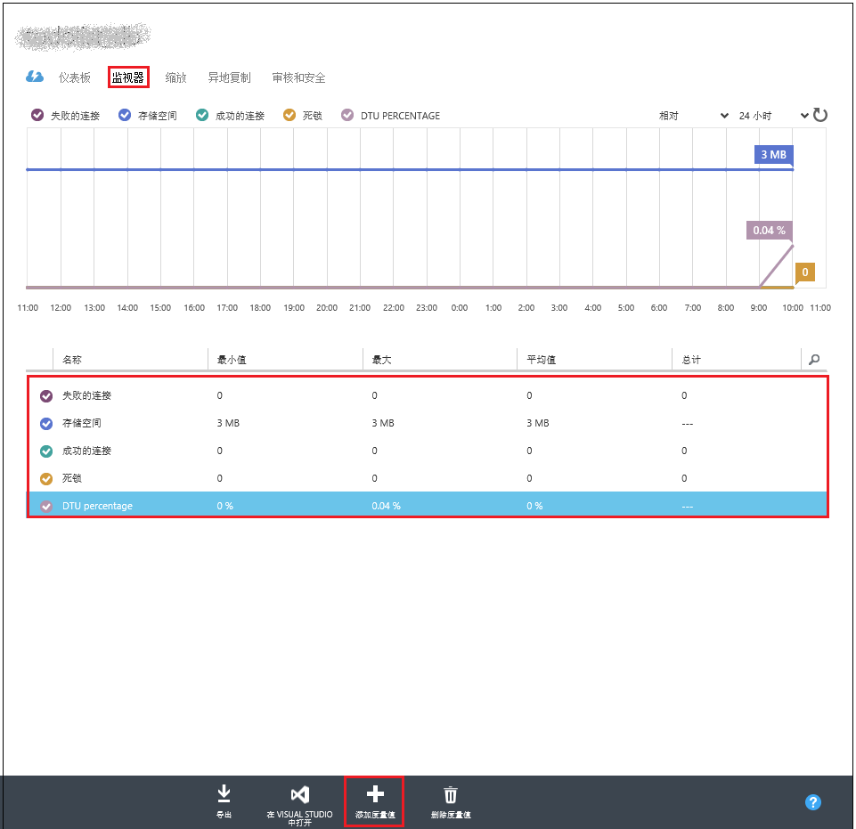

<properties
   pageTitle="SQL 数据库服务层"
   description="比较 Azure SQL 数据库服务层的性能和业务连续性功能，以便在成本与功能之间找到适当的平衡点，既能根据需要进行缩放，又不会造成停机。"
   services="sql-database"
   documentationCenter=""
   authors="shontnew"
   manager="jeffreyg"
   editor="monicar"/>

<tags
   ms.service="sql-database"
   ms.date="09/11/2015"
   wacn.date="11/02/2015"/>

# 服务层

## 概述
[Azure SQL 数据库](/documentation/articles/sql-database-technical-overview)提供了多个服务层来处理不同类型的工作负荷。你可以选择使用定义的特征和定价创建单一数据库。也可以在弹性数据库池中创建多个数据库。在这两种情况下，层包括**基本**、**标准**和**高级**。但根据你是创建单个数据库还是创建弹性数据库池内的数据库，这些层的特性可能会有所不同。本文概述了这两个上下文中的服务层。

## 服务层
基本、标准和高级服务层都提供 99.99% 的运行时间 SLA 和可预测的性能、灵活的业务连续性选项、安全功能和按小时计费。下表提供了最适用于不同应用程序工作负荷的层的示例。

| 服务层 | 目标工作负荷 |
|---|---|
| **基本** | 最适合于小型数据库，通常支持在给定时间执行一个活动操作。示例包括用于开发或测试的数据库，或不常使用的小型应用程序。 |
| **标准** | 大多数云应用程序的首选选项，支持多个并发查询。示例包括工作组或 Web 应用程序。 |
| **高级** | 专为高事务量设计，支持大量并发用户，并且需要最高级别的业务连续性功能。示例包括支持任务关键型应用程序的数据库。 |

>[AZURE.NOTE] Web 和 Business Edition 即将停用。了解如何[升级 Web 和 Business Edition](/documentation/articles/sql-database-upgrade-new-service-tiers.md)。<!--  如果你打算继续使用 Web 和 Business Edition，请阅读[版本停用常见问题](http://azure.microsoft.com/pricing/details/sql-database/web-business/)-->

### 用于单一数据库的服务层
对于单一数据库，每个服务层均包含多个性能级别，你可以灵活选择最适合工作负荷需求的级别。如果你需要向上或向下缩放，可以在 Azure 门户中轻松更改数据库层，且不会给应用程序造成任何中断。有关详细信息，请参阅[更改数据库服务层和性能级别](sql-database-scale-up.md)。

此处列出的性能特征适用于使用 [SQL 数据库 V12](/documentation/articles/sql-database-v12-whats-new) 创建的数据库。

[AZURE.INCLUDE [SQL 数据库服务层表](../includes/sql-database-service-tiers-table.md)]

### 用于弹性数据库池的服务层
除了创建和缩放单一数据库外，你还可以选择管理[弹性数据库池](/documentation/articles/sql-database-elastic-pool)中的多个数据库。弹性数据库池中的所有数据库共享一组公用资源。性能特征由*弹性数据库事务单位* (eDTU) 数度量。与单一数据库一样，弹性数据库池有三个性能层：**基本**、**标准**和**高级**。对于弹性数据库，这三个服务层仍定义整体性能限制和多个功能。

弹性数据库池允许这些数据库共享和使用 DTU 资源，而无需为该池中的数据库分配特定性能级别。例如，标准池中的单一数据库可使用 0 个 eDTU 到最大数据库 eDTU 数（服务层定义的 100 个 eDTU 或你配置的自定义数量）运转。这允许多个具有不同工作负荷的数据库有效地使用可用于整个池的 eDTU 资源。

下表描述了弹性数据库池服务层的特征。

[AZURE.INCLUDE [用于弹性数据库的 SQL 数据库服务层表](../includes/sql-database-service-tiers-table-elastic-db-pools.md)]

>[AZURE.NOTE] 池中的每个数据库也遵循该层的单一数据库特征。例如，基本池具有每池最大会话数为 2400 – 28800 的限制，但该池中单个数据库具有 300 个会话数的数据库限制（即在上一节中指定的单个基本数据库的限制）。

## 了解 DTU

[AZURE.INCLUDE [SQL 数据库 DTU 说明](../includes/sql-database-understanding-dtus.md)]

## 监视性能
监视 SQL 数据库的性能，首先需要监视与你为数据库选择的性能级别相关的资源使用率。通过以下方式公开这些相关数据：

1.	Microsoft Azure 管理门户。

2.	用户数据库中以及包含用户数据库的服务器的 master 数据库中的动态管理视图。

在 [Azure 预览门户](https://manage.windowsazure.cn)中，可以通过选择数据库并单击“监视”图表来监视单一数据库的使用率。这将显示“指标”窗口，可通过单击“编辑图表”按钮来对其进行更改。添加以下指标：

- CPU 百分比
- DTU 百分比
- 数据 IO 百分比
- 存储百分比

添加这些指标后，你可以继续在“监视”图表上查看它们，并可在“指标”窗口上查看更多详细信息。所有这四个指标均显示相对于数据库的 **DTU** 的平均利用率百分比。

你还可以针对性能指标配置警报。单击“指标”窗口中的“添加警报”按钮。按照向导说明来配置警报。你可以选择在指标超出特定阈值或指标低于特定阈值时显示警报。

例如，如果你预期数据库的工作负荷会增长，则可以选择配置在数据库的任何性能指标达到 80% 时发出电子邮件警报。你可以将此警报用作预警，以确定你何时需要切换到下一个更高的性能级别。

性能指标还可以帮助你确定是否能够降级到更低的性能级别。假定你正在使用一个标准 S2 数据库并且所有性能指标均显示该数据库在任何给定时间平均的使用率不超过 10%。很可能该数据库在标准 S1 中会很好地正常工作。但是，在做出决策以转换到更低的性能级别之前，请注意出现峰值或波动情况的工作负荷。

在门户中公开的相同指标也可以通过系统视图查看：服务器的逻辑主数据库中的 [sys.resource\_stats](https://msdn.microsoft.com/zh-cn/library/dn269979.aspx) 和用户数据库中的 [sys.dm\_db\_resource\_stats](https://msdn.microsoft.com/zh-cn/library/dn800981.aspx)（**sys.dm\_db\_resource\_stats** 将在每个基本、标准和高级用户数据库中创建。Web 和 Business Edition 数据库将返回空结果集）。如果需要在更长时间段内监视更粗粒度的数据，请使用 **sys.resource\_stats**。如果需要在较小的时间范围内监视更细粒度的数据，请使用 **sys.dm\_db\_resource\_stats**。有关详细信息，请参阅 [Azure SQL 数据库性能指南](https://msdn.microsoft.com/zh-cn/library/azure/dn369873.aspx)。

对于弹性数据库池，可以使用本节中所述的技术来监视池中的单个数据库。但你还可以在总体上监视池。有关信息，请参阅[监视和管理弹性数据库池](/documentation/articles/sql-database-elastic-pool-portal/#monitor-and-manage-an-elastic-database-pool)。

## 后续步骤
[SQL 数据库定价](/home/features/sql-database/#price/)中提供了有关这些层的价格详细信息。

如果你有兴趣以组的形式管理多个数据库，请考虑[弹性数据库池](/documentation/articles/sql-database-elastic-pool-guidance)以及关联的[弹性数据库池的价格和性能注意事项](/documentation/articles/sql-database-elastic-pool-guidance)。

现在，你已了解有关 SQL 数据库层的信息，可使用[免费试用版](/pricing/1rmb-trial/)来试用这些层，并了解[如何创建你的第一个 SQL 数据库](/documentation/articles/sql-database-get-started)！
 

<!---HONumber=76-->