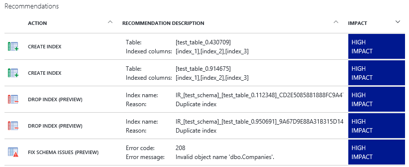
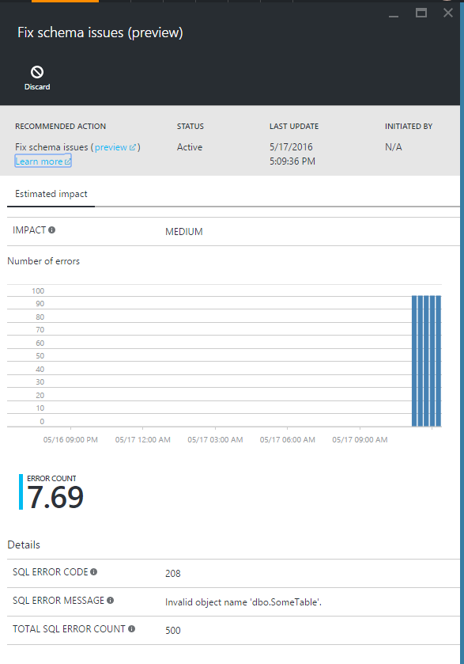
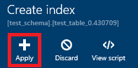
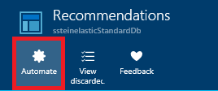
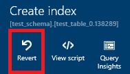

<properties 
   pageTitle="使用 Azure 门户预览的 Azure SQL 数据库顾问 | Microsoft Azure" 
   description="可以在 Azure 门户预览中使用 Azure SQL 数据库顾问查看和实施为你的现有 SQL 数据库提供的建议，这些建议可以提高当前查询性能。" 
   services="sql-database" 
   documentationCenter="" 
   authors="stevestein" 
   manager="jhubbard" 
   editor="monicar"/>

<tags
   ms.service="sql-database"
   ms.devlang="na"
   ms.topic="article"
   ms.tgt_pltfrm="na"
   ms.workload="data-management" 
   ms.date="06/22/2016" 
   wacn.date="08/15/2016"
   ms.author="sstein"/>

# SQL 数据库顾问

> [AZURE.SELECTOR]
- [SQL 数据库顾问概述](/documentation/articles/sql-database-advisor/)
- [Azure 门户预览](/documentation/articles/sql-database-advisor-portal/)

可以在 Azure 门户预览中使用 Azure SQL 数据库顾问查看和实施为你的现有 SQL 数据库提供的建议，这些建议可以提高当前查询性能。

## 查看建议

你可以在建议页中根据其对提高性能的潜在影响来查看排位靠前的建议。你还可以查看历史操作的状态。选择要查看其详细信息的建议或状态。

若要查看和应用建议，需要 Azure 中相应的[基于角色的访问控制](/documentation/articles/role-based-access-control-configure/)权限。查看建议需要“读者”、“SQL DB 参与者”权限，执行任何操作（如创建或删除索引、取消创建索引）需要“所有者”、“SQL DB 参与者”权限。

1. 登录到 [Azure 门户预览](https://portal.azure.cn/)。
2. 单击“浏览”>“SQL 数据库”，然后选择数据库。
5. 单击“所有设置”>“建议”可查看适用于所选数据库的可用“建议”。

> [AZURE.NOTE] 若要获取建议，数据库需要具有一周左右的使用量，且该周内需要有一些活动。此外也需要一些一致的活动。SQL 数据库顾问优化一致的查询模式比优化随机的突发活动更加轻松。如果建议不可用，“建议”页会提供一条说明原因的消息。

下面是 Azure 门户预览中“修复架构问题”建议的示例。

按其对性能的潜在影响将建议分为以下 4 个类别：

| 影响 | 说明 |
| :--- | :--- |
| 高 | 高影响建议应提供最重要的性能影响。 |
| 中型 | 中等影响建议应提高性能，但提升程度不大。 |
| 低 | 低影响建议提供的性能比没有时更好，但改进可能不明显。 

### 从列表中删除建议

如果建议的列表中包含你想要删除的项则可放弃建议：

1. 选择“建议”列表中的建议。
2. 单击“详细信息”边栏选项卡上的“放弃”。

你可以根据需要将已放弃的项重新添加到“建议”列表中：

1. 在“建议”边栏选项卡上单击“查看已放弃的项”。
1. 从列表中选择一个放弃的项，查看其详细信息。
1. （可选）单击“撤消放弃”，将索引重新添加到“建议”的主列表。

## 应用建议

SQL 数据库顾问允许你通过以下 3 大选项之一全权控制建议的启用方式。

- 一次应用一个建议。
- 启用顾问以自动应用建议（当前仅适用于索引建议）。
- 针对数据库手动运行建议的 T-SQL 脚本以实施建议。

选择要查看其详细信息的建议，然后单击“查看脚本”查看具体详细信息，以了解如何创建建议。

当顾问应用建议时，数据库将保持联机状态 -- 使用 SQL 数据库顾问不会让数据库离线。

### 应用单个建议

你可以逐个查看和接受建议。

1. 在“建议”边栏选项卡上单击某个建议。
2. 在“详细信息”边栏选项卡上单击“应用”。

    

### 启用自动索引管理

可以将 SQL 数据库顾问设置为自动实施建议。建议一出现就会自动应用。对于该服务所管理的所有索引操作，如果存在负面的性能影响，则会还原所受到的影响。

1. 在“建议”边栏选项卡上单击“自动执行”：

    

2. 将顾问设置为自动“创建”或“删除”索引：

    

### 手动运行建议的 T-SQL 脚本

选择任意建议，然后单击“查看脚本”。针对数据库运行此脚本以手动应用建议。

不通过该服务监视和验证手动执行的索引的性能影响，因此建议你在创建后监视这些索引以验证它们是否提供性能提升，并在必要时调整或删除它们。有关创建索引的详细信息，请参阅[创建索引 (Transact-SQL)](https://msdn.microsoft.com/zh-cn/library/ms188783.aspx)。

### 取消建议

可以取消处于“待定”、“正在验证”或“成功”状态的建议。不能取消状态为“正在执行”的建议。

1. 在“优化历史记录”区域中选择建议以打开“建议详细信息”边栏选项卡。
2. 单击“取消”可中止应用建议的过程。

## 监视操作

可能不会立刻应用建议。该门户提供了有关建议操作状态的详细信息。以下是索引可能处于的状态：

| 状态 | 说明 |
| :--- | :--- |
| 挂起 | 已经接收应用建议命令并计划执行。 |
| 执行 | 正在应用建议。 |
| 成功 | 已成功应用建议。 |
| 错误 | 在应用建议的过程期间发生了错误。这可能是暂时性问题，或可能是表的架构更改所致，并且脚本不再有效。 |
| 还原 | 已应用建议，但该建议被认为是非性能的且正在被自动还原。 |
| 已还原 | 已还原建议。 |

单击列表中的进程内建议以查看其详细信息：

### 正在还原建议

如果你使用了顾问来应用建议（即并没有手动运行 T-SQL 脚本），那么顾问会在发现性能影响为负面时自动还原该建议。如果你因故需要还原建议，可执行以下操作：

1. 在“优化历史记录”区域中选择已成功应用的建议。
2. 单击“建议详细信息”边栏选项卡上的“还原”。

## 监视索引建议的性能影响

成功实施建议后（当前仅限索引操作和参数化查询建议），可单击“建议详细信息”边栏选项卡上的“Query Insights”以打开 [Query Performance Insights](/documentation/articles/sql-database-query-performance/)，然后查看排位靠前的查询的性能影响。

## 摘要

SQL 数据库顾问提供了提高 SQL 数据库性能的建议。通过提供 T-SQL 脚本以及单个的和全自动化的索引（当前仅限索引），顾问可以有效地协助你优化数据库并最终提高查询性能。

## 后续步骤

监视建议并继续应用它们以优化性能。数据库工作负荷是动态的，并且不断地更改。SQL 数据库顾问将继续监视和提供可能提高数据库性能的建议。

 - 有关 SQL 数据库顾问的概述，请参阅 [SQL 数据库顾问](/documentation/articles/sql-database-advisor/)。
 - 若要了解排名靠前的查询的性能影响，请参阅[查询性能见解](/documentation/articles/sql-database-query-performance/)。

## 其他资源

- [查询存储](https://msdn.microsoft.com/zh-cn/library/dn817826.aspx)
- [CREATE INDEX](https://msdn.microsoft.com/zh-cn/library/ms188783.aspx)
- [基于角色的访问控制](/documentation/articles/role-based-access-control-configure/)

<!---HONumber=Mooncake_0808_2016-->