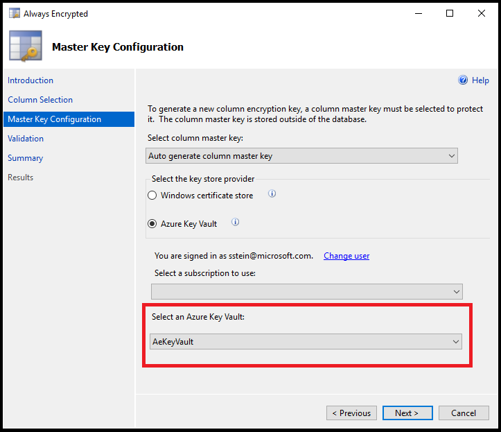
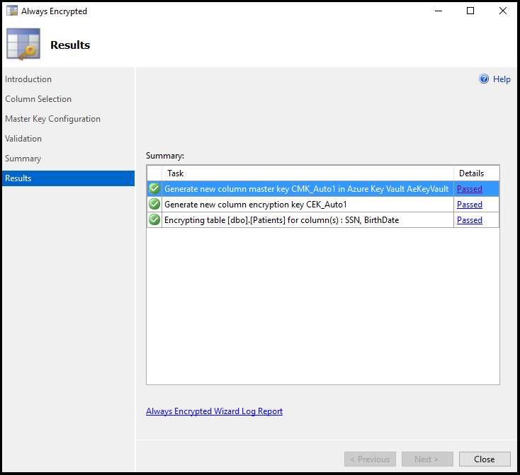
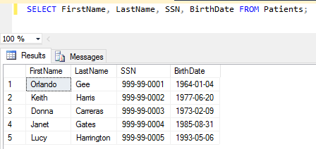

<properties
    pageTitle="始终加密：SQL 数据库 - Azure Key Vault | Azure"
    description="本文演示如何使用 SQL Server Management Studio 中的始终加密向导，通过数据加密来保护 SQL 数据库中的敏感数据。 它还包括如何将每个加密密钥存储在 Azure 密钥保管库的说明。"
    keywords="数据加密, 加密密钥, 云加密"
    services="sql-database"
    documentationcenter=""
    author="stevestein"
    manager="jhubbard"
    editor="cgronlun"
    translationtype="Human Translation" />
<tags
    ms.assetid="6ca16644-5969-497b-a413-d28c3b835c9b"
    ms.service="sql-database"
    ms.custom="secure and protect"
    ms.workload="data-management"
    ms.tgt_pltfrm="na"
    ms.devlang="na"
    ms.topic="article"
    ms.date="03/06/2017"
    wacn.date="04/17/2017"
    ms.author="sstein"
    ms.sourcegitcommit="7cc8d7b9c616d399509cd9dbdd155b0e9a7987a8"
    ms.openlocfilehash="6714761fdd6996f48ead7602c2edb6e780456d3d"
    ms.lasthandoff="04/07/2017" />

# 始终加密：保护 SQL 数据库中的敏感数据并将加密密钥存储在 Azure 密钥保管库中

本文演示如何使用 [SQL Server Management Studio (SSMS)](https://msdn.microsoft.com/zh-cn/library/mt459280.aspx) 中的[始终加密向导](https://msdn.microsoft.com/zh-cn/library/hh213248.aspx)，通过数据加密来保护 SQL 数据库中的敏感数据。 它还包括如何将每个加密密钥存储在 Azure 密钥保管库的说明。

始终加密是 Azure SQL 数据库和 SQL Server 中一项新的数据加密技术，用于保护服务器上的敏感静态数据、在客户端和服务器之间进行移动的敏感数据，以及正在使用中的数据。 始终加密可以确保敏感数据永远不会在数据库系统中以明文形式显示。 配置数据加密之后，仅客户端应用程序或应用服务器（具有密钥访问权限）能够访问明文数据。 有关详细信息，请参阅[始终加密（数据库引擎）](https://msdn.microsoft.com/zh-cn/library/mt163865.aspx)。

将数据库配置为使用始终加密后，将通过 Visual Studio 在 C# 中创建一个客户端应用程序，以便处理加密的数据。

按本文所述步骤进行操作，了解如何为 Azure SQL 数据库设置始终加密。 在本文中，你将学习如何执行以下任务：

* 在 SSMS 中使用始终加密向导创建[始终加密密钥](https://msdn.microsoft.com/zh-cn/library/mt163865.aspx#Anchor_3)。
  * 创建[列主密钥 (CMK)](https://msdn.microsoft.com/zh-cn/library/mt146393.aspx)。
  * 创建[列加密密钥 (CEK)](https://msdn.microsoft.com/zh-cn/library/mt146372.aspx)。
* 创建一个数据库表并加密列。
* 创建一个可以从已加密列插入、选择和显示数据的应用程序。

## 先决条件
在本教程中，你需要：

* Azure 帐户和订阅。 如果没有，请注册[试用版](/pricing/1rmb-trial)。
* [SQL Server Management Studio](https://msdn.microsoft.com/zh-cn/library/mt238290.aspx) 版本 13.0.700.242 或更高版本。
* [.NET Framework 4.6](https://msdn.microsoft.com/zh-cn/library/w0x726c2.aspx) 或更高版本（在客户端计算机上）。
* [Visual Studio](https://www.visualstudio.com/zh-cn/downloads/download-visual-studio-vs.aspx)。
* [Azure PowerShell](https://docs.microsoft.com/zh-cn/powershell/azureps-cmdlets-docs)，版本 1.0 或更高版本。 键入 **(Get-Module azure -ListAvailable).Version** 可查看所运行的 PowerShell 版本。

## 使客户端应用程序可以访问 SQL 数据库服务
首先必须通过设置所需的身份验证并获取在下面的代码中对应用程序进行身份验证所需的 *ClientId* 和 *Secret*，使客户端应用程序可以访问 SQL 数据库服务。

1. 打开 [Azure 经典管理门户](http://manage.windowsazure.cn)。
2. 选择“Active Directory”，然后单击应用程序将使用的 Active Directory。
3. 单击“应用程序”，然后单击“添加”。
4. 键入应用程序的名称（例如：*myClientApp*），选择“WEB 应用程序”，然后单击箭头以继续。
5. 对于“登录 URL”和“应用 ID URI”，可以键入一个有效 URL（例如：*http://myClientApp*），然后继续。
6. 单击“配置”。
7. 复制你的“客户端 ID”。 （稍后在代码中将需要此值。）
8. 在“密钥”部分中，从“选择持续时间”下拉列表选择“1 年”。 （在步骤 13 中保存后将复制该密钥。）
9. 向下滚动并单击“添加应用程序”。
10. 保留“显示”设置为“Microsoft 应用”，然后选择“Microsoft Azure 服务管理 API”。 单击复选标记以继续。
11. 从“委派权限”下拉列表选择“访问 Azure 服务管理...”。
12. 单击“保存”。
13. 在保存完成后，将密钥值复制到“密钥”部分。 （稍后在代码中将需要此值。）

## 创建密钥保管库以存储密钥
现在客户端应用已配置并且你获得了客户端 ID，便可以创建密钥保管库并配置其访问策略以允许你和应用程序访问保管库的密码（始终加密密钥）。 *create*、*get*、*list*、*sign*、*verify*、*wrapKey* 和 *unwrapKey* 权限是用于创建新的列主密钥以及通过 SQL Server Management Studio 设置加密所必需的。

若要快速创建 Azure 密钥保管库，可以运行以下脚本。有关这些 cmdlet 的详细说明以及有关创建和配置 Azure 密钥保管库的详细信息，请参阅 [Azure 密钥保管库入门](/documentation/articles/key-vault-get-started/)

    $subscriptionName = '<your Azure subscription name>'
    $userPrincipalName = '<username@domain.com>'
    $clientId = '<client ID that you copied in step 7 above>'
    $resourceGroupName = '<resource group name>'
    $location = '<datacenter location>'
    $vaultName = 'AeKeyVault'

    Login-AzureRmAccount -EnvironmentName AzureChinaCloud
    $subscriptionId = (Get-AzureRmSubscription -SubscriptionName $subscriptionName).SubscriptionId
    Set-AzureRmContext -SubscriptionId $subscriptionId

    New-AzureRmResourceGroup –Name $resourceGroupName –Location $location
    New-AzureRmKeyVault -VaultName $vaultName -ResourceGroupName $resourceGroupName -Location $location

    Set-AzureRmKeyVaultAccessPolicy -VaultName $vaultName -ResourceGroupName $resourceGroupName -PermissionsToKeys create,get,wrapKey,unwrapKey,sign,verify,list -UserPrincipalName $userPrincipalName
    Set-AzureRmKeyVaultAccessPolicy  -VaultName $vaultName  -ResourceGroupName $resourceGroupName -ServicePrincipalName $clientId -PermissionsToKeys get,wrapKey,unwrapKey,sign,verify,list

## 创建空的 SQL 数据库
1. 登录 [Azure 门户预览](https://portal.azure.cn/)。
2. 转到“新建” > “数据 + 存储” > “SQL 数据库”。
3. 在新服务器或现有服务器上创建名为 **Clinic** 的**空**数据库。 若要深入了解如何在 Azure 门户预览中创建数据库，请参阅[你的第一个 Azure SQL 数据库](/documentation/articles/sql-database-get-started/)。
   
    

在本教程中稍后将需要连接字符串，因此在创建数据库后，浏览到新的 Clinic 数据库并复制连接字符串。 你可以在任何时候获取连接字符串，但很容易将其复制到 Azure 门户预览。

1. 转到“SQL 数据库” > “Clinic” > “显示数据库连接字符串”。
2. 复制 **ADO.NET** 的连接字符串。
   
    

## 使用 SSMS 连接到数据库
打开 SSMS，连接到包含 Clinic 数据库的服务器。

1. 打开 SSMS。 （转到“连接” > “数据库引擎”以打开“连接到服务器”窗口）（如果它未打开。）
2. 输入服务器名称和凭据。 服务器名称可以在 SQL 数据库边栏选项卡以及你此前复制的连接字符串中找到。 键入完整的服务器名称，包括 *database.chinacloudapi.cn*。
   
    

如果“新建防火墙规则”窗口打开，请登录到 Azure，让 SSMS 为你创建新的防火墙规则。

## 创建表
在本部分中，将创建一个表以保存患者数据。 它最初尚未加密 - 可在下一部分配置加密。

1. 展开“数据库”。
2. 右键单击“Clinic”数据库，然后单击“新建查询”。
3. 将以下 Transact-SQL (T-SQL) 粘贴到新查询窗口中，然后“执行”它。

        CREATE TABLE [dbo].[Patients](
         [PatientId] [int] IDENTITY(1,1), 
         [SSN] [char](11) NOT NULL,
         [FirstName] [nvarchar](50) NULL,
         [LastName] [nvarchar](50) NULL, 
         [MiddleName] [nvarchar](50) NULL,
         [StreetAddress] [nvarchar](50) NULL,
         [City] [nvarchar](50) NULL,
         [ZipCode] [char](5) NULL,
         [State] [char](2) NULL,
         [BirthDate] [date] NOT NULL
         PRIMARY KEY CLUSTERED ([PatientId] ASC) ON [PRIMARY] );
         GO

## 加密列（配置始终加密）
SSMS 提供了一个向导，通过设置列主密钥、列加密密钥和已加密列即可轻松地配置始终加密。

1. 展开“数据库” > “Clinic” > “表”。
2. 右键单击“Patients”表，然后选择“加密列”以打开始终加密向导：
   
    

始终加密向导包括以下部分：**列选择**、**主密钥配置**、**验证**和**摘要**。

### 列选择
单击“简介”页上的“下一步”，可以打开“列选择”页。 在此页上，选择想要加密的列，[加密类型和要使用的列加密密钥 (CEK)](https://msdn.microsoft.com/zh-cn/library/mt459280.aspx#Anchor_2)。

加密每位患者的“SSN”和“出生日期”信息。 SSN 列将使用确定性加密，该加密支持相等性查找、联接和分组方式。 BirthDate 列将使用随机加密，该加密不支持操作。

将 SSN 列的“加密类型”设置为“确定”，并将 BirthDate 列设置为“随机”。 单击“下一步” 。

### 主密钥配置
**主密钥配置**页是设置 CMK 和选择密钥存储提供程序（在其中存储 CMK）的地方。 目前，可以将 CMK 存储在 Windows 证书存储、Azure 密钥保管库或硬件安全模块 (HSM) 中。

本教程演示如何将密钥存储在 Azure 密钥保管库中。

1. 选择“Azure 密钥保管库”。
2. 从下拉列表中选择所需密钥保管库。
3. 单击“下一步” 。

### 验证
你可以现在就加密这些列，也可以保存 PowerShell 脚本供以后运行。 对于本教程，请选择“现在完成”，然后单击“下一步”。

### 摘要
验证设置是否全都正确，然后单击“完成”以完成“始终加密”的设置。

### 验证向导的操作
向导完成后，你的数据库就会设置为始终加密。 该向导执行以下操作：

* 创建列主密钥并将其存储在 Azure 密钥保管库中。
* 创建列加密密钥并将其存储在 Azure 密钥保管库中。
* 配置了所选列的加密。 “Patients”表目前尚无数据，但所选列中的任何现有数据都会进行加密。

你可以验证 SSMS 中密钥的创建，只需展开“Clinic” > “安全” > “始终加密密钥”即可。

## 创建处理已加密数据的客户端应用程序
现在已设置始终加密，可以生成一个应用程序，用其在已加密列上执行某些 *inserts* 操作和 *selects* 操作。  

> [AZURE.IMPORTANT]
> 通过始终加密列将明文数据传递到服务器时，应用程序必须使用 [SqlParameter](https://msdn.microsoft.com/zh-cn/library/system.data.sqlclient.sqlparameter.aspx) 对象。 在不使用 SqlParameter 对象的情况下传递文本值会导致异常。
> 
> 

1. 打开 Visual Studio 并创建新的 C# **控制台应用程序**（Visual Studio 2015 和更低版本）或**控制台应用 (.NET Framework)**（Visual Studio 2017 和更高版本）。 确保将你的项目设置为 **.NET Framework 4.6** 或更高版本。
2. 将项目命名为 **AlwaysEncryptedConsoleAKVApp**，然后单击“确定”。
3. 通过转到“工具” > “NuGet 包管理器” > “包管理器控制台”来安装以下 NuGet 包。

在包管理器控制台中运行以下 2 行代码。

    Install-Package Microsoft.SqlServer.Management.AlwaysEncrypted.AzureKeyVaultProvider
    Install-Package Microsoft.IdentityModel.Clients.ActiveDirectory

## 修改连接字符串以启用始终加密
本节介绍如何在数据库连接字符串中启用始终加密。

若要启用“始终加密”，你需要将“列加密设置”关键字添加到连接字符串中，并将其设置为“启用”。

你可以在连接字符串中直接进行该设置，也可以使用 [SqlConnectionStringBuilder](https://msdn.microsoft.com/zh-cn/library/system.data.sqlclient.sqlconnectionstringbuilder.aspx) 进行设置。 下一节中的示例应用程序演示如何使用 **SqlConnectionStringBuilder**。

### 在连接字符串中启用始终加密
将以下关键字添加到连接字符串中。

    Column Encryption Setting=Enabled

### 通过 SqlConnectionStringBuilder 启用始终加密
以下代码显示了如何通过将 [SqlConnectionStringBuilder.ColumnEncryptionSetting](https://msdn.microsoft.com/zh-cn/library/system.data.sqlclient.sqlconnectionstringbuilder.columnencryptionsetting.aspx) 设置为[启用](https://msdn.microsoft.com/zh-cn/library/system.data.sqlclient.sqlconnectioncolumnencryptionsetting.aspx)来启用“始终加密”。

    // Instantiate a SqlConnectionStringBuilder.
    SqlConnectionStringBuilder connStringBuilder = 
       new SqlConnectionStringBuilder("replace with your connection string");

    // Enable Always Encrypted.
    connStringBuilder.ColumnEncryptionSetting = 
       SqlConnectionColumnEncryptionSetting.Enabled;

## 注册 Azure 密钥保管库提供程序
下面的代码演示如何使用 ADO.NET 驱动程序注册 Azure 密钥保管库提供程序。

    private static ClientCredential _clientCredential;

    static void InitializeAzureKeyVaultProvider()
    {
       _clientCredential = new ClientCredential(clientId, clientSecret);

       SqlColumnEncryptionAzureKeyVaultProvider azureKeyVaultProvider =
          new SqlColumnEncryptionAzureKeyVaultProvider(GetToken);

       Dictionary<string, SqlColumnEncryptionKeyStoreProvider> providers =
          new Dictionary<string, SqlColumnEncryptionKeyStoreProvider>();

       providers.Add(SqlColumnEncryptionAzureKeyVaultProvider.ProviderName, azureKeyVaultProvider);
       SqlConnection.RegisterColumnEncryptionKeyStoreProviders(providers);
    }

## 始终加密示例控制台应用程序
此示例演示了如何执行以下操作：

* 修改连接字符串以启用始终加密。
* 将 Azure 密钥保管库注册为应用程序的密钥存储提供程序。  
* 将数据插入已加密列。
* 通过在已加密列中筛选出特定的值来选择记录。

将 **Program.cs** 的内容替换为以下代码。 将 Main 方法前一行中全局 connectionString 变量的连接字符串替换为 Azure 门户预览中的有效连接字符串。 这是需要对此代码进行的唯一更改。

运行该应用以在操作中查看始终加密。

    using System;
    using System.Collections.Generic;
    using System.Linq;
    using System.Text;
    using System.Threading.Tasks;
    using System.Data;
    using System.Data.SqlClient;
    using Microsoft.IdentityModel.Clients.ActiveDirectory;
    using Microsoft.SqlServer.Management.AlwaysEncrypted.AzureKeyVaultProvider;

    namespace AlwaysEncryptedConsoleAKVApp
    {
    class Program
    {
        // Update this line with your Clinic database connection string from the Azure Portal.
        static string connectionString = @"<connection string from the portal>";
        static string clientId = @"<client id from step 7 above>";
        static string clientSecret = "<key from step 13 above>";

        static void Main(string[] args)
        {
            InitializeAzureKeyVaultProvider();

            Console.WriteLine("Signed in as: " + _clientCredential.ClientId);

            Console.WriteLine("Original connection string copied from the Azure portal:");
            Console.WriteLine(connectionString);

            // Create a SqlConnectionStringBuilder.
            SqlConnectionStringBuilder connStringBuilder =
                new SqlConnectionStringBuilder(connectionString);

            // Enable Always Encrypted for the connection.
            // This is the only change specific to Always Encrypted 
            connStringBuilder.ColumnEncryptionSetting =
                SqlConnectionColumnEncryptionSetting.Enabled;

            Console.WriteLine(Environment.NewLine + "Updated connection string with Always Encrypted enabled:");
            Console.WriteLine(connStringBuilder.ConnectionString);

            // Update the connection string with a password supplied at runtime.
            Console.WriteLine(Environment.NewLine + "Enter server password:");
            connStringBuilder.Password = Console.ReadLine();

            // Assign the updated connection string to our global variable.
            connectionString = connStringBuilder.ConnectionString;

            // Delete all records to restart this demo app.
            ResetPatientsTable();

            // Add sample data to the Patients table.
            Console.Write(Environment.NewLine + "Adding sample patient data to the database...");

            InsertPatient(new Patient()
            {
                SSN = "999-99-0001",
                FirstName = "Orlando",
                LastName = "Gee",
                BirthDate = DateTime.Parse("01/04/1964")
            });
            InsertPatient(new Patient()
            {
                SSN = "999-99-0002",
                FirstName = "Keith",
                LastName = "Harris",
                BirthDate = DateTime.Parse("06/20/1977")
            });
            InsertPatient(new Patient()
            {
                SSN = "999-99-0003",
                FirstName = "Donna",
                LastName = "Carreras",
                BirthDate = DateTime.Parse("02/09/1973")
            });
            InsertPatient(new Patient()
            {
                SSN = "999-99-0004",
                FirstName = "Janet",
                LastName = "Gates",
                BirthDate = DateTime.Parse("08/31/1985")
            });
            InsertPatient(new Patient()
            {
                SSN = "999-99-0005",
                FirstName = "Lucy",
                LastName = "Harrington",
                BirthDate = DateTime.Parse("05/06/1993")
            });

            // Fetch and display all patients.
            Console.WriteLine(Environment.NewLine + "All the records currently in the Patients table:");

            foreach (Patient patient in SelectAllPatients())
            {
                Console.WriteLine(patient.FirstName + " " + patient.LastName + "\tSSN: " + patient.SSN + "\tBirthdate: " + patient.BirthDate);
            }

            // Get patients by SSN.
            Console.WriteLine(Environment.NewLine + "Now lets locate records by searching the encrypted SSN column.");

            string ssn;

            // This very simple validation only checks that the user entered 11 characters.
            // In production be sure to check all user input and use the best validation for your specific application.
            do
            {
                Console.WriteLine("Please enter a valid SSN (ex. 999-99-0003):");
                ssn = Console.ReadLine();
            } while (ssn.Length != 11);

            // The example allows duplicate SSN entries so we will return all records
            // that match the provided value and store the results in selectedPatients.
            Patient selectedPatient = SelectPatientBySSN(ssn);

            // Check if any records were returned and display our query results.
            if (selectedPatient != null)
            {
                Console.WriteLine("Patient found with SSN = " + ssn);
                Console.WriteLine(selectedPatient.FirstName + " " + selectedPatient.LastName + "\tSSN: "
                    + selectedPatient.SSN + "\tBirthdate: " + selectedPatient.BirthDate);
            }
            else
            {
                Console.WriteLine("No patients found with SSN = " + ssn);
            }

            Console.WriteLine("Press Enter to exit...");
            Console.ReadLine();
        }

        private static ClientCredential _clientCredential;

        static void InitializeAzureKeyVaultProvider()
        {

            _clientCredential = new ClientCredential(clientId, clientSecret);

            SqlColumnEncryptionAzureKeyVaultProvider azureKeyVaultProvider =
              new SqlColumnEncryptionAzureKeyVaultProvider(GetToken);

            Dictionary<string, SqlColumnEncryptionKeyStoreProvider> providers =
              new Dictionary<string, SqlColumnEncryptionKeyStoreProvider>();

            providers.Add(SqlColumnEncryptionAzureKeyVaultProvider.ProviderName, azureKeyVaultProvider);
            SqlConnection.RegisterColumnEncryptionKeyStoreProviders(providers);
        }

        public async static Task<string> GetToken(string authority, string resource, string scope)
        {
            var authContext = new AuthenticationContext(authority);
            AuthenticationResult result = await authContext.AcquireTokenAsync(resource, _clientCredential);

            if (result == null)
                throw new InvalidOperationException("Failed to obtain the access token");
            return result.AccessToken;
        }

        static int InsertPatient(Patient newPatient)
        {
            int returnValue = 0;

            string sqlCmdText = @"INSERT INTO [dbo].[Patients] ([SSN], [FirstName], [LastName], [BirthDate])
     VALUES (@SSN, @FirstName, @LastName, @BirthDate);";

            SqlCommand sqlCmd = new SqlCommand(sqlCmdText);

            SqlParameter paramSSN = new SqlParameter(@"@SSN", newPatient.SSN);
            paramSSN.DbType = DbType.AnsiStringFixedLength;
            paramSSN.Direction = ParameterDirection.Input;
            paramSSN.Size = 11;

            SqlParameter paramFirstName = new SqlParameter(@"@FirstName", newPatient.FirstName);
            paramFirstName.DbType = DbType.String;
            paramFirstName.Direction = ParameterDirection.Input;

            SqlParameter paramLastName = new SqlParameter(@"@LastName", newPatient.LastName);
            paramLastName.DbType = DbType.String;
            paramLastName.Direction = ParameterDirection.Input;

            SqlParameter paramBirthDate = new SqlParameter(@"@BirthDate", newPatient.BirthDate);
            paramBirthDate.SqlDbType = SqlDbType.Date;
            paramBirthDate.Direction = ParameterDirection.Input;

            sqlCmd.Parameters.Add(paramSSN);
            sqlCmd.Parameters.Add(paramFirstName);
            sqlCmd.Parameters.Add(paramLastName);
            sqlCmd.Parameters.Add(paramBirthDate);

            using (sqlCmd.Connection = new SqlConnection(connectionString))
            {
                try
                {
                    sqlCmd.Connection.Open();
                    sqlCmd.ExecuteNonQuery();
                }
                catch (Exception ex)
                {
                    returnValue = 1;
                    Console.WriteLine("The following error was encountered: ");
                    Console.WriteLine(ex.Message);
                    Console.WriteLine(Environment.NewLine + "Press Enter key to exit");
                    Console.ReadLine();
                    Environment.Exit(0);
                }
            }
            return returnValue;
        }

        static List<Patient> SelectAllPatients()
        {
            List<Patient> patients = new List<Patient>();

            SqlCommand sqlCmd = new SqlCommand(
              "SELECT [SSN], [FirstName], [LastName], [BirthDate] FROM [dbo].[Patients]",
                new SqlConnection(connectionString));

            using (sqlCmd.Connection = new SqlConnection(connectionString))

            using (sqlCmd.Connection = new SqlConnection(connectionString))
            {
                try
                {
                    sqlCmd.Connection.Open();
                    SqlDataReader reader = sqlCmd.ExecuteReader();

                    if (reader.HasRows)
                    {
                        while (reader.Read())
                        {
                            patients.Add(new Patient()
                            {
                                SSN = reader[0].ToString(),
                                FirstName = reader[1].ToString(),
                                LastName = reader["LastName"].ToString(),
                                BirthDate = (DateTime)reader["BirthDate"]
                            });
                        }
                    }
                }
                catch (Exception ex)
                {
                    throw;
                }
            }

            return patients;
        }

        static Patient SelectPatientBySSN(string ssn)
        {
            Patient patient = new Patient();

            SqlCommand sqlCmd = new SqlCommand(
                "SELECT [SSN], [FirstName], [LastName], [BirthDate] FROM [dbo].[Patients] WHERE [SSN]=@SSN",
                new SqlConnection(connectionString));

            SqlParameter paramSSN = new SqlParameter(@"@SSN", ssn);
            paramSSN.DbType = DbType.AnsiStringFixedLength;
            paramSSN.Direction = ParameterDirection.Input;
            paramSSN.Size = 11;

            sqlCmd.Parameters.Add(paramSSN);

            using (sqlCmd.Connection = new SqlConnection(connectionString))
            {
                try
                {
                    sqlCmd.Connection.Open();
                    SqlDataReader reader = sqlCmd.ExecuteReader();

                    if (reader.HasRows)
                    {
                        while (reader.Read())
                        {
                            patient = new Patient()
                            {
                                SSN = reader[0].ToString(),
                                FirstName = reader[1].ToString(),
                                LastName = reader["LastName"].ToString(),
                                BirthDate = (DateTime)reader["BirthDate"]
                            };
                        }
                    }
                    else
                    {
                        patient = null;
                    }
                }
                catch (Exception ex)
                {
                    throw;
                }
            }
            return patient;
        }

        // This method simply deletes all records in the Patients table to reset our demo.
        static int ResetPatientsTable()
        {
            int returnValue = 0;

            SqlCommand sqlCmd = new SqlCommand("DELETE FROM Patients");
            using (sqlCmd.Connection = new SqlConnection(connectionString))
            {
                try
                {
                    sqlCmd.Connection.Open();
                    sqlCmd.ExecuteNonQuery();

                }
                catch (Exception ex)
                {
                    returnValue = 1;
                }
            }
            return returnValue;
        }
    }

    class Patient
    {
        public string SSN { get; set; }
        public string FirstName { get; set; }
        public string LastName { get; set; }
        public DateTime BirthDate { get; set; }
    }
    }

## 确保数据已加密
通过 SSMS 对患者数据进行查询（使用当前的连接，其中，**列加密设置**尚未启用），可以快速查看服务器上的实际数据是否已加密。

针对 Clinic 数据库运行以下查询。

    SELECT FirstName, LastName, SSN, BirthDate FROM Patients;

你可以看到，加密的列不包含任何明文数据。

   

若要使用 SSMS 来访问明文数据，可将 *Column Encryption Setting=enabled* 参数添加到连接中。

1. 在 SSMS 中，右键单击“对象资源管理器”中的服务器，然后选择“断开连接”。
2. 单击“连接” > “数据库引擎”打开“连接到服务器”窗口，然后单击“选项”。
3. 单击“其他连接参数”，然后键入 **Column Encryption Setting=enabled**。
   
    
4. 针对 Clinic 数据库运行以下查询。

        SELECT FirstName, LastName, SSN, BirthDate FROM Patients;

     现在，你可以看到已加密列中的明文数据。

    

## 后续步骤
创建使用始终加密的数据库以后，你可能需要执行以下操作：

* [轮换使用和清除密钥](https://msdn.microsoft.com/zh-cn/library/mt607048.aspx)。
* [迁移已使用始终加密加密的数据](https://msdn.microsoft.com/zh-cn/library/mt621539.aspx)。

## 相关信息
* [始终加密（客户端开发）](https://msdn.microsoft.com/zh-cn/library/mt147923.aspx)
* [透明数据加密](https://msdn.microsoft.com/zh-cn/library/bb934049.aspx)
* [SQL Server 加密](https://msdn.microsoft.com/zh-cn/library/bb510663.aspx)
* [始终加密向导](https://msdn.microsoft.com/zh-cn/library/mt459280.aspx)
* [始终加密博客](http://blogs.msdn.com/b/sqlsecurity/archive/tags/always-encrypted/)

<!--Update_Description: SQL operations steps fine tune-->