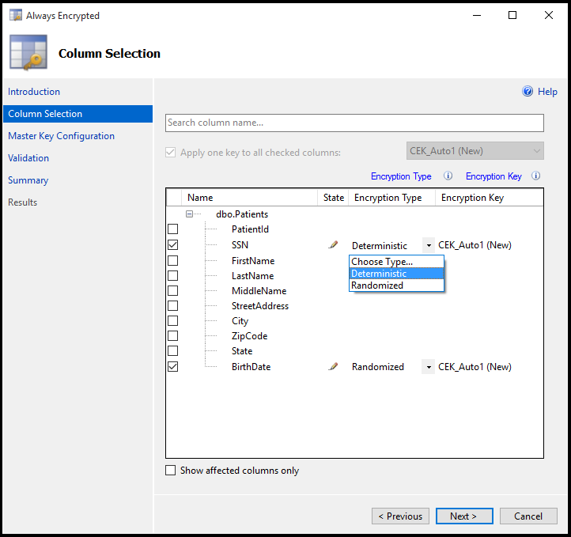
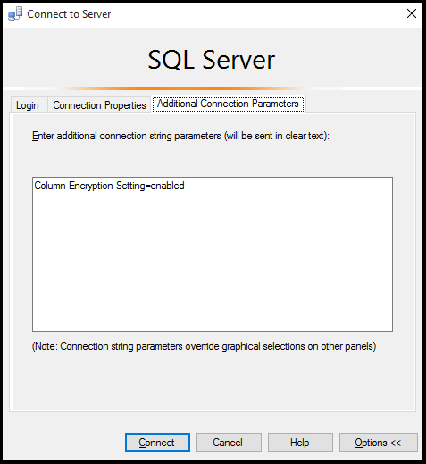

<properties
	pageTitle="始终加密 - 使用数据库加密保护 Azure SQL 数据库中的敏感数据"
	description="在数分钟内保护 SQL 数据库中的敏感数据。"
	keywords="加密数据, sql 加密, 数据库加密, 敏感数据, 始终加密"	
	services="sql-database"
	documentationCenter=""
	authors="stevestein"
	manager="jhubbard"
	editor="cgronlun"/>

<tags
	ms.service="sql-database"
	ms.date="05/09/2016"
	wacn.date="05/23/2016"/>

# 始终加密 - 使用数据库加密保护 SQL 数据库中的敏感数据并将加密密钥存储在 Windows 证书存储中

> [AZURE.SELECTOR]
- [Azure 密钥保管库](/documentation/articles/sql-database-always-encrypted-azure-key-vault/)
- [Windows 证书存储](/documentation/articles/sql-database-always-encrypted/)

本文演示如何使用 [SQL Server Management Studio (SSMS)](https://msdn.microsoft.com/zh-cn/library/hh213248.aspx) 中的[始终加密向导](https://msdn.microsoft.com/zh-cn/library/mt459280.aspx)，通过数据库加密来保护 SQL 数据库中的敏感数据，以及如何将加密密钥存储在 Windows 证书存储中。

始终加密是 Azure SQL 数据库和 SQL Server 中一项新的数据加密技术，用于保护服务器上的敏感静态数据、在客户端和服务器之间进行移动的敏感数据，以及正在使用中的数据，确保敏感数据永远不会在数据库系统中以明文形式显示。加密数据之后，仅客户端应用程序或应用服务器（具有密钥访问权限）能够访问明文数据。有关详细信息，请参阅[始终加密（数据库引擎）](https://msdn.microsoft.com/zh-cn/library/mt163865.aspx)。

将数据库配置为使用始终加密后，我们将通过 Visual Studio 使用 C# 创建一个客户端应用程序，以便处理加密的数据。

按本文所述步骤进行操作，了解如何为 Azure SQL 数据库设置始终加密。在本文中，你将学习如何执行以下任务：

- 在 SSMS 中使用始终加密向导创建[始终加密密钥](https://msdn.microsoft.com/zh-cn/library/mt163865.aspx#Anchor_3)
    - 创建[列主密钥 (CMK)](https://msdn.microsoft.com/zh-cn/library/mt146393.aspx)。
    - 创建[列加密密钥 (CEK)](https://msdn.microsoft.com/zh-cn/library/mt146372.aspx)。
- 创建一个数据库表并加密部分列。
- 创建一个可以从已加密列插入、选择和显示数据的应用程序。

> [AZURE.NOTE] Azure SQL 数据库的始终加密目前为预览版。

## 先决条件

在本教程中，你需要：

- 在开始之前，你需要有 Azure 帐户和订阅。如果没有，请注册[试用版](/pricing/1rmb-trial)。
- [SQL Server Management Studio (SSMS)](https://msdn.microsoft.com/zh-cn/library/mt238290.aspx) 13.0.700.242 或更高版本。
- [.NET Framework 4.6](https://msdn.microsoft.com/zh-cn/library/w0x726c2.aspx) 或更高版本（在客户端计算机上）。
- [Visual Studio](https://www.visualstudio.com/downloads/download-visual-studio-vs.aspx)。

## 使用 SSMS 连接到数据库

打开 SSMS，连接到包含 Clinic 数据库的服务器。

1. 打开 SSMS（单击“连接”>“数据库引擎...”打开“连接到服务器”窗口（如果尚未打开））。
2. 输入服务器名称和凭据。服务器名称可以在 SQL 数据库边栏选项卡以及你此前复制的连接字符串中找到。键入完整的服务器名称，例如 *database.chinacloudapi.cn*。

	

3. 如果“新建防火墙规则”窗口打开，请登录到 Azure，让 SSMS 为你创建防火墙规则。

## 创建表

首先，我们将创建一个表来保留患者数据（一开始只需一个普通表 -- 我们会在下一部分配置加密）。

1. 展开“数据库”。
1. 右键单击“Clinic”数据库，然后单击“新建查询”。
2. 将以下 Transact-SQL (T-SQL) 粘贴到新查询窗口中，然后单击“执行”执行该语句：

        CREATE TABLE [dbo].[Patients](
         [PatientId] [int] IDENTITY(1,1), 
         [SSN] [char](11) NOT NULL,
         [FirstName] [nvarchar](50) NULL,
         [LastName] [nvarchar](50) NULL, 
         [MiddleName] [nvarchar](50) NULL,
         [StreetAddress] [nvarchar](50) NULL,
         [City] [nvarchar](50) NULL,
         [ZipCode] [char](5) NULL,
         [State] [char](2) NULL,
         [BirthDate] [date] NOT NULL
         PRIMARY KEY CLUSTERED ([PatientId] ASC) ON [PRIMARY] );
         GO

## 加密某些列（配置始终加密）

SSMS 提供了一个向导，可以轻松地配置始终加密，只需为你设置列主密钥 (CMK)、列加密密钥 (CEK) 和已加密列即可。

1. 展开“数据库”>“Clinic”>“表”。
2. 右键单击“患者”表，然后选择“加密列...”以打开始终加密向导：

    

3. **列选择**

    单击“简介”页上的“下一步”打开“列选择”页，在该页中，你可以选择要加密的列、要使用的[加密类型和列加密密钥 (CEK)](https://msdn.microsoft.com/zh-cn/library/mt459280.aspx#Anchor_2)。

    我们需要加密每位患者的“身份证号”和“出生日期”信息。SSN 列将使用确定性加密，该加密支持相等性查找、联接和分组方式。BirthDate 列将使用随机加密，该加密不支持操作。

    选择“身份证号”列的“加密类型”并将其设置为“确定”，将“出生日期”列设置为“随机”，然后单击“下一步”。

    

4. **主密钥配置** (CMK)

    “主密钥配置”页是设置列主密钥 (CMK) 和选择密钥存储提供程序（在其中存储 CMK）的地方。目前，你可以将 CMK 存储在 Windows 证书存储、Azure 密钥保管库或硬件安全模块 (HSM) 中。本教程演示如何将密钥存储在 Windows 证书存储中。

    确保选中“Windows 证书存储”，然后单击“下一步”。

    

5. **验证**

    你可以现在就加密这些列，也可以保存 PowerShell 脚本供以后运行。对于本教程，请选择“现在完成”，然后单击“下一步”。

6. **摘要**

    确保设置全都正确，然后单击“完成”完成始终加密的设置。

    

### 该向导的具体功能是什么？

向导完成后，你的数据库就会设置为始终加密，并完成了以下操作：

- 创建了列主密钥 (CMK)。
- 创建了列加密密钥 (CEK)。
- 配置了所选列的加密。（我们的“患者”表目前尚无数据，但所选列中的任何现有数据都会进行加密。）

你可以验证 SSMS 中创建的密钥，只需展开“Clinic”>“安全”>“始终加密密钥”即可。现在，你可以看到向导为你生成的新密钥了。

## 创建处理已加密数据的客户端应用程序

现在我们已设置始终加密，让我们生成一个应用程序，用其在已加密列上执行某些 INSERT 操作和 SELECT 操作。若要成功运行此示例应用程序，你必需在运行过始终加密向导的计算机上运行它。若要在其他计算机上运行，你必须将始终加密证书部署到运行客户端应用的计算机上。

> [AZURE.IMPORTANT] 通过始终加密列将明文数据传递到服务器时，应用程序必须使用 [SqlParameter](https://msdn.microsoft.com/zh-cn/library/system.data.sqlclient.sqlparameter.aspx) 对象。在不使用 SqlParameter 对象的情况下传递文本值会导致异常。

1. 打开 Visual Studio 并创建新的 C# 控制台应用程序。确保将你的项目设置为 **.NET Framework 4.6** 或更高版本。
2. 将项目命名为 **AlwaysEncryptedConsoleApp**，然后单击“确定”。

	

## 修改连接字符串以启用始终加密

本节只介绍如何在数据库连接字符串中启用始终加密。在下一节（即“始终加密示例控制台应用程序”）中，你需要实际修改刚创建的控制台应用。

若要启用始终加密，你需要将 **Column Encryption Setting** 关键字添加到连接字符串中，并将其设置为 **Enabled**。

你可以在连接字符串中直接进行该设置，也可以使用 [SqlConnectionStringBuilder](https://msdn.microsoft.com/zh-cn/library/system.data.sqlclient.sqlconnectionstringbuilder.aspx) 进行设置。下一节中的示例应用程序演示如何使用 **SqlConnectionStringBuilder**。

> [AZURE.NOTE] 在特定于始终加密的客户端应用程序中，这是需要完成的唯一更改。如果你的某个现有应用程序将其连接字符串存储在外部（即存储在配置文件中），则可在不更改任何代码的情况下启用始终加密。

### 在连接字符串中启用始终加密

将以下关键字添加到连接字符串中：

    Column Encryption Setting=Enabled

### 通过 SqlConnectionStringBuilder 启用始终加密

以下代码显示了如何通过将 [SqlConnectionStringBuilder.ColumnEncryptionSetting](https://msdn.microsoft.com/zh-cn/library/system.data.sqlclient.sqlconnectionstringbuilder.columnencryptionsetting.aspx) 设置为 [Enabled](https://msdn.microsoft.com/zh-cn/library/system.data.sqlclient.sqlconnectioncolumnencryptionsetting.aspx) 来启用始终加密。

    // Instantiate a SqlConnectionStringBuilder.
    SqlConnectionStringBuilder connStringBuilder = 
       new SqlConnectionStringBuilder("replace with your connection string");

    // Enable Always Encrypted.
    connStringBuilder.ColumnEncryptionSetting = 
       SqlConnectionColumnEncryptionSetting.Enabled;

## 始终加密示例控制台应用程序

此示例演示了如何执行以下操作：

- 修改连接字符串以启用始终加密。
- 将数据插入已加密列。
- 通过在已加密列中筛选出特定的值来选择记录。

将 **Program.cs** 的内容替换为以下内容。将 Main 方法上面一行中全局 connectionString 变量的连接字符串替换为 Azure 经典管理门户中的有效连接字符串。这是需要对此代码进行的唯一更改。

现在，请运行该应用以查看始终加密操作。

    using System;
    using System.Collections.Generic;
    using System.Linq;
    using System.Text;
    using System.Threading.Tasks;
    using System.Data;
    using System.Data.SqlClient;
    
    namespace AlwaysEncryptedConsoleApp
    {
    class Program
    {
        // Update this line with your Clinic database connection string from the Azure Portal.
        static string connectionString = @"Replace with your connection string";

        static void Main(string[] args)
        {
            Console.WriteLine("Original connection string copied from the Azure portal:");
            Console.WriteLine(connectionString);

            // Create a SqlConnectionStringBuilder.
            SqlConnectionStringBuilder connStringBuilder =
                new SqlConnectionStringBuilder(connectionString);

            // Enable Always Encrypted for the connection.
            // This is the only change specific to Always Encrypted 
            connStringBuilder.ColumnEncryptionSetting =
                SqlConnectionColumnEncryptionSetting.Enabled;

            Console.WriteLine(Environment.NewLine + "Updated connection string with Always Encrypted enabled:");
            Console.WriteLine(connStringBuilder.ConnectionString);

            // Update the connection string with a password supplied at runtime.
            Console.WriteLine(Environment.NewLine + "Enter server password:");
            connStringBuilder.Password = Console.ReadLine();

            // Assign the updated connection string to our global variable.
            connectionString = connStringBuilder.ConnectionString;

            // Delete all records to restart this demo app.
            ResetPatientsTable();

            // Add sample data to the Patients table.
            Console.Write(Environment.NewLine + "Adding sample patient data to the database...");

            InsertPatient(new Patient() {
                SSN = "999-99-0001", FirstName = "Orlando", LastName = "Gee", BirthDate = DateTime.Parse("01/04/1964") });
            InsertPatient(new Patient() {
                SSN = "999-99-0002", FirstName = "Keith", LastName = "Harris", BirthDate = DateTime.Parse("06/20/1977") });
            InsertPatient(new Patient() {
                SSN = "999-99-0003", FirstName = "Donna", LastName = "Carreras", BirthDate = DateTime.Parse("02/09/1973") });
            InsertPatient(new Patient() {
                SSN = "999-99-0004", FirstName = "Janet", LastName = "Gates", BirthDate = DateTime.Parse("08/31/1985") });
            InsertPatient(new Patient() {
                SSN = "999-99-0005", FirstName = "Lucy", LastName = "Harrington", BirthDate = DateTime.Parse("05/06/1993") });

            // Fetch and display all patients.
            Console.WriteLine(Environment.NewLine + "All the records currently in the Patients table:");

            foreach (Patient patient in SelectAllPatients())
            {
                Console.WriteLine(patient.FirstName + " " + patient.LastName + "\tSSN: " + patient.SSN + "\tBirthdate: " + patient.BirthDate);
            }

            // Get patients by SSN.
            Console.WriteLine(Environment.NewLine + "Now lets locate records by searching the encrypted SSN column.");

            string ssn;

            // This very simple validation only checks that the user entered 11 characters.
            // In production be sure to check all user input and use the best validation for your specific application.
            do
            {
                Console.WriteLine("Please enter a valid SSN (ex. 123-45-6789):");
                ssn = Console.ReadLine();
            } while (ssn.Length != 11);

            // The example allows duplicate SSN entries so we will return all records
            // that match the provided value and store the results in selectedPatients.
            Patient selectedPatient = SelectPatientBySSN(ssn);

            // Check if any records were returned and display our query results.
            if (selectedPatient != null)
            {
                Console.WriteLine("Patient found with SSN = " + ssn);
                Console.WriteLine(selectedPatient.FirstName + " " + selectedPatient.LastName + "\tSSN: "
                    + selectedPatient.SSN + "\tBirthdate: " + selectedPatient.BirthDate);
            }
            else
            {
                Console.WriteLine("No patients found with SSN = " + ssn);
            }

            Console.WriteLine("Press Enter to exit...");
            Console.ReadLine();
        }

        static int InsertPatient(Patient newPatient)
        {
            int returnValue = 0;

            string sqlCmdText = @"INSERT INTO [dbo].[Patients] ([SSN], [FirstName], [LastName], [BirthDate])
         VALUES (@SSN, @FirstName, @LastName, @BirthDate);";

            SqlCommand sqlCmd = new SqlCommand(sqlCmdText);

            SqlParameter paramSSN = new SqlParameter(@"@SSN", newPatient.SSN);
            paramSSN.DbType = DbType.AnsiStringFixedLength;
            paramSSN.Direction = ParameterDirection.Input;
            paramSSN.Size = 11;

            SqlParameter paramFirstName = new SqlParameter(@"@FirstName", newPatient.FirstName);
            paramFirstName.DbType = DbType.String;
            paramFirstName.Direction = ParameterDirection.Input;

            SqlParameter paramLastName = new SqlParameter(@"@LastName", newPatient.LastName);
            paramLastName.DbType = DbType.String;
            paramLastName.Direction = ParameterDirection.Input;

            SqlParameter paramBirthDate = new SqlParameter(@"@BirthDate", newPatient.BirthDate);
            paramBirthDate.SqlDbType = SqlDbType.Date;
            paramBirthDate.Direction = ParameterDirection.Input;

            sqlCmd.Parameters.Add(paramSSN);
            sqlCmd.Parameters.Add(paramFirstName);
            sqlCmd.Parameters.Add(paramLastName);
            sqlCmd.Parameters.Add(paramBirthDate);

            using (sqlCmd.Connection = new SqlConnection(connectionString))
            {
                try
                {
                    sqlCmd.Connection.Open();
                    sqlCmd.ExecuteNonQuery();
                }
                catch (Exception ex)
                {
                    returnValue = 1;
                    Console.WriteLine("The following error was encountered: ");
                    Console.WriteLine(ex.Message);
                    Console.WriteLine(Environment.NewLine + "Press Enter key to exit");
                    Console.ReadLine();
                    Environment.Exit(0);
                }
            }
            return returnValue;
        }

        static List<Patient> SelectAllPatients()
        {
            List<Patient> patients = new List<Patient>();

            SqlCommand sqlCmd = new SqlCommand(
              "SELECT [SSN], [FirstName], [LastName], [BirthDate] FROM [dbo].[Patients]",
                new SqlConnection(connectionString));

            using (sqlCmd.Connection = new SqlConnection(connectionString))

            using (sqlCmd.Connection = new SqlConnection(connectionString))
            {
                try
                {
                    sqlCmd.Connection.Open();
                    SqlDataReader reader = sqlCmd.ExecuteReader();

                    if (reader.HasRows)
                    {
                        while (reader.Read())
                        {
                            patients.Add(new Patient()
                            {
                                SSN = reader[0].ToString(),
                                FirstName = reader[1].ToString(),
                                LastName = reader["LastName"].ToString(),
                                BirthDate = (DateTime)reader["BirthDate"]
                            });
                        }
                    }
                }
                catch (Exception ex)
                {
                    throw;
                }
            }

            return patients;
        }

        static Patient SelectPatientBySSN(string ssn)
        {
            Patient patient = new Patient();

            SqlCommand sqlCmd = new SqlCommand(
                "SELECT [SSN], [FirstName], [LastName], [BirthDate] FROM [dbo].[Patients] WHERE [SSN]=@SSN",
                new SqlConnection(connectionString));

            SqlParameter paramSSN = new SqlParameter(@"@SSN", ssn);
            paramSSN.DbType = DbType.AnsiStringFixedLength;
            paramSSN.Direction = ParameterDirection.Input;
            paramSSN.Size = 11;

            sqlCmd.Parameters.Add(paramSSN);

            using (sqlCmd.Connection = new SqlConnection(connectionString))
            {
                try
                {
                    sqlCmd.Connection.Open();
                    SqlDataReader reader = sqlCmd.ExecuteReader();

                    if (reader.HasRows)
                    {
                        while (reader.Read())
                        {
                            patient = new Patient()
                            {
                                SSN = reader[0].ToString(),
                                FirstName = reader[1].ToString(),
                                LastName = reader["LastName"].ToString(),
                                BirthDate = (DateTime)reader["BirthDate"]
                            };
                        }
                    }
                    else
                    {
                        patient = null;
                    }
                }
                catch (Exception ex)
                {
                    throw;
                }
            }
            return patient;
        }

        // This method simply deletes all records in the Patients table to reset our demo.
        static int ResetPatientsTable()
        {
            int returnValue = 0;

            SqlCommand sqlCmd = new SqlCommand("DELETE FROM Patients");
            using (sqlCmd.Connection = new SqlConnection(connectionString))
            {
                try
                {
                    sqlCmd.Connection.Open();
                    sqlCmd.ExecuteNonQuery();

                }
                catch (Exception ex)
                {
                    returnValue = 1;
                }
            }
            return returnValue;
        }
    }

    class Patient
    {
        public string SSN { get; set; }
        public string FirstName { get; set; }
        public string LastName { get; set; }
        public DateTime BirthDate { get; set; }
    }
    }

## 确保数据已加密

若要快速查看服务器上的实际数据是否已加密，可以通过 SSMS 对患者数据进行轻松查询（使用当前的连接，其中，列加密设置尚未启用）。

针对 Clinic 数据库运行以下查询：

    SELECT FirstName, LastName, SSN, BirthDate FROM Patients;

你可以看到，加密的列不包含任何明文数据。

   

若要使用 SSMS 来访问明文数据，可将 **Column Encryption Setting=enabled** 参数添加到连接中。

1. 在 SSMS 中，右键单击“对象资源管理器”中的服务器，然后单击“断开连接”。
2. 单击“连接”>“数据库引擎”打开“连接到服务器”窗口，然后单击“选项”。
3. 单击“其他连接参数”，然后键入 **Column Encryption Setting=enabled**。

	

4. 针对 Clinic 数据库运行以下查询：

        SELECT FirstName, LastName, SSN, BirthDate FROM Patients;

     现在，你可以看到已加密列中的明文数据。

	

> [AZURE.NOTE] 如果你从其他计算机使用 SSMS（或任何客户端）进行连接，则无法访问加密密钥，因此无法解密数据。

## 后续步骤
创建使用始终加密的数据库以后，你可能需要执行以下操作：

- 从另一台计算机运行此示例。此示例无法访问加密密钥，因此无法访问明文数据，导致无法成功运行。 
- [轮换使用和清除密钥](https://msdn.microsoft.com/zh-cn/library/mt607048.aspx)。
- [迁移已使用始终加密加密的数据](https://msdn.microsoft.com/zh-cn/library/mt621539.aspx)
- 将始终加密证书部署到其他客户端计算机。

## 相关信息

- [始终加密（客户端开发）](https://msdn.microsoft.com/zh-cn/library/mt147923.aspx)
- [透明数据加密](https://msdn.microsoft.com/zh-cn/library/bb934049.aspx)
- [SQL Server 加密](https://msdn.microsoft.com/zh-cn/library/bb510663.aspx)
- [始终加密向导](https://msdn.microsoft.com/zh-cn/library/mt459280.aspx)
- [始终加密博客](http://blogs.msdn.com/b/sqlsecurity/archive/tags/always-encrypted)

<!---HONumber=Mooncake_0328_2016-->
