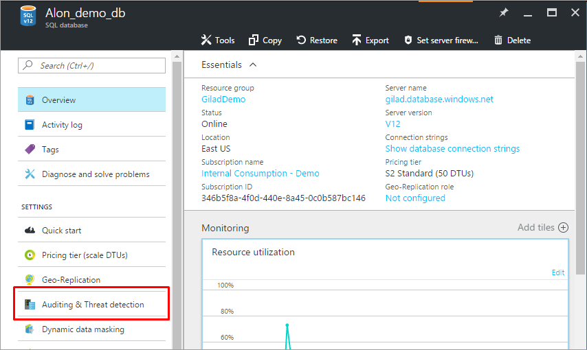

<properties
    pageTitle="Azure 门户预览：管理 SQL 数据库审核 | Azure"
    description="在 Azure 门户预览中配置 Azure SQL 数据库审核，以跟踪数据库事件并将其写入 Azure 存储帐户中的审核日志。"
    services="sql-database"
    documentationcenter=""
    author="ronitr"
    manager="jhubbard"
    editor="giladm" />
<tags
    ms.assetid="89c2a155-c2fb-4b67-bc19-9b4e03c6d3bc"
    ms.service="sql-database"
    ms.custom="secure and protect"
    ms.workload="data-management"
    ms.tgt_pltfrm="na"
    ms.devlang="na"
    ms.topic="article"
    ms.date="10/05/2016"
    wacn.date="03/24/2017"
    ms.author="ronitr; giladm" />  

# 在 Azure 门户预览中配置和管理 SQL 数据库审核

以下部分介绍如何使用 Azure 门户预览配置和管理审核。若要使用 PowerShell 配置和管理审核，请参阅[使用 PowerShell 配置审核](/documentation/articles/sql-database-auditing-powershell/)。若要使用 REST API 配置和管理审核，请参阅[使用 REST API 配置审核](/documentation/articles/sql-database-auditing-rest/)。

有关审核的概述，请参阅 [SQL 数据库审核](/documentation/articles/sql-database-auditing/)。

## 配置 Blob 审核

1. 启动 [Azure 门户预览](https://portal.azure.cn)。
2. 导航到要审核的 SQL 数据库/SQL Server 的“设置”边栏选项卡。在“设置”边栏选项卡中，选择“审核和威胁检测”。

      

3. 在“数据库审核配置”边栏选项卡中，可以选中“从服务器继承设置”复选框，指定根据数据库服务器的设置对数据库进行审核。如果选中此选项，将会看到“查看服务器审核设置”链接，可以使用该链接在此上下文中查看或修改服务器审核设置。

    ![导航窗格][2]  

4. 若要在数据库级别启用 Blob 审核（结合服务器级审核，或者取代服务器级审核），请取消选中“从服务器继承审核设置”选项，将审核设置为“打开”，然后选择“Blob”审核类型。

    ![导航窗格][3]  

5. 选择“存储详细信息”打开“审核日志存储”边栏选项卡。选择日志要保存到的 Azure 存储帐户以及保留期（超过此期限的旧日志将会删除），然后单击底部的“确定”。**提示：**为所有审核的数据库使用相同的存储帐户，以便充分利用审核报告模板。

     
    ![导航窗格][4]
6. 若要自定义已审核的事件，可通过 [PowerShell](/documentation/articles/sql-database-auditing-powershell/) 或 [REST API](/documentation/articles/sql-database-auditing-rest/) 执行此操作。
7. 单击“保存”。

## 表审核

> [AZURE.IMPORTANT]
>在设置“表审核”之前，请检查使用的是否为“下层客户端”。此外，如果有严格的防火墙设置，请注意，在启用表审核时[会更改数据库的 IP 终结点](/documentation/articles/sql-database-auditing-and-dynamic-data-masking-downlevel-clients/)。
>

1. 启动 [Azure 门户预览](https://portal.azure.cn) 。
2. 导航到要审核的 SQL 数据库/SQL Server 的“设置”边栏选项卡。在“设置”边栏选项卡中，选择“审核和威胁检测”（*[请参阅“Blob 审核”部分中的屏幕截图](#auditing-screenshot)*）。
3. 在数据库审核配置边栏选项卡中，可以选中“从服务器继承设置”复选框，指定根据数据库服务器的设置对数据库进行审核。如果选中此选项，将会看到“查看服务器审核设置”链接，可以使用该链接在此上下文中查看或修改服务器审核设置。

    ![导航窗格][2]  

4. 如果不想要从服务器继承审核设置，请**取消选中**“从服务器继承审核设置”选项、将审核设置为“打开”，然后选择“表”审核类型。

    ![导航窗格][3-tbl]  

5. 选择“存储详细信息”打开“审核日志存储”边栏选项卡。选择日志要保存到的 Azure 存储帐户以及保留期（超过此期限的旧日志将会删除）。**提示：**为所有审核的数据库使用相同的存储帐户，以便充分利用审核报告模板（*[请参阅“Blob 审核”部分中的屏幕截图](#storage-screenshot)*）。
6. 单击“审核事件”自定义要审核的事件。在“按事件记录日志”边栏选项卡中，单击“成功”和“失败”记录所有事件，或选择单个事件类别。

    ![导航窗格][5]  

7. 配置审核设置后，可以打开新的威胁检测（预览版）功能，并配置电子邮件用于接收安全警报。使用威胁检测可以接收针对异常数据库活动（可能表示潜在安全威胁）发出的主动警报。有关更多详细信息，请参阅[威胁检测](/documentation/articles/sql-database-threat-detection/)。
8. 单击“保存”。

## 审核异地复制的数据库

使用异地复制的数据库时，可以根据审核类型，针对主数据库和/或辅助数据库设置审核。

**表审核：**可以在数据库或服务器级别为两个数据库（主数据库和辅助数据库）中的每一个配置不同的策略。

**Blob 审核：**请遵循以下说明：

1. **主数据库：**在服务器或数据库本身上打开 Blob 审核。
2. **辅助数据库**：可以通过主数据库审核设置打开/关闭 Blob 审核。

   * 在主数据库上打开 Blob 审核。必须在*主数据库本身*上启用 Blob 审核，而不要在服务器上启用。
   * 在主数据库上启用 Blob 审核后，也会在辅助数据库上启用它。

    > [AZURE.IMPORTANT]
    >默认情况下，辅助数据库的存储设置与主数据库相同，因而会导致生成跨区域流量。在辅助服务器上启用 Blob 审核并在辅助服务器存储设置中配置本地存储可以避免此问题（这会覆盖辅助数据库的存储位置，导致每个数据库将审核日志保存到本地存储中）。

## 查看 Blob 审核日志

Blob 审核日志以 Blob 文件集合的形式保存在名为“**sqldbauditlogs**”的容器中。

有关 Blob 审核日志存储文件夹层次结构、Blob 命名约定和日志格式的更多详细信息，请参阅 [Blob 审核日志格式参考（文档文件下载）](https://go.microsoft.com/fwlink/?linkid=829599)。

可通过多种方法查看 Blob 审核日志：

* 通过 [Azure 门户预览](https://portal.azure.cn) - 打开相关的数据库。在数据库的“审核和威胁检测”边栏选项卡顶部，单击“查看审核日志”。

    ![导航窗格][10]  

    此时将打开“审核记录”边栏选项卡，可在其中查看日志。

    - 可以通过单击“审核记录”边栏选项卡顶部区域中的“筛选”，选择查看特定的日期
    - 可以在服务器策略审核或数据库策略审核创建的审核记录之间切换

    ![导航窗格][11]  

* 通过门户或使用 [Azure 存储资源管理器](http://storageexplorer.com/)等工具从 Azure 存储 Blob 容器下载日志文件。

    在本地下载日志文件后，可以双击该文件将它打开，然后在 SSMS 中查看和分析日志。

* 其他方法：

   * 可以通过 Azure 存储资源管理器同时下载多个文件 - 右键单击特定的子文件夹（包含特定日期生成的所有日志文件的子文件夹），然后选择“另存为”，将文件保存到本地文件夹中。

       下载多个文件后（或者一整天的日志文件，如上所述），可按如下所示在本地合并它们：

       **依次打开“SSMS”->“文件”->“打开”->“合并扩展事件”-> 选择要合并的所有文件**
   * 以编程方式：

     * [扩展事件读取器 C# 库](https://blogs.msdn.microsoft.com/extended_events/2011/07/20/introducing-the-extended-events-reader/)
     * [使用 PowerShell 查询扩展事件文件](https://sqlscope.wordpress.com/2014/11/15/reading-extended-event-files-using-client-side-tools-only/)

   * 我们已创建一个[示例应用程序](https://github.com/Microsoft/Azure-SQL-DB-auditing-OMS-integration)，它在 Azure 中运行，并利用 OMS 公共 API 将 SQL 审核日志推送到 OMS，以通过 OMS 仪表板使用。

## 查看表审核日志

表审核日志以 Azure 存储表集合的形式保存，具有 **SQLDBAuditLogs** 前缀。

有关表审核日志格式的更多详细信息，请参阅[表审核日志格式参考（文档文件下载）](http://go.microsoft.com/fwlink/?LinkId=506733)。

可通过多种方法查看表审核日志：

* 通过 [Azure 门户预览](https://portal.azure.cn) - 打开相关的数据库。在数据库的“审核和威胁检测”边栏选项卡顶部，单击“查看审核日志”。

    ![导航窗格][10]  

    此时将打开“审核记录”边栏选项卡，可在其中查看日志。

    * 可以通过单击“审核记录”边栏选项卡顶部区域中的“筛选”，选择查看特定的日期
    * 可以通过单击“审核记录”边栏选项卡顶部区域中的“在 Excel 中打开”，下载并查看 Excel 格式的审核日志

    ![导航窗格][12]

* 或者，可以借助以[可下载 Excel 电子表格](http://go.microsoft.com/fwlink/?LinkId=403540)形式提供的预配置报告模板来快速分析日志数据。若要对审核日志使用模板，需要安装 Excel 2013 或更高版本以及 [Power Query(http://www.microsoft.com/download/details.aspx?id=39379)。

* 还可以使用 Power Query 将审核日志从 Azure 存储帐户直接导入 Excel 模板。然后可以浏览审核记录，并在日志数据顶部创建仪表板和报表。

    ![导航窗格][9]  

## 重新生成存储密钥
在生产环境中，可能会定期刷新存储密钥。刷新密钥时，需要重新保存审核策略。过程如下：

1. 在“存储详细信息”边栏选项卡中，将“存储访问密钥”从“主要”切换为“辅助”，然后单击底部的“确定”。然后，单击审核配置边栏选项卡顶部的“保存”。

    ![导航窗格][6]  

2. 转到“存储配置”边栏选项卡，然后**重新生成***主访问密钥*。

    ![导航窗格][8]  

3. 返回“审核配置”边栏选项卡，将“存储访问密钥”从“辅助”切换为“主要”，然后单击底部的“确定”。然后单击审核配置边栏选项卡顶部的“保存”。
4. 返回“存储配置”边栏选项卡并**重新生成***辅助访问密钥*（为下一个密钥刷新周期做好准备）。

<!--Anchors-->

[Azure SQL Database Auditing overview]: #subheading-1
[Set up auditing for your database]: #subheading-2
[Analyze audit logs and reports]: #subheading-3
[Practices for usage in production]: #subheading-5
[Storage Key Regeneration]: #subheading-6
[Automation (PowerShell / REST API)]: #subheading-7
[Blob/Table differences in Server auditing policy inheritance]: (#subheading-8)

<!--Image references-->
[1]: ./media/sql-database-auditing-get-started/1_auditing_get_started_settings.png
[2]: ./media/sql-database-auditing-get-started/2_auditing_get_started_server_inherit.png
[3]: ./media/sql-database-auditing-get-started/3_auditing_get_started_turn_on.png
[3-tbl]: ./media/sql-database-auditing-get-started/3_auditing_get_started_turn_on_table.png
[4]: ./media/sql-database-auditing-get-started/4_auditing_get_started_storage_details.png
[5]: ./media/sql-database-auditing-get-started/5_auditing_get_started_audited_events.png
[6]: ./media/sql-database-auditing-get-started/6_auditing_get_started_storage_key_regeneration.png
[7]: ./media/sql-database-auditing-get-started/7_auditing_get_started_activity_log.png
[8]: ./media/sql-database-auditing-get-started/8_auditing_get_started_regenerate_key.png
[9]: ./media/sql-database-auditing-get-started/9_auditing_get_started_report_template.png
[10]: ./media/sql-database-auditing-get-started/10_auditing_get_started_blob_view_audit_logs.png
[11]: ./media/sql-database-auditing-get-started/11_auditing_get_started_blob_audit_records.png
[12]: ./media/sql-database-auditing-get-started/12_auditing_get_started_table_audit_records.png

## 后续步骤

* 若要使用 PowerShell 配置和管理审核，请参阅[使用 PowerShell 配置数据库审核](/documentation/articles/sql-database-auditing-powershell/)。
* 若要使用 REST API 配置和管理审核，请参阅[使用 REST API 配置数据库审核](/documentation/articles/sql-database-auditing-rest/)。
* 有关审核的概述，请参阅[数据库审核](/documentation/articles/sql-database-auditing/)。

<!---HONumber=Mooncake_0320_2017-->