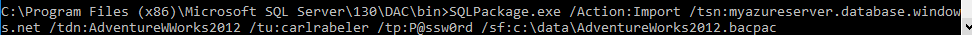

<properties
    pageTitle="使用 SqlPackage 从 BACPAC 文件导入到 SQL 数据库"
    description="Azure SQL 数据库, 数据库迁移, 导入数据库, 导入 BACPAC 文件, sqlpackage"
    services="sql-database"
    documentationcenter=""
    author="CarlRabeler"
    manager="jhubbard"
    editor="" />
<tags
    ms.assetid="424afa27-5f13-4ec3-98f6-99a511a6a2df"
    ms.service="sql-database"
    ms.devlang="NA"
    ms.topic="article"
    ms.tgt_pltfrm="NA"
    ms.workload="sqldb-migrate"
    ms.date="11/08/2016"
    wacn.date="12/19/2016"
ms.author="carlrab" />

# 使用 SqlPackage 从 BACPAC 文件导入到 SQL 数据库

> [AZURE.SELECTOR]
- [SSMS](/documentation/articles/sql-database-cloud-migrate-compatible-import-bacpac-ssms/)
- [SqlPackage](/documentation/articles/sql-database-cloud-migrate-compatible-import-bacpac-sqlpackage/)
- [Azure 门户预览](/documentation/articles/sql-database-import/)
- [PowerShell](/documentation/articles/sql-database-import-powershell/)

本文说明如何使用 [SqlPackage](https://msdn.microsoft.com/zh-cn/library/hh550080.aspx) 命令行实用程序从 [BACPAC](https://msdn.microsoft.com/zh-cn/library/ee210546.aspx#Anchor_4) 文件导入到 SQL 数据库。此实用程序随 [SQL Server Management Studio](https://msdn.microsoft.com/zh-cn/library/mt238290.aspx) 和[用于 Visual Studio 的 SQL Server Data Tools](https://msdn.microsoft.com/zh-cn/library/mt204009.aspx) 的最新版本提供，也可直接从 Microsoft 下载中心下载 [SqlPackage](https://www.microsoft.com/zh-cn/download/details.aspx?id=53876) 的最新版本。

> [AZURE.NOTE] 以下步骤假定用户已预配 SQL 数据库服务器，手头有连接信息，并且已验证源数据库兼容。

## 使用 SqlPackage 从 BACPAC 文件导入到 Azure SQL 数据库

使用以下步骤通过 [SqlPackage.exe](https://msdn.microsoft.com/zh-cn/library/hh550080.aspx) 命令行实用程序从 BACPAC 文件导入兼容的 SQL Server 数据库（或 Azure SQL 数据库）。

> [AZURE.NOTE] 以下步骤假定用户已预配 Azure SQL 数据库服务器并且手头有连接信息。

1. 打开命令提示符并更改包含 sqlpackage.exe 命令行实用程序的目录 - 此实用程序随 Visual Studio 和 SQL Server 一起提供。
2. 结合环境的以下参数执行以下 sqlpackage.exe 命令：

	`sqlpackage.exe /Action:Import /tsn:< server_name > /tdn:< database_name > /tu:< user_name > /tp:< password > /sf:< source_file >`  

	| 参数 | 说明 |
	|---|---|
	| < server_name > | 目标服务器名称 |
	| < database_name > | 目标数据库名称 |
	| < user_name > | 目标服务器中的用户名 |
	| < password > | 用户的密码 |
	| < source_file > | 要导入的 BACPAC 文件的文件名和位置 |

	  

## 后续步骤
- [最新版本的 SSDT](https://msdn.microsoft.com/zh-cn/library/mt204009.aspx)
- [最新版本的 SQL Server Management Studio](https://msdn.microsoft.com/zh-cn/library/mt238290.aspx)

## 其他资源
- [SQL 数据库 V12](/documentation/articles/sql-database-v12-whats-new/)
- [Transact-SQL 部分支持或不支持的函数](/documentation/articles/sql-database-transact-sql-information/)
- [使用 SQL Server 迁移助手迁移非 SQL Server 数据库](http://blogs.msdn.com/b/ssma/)

<!---HONumber=Mooncake_1212_2016-->