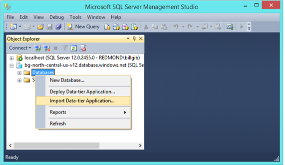
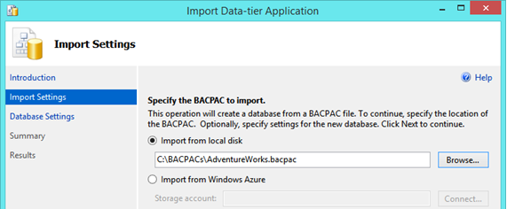

<properties
    pageTitle="将 SQL Server 数据库迁移到 Azure SQL 数据库 | Azure"
    description="Azure SQL 数据库, 数据库部署, 数据库迁移, 导入数据库, 导出数据库, 迁移向导"
    services="sql-database"
    documentationcenter=""
    author="CarlRabeler"
    manager="jhubbard"
    editor="" />
<tags
    ms.assetid="24375fc6-c94c-43ef-97ec-fce77343b581"
    ms.service="sql-database"
    ms.devlang="NA"
    ms.topic="article"
    ms.tgt_pltfrm="NA"
    ms.workload="sqldb-migrate"
    ms.date="11/08/2016"
    wacn.date="12/19/2016"
ms.author="carlrab" />

# 使用 SSMS 从 BACPAC 导入到 SQL 数据库

> [AZURE.SELECTOR]
- [SSMS](/documentation/articles/sql-database-cloud-migrate-compatible-import-bacpac-ssms/)
- [SqlPackage](/documentation/articles/sql-database-cloud-migrate-compatible-import-bacpac-sqlpackage/)
- [Azure 门户预览](/documentation/articles/sql-database-import/)
- [PowerShell](/documentation/articles/sql-database-import-powershell/)

本文说明如何使用 SQL Server Management Studio 中的“导出数据层应用程序”向导从 [BACPAC](https://msdn.microsoft.com/zh-cn/library/ee210546.aspx#Anchor_4) 文件导入到 SQL 数据库。

> [AZURE.NOTE] 以下步骤假定用户已预配 Azure SQL 逻辑实例并且手头有连接信息。

1. 确认你安装了最新版本的 SQL Server Management Studio。Management Studio 的新版本将每月更新一次，以与 Azure 门户的更新保持同步。

	 > [AZURE.IMPORTANT] 建议始终使用最新版本的 Management Studio 以与 Azure 和 SQL 数据库的更新保持同步。[更新 SQL Server Management Studio](https://msdn.microsoft.com/zh-cn/library/mt238290.aspx)。

2. 连接到 Azure SQL 数据库服务器、右键单击“数据库”文件夹，然后单击“导入数据层应用程序...”
   
    

3.	若要在 Azure SQL 数据库中创建数据库，请从本地磁盘导入 BACPAC 文件，或选择已将 BACPAC 文件上传到其中的 Azure 存储帐户和容器。

    

	 > [AZURE.IMPORTANT] 从 Azure Blob 存储导入 BACPAC 时，请使用标准存储。不支持从高级存储导入 BACPAC。

4.	为 Azure SQL 数据库中的数据库提供**新数据库名称**，设置 **Azure SQL 数据库的版本**（服务层）、**最大数据库大小**和**服务目标**（性能级别）。

    

5.	单击“下一步”，然后单击“完成”以将该 BACPAC 文件导入 Azure SQL 数据库服务器中的新数据库。

6. 使用对象资源管理器，连接到 Azure SQL 数据库服务器中的已迁移数据库。
7. 使用 Azure 门户预览，查看数据库及其属性。

## 后续步骤

- [最新版本的 SSDT](https://msdn.microsoft.com/zh-cn/library/mt204009.aspx)
- [最新版本的 SQL Server Management Studio](https://msdn.microsoft.com/zh-cn/library/mt238290.aspx)

## 其他资源

- [SQL 数据库 V12](/documentation/articles/sql-database-v12-whats-new/)
- [Transact-SQL 部分支持或不支持的函数](/documentation/articles/sql-database-transact-sql-information/)
- [使用 SQL Server 迁移助手迁移非 SQL Server 数据库](http://blogs.msdn.com/b/ssma/)

<!---HONumber=Mooncake_1212_2016-->