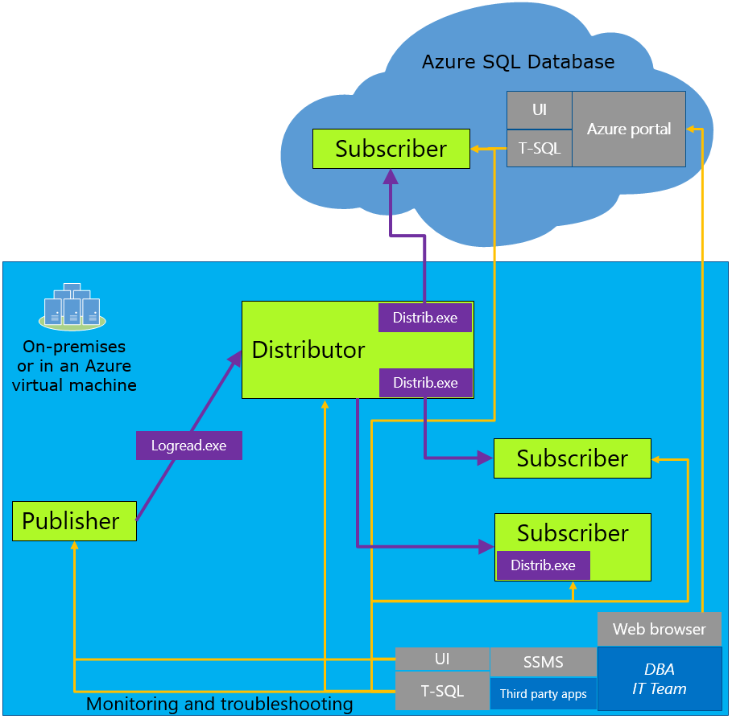

<properties
   pageTitle="使用事务复制迁移到 SQL 数据库"
   description="Azure SQL 数据库，数据库迁移，导入数据库，事务复制"
   services="sql-database"
   documentationCenter=""
   authors="CarlRabeler"
   manager="jhubbard"
   editor=""/>

<tags
   ms.service="sql-database"
   ms.devlang="NA"
   ms.topic="article"
   ms.tgt_pltfrm="NA"
   ms.workload="sqldb-migrate"
   ms.date="08/23/2016"
   wacn.date="10/17/2016"
   ms.author="carlrab"/>  

# 使用事务复制将 SQL Server 数据库迁移到 Azure SQL 数据库

> [AZURE.SELECTOR]
- [SSMS 迁移向导](/documentation/articles/sql-database-cloud-migrate-compatible-using-ssms-migration-wizard/)
- [导出到 BACPAC 文件](/documentation/articles/sql-database-cloud-migrate-compatible-export-bacpac-ssms/)
- [从 BACPAC 文件导入](/documentation/articles/sql-database-cloud-migrate-compatible-import-bacpac-ssms/)
- [事务复制](/documentation/articles/sql-database-cloud-migrate-compatible-using-transactional-replication/)

在本文中，你将了解如何使用 SQL Server 事务复制以最短的停机时间将兼容的 SQL Server 数据库迁移到 Azure SQL 数据库。

## 了解事务复制的体系结构

如果在发生迁移时你无法承受从生产中删除 SQL Server 数据库的后果，可以使用 SQL Server 事务复制作为你的迁移解决方案。若要使用此解决方案，请将 Azure SQL 数据库配置为你想要迁移的本地 SQL Server 实例的订阅服务器。在新的事务不断发生时，本地事务复制分发器将对要同步的本地数据库（发布服务器）中的数据进行同步。

还可以使用事务复制来迁移本地数据库的子集。复制到 Azure SQL 数据库的发布可以限制为复制的数据库中表的子集。对于所复制的每一个表，可以将数据限制为行的子集和/或列的子集。

使用事务复制时，对数据或架构所做的所有更改都会显示在 Azure SQL 数据库中。同步完成后，如果已准备好进行迁移，则可更改应用程序的连接字符串，使其指向 Azure SQL 数据库。一旦事务复制清空保留在本地数据库中的任何更改，并且所有应用程序都指向 Azure DB，即可卸载事务复制。Azure SQL 数据库现在是用户的生产系统。

   

## 事务复制要求

事务复制是一种内置技术，与 SQL Server 6.5 和更高版本的 SQL Server 集成。它是成熟且经过证实的技术，大多数 DBA 运用现有的经验就能操作。现在，可以使用 [SQL Server 2016](https://www.microsoft.com/en-us/cloud-platform/sql-server) 将 Azure SQL 数据库配置为本地发布的[事务复制订阅者](https://msdn.microsoft.com/zh-cn/library/mt589530.aspx)。从 Management Studio 设置的体验与在本地服务器上设置事务复制订阅者相同。当发布服务器和分发服务器至少是以下 SQL Server 版本之一时，支持此方案：

 - SQL Server 2016 和更高版本
 - SQL Server 2014 SP1 CU3 和更高版本
 - SQL Server 2014 RTM CU10 和更高版本
 - SQL Server 2012 SP2 CU8 和更高版本
 - SQL Server 2012 SP3 和更高版本

> [AZURE.IMPORTANT] 使用最新版本的 SQL Server Management Studio，保持与 Azure 和 SQL 数据库的更新同步。较旧版本的 SQL Server Management Studio 不能将 SQL 数据库设置为订阅服务器。[更新 SQL Server Management Studio](https://msdn.microsoft.com/zh-cn/library/mt238290.aspx)。

## 后续步骤

- [最新版本的 SQL Server Management Studio](https://msdn.microsoft.com/zh-cn/library/mt238290.aspx)
- [最新版本的 SSDT](https://msdn.microsoft.com/zh-cn/library/mt204009.aspx)
- [SQL Server 2016](https://www.microsoft.com/zh-CN/cloud-platform/sql-server)

## 其他资源

- [事务复制](https://msdn.microsoft.com/zh-cn/library/mt589530.aspx)
- [SQL 数据库 V12](/documentation/articles/sql-database-v12-whats-new/)
- [Transact-SQL 部分支持或不支持的函数](/documentation/articles/sql-database-transact-sql-information/)
- [使用 SQL Server 迁移助手迁移非 SQL Server 数据库](http://blogs.msdn.com/b/ssma/)

<!---HONumber=Mooncake_1010_2016-->