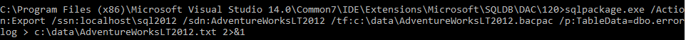
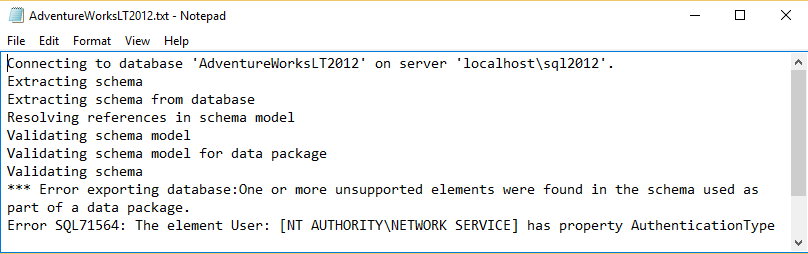

<properties
   pageTitle="使用 SqlPackage.exe 确定 SQL 数据库兼容性"
   description="Azure SQL 数据库, 数据库迁移, SQL 数据库兼容性, SqlPackage"
   services="sql-database"
   documentationCenter=""
   authors="CarlRabeler"
   manager="jhubbard"
   editor=""/>

<tags
   ms.service="sql-database"
   ms.devlang="NA"
   ms.topic="article"
   ms.tgt_pltfrm="NA"
   ms.workload="sqldb-migrate"
   ms.date="08/24/2016"
   wacn.date="11/16/2016"
   ms.author="carlrab"/>  

# 使用 SqlPackage.exe 确定 SQL 数据库兼容性

> [AZURE.SELECTOR]
- [SSDT](/documentation/articles/sql-database-cloud-migrate-fix-compatibility-issues-ssdt/)
- [SqlPackage](/documentation/articles/sql-database-cloud-migrate-determine-compatibility-sqlpackage/)
- [SSMS](/documentation/articles/sql-database-cloud-migrate-determine-compatibility-ssms/)
- [升级顾问](http://www.microsoft.com/download/details.aspx?id=48119)
- [SAMW](/documentation/articles/sql-database-cloud-migrate-fix-compatibility-issues/)

在本文中，你将了解如何使用 [SqlPackage](https://msdn.microsoft.com/zh-cn/library/hh550080.aspx) 命令提示实用程序确定要迁移到 SQL 数据库的 SQL Server 数据库是否兼容。

## 使用 SqlPackage.exe

1. 打开命令提示符并更改包含 sqlpackage.exe 最新版本的目录。此实用程序随 Visual Studio 和 SQL Server 一起提供。下载[最新版本的 SQL Server Data Tools for Visual Studio](https://msdn.microsoft.com/zh-cn/library/mt204009.aspx) 以获取 SqlPackage 实用程序的最新版本。
2. 使用你的环境的以下参数运行以下 SqlPackage 命令：

	'sqlpackage.exe /Action:Export /ssn:< server_name > /sdn:< database_name > /tf:< target_file > /p:TableData=< schema_name.table_name > > < output_file > 2>&1'

	| 参数 | 说明 |
	|---|---|
	| < server_name > | 源服务器名称 |
	| < database_name > | 源数据库名称 |
	| < target_file > | BACPAC 文件的文件名和位置 |
	| < schema_name.table_name > | 其数据将输出到目标文件的表 |
	| < output_file > | 包含错误（如果有）的输出文件的文件名和位置 |

	使用 /P:TableName 参数的原因是：只需测试导出到 Azure SQL 数据库 V12 的数据库兼容性，不需测试从所有表导出数据。遗憾的是，sqlpackage.exe 的导出参数不支持提取零个表。需指定至少一个表，例如一个小型表。< output\_file > 将包含任何错误的报告。“> 2>&1”字符串将执行命令后生成的标准输出和标准错误传送到指定的输出文件。

	  

3. 打开输出文件并查看兼容性错误（如果有）。

	  

## 后续步骤

- [最新版本的 SSDT](https://msdn.microsoft.com/zh-cn/library/mt204009.aspx) 
[最新版本的 SQL Server Management Studio](https://msdn.microsoft.com/zh-cn/library/mt238290.aspx)
- [修复数据库迁移的兼容性问题](/documentation/articles/sql-database-cloud-migrate/#fix-database-migration-compatibility-issues)
- [将兼容的 SQL Server 数据库迁移到 SQL 数据库](/documentation/articles/sql-database-cloud-migrate/#migrate-a-compatible-sql-server-database-to-sql-database)

## 其他资源

- [SQL 数据库 V12](/documentation/articles/sql-database-v12-whats-new/)
- [Transact-SQL 部分支持或不支持的函数](/documentation/articles/sql-database-transact-sql-information/)
- [使用 SQL Server 迁移助手迁移非 SQL Server 数据库](http://blogs.msdn.com/b/ssma/)

<!---HONumber=Mooncake_1010_2016-->