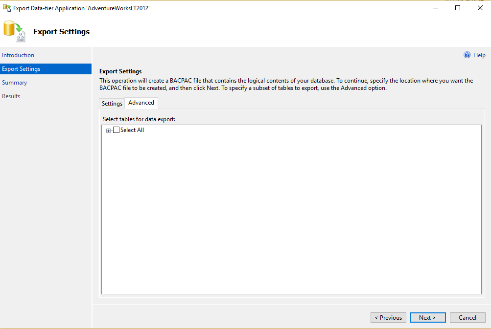
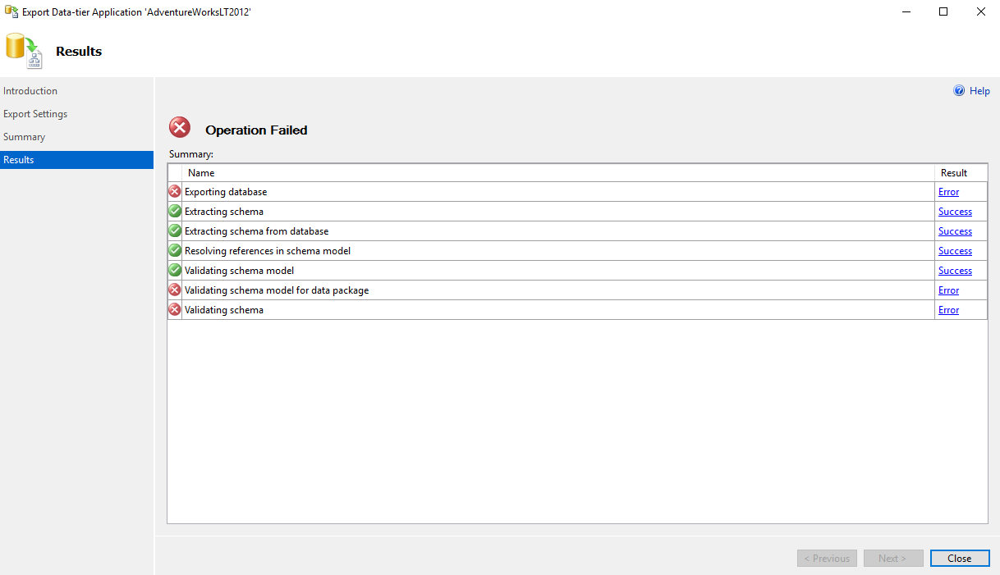
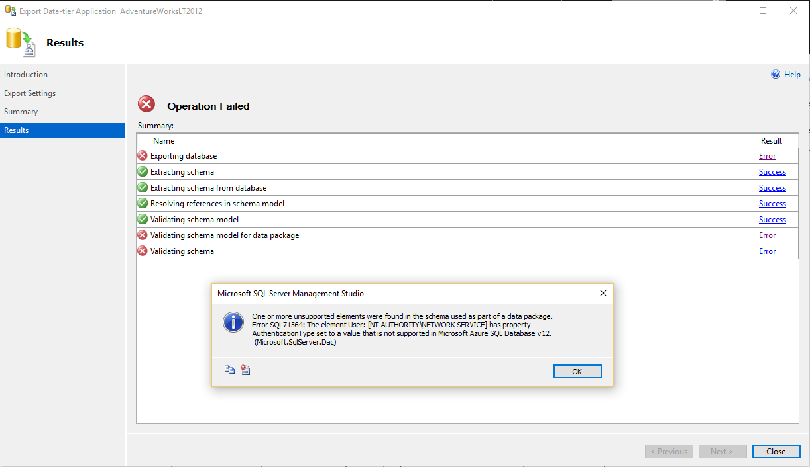

<properties
   pageTitle="在迁移到 Azure SQL 数据库之前，使用 SQL Server Management Studio 确定 SQL 数据库的兼容性 | Azure"
   description="Azure SQL 数据库, 数据库迁移, SQL 数据库兼容性, 导出数据层应用程序向导"
   services="sql-database"
   documentationCenter=""
   authors="CarlRabeler"
   manager="jhubbard"
   editor=""/>

<tags
   ms.service="sql-database"
   ms.devlang="NA"
   ms.topic="article"
   ms.tgt_pltfrm="NA"
   ms.workload="sqldb-migrate"
   ms.date="08/29/2016"
   wacn.date="10/17/2016"
   ms.author="carlrab"/>  

# 在迁移到 Azure SQL 数据库之前，使用 SQL Server Management Studio 确定 SQL 数据库的兼容性

> [AZURE.SELECTOR]
- [SSDT](/documentation/articles/sql-database-cloud-migrate-fix-compatibility-issues-ssdt/)
- [SqlPackage](/documentation/articles/sql-database-cloud-migrate-determine-compatibility-sqlpackage/)
- [SSMS](/documentation/articles/sql-database-cloud-migrate-determine-compatibility-ssms/)
- [升级顾问](http://www.microsoft.com/download/details.aspx?id=48119)
- [SAMW](/documentation/articles/sql-database-cloud-migrate-fix-compatibility-issues/)
 
在本文中，你将了解如何使用 SQL Server Management Studio 中的“导出数据层应用程序”向导确定要迁移到 SQL 数据库的 SQL Server 数据库是否兼容。

## 使用 SQL Server Management Studio

1. 确认你安装了最新版本的 SQL Server Management Studio。Management Studio 的新版本将每月更新一次，以与 Azure 门户的更新保持同步。

 	 > [AZURE.IMPORTANT] 建议始终使用最新版本的 Management Studio 以保持与 Azure 和 SQL 数据库的更新同步。[更新 SQL Server Management Studio](https://msdn.microsoft.com/zh-cn/library/mt238290.aspx)。

2. 打开 Management Studio 并连接到你在对象资源管理器中的源数据库。
3. 右键单击对象资源管理器中的源数据库，指向“任务”，然后单击“导出数据层应用程序...”

	

4. 在导出向导中，单击“下一步”，然后在“设置”选项卡上配置导出，以将 BACPAC 文件保存到本地磁盘位置或 Azure Blob。有在没有数据库兼容性问题时，将会保存 BACPAC 文件。如果有兼容性问题，这些问题将显示在控制台上。

	  

5. 若要跳过导出数据这一步，请单击“高级”选项卡并清除“全选”复选框。此时我们的目标仅是测试兼容性。

	

6. 单击“下一步”，然后单击“完成”。在向导验证架构后，将显示数据库兼容性问题（如果有）。

	  

7. 如果未显示任何错误，则数据库是兼容的，你已可以进行迁移。如果有错误，则需要修复它们。若要查看错误，请单击“验证架构”所对应的错误。
	

8.	如果 *.BACPAC 文件已成功生成，则数据库与 SQL 数据库兼容，并已准备好迁移。

## 后续步骤

- [最新版本的 SSDT](https://msdn.microsoft.com/zh-cn/library/mt204009.aspx)
- [最新版本的 SQL Server Management Studio](https://msdn.microsoft.com/zh-cn/library/mt238290.aspx)
- [修复数据库迁移的兼容性问题](/documentation/articles/sql-database-cloud-migrate/#fix-database-migration-compatibility-issues)
- [将兼容的 SQL Server 数据库迁移到 SQL 数据库](/documentation/articles/sql-database-cloud-migrate/#migrate-a-compatible-sql-server-database-to-sql-database)

## 其他资源

- [SQL 数据库 V12](/documentation/articles/sql-database-v12-whats-new/)
- [Transact-SQL 部分支持或不支持的函数](/documentation/articles/sql-database-transact-sql-information/)
- [使用 SQL Server 迁移助手迁移非 SQL Server 数据库](http://blogs.msdn.com/b/ssma/)

<!---HONumber=Mooncake_1010_2016-->