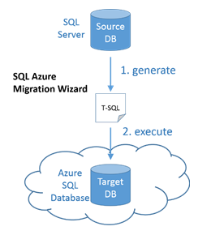

<properties
   pageTitle="迁移到 SQL 数据库之前，修复 SQL Server 数据库兼容性问题"
   description="Azure SQL 数据库, 数据库迁移, 兼容性, SQL Azure 迁移向导"
   services="sql-database"
   documentationCenter=""
   authors="CarlRabeler"
   manager="jhubbard"
   editor=""/>

<tags
   ms.service="sql-database"
   ms.devlang="NA"
   ms.topic="article"
   ms.tgt_pltfrm="NA"
   ms.workload="sqldb-migrate"
   ms.date="08/24/2016"
   wacn.date="12/12/2016"
   ms.author="carlrab"/>  

# 在迁移到 Azure SQL 数据库之前使用 SQL Azure 迁移向导解决 SQL Server 数据库兼容性问题

> [AZURE.SELECTOR]
- 使用 [SQL Azure 迁移向导](/documentation/articles/sql-database-cloud-migrate-fix-compatibility-issues/)
- 使用 [SSDT](/documentation/articles/sql-database-cloud-migrate-fix-compatibility-issues-ssdt/)
- 使用 [SSMS](/documentation/articles/sql-database-cloud-migrate-fix-compatibility-issues-ssms/)

本文介绍了在迁移到 Azure SQL 数据库之前如何使用 SQL Azure 迁移向导检测并解决 SQL Server 数据库的兼容性问题。

## 使用 SQL Azure 迁移向导

使用 [SQL Azure 迁移向导](http://sqlazuremw.codeplex.com/) CodePlex 工具，从不兼容的源数据库生成 T-SQL 脚本。然后，向导会对此脚本进行转换，使之与 SQL 数据库兼容。然后，用户即可连接到 Azure SQL 数据库执行该脚本。此工具还可分析跟踪文件，确定兼容性问题。生成的脚本可以只包含架构，也可以包含 BCP 格式的数据。其他文档（包括分步指南）可在 CodePlex 上的 [SQL Azure 迁移向导](http://sqlazuremw.codeplex.com/)中找到。

   

  > [AZURE.NOTE] 向导的内置转换并非能够修复它可检测到的所有不兼容的架构。无法解决的非兼容脚本将报告为错误，并会在生成的脚本中注入注释。如果检测到多个错误，请使用 Visual Studio 或 SQL Server Management Studio 来单步执行并修复无法使用 SQL Server 迁移向导修复的每个错误。

## 后续步骤

- [最新版本的 SSDT](https://msdn.microsoft.com/zh-cn/library/mt204009.aspx)
- [最新版本的 SQL Server Management Studio](https://msdn.microsoft.com/zh-cn/library/mt238290.aspx)
- [将兼容的 SQL Server 数据库迁移到 SQL 数据库](/documentation/articles/sql-database-cloud-migrate/#migrate-a-compatible-sql-server-database-to-sql-database)

## 其他资源

- [SQL 数据库 V12](/documentation/articles/sql-database-v12-whats-new/)
- [Transact-SQL 部分支持或不支持的函数](/documentation/articles/sql-database-transact-sql-information/)
- [使用 SQL Server 迁移助手迁移非 SQL Server 数据库](http://blogs.msdn.com/b/ssma/)

<!---HONumber=Mooncake_Quality_Review_1118_2016-->