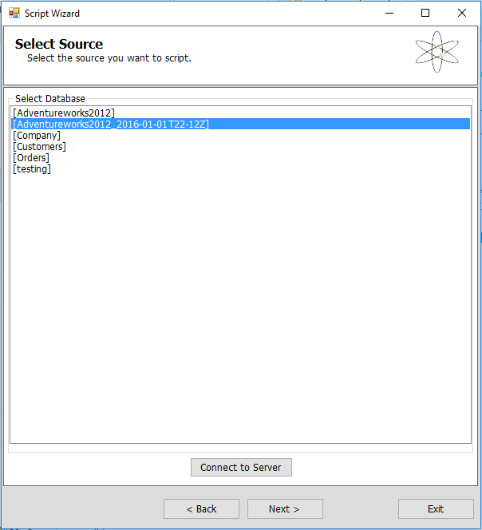

<properties
    pageTitle="从 Azure SQL 数据库备份中还原单个表 | Azure"
    description="了解如何从 Azure SQL 数据库备份中还原单个表。"
    services="sql-database"
    documentationcenter=""
    author="dalechen"
    manager="cshepard"
    editor="" />
<tags
    ms.assetid="340b41bd-9df8-47fb-adfc-03216de38a5e"
    ms.service="sql-database"
    ms.custom="migrate and move"
    ms.workload="data-management"
    ms.tgt_pltfrm="na"
    ms.devlang="na"
    ms.topic="article"
    ms.date="01/20/2017"
    wacn.date="03/24/2017"
    ms.author="daleche" />  

# 如何从 Azure SQL 数据库备份中还原单个表

你可能会遇到这种情况，不小心修改了 SQL 数据库中的某些数据，而现在你希望恢复单个受影响的表。本文介绍如何在数据库中从某个 SQL 数据库[自动备份](/documentation/articles/sql-database-automated-backups/)还原单个表。

## 准备步骤：重命名表，并还原数据库的一个副本
1. 确定 Azure SQL 数据库中你要替换为还原的副本的表。使用 Microsoft SQL Management Studio 重命名此表。例如，将此表重命名为 &lt;table name&gt;\_old。
   
    > [AZURE.NOTE]
    >为了避免受到阻止，请确保要重命名的表没有任何正在运行的活动。如果你遇到问题，请确保在维护时段内执行此过程。
    >
2. 使用[时间点还原](/documentation/articles/sql-database-recovery-using-backups/#point-in-time-restore)步骤，将数据库的一个备份还原到想要恢复到的一个时间点。

    > [AZURE.NOTE]
    >还原的数据库的名称的格式为 DBName+TimeStamp；例如，**Adventureworks2012\_2016-01-01T22-12Z**。此步骤不会覆盖服务器上现有的数据库名称。这是一项安全措施，目的是让用户在删除其当前数据库之前确认还原的数据库，然后重命名此还原的数据库供生产之用。
   
## 使用 SQL 数据库迁移工具从还原的数据库中复制表
1. 下载并安装 [SQL 数据库迁移向导](https://sqlazuremw.codeplex.com)。

2. 打开 SQL 数据库迁移向导，在“选择处理”页上选择“分析/迁移数据库”，然后单击“下一步”。

    
    
3. 在“连接到服务器”对话框中应用以下设置：

   * 服务器名称：**你的 SQL Server**
   * 身份验证：**SQL Server 身份验证**
   * 登录名：**你的登录名**
   * 密码：**你的密码**
   * 数据库：**Master DB（列出所有数据库）**
   
    > [AZURE.NOTE]
    >默认情况下，此向导保存你的登录信息。如果不想保存，请选择“忘记登录信息”。
    >
   
    
    
4. 在“选择源”对话框中，选择“准备步骤”部分中的还原的数据库名称作为你的源，然后单击“下一步”。

	
5. 在“选择对象”对话框中，选择“选择特定的数据库对象”选项，然后选择你想要迁移到目标服务器的表。

6. 在“脚本向导摘要”页面中，当询问你是否准备好生成 SQL 脚本时，单击“是”。你还可以选择保存此 TSQL 脚本供以后使用。

7. 在“结果摘要”页面上，单击“下一步”。

8. 在“设置目标服务器连接”页面上，单击“连接到服务器”，然后输入详细信息，如下所示：
	- **服务器名称**：目标服务器实例
	- **身份验证**：**SQL Server 身份验证**。输入你的登录凭据。
	- **数据库**：**Master 数据库（列出所有数据库）**。此选项可列出目标服务器上的所有数据库。

	

9. 单击“连接”，选择你要将此表移动到的目标数据库，然后单击“下一步”。将完成运行之前生成的脚本，你会看到复制到目标数据库的最近移动的表。

## 验证步骤

- 查询并测试最近复制的表，以确保数据完好无损。确认后，你可以删除“准备步骤”部分中的重命名表（例如 &lt;table name&gt;\_old）。

## 后续步骤

[SQL 数据库自动备份](/documentation/articles/sql-database-automated-backups/)

<!---HONumber=Mooncake_0320_2017-->
<!--Update_Description: remove restore retention table-->