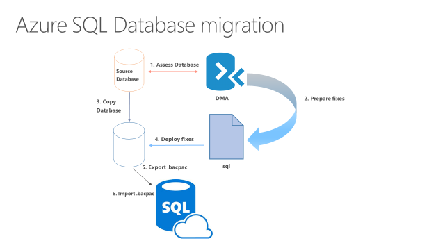

<properties
    pageTitle="将 SQL Server 数据库迁移到 Azure SQL 数据库 | Azure"
    description="了解如何将 SQL Server 数据库迁移到云中的 Azure SQL 数据库。执行数据库迁移之前，使用数据库迁移工具测试兼容性。"
    keywords="数据库迁移, SQL Server 数据库迁移, 数据库迁移工具, 迁移数据库, 迁移 SQL 数据库"
    services="sql-database"
    documentationcenter=""
    author="CarlRabeler"
    manager="jhubbard"
    editor="" />
<tags
    ms.assetid="9cf09000-87fc-4589-8543-a89175151bc2"
    ms.service="sql-database"
    ms.custom="migrate and move"
    ms.devlang="NA"
    ms.topic="article"
    ms.tgt_pltfrm="NA"
    ms.workload="sqldb-migrate"
    ms.date="02/08/2017"
    wacn.date="03/24/2017"
    ms.author="carlrab" />  

# 将 SQL Server 数据库迁移到云中的 SQL 数据库
本文介绍两种将 SQL Server 2005 或更高版本的数据库迁移到 Azure SQL 数据库的主要方法。第一种方法相对简单，但迁移过程中需要一段时间（可能较长）的停机。第二种方法更复杂，但在迁移过程中的停机时间大大缩短。

两种方法均需确保源数据库兼容 Azure SQL 数据库。使用 SQL 数据库 V12 时，除了要解决服务器级操作和跨数据库操作的相关问题之外，还要解决与 SQL Server 的[功能对等性](/documentation/articles/sql-database-features/)问题。依赖[部分支持或不受支持的函数](/documentation/articles/sql-database-transact-sql-information/)的数据库和应用程序需要进行某种程度的[重新设计来修复这些不兼容性](/documentation/articles/sql-database-cloud-migrate/#resolving-database-migration-compatibility-issues)，然后才能迁移 SQL Server 数据库。

> [AZURE.NOTE]
>若要将非 SQL Server 数据库（包括 Microsoft Access、Sybase、MySQL Oracle 和 DB2）迁移到 Azure SQL 数据库，请参阅 [SQL Server 迁移助手](https://blogs.msdn.microsoft.com/datamigration/2016/12/22/released-sql-server-migration-assistant-ssma-v7-2/)。
> 

## 方法 1：在迁移过程中需要停机的迁移

 如果可以承受一定的停机时间，或者正在针对以后的迁移执行生产数据库的测试迁移，请使用此方法。

以下列表包含使用此方法进行 SQL Server 数据库迁移的常规工作流。

    

1. 使用最新版 [Data Migration Assistant (DMA)](https://www.microsoft.com/download/details.aspx?id=53595) 评估数据库的兼容性。
2. 以 Transact-SQL 脚本形式准备任何所需的修补程序。
3. 对要迁移的源数据库进行事务一致性复制 - 确保不对源数据库进行进一步的更改（也可在迁移完成后手动应用任何此类更改）。有许多方法可以使数据库处于静默状态，例如禁用客户端连接以创建[数据库快照](https://msdn.microsoft.com/zh-cn/library/ms175876.aspx)。
4. 部署 Transact-SQL 脚本，将修补程序应用到数据库副本。
5. 将数据库副本[导出](/documentation/articles/sql-database-export-sqlpackage/)到本地驱动器上的 .BACPAC 文件。
6. 使用多个 BACPAC 导入工具中的任何一个（若要获得最佳性能，建议使用 SQLPackage.exe 工具），以新 Azure SQL 数据库的形式[导入](/documentation/articles/sql-database-import-sqlpackage/) .BACPAC 文件。

### 优化迁移过程中的数据传输性能 

以下列表包含的建议可帮助你在导入过程中获得最佳性能。

* 若要获得最高的传输性能，请在预算允许范围内选择最高的服务级别和性能层。为了节省资金，可以在迁移完成后缩减规模。请参阅[使用 Azure 门户预览更改单一数据库的服务层和性能级别](/documentation/articles/sql-database-manage-single-databases-portal/#change-the-service-tier-and-performance-level-of-a-single-database)、[使用 PowerShell 更改单一数据库的服务层和性能级别](/documentation/articles/sql-database-manage-single-databases-powershell/#change-the-service-tier-and-performance-level-of-a-single-database)、[使用 Transact-SQL 更改单一数据库的服务层和性能级别](/documentation/articles/sql-database-manage-single-databases-tsql/#change-the-service-tier-and-performance-level-of-a-single-database)
* 尽量缩短 .BACPAC 文件与目标数据中心之间的距离。
* 在迁移过程中禁用自动统计
* 将表和索引分区
* 删除已编制索引的视图，在完成后重新创建这些视图
* 将很少查询的历史数据转移到其他数据库，将这些历史数据迁移到单独的 Azure SQL 数据库。然后，可以使用[弹性查询](/documentation/articles/sql-database-elastic-query-overview/)来查询这些历史数据。

### 迁移完成后优化性能

在迁移完成后[更新统计信息](https://msdn.microsoft.com/zh-cn/library/ms187348.aspx)并执行完全扫描。

## 方法 2：使用事务复制

如果在发生迁移时你无法承受从生产中删除 SQL Server 数据库的后果，可以使用 SQL Server 事务复制作为你的迁移解决方案。若要使用此方法，源数据库必须满足[事务复制要求](https://msdn.microsoft.com/zh-cn/library/mt589530.aspx)且与 Azure SQL 数据库兼容。

若要使用此解决方案，请将 Azure SQL 数据库配置为要迁移的 SQL Server 实例的订阅服务器。在新的事务不断发生时，事务复制分发器将对要同步的数据库（发布服务器）中的数据进行同步。

使用事务复制时，对数据或架构所做的所有更改都会显示在 Azure SQL 数据库中。同步完成后，如果已准备好进行迁移，则可更改应用程序的连接字符串，使其指向 Azure SQL 数据库。一旦事务复制清空保留在源数据库中的任何更改，并且所有应用程序都指向 Azure DB，即可卸载事务复制。Azure SQL 数据库现在是用户的生产系统。

   

> [AZURE.TIP]
>还可以使用事务复制来迁移源数据库的子集。复制到 Azure SQL 数据库的发布可以限制为复制的数据库中表的子集。对于所复制的每一个表，可以将数据限制为行的子集和/或列的子集。
>

### 使用事务复制工作流迁移到 SQL 数据库

> [AZURE.IMPORTANT]
>使用最新版本的 SQL Server Management Studio 以与 Azure 和 SQL 数据库的更新保持同步。较旧版本的 SQL Server Management Studio 不能将 SQL 数据库设置为订阅服务器。[更新 SQL Server Management Studio](https://msdn.microsoft.com/zh-cn/library/mt238290.aspx)。
> 

1. 设置分发
   -  [使用 SQL Server Management Studio (SSMS)](https://msdn.microsoft.com/zh-cn/library/ms151192.aspx#Anchor_1)
   -  [使用 Transact-SQL](https://msdn.microsoft.com/zh-cn/library/ms151192.aspx#Anchor_2)
2. 创建发布
   -  [使用 SQL Server Management Studio (SSMS)](https://msdn.microsoft.com/zh-cn/library/ms151160.aspx#Anchor_1)
   -  [使用 Transact-SQL](https://msdn.microsoft.com/zh-cn/library/ms151160.aspx#Anchor_2)
3. 创建订阅
   -  [使用 SQL Server Management Studio (SSMS)](https://msdn.microsoft.com/zh-cn/library/ms152566.aspx#Anchor_0)
   -  [使用 Transact-SQL](https://msdn.microsoft.com/zh-cn/library/ms152566.aspx#Anchor_1)

### 有关迁移到 SQL 数据库的一些提示和差异

1. 使用本地分发服务器
   - 这会对服务器的性能造成影响。
   - 如果对性能的影响不可接受，可以使用另一台服务器，但这又会增大管理的复杂性。
2. 选择快照文件夹时，请确保选择的文件夹足够大，可以保存想要复制的每个表的 BCP。
3. 快照创建操作在完成之前会锁定关联的表，因此，请适当地计划好快照。
4. Azure SQL 数据库中仅支持推送订阅。只能从源数据库添加订阅服务器。

## 解决数据库迁移的兼容性问题
根据源数据库中的 SQL Server 版本以及正在迁移的数据库复杂性，可能会发现各种不同的不兼容性问题。旧版 SQL Server 的兼容性问题更多。除了使用所选搜索引擎的目标 Internet 搜索以外，还可以使用以下资源：

* [Azure SQL 数据库中不支持的 SQL Server 数据库功能](/documentation/articles/sql-database-transact-sql-information/)
* [SQL Server 2016 中已停用的数据库引擎功能](https://msdn.microsoft.com/zh-cn/library/ms144262%28v=sql.130%29)
* [SQL Server 2014 中已停用的数据库引擎功能](https://msdn.microsoft.com/zh-cn/library/ms144262%28v=sql.120%29)
* [SQL Server 2012 中已停用的数据库引擎功能](https://msdn.microsoft.com/zh-cn/library/ms144262%28v=sql.110%29)
* [SQL Server 2008 R2 中已停用的数据库引擎功能](https://msdn.microsoft.com/zh-cn/library/ms144262%28v=sql.105%29)
* [SQL Server 2005 中已停用的数据库引擎功能](https://msdn.microsoft.com/zh-cn/library/ms144262%28v=sql.90%29)

除了搜索 Internet 和使用这些资源，还可以使用 [MSDN SQL Server 社区论坛](https://social.msdn.microsoft.com/Forums/sqlserver/home?category=sqlserver)或 [StackOverflow](http://stackoverflow.com/)。

## 后续步骤
* 使用 Azure SQL EMEA 工程师博客中的脚本来[监视迁移过程中的 tempdb 使用情况](https://blogs.msdn.microsoft.com/azuresqlemea/2016/12/28/lesson-learned-10-monitoring-tempdb-usage/)。
* 使用 Azure SQL EMEA 工程师博客中的脚本来[监视发生迁移时数据库的事务日志空间](https://blogs.msdn.microsoft.com/azuresqlemea/2016/10/31/lesson-learned-7-monitoring-the-transaction-log-space-of-my-database/0)。
* 如需 SQL Server 客户顾问团队编写的有关使用 BACPAC 文件进行迁移的博客，请参阅 [使用 BACPAC 文件从 SQL Server 迁移到 Azure SQL 数据库](https://blogs.msdn.microsoft.com/sqlcat/2016/10/20/migrating-from-sql-server-to-azure-sql-database-using-bacpac-files/)。
* 若要了解如何在迁移后处理 UTC 时间，请参阅 [根据本地时区修改默认时区](https://blogs.msdn.microsoft.com/azuresqlemea/2016/07/27/lesson-learned-4-modifying-the-default-time-zone-for-your-local-time-zone/)。
* 若要了解如何在迁移后更改数据库的默认语言，请参阅 [如何更改 Azure SQL 数据库的默认语言](https://blogs.msdn.microsoft.com/azuresqlemea/2017/01/13/lesson-learned-16-how-to-change-the-default-language-of-azure-sql-database/)。

<!---HONumber=Mooncake_0320_2017-->
<!--Update_Description: maint content update, introduce two ways for cloud migration -->