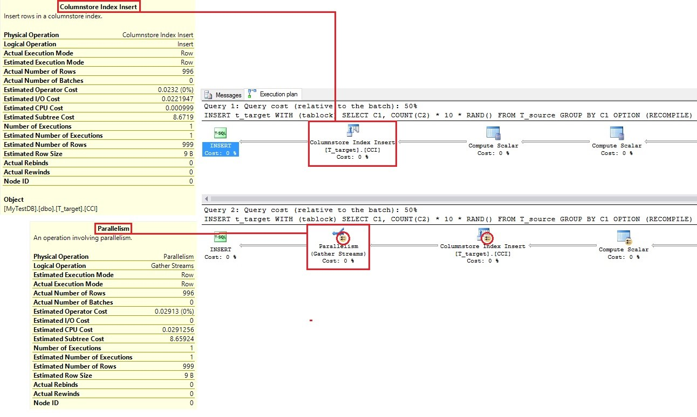
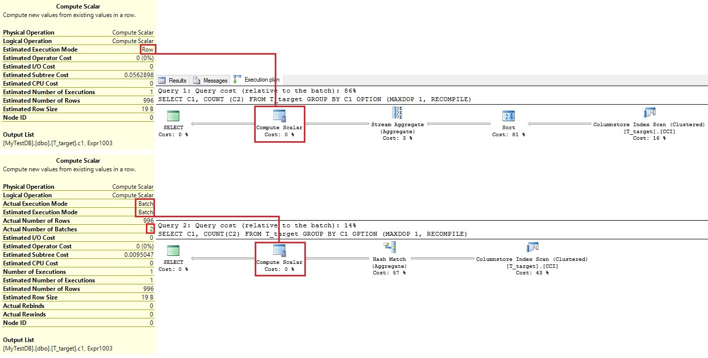
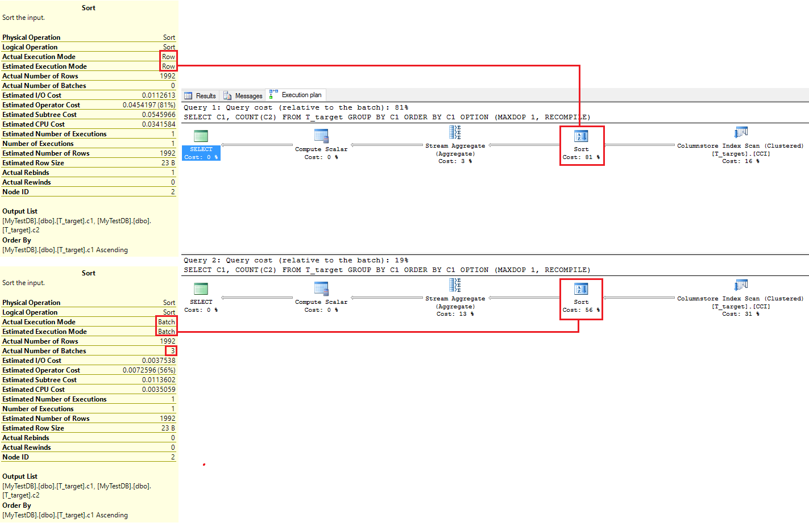
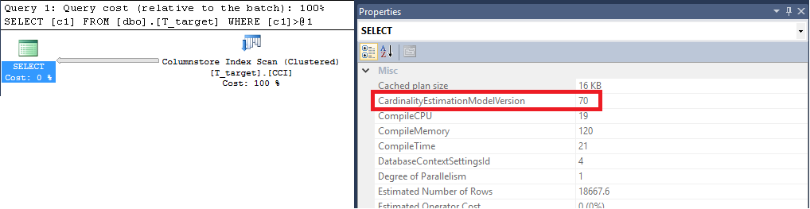
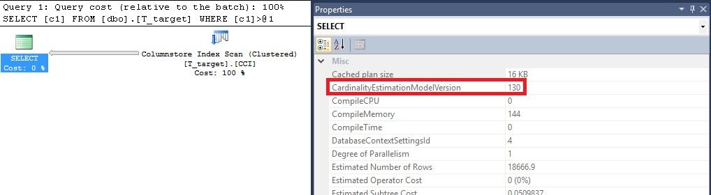
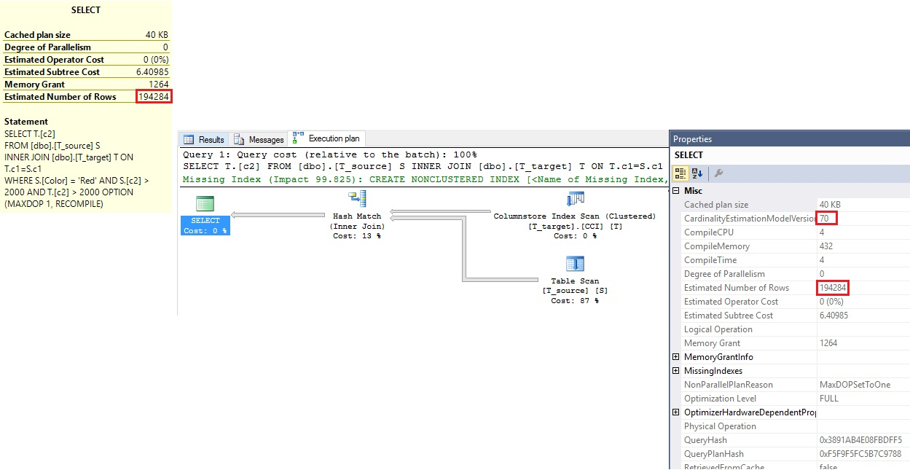

<properties
    pageTitle="数据库兼容级别 130 - Azure SQL 数据库 | Azure"
    description="在本文中，我们将探讨在兼容级别 130 运行 Azure SQL 数据库的优势，以及使用新查询优化器和查询处理器功能的优势。 另外，我们将解决对现有 SQL 应用程序的查询性能可能造成的负面影响。"
    services="sql-database"
    documentationcenter=""
    author="alainlissoir"
    manager="jhubbard"
    editor=""
    translationtype="Human Translation" />
<tags
    ms.assetid="8619f90b-7516-46dc-9885-98429add0053"
    ms.service="sql-database"
    ms.custom="monitor and tune"
    ms.workload="data-management"
    ms.devlang="NA"
    ms.tgt_pltfrm="NA"
    ms.topic="article"
    ms.date="03/03/2017"
    wacn.date="04/17/2017"
    ms.author="alainl"
    ms.sourcegitcommit="7cc8d7b9c616d399509cd9dbdd155b0e9a7987a8"
    ms.openlocfilehash="d19d6dfb743d1c4a7e38a807446a72d2d1c0418d"
    ms.lasthandoff="04/07/2017" />

# 已改善 Azure SQL 数据库中兼容级别 130 的查询性能
Azure SQL 数据库在许多不同的兼容级别上以透明方式运行数十万个数据库，对其所有客户保留并保证对应 Microsoft SQL Server 版本的向后兼容性！

在本文中，我们将探讨在兼容级别 130 运行 Azure SQL 数据库的优势，以及使用新查询优化器和查询处理器功能的优势。 另外，我们将解决对现有 SQL 应用程序的查询性能可能造成的负面影响。

下面列出了 SQL 版本与默认兼容级别的对照供参考：

* 100：在 SQL Server 2008 和 Azure SQL 数据库 V11 中。
* 110：在 SQL Server 2012 和 Azure SQL 数据库 V11 中。
* 120：在 SQL Server 2014 和 Azure SQL 数据库 V12 中。
* 130：在 SQL Server 2016 和 Azure SQL 数据库 V12 中。

> [AZURE.IMPORTANT]
> **新创建的**数据库的默认兼容级别为 130。
> 

## 关于兼容级别 130
首先，如果你想要知道数据库当前的兼容级别，请执行以下 Transact-SQL 语句。

    SELECT compatibility_level
        FROM sys.databases
        WHERE name = '<YOUR DATABASE_NAME>’;

在**新**创建的数据库更改为级别 130 之前，让我们通过一些基本的查询示例来查看此更改的相关信息，并了解相关人员如何从中受益。

关系数据库中的查询处理可能非常复杂，并且需要对计算机科学和数学有着深厚的了解才能理解固有的设计选项和行为。 本文档的内容已刻意简化，以确保具有一些最基本技术背景的人员可以了解兼容级别更改的影响，并确定其对于应用程序有何好处。

我们快速看一下兼容级别 130 对表带来的好处。  可以在 [ALTER DATABASE 兼容级别 (Transact-SQL)](https://msdn.microsoft.com/zh-cn/library/bb510680.aspx) 中找到更多详细信息，简短摘要如下：

* Insert-select 语句的 Insert 操作可以是多线程操作或包含并行计划，而此操作之前是单线程操作。
* 内存优化表和表变量查询现在可以包含并行计划，而此操作之前也是单线程操作。
* 内存优化表的统计信息现在可以采样并自动更新。 有关详细信息，请参阅[数据引擎的新增功能：内存中 OLTP](https://msdn.microsoft.com/zh-cn/library/bb510411.aspx#InMemory)。
* 列存储索引的批处理模式与行模式更改
  * 现在，将以批处理模式对包含列存储索引的表排序。
  * 开窗聚合现在以批处理模式运行，例如 T-SQL LAG/LEAD 语句。
  * 以批处理模式查询包含多个不同子句的列存储表。
  * 在 DOP = 1 下面运行的或具有串行计划的查询也以批处理模式运行。
* 最后，基数估算随着兼容级别 120 的出现得到了改进，但对于在较低的兼容级别（也就是 100 或 110）运行的基数估算，移动到兼容级别 130 也会带来这些改进，且这些改进也有益于应用程序的查询性能。

## 演练兼容级别 130
首先，我们要创建一些表、索引和随机数据，以演练某些新功能。 可以在 SQL Server 2016 下或在 Azure SQL 数据库下执行 T-SQL 脚本示例。 但是，在创建 Azure SQL 数据库时，请确保至少选择一个 P2 数据库，因为至少需要几个核心才能允许多线程，并因而受益于这些功能。

    -- Create a Premium P2 Database in Azure SQL Database

    CREATE DATABASE MyTestDB
        (EDITION=’Premium’, SERVICE_OBJECTIVE=’P2′);
    GO

    -- Create 2 tables with a column store index on
    -- the second one (only available on Premium databases)

    CREATE TABLE T_source
        (Color varchar(10), c1 bigint, c2 bigint);

    CREATE TABLE T_target
        (c1 bigint, c2 bigint);

    CREATE CLUSTERED COLUMNSTORE INDEX CCI ON T_target;
    GO

    -- Insert few rows.

    INSERT T_source VALUES
        (‘Blue’, RAND() * 100000, RAND() * 100000),
        (‘Yellow’, RAND() * 100000, RAND() * 100000),
        (‘Red’, RAND() * 100000, RAND() * 100000),
        (‘Green’, RAND() * 100000, RAND() * 100000),
        (‘Black’, RAND() * 100000, RAND() * 100000);

    GO 200

    INSERT T_source SELECT * FROM T_source;

    GO 10

我们现在来看一下兼容级别 130 附带的一些查询处理功能。

## 并行 INSERT
执行下面的 T-SQL 语句时将在兼容级别 120 和 130 下执行 INSERT 操作，即分别在单线程模型 (120) 和多线程模型 (130) 中执行 INSERT 操作。

    -- Parallel INSERT … SELECT … in heap or CCI
    -- is available under 130 only

    SET STATISTICS XML ON;

    ALTER DATABASE MyTestDB
        SET COMPATIBILITY_LEVEL = 120;
    GO 

    -- The INSERT part is in serial

    INSERT t_target WITH (tablock)
        SELECT C1, COUNT(C2) * 10 * RAND()
            FROM T_source
            GROUP BY C1
        OPTION (RECOMPILE);

    ALTER DATABASE MyTestDB
        SET COMPATIBILITY_LEVEL = 130
    GO

    -- The INSERT part is in parallel

    INSERT t_target WITH (tablock)
        SELECT C1, COUNT(C2) * 10 * RAND()
            FROM T_source
            GROUP BY C1
        OPTION (RECOMPILE);

    SET STATISTICS XML OFF;

通过请求实际查询计划、查看其图形表示法或其 XML 内容，即可确定正在运行哪个基数估算函数。 查看图 1 的并排计划，我们可以清楚地看到列存储 INSERT 操作从 120 中的串行执行变成 130 中的并行执行。 此外，请注意 130 计划中的迭代器图标更改显示两个并行箭头，这说明了迭代器现在的确是并行执行的事实。 如果有大量的 INSERT 操作要完成，并行执行（已链接到可对数据库支配的核心数目）的效果更佳；根据具体的情况，速度最高可快 100 倍！

*图 1：INSERT 操作从串行执行更改为兼容级别 130 中的并行执行。*

## SERIAL 批处理模式
同样地，在处理行时转到兼容级别 130 即可执行批处理模式处理。 首先，批处理模式操作仅适用于已准备好列存储索引时。 其次，一个批处理通常代表大约 900 行，并使用针对多核 CPU、较高内存吞吐量优化的代码逻辑，并且尽可能直接利用列存储的压缩数据。 在这些情况下，SQL Server 2016 一次可以处理大约 900 行，而不是一次处理 1 行，因此操作的整体开销现在是由整个批处理分担，从而降低各行的整体成本。 与列存储压缩结合的此共享操作数量基本上可减少 SELECT 批处理模式操作中的延迟。 可以在[列存储索引指南](https://msdn.microsoft.com/zh-cn/library/gg492088.aspx)中找到有关列存储和批处理模式的详细信息。

    -- Serial batch mode execution

    SET STATISTICS XML ON;

    ALTER DATABASE MyTestDB
        SET COMPATIBILITY_LEVEL = 120;
    GO

    -- The scan and aggregate are in row mode

    SELECT C1, COUNT (C2)
        FROM T_target
        GROUP BY C1
        OPTION (MAXDOP 1, RECOMPILE);
    GO

    ALTER DATABASE MyTestDB
        SET COMPATIBILITY_LEVEL = 130;
    GO 

    -- The scan and aggregate are in batch mode,
    -- and force MAXDOP to 1 to show that batch mode
    -- also now works in serial mode.

    SELECT C1, COUNT(C2)
        FROM T_target
        GROUP BY C1
        OPTION (MAXDOP 1, RECOMPILE);
    GO

    SET STATISTICS XML OFF;

观察图 2 的并排查询计划后，我们可以看到处理模式已随兼容级别更改，因此，同时在两个兼容级别中执行查询时，可以看到大多数的处理时间花费在行模式 (86%)（相比于已处理 2 个批处理的批处理模式 (14%)）上。 增加数据集会带来更多的优势。

*图 2：SELECT 操作从串行更改为兼容级别 130 中的批处理模式。*

## 排序执行的批处理模式
与前面的示例类似，但应用到排序操作后，从行模式（兼容级别 120）转换为批处理模式（兼容级别 130）可提升 SORT 操作的性能，其原因相同。

    -- Batch mode on sort execution

    SET STATISTICS XML ON;

    ALTER DATABASE MyTestDB
        SET COMPATIBILITY_LEVEL = 120;
    GO

    -- The scan and aggregate are in row mode

    SELECT C1, COUNT(C2)
        FROM T_target
        GROUP BY C1
        ORDER BY C1
        OPTION (MAXDOP 1, RECOMPILE);
    GO

    ALTER DATABASE MyTestDB
        SET COMPATIBILITY_LEVEL = 130;
    GO

    -- The scan and aggregate are in batch mode,
    -- and force MAXDOP to 1 to show that batch mode
    -- also now works in serial mode.

    SELECT C1, COUNT(C2)
        FROM T_target
        GROUP BY C1
        ORDER BY C1
        OPTION (MAXDOP 1, RECOMPILE);
    GO

    SET STATISTICS XML OFF;

如图 3 中的并排查询所示，我们可以看到行模式中的排序操作代表 81% 的开销，而批处理模式只代表 19% 的开销（排序本身分别占 81% 和 56%）。

*图 3：SORT 操作从行模式更改为兼容级别 130 中的批处理模式。*

显然，这些示例只包含成千上万行，考虑到如今大多数 SQL Server 中可用的数据，这算不上什么。 针对数百万行进行预估，即可在执行的数分钟内转换，免除了每天搁置工作负荷的本质。

## 基数估算 (CE) 改进
任何在兼容级别 120 或更高级别运行的数据库都将使用包含在 SQL Server 2014 中新的基数估算功能。 从根本上讲，基数估算是用于根据估算的成本来确定 SQL Server 将如何执行查询的逻辑。 此估算是使用于自与该查询所涉及对象关联的统计信息的输入来计算。 实际上，概括而言，基数估算函数是行计数估算值，以及以下各项的相关信息：值分布、非重复值计数，以及查询中引用的表和对象包含的重复计数。 如果这些估算值错误，则可能会因为授予的内存不足（即 TempDB 溢出）、选择串行计划执行（而非并行计划执行）等等而导致不必要的磁盘 I/O。 总而言之，不正确的估算值可能导致查询执行的整体性能降低。 另一方面，更完善的估算值、更精确的估算值会导致更好的查询执行！

如前所述，查询优化和评估是复杂的操作，如果想要详细了解查询计划和基数估算器，可以参考[使用 SQL Server 2014 基数估算器来优化查询计划](https://msdn.microsoft.com/zh-cn/library/dn673537.aspx)。

## 目前使用哪种基数估算？
若要确定查询是在哪个基数估算下运行的，请使用以下查询示例。 第一个示例在兼容级别 110 下运行，表示使用的是旧的基数估算函数。

    -- Old CE

    ALTER DATABASE MyTestDB
        SET COMPATIBILITY_LEVEL = 110;
    GO

    SET STATISTICS XML ON;

    SELECT [c1]
        FROM [dbo].[T_target]
        WHERE [c1] > 20000;
    GO

    SET STATISTICS XML OFF;

执行完成后，单击 XML 链接，并查看第一个迭代器的属性。 请注意，名为 CardinalityEstimationModelVersion 的属性名称当前设置为 70。 这并不意味数据库的兼容级别设置为 SQL Server 7.0 版（如前面的 T-SQL 语句所示，其设置于 110），但值 70 代表自 SQL Server 7.0 起可用的旧版基数估算功能，直到 SQL Server 2014（随附兼容级别 120）以后才有主要版本。

图 4：使用兼容级别 110 或更低级别时，CardinalityEstimationModelVersion 设置为 70。

或者，可以将兼容级别更改为 130，并使用设置为 ON 的 LEGACY_CARDINALITY_ESTIMATION 配合 [ALTER DATABASE SCOPED CONFIGURATION](https://msdn.microsoft.com/zh-cn/library/mt629158.aspx) 来停止使用新的基数估算函数。 从基数估算函数的观点来看，在使用最新的查询处理兼容级别时，这与使用 110 相同。 这样，你就可以受益于随附最新兼容级别的新查询处理功能（即批处理模式），但必要时仍依赖旧的基数估算功能。

    -- Old CE

    ALTER DATABASE MyTestDB
        SET COMPATIBILITY_LEVEL = 130;
    GO

    ALTER DATABASE
        SCOPED CONFIGURATION
        SET LEGACY_CARDINALITY_ESTIMATION = ON;
    GO

    SET STATISTICS XML ON;

    SELECT [c1]
        FROM [dbo].[T_target]
        WHERE [c1] > 20000;
    GO

    SET STATISTICS XML OFF;

更改兼容级别 120 或 130 可启用新的基数估算功能。 在这种情况下，默认的 CardinalityEstimationModelVersion 设置为 120 或 130。

    -- New CE

    ALTER DATABASE MyTestDB
        SET COMPATIBILITY_LEVEL = 130;
    GO

    ALTER DATABASE
        SCOPED CONFIGURATION
        SET LEGACY_CARDINALITY_ESTIMATION = OFF;
    GO

    SET STATISTICS XML ON;

    SELECT [c1]
        FROM [dbo].[T_target]
        WHERE [c1] > 20000;
    GO

    SET STATISTICS XML OFF;

*图 5：使用兼容级别 130 时，CardinalityEstimationModelVersion 设置为 130。*

## 体会基数估算的差异
现在，让我们运行稍微复杂的查询（涉及到包含一个 WHERE 子句及一些述词的 INNER JOIN），并且先查看旧基数估算函数的行计数估算值。

    -- Old CE row estimate with INNER JOIN and WHERE clause

    ALTER DATABASE MyTestDB
        SET COMPATIBILITY_LEVEL = 130;
    GO

    ALTER DATABASE
        SCOPED CONFIGURATION
        SET LEGACY_CARDINALITY_ESTIMATION = ON;
    GO

    SET STATISTICS XML ON;

    SELECT T.[c2]
        FROM
                       [dbo].[T_source] S
            INNER JOIN [dbo].[T_target] T  ON T.c1=S.c1
        WHERE
            S.[Color] = ‘Red’  AND
            S.[c2] > 2000  AND
            T.[c2] > 2000
        OPTION (RECOMPILE);
    GO

    SET STATISTICS XML OFF;

有效执行此查询会返回 200,704 行，而通过旧基数估算功能的行预估值会声明 194,284 行。 显然，如前所述，这些行计数结果也取决于运行之前示例的频率，在每次运行时一再填充示例表。 显然，除了表图形、数据内容，以及此数据彼此相互关联的方式，查询中的谓词也影响实际的估算。

*图 6：行计数估算值为 194,284 或与预期的 200,704 行相差 6,000 行。*

同样地，我们现在使用新的基数估算功能执行相同的查询。

    -- New CE row estimate with INNER JOIN and WHERE clause

    ALTER DATABASE MyTestDB
        SET COMPATIBILITY_LEVEL = 130;
    GO

    ALTER DATABASE
        SCOPED CONFIGURATION
        SET LEGACY_CARDINALITY_ESTIMATION = OFF;
    GO

    SET STATISTICS XML ON;

    SELECT T.[c2]
        FROM
                       [dbo].[T_source] S
            INNER JOIN [dbo].[T_target] T  ON T.c1=S.c1
        WHERE
            S.[Color] = ‘Red’  AND
            S.[c2] > 2000  AND
            T.[c2] > 2000
        OPTION (RECOMPILE);
    GO

    SET STATISTICS XML OFF;

我们现在看到行估算值为 202,877，或更加接近且高于旧的基数估算。

*图 7：行计数估算现在是 202,877 而不是 194,284。*

事实上，结果集为 200,704 行（但全都取决于运行以前示例查询的频率，但更重要的是，因为 T-SQL 使用 RAND() 语句，所以每次运行返回的实际值都有所不同）。 因此，在此特定示例中，新的基数估算在估算行数时效果更好，因为 202,877 比 194,284 更接近 200,704！ 最后，如果将 WHERE 子句更改为等号（举例而言，而非“>”），这可能使新旧基数函数之间的估算值更加不同（视可以获取多少匹配项目而定）。

显然，在此情况下，与实际计数相差大约 6000 行，在某些情况下并不代表大量数据。 现在，将此转置成跨数个表的数百万行和更复杂的查询，而有时候估算值可能相差数百万行，因此，挑选错误的执行计划，或请求授予的内存不足（导致 TempDB 溢出并造成更多的 I/O）的风险高出许多。

如果有机会，请使用最典型的查询和数据集来练习此比较，并亲自查看旧的和新的估算值如何受到影响（有些估算值可能变得与事实相差更远，或者其他一些估算值可能更接近结果集中返回的实际行计数）。 这全都取决于查询图形、Azure SQL 数据库特性、数据集的性质和大小，以及其相关的可用统计信息。 如果才创建 Azure SQL 数据库实例，查询优化工具则必须从头构建其知识，而不是重复使用之前查询运行所构成的统计信息。 因此，估算值非常情境式，并且几乎是每个服务器和应用程序情况所特有。 这是要牢记的重要方面！

## 要考虑的一些注意事项
尽管大多数的工作负荷受益于兼容级别 130，但是在对生产环境采用此兼容级别之前，基本上有 3 个选项：

1. 请迁移到兼容级别 130，并查看如何执行操作。 如果出现一些性能衰退，请将兼容级别设置回其原始级别，或保持为 130，并且只让基数估算还原到旧模式（如前文所述，这可独立处理问题）。
2. 可在类似的生产负载下彻底测试现有的应用程序、进行微调，以及在生产前验证性能。 若有任何问题，同上所述，可以随时恢复到原始兼容级别，或让基数估算还原到旧模式。
3. 作为最后一个选项，处理这些问题的最新方法是使用查询存储。 这是目前的建议选项！ 为了帮助分析在兼容级别 120 下或低于兼容级别 130 的级别下的查询，我们完全鼓励使用查询存储。 查询存储适用于最新版的 Azure SQL 数据库 V12，并且其设计用于帮助进行查询性能故障排除。 将查询存储视为数据库的航班数据记录器，其可收集和呈现关于所有查询的详细历史信息。 这可减少诊断和解决问题所需的时间，从而大幅简化性能举证。 有关详细信息，请参阅 [Query Store: A flight data recorder for your database](https://azure.microsoft.com/zh-cn/blog/query-store-a-flight-data-recorder-for-your-database/)（查询存储：数据库的航班数据记录器）。

在高级别中，如果已经有一组在兼容级别 120 或更低级别运行的数据库，并计划将其中一些数据库转到 130，或因为工作负荷自动预配一些默认设置为 130 的新数据库，请考虑以下各项：

* 在更改为生产环境中的新兼容级别之前，启用查询存储。 有关详细信息，可以参考[更改数据库兼容性模式和使用 Query Store](https://msdn.microsoft.com/zh-cn/library/bb895281.aspx)。
* 接下来，使用具代表性的数据和类似生产环境的查询来测试所有重要工作负荷，并比较所经历的性能与存储所报告的性能。 如果遇到一些性能衰退，可以找出衰退的查询存储查询，并使用查询存储提供的计划强制选项（也称为计划关联）。 在这种情况下，绝对可以保持兼容级别 130，并使用查询存储的建议的以前查询计划。
* 如果想要使用 Azure SQL 数据库（即 运行 SQL Server 2016）的新特性与功能，但很容易受到兼容级别 130 带来的更改的影响，则最终手段是考虑使用 ALTER DATABASE 语句，让兼容级别强制恢复到符合工作负荷的级别。 但首先请注意查询存储计划关联选项是最佳的选择，因为不使用 130 基本上保持在旧版 SQL Server 的功能级别。
* 如果你有跨多个数据库的多租户应用程序，则可能必须更新数据库的预配逻辑，以确保所有数据库（旧的和新预配的）的兼容级别都一致。 应用程序工作负荷性能可能很容易受某些数据库在不同兼容级别执行的此事实所影响，因此，所有数据库的兼容级别都必须一致，以便为所有的客户提供相同的体验。 并非一定要这样做；实际上这取决于应用程序受兼容级别影响的程度。
* 最后，在基数估算方面，建议在新的条件之下测试生产工作负荷，以确定应用程序是否受益于基数估算的改进。

## 结束语
使用 Azure SQL 数据库以受益于所有的 SQL Server 2016 增强功能，可以明显改善查询执行。 当然，如同任何新功能，必须执行适当的评估，才能确定数据库工作负荷执行最佳的确切条件。 经验表明，大多数工作负荷至少应该在兼容级别 130 下以透明方式运行，同时使用新的查询处理函数和新的基数估算。 但实际上总有一些例外情况，进行适当的审慎调查是很重要的评估措施，这可以确定能够从这些增强功能中获得多少好处。 同样地，查询存储对于执行此工作很有帮助！

## 参考
* [数据库引擎中的新增功](https://msdn.microsoft.com/zh-cn/library/bb510411.aspx#InMemory)
* [Borko Novakovic 在 2016 年 6 月 8 日发表的博客文章：Query Store: A flight data recorder for your database](https://azure.microsoft.com/zh-cn/blog/query-store-a-flight-data-recorder-for-your-database/)（查询存储：数据库的航班数据记录器）
* [ALTER DATABASE 兼容性级别 (Transact-SQL)](https://msdn.microsoft.com/zh-cn/library/bb510680.aspx)
* [ALTER DATABASE SCOPED CONFIGURATION](https://msdn.microsoft.com/zh-cn/library/mt629158.aspx)（更改数据库范围的配置）
* [Compatibility Level 130 for Azure SQL Database V12](https://azure.microsoft.com/updates/compatibility-level-130-for-azure-sql-database-v12/)（Azure SQL Database V12 的兼容性级别 130）
* [Optimizing Your Query Plans with the SQL Server 2014 Cardinality Estimator](https://msdn.microsoft.com/zh-cn/library/dn673537.aspx)（使用 SQL Server 2014 基数估算器优化查询计划）
* [列存储索引指南](https://msdn.microsoft.com/zh-cn/library/gg492088.aspx)
* Alain Lissoir 在 2016 年 5 月 6 日发表的博客文章：[Improved Query Performance with Compatibility Level 130 in Azure SQL Database](https://blogs.msdn.microsoft.com/sqlserverstorageengine/2016/05/06/improved-query-performance-with-compatibility-level-130-in-azure-sql-database/)（已改善 Azure SQL 数据库中兼容级别 130 的查询性能）
<!--Update_Description: wording update; remove several links-->