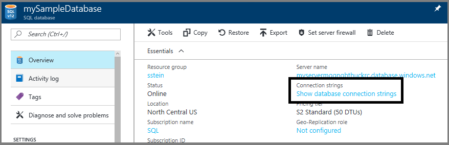
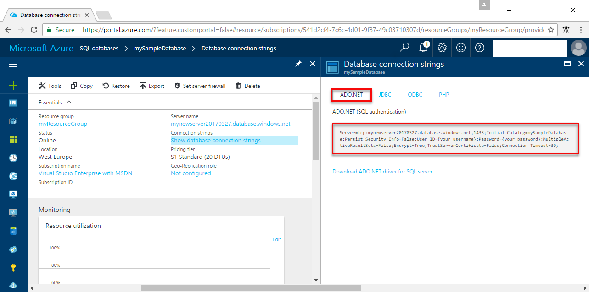

<properties
    pageTitle="使用 .NET (C#) 连接到 Azure SQL 数据库 | Azure"
    description="演示了一个可以用来连接到 Azure SQL 数据库并进行查询的 .NET 代码示例"
    services="sql-database"
    documentationcenter=""
    author="ajlam"
    manager="jhubbard"
    editor="" />
<tags
    ms.assetid="7faca033-24b4-4f64-9301-b4de41e73dfd"
    ms.service="sql-database"
    ms.custom="quick start connect"
    ms.workload="drivers"
    ms.tgt_pltfrm="na"
    ms.devlang="dotnet"
    ms.topic="hero-article"
    ms.date="04/05/2017"
    wacn.date="05/22/2017"
    ms.author="andrela;sstein;carlrab"
    ms.translationtype="Human Translation"
    ms.sourcegitcommit="8fd60f0e1095add1bff99de28a0b65a8662ce661"
    ms.openlocfilehash="4597286cd70bbafc0056670bac02b256dc84b484"
    ms.contentlocale="zh-cn"
    ms.lasthandoff="05/12/2017" />

# <a name="azure-sql-database-use-net-c-to-connect-and-query-data"></a>Azure SQL 数据库：使用 .NET (C#) 进行连接和数据查询

本快速入门演示了如何通过 Windows、Mac OS 和 Ubuntu Linux 平台使用 [C# 和 ADO.NET](https://msdn.microsoft.com/zh-cn/library/kb9s9ks0.aspx) 连接到 Azure SQL 数据库，然后使用 Transact-SQL 语句在数据库中查询、插入、更新和删除数据。

此快速入门使用以下某个快速入门中创建的资源作为其起点：

- [创建 DB - 门户](/documentation/articles/sql-database-get-started-portal/)
- [创建 DB - CLI](/documentation/articles/sql-database-get-started-cli/)

## <a name="install-net"></a>安装 .NET

### <a name="windows-net-framework-and-net-core"></a>**Windows .NET Framework 和 .NET Core**

Visual Studio 2017 Community 是全功能、可扩展的免费 IDE，用于创建适用于 Android、iOS、Windows 以及 Web 和数据库应用程序与云服务的新式应用程序。 可以安装完整的 .NET Framework，也可以只安装 .NET Core。 快速入门中的代码片段二者都可以使用。 如果已在计算机上安装了 Visual Studio，请跳过下面几个步骤。

1. 下载[安装程序](https://go.microsoft.com/fwlink/?LinkId=691978)。 
2. 运行该安装程序，并遵照安装提示完成安装。

### <a name="mac-os"></a>**Mac OS**
打开终端并导航到要在其中创建 .NET Core 项目的目录。 输入以下命令安装 **brew**、**OpenSSL** 和 **.NET Core**。 

    ruby -e "$(curl -fsSL https://raw.githubusercontent.com/Homebrew/install/master/install)"
    brew update
    brew install openssl
    mkdir -p /usr/local/lib
    ln -s /usr/local/opt/openssl/lib/libcrypto.1.0.0.dylib /usr/local/lib/
    ln -s /usr/local/opt/openssl/lib/libssl.1.0.0.dylib /usr/local/lib/

在 macOS 上安装 .NET Core。 下载[正式的安装程序](https://go.microsoft.com/fwlink/?linkid=843444)。 此安装程序将安装工具并将其放置在路径中，以便你可以从控制台运行 dotnet

### <a name="linux-ubuntu"></a>**Linux (Ubuntu)**
打开终端并导航到要在其中创建 .NET Core 项目的目录。 输入以下命令安装 **.NET Core**。

    sudo sh -c 'echo "deb [arch=amd64] https://apt-mo.trafficmanager.net/repos/dotnet-release/ xenial main" > /etc/apt/sources.list.d/dotnetdev.list'
    sudo apt-key adv --keyserver hkp://keyserver.ubuntu.com:80 --recv-keys 417A0893
    sudo apt-get update
    sudo apt-get install dotnet-dev-1.0.1

## <a name="get-connection-information"></a>获取连接信息

在 Azure 门户预览中获取连接字符串。 请使用连接字符串连接到 Azure SQL 数据库。

1. 登录到 [Azure 门户预览](https://portal.azure.cn/)。
2. 从左侧菜单中选择“SQL 数据库”，然后单击“SQL 数据库”页上的数据库。 
3. 在数据库的“概要”窗格中，查看完全限定的服务器名称。 

    

4. 单击“显示数据库连接字符串”。

5. 查看完整的 **ADO.NET** 连接字符串。

    
    
## <a name="add-systemdatasqlclient"></a>添加 System.Data.SqlClient
使用 .NET Core 时，请将 System.Data.SqlClient 作为依赖项添加到项目的 ***csproj*** 文件。

    <ItemGroup>
        <PackageReference Include="System.Data.SqlClient" Version="4.3.0" />
    </ItemGroup>

## <a name="select-data"></a>选择数据

1. 在开发环境中，打开一个空白的代码文件。
2. 将 ```using System.Data.SqlClient``` 添加到代码文件 ([System.Data.SqlClient namespace](https://msdn.microsoft.com/zh-cn/library/system.data.sqlclient.aspx))。 

3. 使用 [SqlCommand.ExecuteReader](https://msdn.microsoft.com/zh-cn/library/system.data.sqlclient.sqlcommand.executereader.aspx) 和 [SELECT](https://msdn.microsoft.com/zh-cn/library/ms189499.aspx) Transact-SQL 语句查询 Azure SQL 数据库中的数据。 为服务器添加相应的值

        using System;
        using System.Data;
        using System.Data.SqlClient;
    
        namespace ConsoleApplication1
        {
            class Program
            {
                static void Main(string[] args)
                {
                    try 
                    { 
                        SqlConnectionStringBuilder builder = new SqlConnectionStringBuilder();
                        builder.DataSource = "your_server.database.chinacloudapi.cn"; 
                        builder.UserID = "your_user";            
                        builder.Password = "your_password";     
                        builder.InitialCatalog = "your_database";
    
                        using (SqlConnection connection = new SqlConnection(builder.ConnectionString))
                        {
                            Console.WriteLine("\nQuery data example:");
                            Console.WriteLine("=========================================\n");
                        
                            connection.Open();       
                            StringBuilder sb = new StringBuilder();
                            sb.Append("SELECT TOP 20 pc.Name as CategoryName, p.name as ProductName ");
                            sb.Append("FROM [SalesLT].[ProductCategory] pc ");
                            sb.Append("JOIN [SalesLT].[Product] p ");
                            sb.Append("ON pc.productcategoryid = p.productcategoryid;");
                            String sql = sb.ToString();
    
                            using (SqlCommand command = new SqlCommand(sql, connection))
                            {
                                using (SqlDataReader reader = command.ExecuteReader())
                                {
                                    while (reader.Read())
                                    {
                                        Console.WriteLine("{0} {1}", reader.GetString(0), reader.GetString(1));
                                    }
                                }
                            }                    
                        }
                    }
                    catch (SqlException e)
                    {
                        Console.WriteLine(e.ToString());
                    }
                }
            }
        }

## <a name="insert-data"></a>插入数据

使用 [SqlCommand.ExecuteNonQuery](https://msdn.microsoft.com/zh-cn/library/system.data.sqlclient.sqlcommand.executenonquery.aspx) 和 [INSERT](https://msdn.microsoft.com/zh-cn/library/ms174335.aspx) Transact-SQL 语句将数据插入 Azure SQL 数据库。

    using System;
    using System.Data;
    using System.Data.SqlClient;

    namespace ConsoleApplication1
    {
        class Program
        {
            static void Main(string[] args)
            {
                try 
                { 
                    SqlConnectionStringBuilder builder = new SqlConnectionStringBuilder();
                    builder.DataSource = "your_server.database.chinacloudapi.cn"; 
                    builder.UserID = "your_user";            
                    builder.Password = "your_password";     
                    builder.InitialCatalog = "your_database";

                    using (SqlConnection connection = new SqlConnection(builder.ConnectionString))
                    {
                        Console.WriteLine("\nInsert data example:");
                        Console.WriteLine("=========================================\n");

                        connection.Open();       
                        StringBuilder sb = new StringBuilder();
                        sb.Append("INSERT INTO [SalesLT].[Product] ([Name], [ProductNumber], [Color], [StandardCost], [ListPrice], [SellStartDate]) ");
                        sb.Append("VALUES (@Name, @ProductNumber, @Color, @StandardCost, @ListPrice, @SellStartDate);");
                        String sql = sb.ToString();
                        using (SqlCommand command = new SqlCommand(sql, connection))
                        {
                            command.Parameters.AddWithValue("@Name", "BrandNewProduct");
                            command.Parameters.AddWithValue("@ProductNumber", "200989");
                            command.Parameters.AddWithValue("@Color", "Blue");
                            command.Parameters.AddWithValue("@StandardCost", 75);
                            command.Parameters.AddWithValue("@ListPrice", 80);
                            command.Parameters.AddWithValue("@SellStartDate", "7/1/2016");
                            int rowsAffected = command.ExecuteNonQuery();
                            Console.WriteLine(rowsAffected + " row(s) inserted");
                        }         
                    }
                }
                catch (SqlException e)
                {
                    Console.WriteLine(e.ToString());
                }
            }
        }
    }

## <a name="update-data"></a>更新数据

使用 [SqlCommand.ExecuteNonQuery](https://msdn.microsoft.com/zh-cn/library/system.data.sqlclient.sqlcommand.executenonquery.aspx) 和 [UPDATE](https://msdn.microsoft.com/zh-cn/library/ms177523.aspx) Transact-SQL 语句更新 Azure SQL 数据库中的数据。

    using System;
    using System.Data;
    using System.Data.SqlClient;

    namespace ConsoleApplication1
    {
        class Program
        {
            static void Main(string[] args)
            {
                try 
                { 
                    SqlConnectionStringBuilder builder = new SqlConnectionStringBuilder();
                    builder.DataSource = "your_server.database.chinacloudapi.cn"; 
                    builder.UserID = "your_user";            
                    builder.Password = "your_password";     
                    builder.InitialCatalog = "your_database";

                    using (SqlConnection connection = new SqlConnection(builder.ConnectionString))
                    {
                        Console.WriteLine("\nUpdate data example");
                        Console.WriteLine("=========================================\n");

                        connection.Open();       
                        StringBuilder sb = new StringBuilder();
                        sb.Append("UPDATE [SalesLT].[Product] SET ListPrice = @ListPrice WHERE Name = @Name;");
                        String sql = sb.ToString();
                        using (SqlCommand command = new SqlCommand(sql, connection))
                        {
                            command.Parameters.AddWithValue("@Name", "BrandNewProduct");
                            command.Parameters.AddWithValue("@ListPrice", 500);
                            int rowsAffected = command.ExecuteNonQuery();
                            Console.WriteLine(rowsAffected + " row(s) updated");
                        }         
                    }
                }
                catch (SqlException e)
                {
                    Console.WriteLine(e.ToString());
                }
            }
        }
    }

## <a name="delete-data"></a>删除数据

使用 [SqlCommand.ExecuteNonQuery](https://msdn.microsoft.com/zh-cn/library/system.data.sqlclient.sqlcommand.executenonquery.aspx) 和 [DELETE](https://msdn.microsoft.com/zh-cn/library/ms189835.aspx) Transact-SQL 语句删除 Azure SQL 数据库中的数据。

    using System;
    using System.Data;
    using System.Data.SqlClient;

    namespace ConsoleApplication1
    {
        class Program
        {
            static void Main(string[] args)
            {
                try 
                { 
                    SqlConnectionStringBuilder builder = new SqlConnectionStringBuilder();
                    builder.DataSource = "your_server.database.chinacloudapi.cn"; 
                    builder.UserID = "your_user";            
                    builder.Password = "your_password";     
                    builder.InitialCatalog = "your_database";

                    using (SqlConnection connection = new SqlConnection(builder.ConnectionString))
                    {
                        Console.WriteLine("\nDelete data example");
                        Console.WriteLine("=========================================\n");

                        connection.Open();       
                        StringBuilder sb = new StringBuilder();
                        sb.Append("DELETE FROM SalesLT.Product WHERE Name = @Name;");
                        String sql = sb.ToString();
                        using (SqlCommand command = new SqlCommand(sql, connection))
                        {
                            command.Parameters.AddWithValue("@Name", "BrandNewProduct");
                            int rowsAffected = command.ExecuteNonQuery();
                            Console.WriteLine(rowsAffected + " row(s) deleted");
                        }         
                    }
                }
                catch (SqlException e)
                {
                    Console.WriteLine(e.ToString());
                }
            }
        }
    }

## <a name="next-steps"></a>后续步骤

- 有关 .NET 文档，请参阅 [.NET 文档](https://docs.microsoft.com/dotnet/)。
- 若要使用 SQL Server Management Studio 进行连接和查询，请参阅[使用 SSMS 进行连接和查询](/documentation/articles/sql-database-connect-query-ssms/)
- 若要使用 Visual Studio 进行连接和查询，请参阅[使用 Visual Studio Code 进行连接和查询](/documentation/articles/sql-database-connect-query-vscode/)。
- 若要使用 PHP 进行连接和查询，请参阅[使用 PHP 进行连接和查询](/documentation/articles/sql-database-connect-query-php/)。
- 若要使用 Node.js 进行连接和查询，请参阅[使用 Node.js 进行连接和查询](/documentation/articles/sql-database-connect-query-nodejs/)。
- 若要使用 Java 进行连接和查询，请参阅[使用 Java 进行连接和查询](/documentation/articles/sql-database-connect-query-java/)。
- 若要使用 Python 进行连接和查询，请参阅[使用 Python 进行连接和查询](/documentation/articles/sql-database-connect-query-python/)。
- 若要使用 Ruby 进行连接和查询，请参阅[使用 Ruby 进行连接和查询](/documentation/articles/sql-database-connect-query-ruby/)。
<!--Update_Description:add steps for installing .NET in Windows, Linux, MacOS;simplify azure portal steps for connect sql;update dotnet code for insert,delete,update,select operations-->