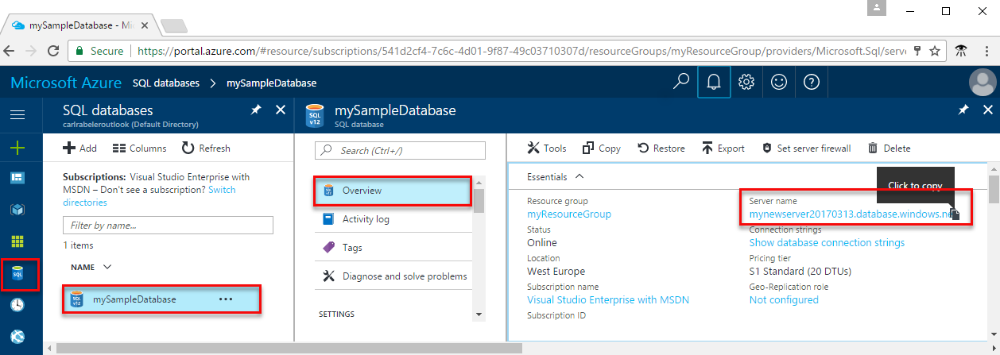

<properties
    pageTitle="使用 Ruby 连接 Azure SQL 数据库 | Azure"
    description="演示了一个可以用来连接到 Azure SQL 数据库并进行查询的 Ruby 代码示例。"
    services="sql-database"
    documentationcenter=""
    author="ajlam"
    manager="jhubbard"
    editor="" />
<tags
    ms.assetid="94fec528-58ba-4352-ba0d-25ae4b273e90"
    ms.service="sql-database"
    ms.custom="quick start connect"
    ms.workload="drivers"
    ms.tgt_pltfrm="na"
    ms.devlang="ruby"
    ms.topic="article"
    ms.date="04/05/2017"
    wacn.date="05/22/2017"
    ms.author="andrela;sstein;carlrab"
    ms.translationtype="Human Translation"
    ms.sourcegitcommit="8fd60f0e1095add1bff99de28a0b65a8662ce661"
    ms.openlocfilehash="06f33fcde998740f39a4f8c68e61a217b013b38f"
    ms.contentlocale="zh-cn"
    ms.lasthandoff="05/12/2017" />

# Azure SQL 数据库：使用 Ruby 进行连接和数据查询

本快速入门演示了如何通过 Mac OS 和 Ubuntu Linux 平台使用 [Ruby](https://Ruby.org) 连接到 Azure SQL 数据库，然后使用 Transact-SQL 语句在数据库中查询、插入、更新和删除数据。

此快速入门使用以下某个快速入门中创建的资源作为其起点：

- [创建 DB - 门户](/documentation/articles/sql-database-get-started-portal/)
- [创建 DB - CLI](/documentation/articles/sql-database-get-started-cli/)

## 安装 Ruby 和数据库通信库

### **Mac OS**
打开终端并导航到要在其中创建 Ruby 脚本的目录。 输入以下命令，安装 **brew**、**FreeTDS** 和 **TinyTDS**。

    ruby -e "$(curl -fsSL https://raw.githubusercontent.com/Homebrew/install/master/install)"
    brew tap microsoft/msodbcsql https://github.com/Microsoft/homebrew-msodbcsql-preview
    brew update
    brew install FreeTDS
    gem install tiny_tds

### **Linux (Ubuntu)**
打开终端并导航到要在其中创建 Ruby 脚本的目录。 输入以下命令，安装 **FreeTDS** 和 **TinyTDS**。

    wget ftp://ftp.freetds.org/pub/freetds/stable/freetds-1.00.27.tar.gz
    tar -xzf freetds-1.00.27.tar.gz
    cd freetds-1.00.27
    ./configure --prefix=/usr/local --with-tdsver=7.3
    make
    make install
    gem install tiny_tds

## 获取连接信息

在 Azure 门户中获取连接字符串。 请使用连接字符串连接到 Azure SQL 数据库。

1. 登录到 [Azure 门户](https://portal.azure.cn/)。
2. 从左侧菜单中选择“SQL 数据库”，然后单击“SQL 数据库”页上的数据库。 
3. 在数据库的“概要”窗格中，查看完全限定的服务器名称。

    
    

## 选择数据
使用 [TinyTDS::Client](https://github.com/rails-sqlserver/tiny_tds) 函数和 [SELECT](https://msdn.microsoft.com/zh-cn/library/ms189499.aspx) Transact-SQL 语句查询 Azure SQL 数据库中的数据。 TinyTDS::Client 函数接受查询并返回结果集。 可使用 [result.each do |row|](https://github.com/rails-sqlserver/tiny_tds) 循环访问结果集。

    require 'tiny_tds'
    server = 'yourserver.database.chinacloudapi.cn'
    database = 'yourdatabase'
    username = 'yourusername'
    password = 'yourpassword'
    client = TinyTds::Client.new username: username, password: password, 
        host: server, port: 1433, database: database, azure: true

    puts "Reading data from table"
    tsql = "SELECT TOP 20 pc.Name as CategoryName, p.name as ProductName
            FROM [SalesLT].[ProductCategory] pc
            JOIN [SalesLT].[Product] p
            ON pc.productcategoryid = p.productcategoryid"
    result = client.execute(tsql)
    result.each do |row|
        puts row
    end

## 插入数据
使用 [TinyTDS::Client](https://github.com/rails-sqlserver/tiny_tds) 函数和 [INSERT](https://msdn.microsoft.com/zh-cn/library/ms174335.aspx) Transact-SQL 语句将数据插入 Azure SQL 数据库。

本示例介绍如何安全地执行 [INSERT](https://msdn.microsoft.com/zh-cn/library/ms174335.aspx) 语句，传递参数以保护应用程序免遭 [SQL 注入](https://technet.microsoft.com/zh-cn/library/ms161953(v=sql.105).aspx)漏洞的危害，然后检索自动生成的[主键](https://msdn.microsoft.com/zh-cn/library/ms179610.aspx)值。    
  
若要配合使用 TinyTDS 和 Azure，建议运行多个 `SET` 语句来更改当前会话处理特定信息的方式。 建议使用代码示例中所提供的 `SET` 语句。 例如，即使未显式指定列的可为 null 状态，通过 `SET ANSI_NULL_DFLT_ON` 依然可以创建新列来允许 null 值。  
  
为符合 Microsoft SQL Server [日期时间](http://msdn.microsoft.com/zh-cn/library/ms187819.aspx)格式，请使用 [strftime](http://ruby-doc.org/core-2.2.0/Time.html#method-i-strftime) 函数转换成对应的日期时间格式。

    require 'tiny_tds'
    server = 'yourserver.database.chinacloudapi.cn'
    database = 'yourdatabase'
    username = 'yourusername'
    password = 'yourpassword'
    client = TinyTds::Client.new username: username, password: password, 
        host: server, port: 1433, database: database, azure: true

    # settings for Azure
    result = client.execute("SET ANSI_NULLS ON")
    result = client.execute("SET CURSOR_CLOSE_ON_COMMIT OFF")
    result = client.execute("SET ANSI_NULL_DFLT_ON ON")
    result = client.execute("SET IMPLICIT_TRANSACTIONS OFF")
    result = client.execute("SET ANSI_PADDING ON")
    result = client.execute("SET QUOTED_IDENTIFIER ON")
    result = client.execute("SET ANSI_WARNINGS ON")
    result = client.execute("SET CONCAT_NULL_YIELDS_NULL ON")

    def insert(name, productnumber, color, standardcost, listprice, sellstartdate)
        tsql = "INSERT INTO SalesLT.Product (Name, ProductNumber, Color, StandardCost, ListPrice, SellStartDate) 
            VALUES (N'#{name}', N'#{productnumber}',N'#{color}',N'#{standardcost}',N'#{listprice}',N'#{sellstartdate}')"
        result = client.execute(tsql)
        result.each
        puts "#{result.affected_rows} row(s) affected"
    end
    insert('BrandNewProduct', '200989', 'Blue', 75, 80, '7/1/2016')

## 更新数据
使用 [TinyTDS::Client](https://github.com/rails-sqlserver/tiny_tds) 函数和 [UPDATE](https://msdn.microsoft.com/zh-cn/library/ms189835.aspx) Transact-SQL 语句删除 Azure SQL 数据库中的数据。

    require 'tiny_tds'
    server = 'yourserver.database.chinacloudapi.cn'
    database = 'yourdatabase'
    username = 'yourusername'
    password = 'yourpassword'
    client = TinyTds::Client.new username: username, password: password, 
        host: server, port: 1433, database: database, azure: true
    
    def update(name, listPrice, client)
        tsql = "UPDATE SalesLT.Product SET ListPrice = N'#{listPrice}' WHERE Name =N'#{name}'";
        result = client.execute(tsql)
        result.each
        puts "#{result.affected_rows} row(s) affected"
    end
    update('BrandNewProduct', 500, client)

## 删除数据
使用 [TinyTDS::Client](https://github.com/rails-sqlserver/tiny_tds) 函数和 [DELETE](https://msdn.microsoft.com/zh-cn/library/ms189835.aspx) Transact-SQL 语句删除 Azure SQL 数据库中的数据。

    require 'tiny_tds'
    server = 'yourserver.database.chinacloudapi.cn'
    database = 'yourdatabase'
    username = 'yourusername'
    password = 'yourpassword'
    client = TinyTds::Client.new username: username, password: password, 
        host: server, port: 1433, database: database, azure: true

    # settings for Azure
    result = client.execute("SET ANSI_NULLS ON")
    result = client.execute("SET CURSOR_CLOSE_ON_COMMIT OFF")
    result = client.execute("SET ANSI_NULL_DFLT_ON ON")
    result = client.execute("SET IMPLICIT_TRANSACTIONS OFF")
    result = client.execute("SET ANSI_PADDING ON")
    result = client.execute("SET QUOTED_IDENTIFIER ON")
    result = client.execute("SET ANSI_WARNINGS ON")
    result = client.execute("SET CONCAT_NULL_YIELDS_NULL ON")

    def delete(name, client)
        tsql = "DELETE FROM SalesLT.Product WHERE Name = N'#{name}'"
        result = client.execute(tsql)
        result.each
        puts "#{result.affected_rows} row(s) affected"
    end
    delete('BrandNewProduct', client)

## 后续步骤

- [TinyTDS](https://github.com/rails-sqlserver/tiny_tds) 的 Github 存储库。
- [提出问题](https://github.com/rails-sqlserver/tiny_tds/issues)。        
- 有关 [Ruby Driver for SQL Server](https://docs.microsoft.com/sql/connect/ruby/ruby-driver-for-sql-server/) 的详细信息。
- 若要使用 SQL Server Management Studio 进行连接和查询，请参阅[使用 SSMS 进行连接和查询](/documentation/articles/sql-database-connect-query-ssms/)
- 若要使用 Visual Studio 进行连接和查询，请参阅[使用 Visual Studio Code 进行连接和查询](/documentation/articles/sql-database-connect-query-vscode/)。
- 若要使用 .NET 进行连接和查询，请参阅[使用 .NET 进行连接和查询](/documentation/articles/sql-database-connect-query-dotnet/)。
- 若要使用 PHP 进行连接和查询，请参阅[使用 PHP 进行连接和查询](/documentation/articles/sql-database-connect-query-php/)。
- 若要使用 Node.js 进行连接和查询，请参阅[使用 Node.js 进行连接和查询](/documentation/articles/sql-database-connect-query-nodejs/)。
- 若要使用 Java 进行连接和查询，请参阅[使用 Java 进行连接和查询](/documentation/articles/sql-database-connect-query-java/)。
- 若要使用 Python 进行连接和查询，请参阅[使用 Python 进行连接和查询](/documentation/articles/sql-database-connect-query-python/)。