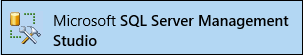
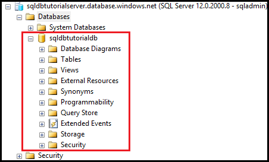
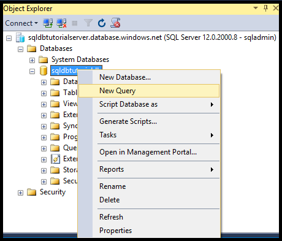
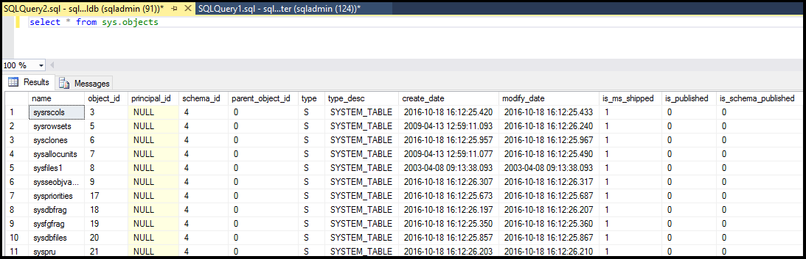

<properties
    pageTitle="连接到 SQL 数据库 - SQL Server Management Studio | Azure"
    description="了解如何通过使用 SQL Server Management Studio (SSMS) 连接到在 Azure 上的 SQL 数据库。然后，使用 Transact-SQL (T-SQL) 运行示例查询。"
    metacanonical=""
    keywords="连接到 sql 数据库, sql server management studio"
    services="sql-database"
    documentationcenter=""
    author="CarlRabeler"
    manager="jhubbard"
    editor="" />
<tags
    ms.assetid="7cd2a114-c13c-4ace-9088-97bd9d68de12"
    ms.service="sql-database"
    ms.custom="development"
    ms.workload="data-management"
    ms.tgt_pltfrm="na"
    ms.devlang="na"
    ms.topic="article"
    ms.date="02/01/2017"
    wacn.date="03/24/2017"
    ms.author="sstein;carlrab" />  

# 使用 SQL Server Management Studio 连接到 SQL 数据库并执行示例 T-SQL 查询

本文介绍如何使用 SQL Server Management Studio (SSMS) 连接到 Azure SQL 数据库。成功连接以后，即可运行简单的 Transact-SQL (T-SQL) 查询，验证与数据库的通信。

[AZURE.INCLUDE [SSMS 安装](../../includes/sql-server-management-studio-install.md)]

1. 如果尚未这样做，请在[下载 SQL Server Management Studio](https://msdn.microsoft.com/zh-cn/library/mt238290.aspx) 中下载并安装最新版本的 SSMS。为了保持版本最新，当有新版本可供下载时 SSMS 最新版本会提示你。

2. 安装后，在 Windows 搜索框中键入“Microsoft SQL Server Management Studio”，并单击 **Enter** 打开 SSMS：

      

3. 在“连接到服务器”对话框中，输入使用 SQL Server 身份验证连接到 SQL Server 所需的信息。

      

4. 单击“连接”。

      

5. 在对象资源管理器中，展开“数据库”，展开任一数据库以查看该数据库中的对象。

      

6. 右键单击该数据库，然后单击“新建查询”。

      

7. 在查询窗口中，键入以下查询：

   	select * from sys.objects
   
8.  在工具栏上，单击“执行”返回示例数据库中所有系统对象的列表。

      

> [AZURE.TIP]
>如需教程，请参阅[教程：使用 Azure 门户预览和 SQL Server Management Studio 预配和访问 Azure SQL 数据库](/documentation/articles/sql-database-get-started/)。
>

## 后续步骤

- 可以按照与 SQL Server 基本相同的方法，使用 T-SQL 语句来创建和管理 Azure 中的数据库。如果已熟悉如何使用 SQL Server 的 T-SQL，请参阅 [Azure SQL 数据库 Transact-SQL 信息](/documentation/articles/sql-database-transact-sql-information/)，了解差异摘要。
- 如果不熟悉 T-SQL，请参阅[教程：编写 Transact-SQL 语句](https://msdn.microsoft.com/zh-cn/library/ms365303.aspx)和 [Transact-SQL 参考（数据库引擎）](https://msdn.microsoft.com/zh-cn/library/bb510741.aspx)。
- 有关 SQL Server 身份验证的入门教程，请参阅 [SQL 身份验证和授权](/documentation/articles/sql-database-control-access-sql-authentication-get-started/)
- 有关 Azure Active Directory 身份验证的入门教程，请参阅 [Azure AD 身份验证和授权](/documentation/articles/sql-database-control-access-aad-authentication-get-started/)
- 有关 SSMS 的详细信息，请参阅[使用 SQL Server Management Studio](https://msdn.microsoft.com/zh-cn/library/ms174173.aspx)。

<!---HONumber=Mooncake_0320_2017-->
<!--update: update and add link references-->