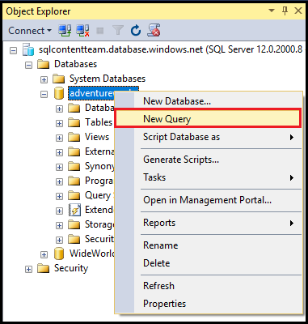
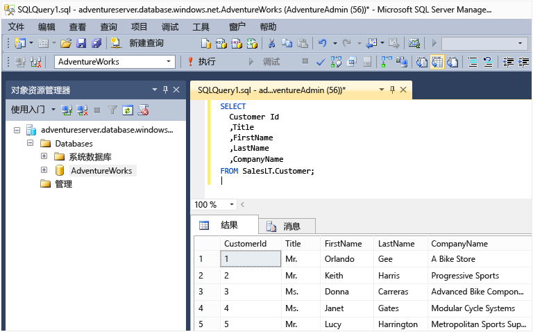

<properties
	pageTitle="连接到 SQL 数据库 - SQL Server Management Studio | Azure"
	description="了解如何通过使用 SQL Server Management Studio (SSMS) 连接到在 Azure 上的 SQL 数据库。然后，使用 Transact-SQL (T-SQL) 运行示例查询。"
	metaCanonical=""
	keywords="连接到 sql 数据库, sql server management studio"
	services="sql-database"
	documentationCenter=""
	authors="stevestein"
	manager="jhubbard"
	editor="" />

<tags
	ms.service="sql-database"
	ms.date="05/09/2016"
	wacn.date="06/14/2016" />

# 使用 SQL Server Management Studio 连接到 SQL 数据库并执行示例 T-SQL 查询

> [AZURE.SELECTOR]
- [SSMS](/documentation/articles/sql-database-connect-query-ssms/)
- [C#](/documentation/articles/sql-database-connect-query/)
- [Excel](/documentation/articles/sql-database-connect-excel/)

本文介绍如何使用最新版本的 SQL Server Management Studio (SSMS) 连接到 Azure SQL 数据库并使用 Transact-SQL (T-SQL) 语句执行简单查询。

[AZURE.INCLUDE [登录](../includes/azure-getting-started-portal-login.md)]

[AZURE.INCLUDE [SSMS 安装](../includes/sql-server-management-studio-install.md)]

[AZURE.INCLUDE [SSMS 连接](../includes/sql-database-sql-server-management-studio-connect-server-principal.md)]

## 运行示例查询

连接到逻辑服务器后，你可以连接到数据库并运行示例查询。

1. 在“对象资源管理器”中，导航到你对其拥有权限的服务器，例如 **AdventureWorks** 示例数据库。
2. 右键单击数据库，然后选择“新建查询”。

	

3. 在查询窗口中，复制并粘贴以下代码。

		SELECT
		CustomerId
		,Title
		,FirstName
		,LastName
		,CompanyName
		FROM SalesLT.Customer;

4. 单击“运行”按钮。以下屏幕截图显示查询成功。

	

## 后续步骤

可以按照与 SQL Server 基本相同的方法，使用 T-SQL 语句来创建和管理 Azure 中的数据库。如果你熟悉如何使用 SQL Server 的 T-SQL，请参阅 [Azure SQL 数据库 Transact-SQL 信息](/documentation/articles/sql-database-transact-sql-information/)，了解差异摘要。

如果你不熟悉 T-SQL，请参阅[教程：编写 Transact-SQL 语句](https://msdn.microsoft.com/zh-cn/library/ms365303.aspx)和 [Transact-SQL 参考（数据库引擎）](https://msdn.microsoft.com/zh-cn/library/bb510741.aspx)。

若要开始创建数据库用户和数据库用户管理员，请参阅 [Azure SQL 数据库安全性入门](/documentation/articles/sql-database-get-started-security/)

<!---HONumber=Mooncake_0530_2016-->