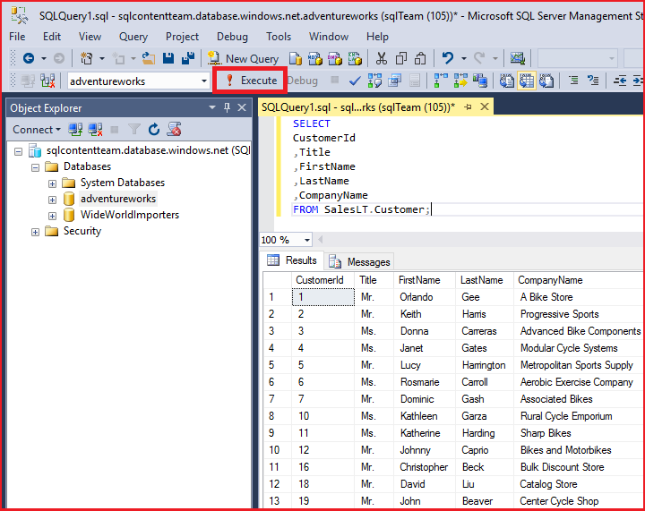

<properties
	pageTitle="连接到 SQL 数据库 - SQL Server Management Studio | Azure"
	description="了解如何通过使用 SQL Server Management Studio (SSMS) 连接到在 Azure 上的 SQL 数据库。然后，使用 Transact-SQL (T-SQL) 运行示例查询。"
	metaCanonical=""
	keywords="连接到 sql 数据库, sql server management studio"
	services="sql-database"
	documentationCenter=""
	authors="stevestein"
	manager="jhubbard"
	editor="" />

<tags
	ms.service="sql-database"
	ms.workload="data-management"
	ms.tgt_pltfrm="na"
	ms.devlang="na"
	ms.topic="get-started-article"
	ms.date="08/17/2016"
	wacn.date="10/17/2016"
	ms.author="sstein;carlrab" />  

# 使用 SQL Server Management Studio 连接到 SQL 数据库并执行示例 T-SQL 查询

> [AZURE.SELECTOR]
- [Visual Studio](/documentation/articles/sql-database-connect-query/)
- [SSMS](/documentation/articles/sql-database-connect-query-ssms/)
- [Excel](/documentation/articles/sql-database-connect-excel/)

本文介绍如何使用 SQL Server Management Studio (SSMS) 连接到 Azure SQL 数据库。成功连接以后，即可运行简单的 Transact-SQL (T-SQL) 查询，验证与数据库的通信。

[AZURE.INCLUDE [SSMS 安装](../../includes/sql-server-management-studio-install.md)]

[AZURE.INCLUDE [SSMS 连接](../../includes/sql-database-sql-server-management-studio-connect-server-principal.md)]

## 运行示例查询

连接到服务器后，即可连接到数据库并运行示例查询。如果不熟悉如何编写查询，请参阅 [Writing Transact-SQL Statements](https://msdn.microsoft.com/zh-cn/library/ms365303.aspx)（编写 Transact-SQL 语句）。

1. 在“对象资源管理器”中，导航到服务器上的数据库，例如 **AdventureWorks** 示例数据库。
2. 右键单击数据库，然后选择“新建查询”：

	  

3. 在查询窗口中，复制并粘贴以下内容：

		SELECT
		CustomerId
		,Title
		,FirstName
		,LastName
		,CompanyName
		FROM SalesLT.Customer;

4. 单击“执行”按钮：

	  

## 后续步骤

可以按照与 SQL Server 基本相同的方法，使用 T-SQL 语句来创建和管理 Azure 中的数据库。如果已熟悉如何使用 SQL Server 的 T-SQL，请参阅 [Azure SQL 数据库 Transact-SQL 信息](/documentation/articles/sql-database-transact-sql-information/)，了解差异摘要。

如果不熟悉 T-SQL，请参阅[教程：编写 Transact-SQL 语句](https://msdn.microsoft.com/zh-cn/library/ms365303.aspx)和 [Transact-SQL 参考（数据库引擎）](https://msdn.microsoft.com/zh-cn/library/bb510741.aspx)。

若要开始创建数据库用户和数据库用户管理员，请参阅 [Azure SQL 数据库安全性入门](/documentation/articles/sql-database-get-started-security/)

有关 SSMS 的详细信息，请参阅 [Use SQL Server Management Studio](https://msdn.microsoft.com/zh-cn/library/ms174173.aspx)（使用 SQL Server Management Studio）。

<!---HONumber=Mooncake_1010_2016-->