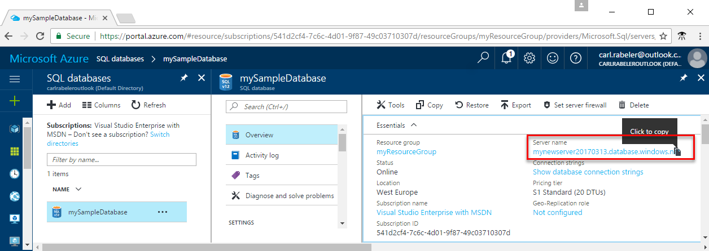
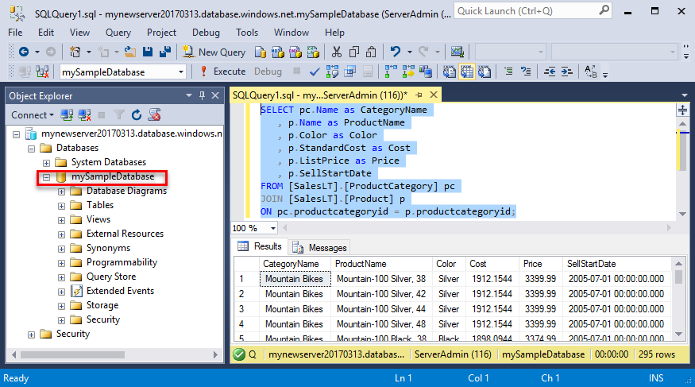
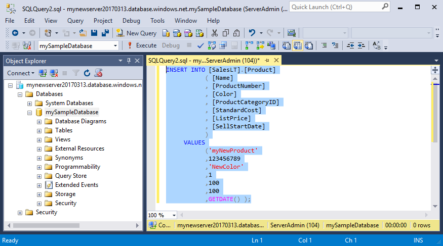
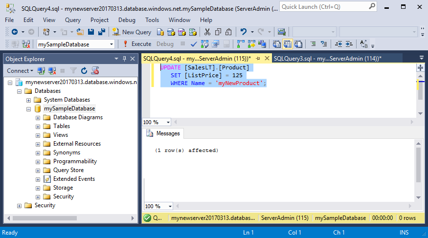
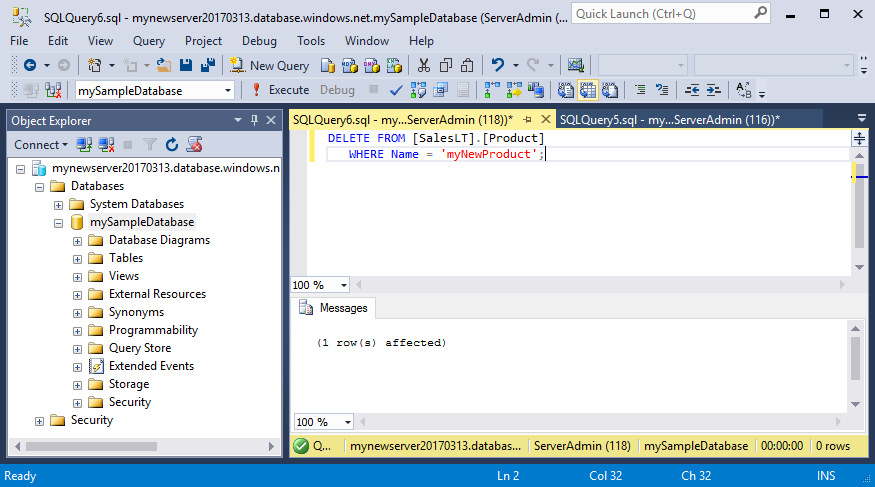

<properties
    pageTitle="SSMS：在 Azure SQL 数据库中进行连接和数据查询 | Azure"
    description="了解如何通过使用 SQL Server Management Studio (SSMS) 连接到在 Azure 上的 SQL 数据库。 然后，通过运行 Transact-SQL (T-SQL) 语句来查询和编辑数据。"
    metacanonical=""
    keywords="连接到 sql 数据库, sql server management studio"
    services="sql-database"
    documentationcenter=""
    author="CarlRabeler"
    manager="jhubbard"
    editor=""
    translationtype="Human Translation" />
<tags
    ms.assetid="7cd2a114-c13c-4ace-9088-97bd9d68de12"
    ms.service="sql-database"
    ms.custom="development"
    ms.workload="data-management"
    ms.tgt_pltfrm="na"
    ms.devlang="na"
    ms.topic="hero-article"
    ms.date="03/15/2017"
    wacn.date="04/17/2017"
    ms.author="carlrab"
    ms.sourcegitcommit="7cc8d7b9c616d399509cd9dbdd155b0e9a7987a8"
    ms.openlocfilehash="dfeb0b7ec05d9b81dd866155517ec9034277cef2"
    ms.lasthandoff="04/07/2017" />

# Azure SQL 数据库：使用 SQL Server Management Studio 进行连接和数据查询

使用 [SQL Server Management Studio](https://msdn.microsoft.com/zh-cn/library/ms174173.aspx) (SSMS) 通过用户界面或脚本创建和管理 SQL Server 资源。 本指南详述了如何使用 SSMS 连接到 Azure SQL 数据库，然后执行查询、插入、更新和删除语句。

此快速入门使用以下某个快速入门中创建的资源作为其起点：

- [创建 DB - 门户](/documentation/articles/sql-database-get-started-portal/)
- [创建 DB - CLI](/documentation/articles/sql-database-get-started-cli/)
- [创建 DB - PowerShell](/documentation/articles/sql-database-get-started-powershell/) 

在开始之前，请确保已安装最新版本的 [SSMS](https://msdn.microsoft.com/zh-cn/library/mt238290.aspx)。 

## 获取连接信息

请在 Azure 门户预览中获取 Azure SQL 数据库服务器的完全限定服务器名称。 请使用 SQL Server Management Studio 通过完全限定的服务器名称连接到服务器。

1. 登录 [Azure 门户预览](https://portal.azure.cn/)。
2. 从左侧菜单中选择“SQL 数据库”，然后单击“SQL 数据库”页上的数据库。 
3. 在数据库的“Azure 门户”页的“概要”窗格中，找到并复制“服务器名称”。

    

## 连接到服务器

使用 SQL Server Management Studio 建立到 Azure SQL 数据库服务器的连接。

1. 在 Windows 搜索框中键入 **SSMS**， 然后单击 **Enter** 打开 SSMS。

2. 在“连接到服务器”对话框中，输入以下信息：
   - **服务器类型**：指定数据库引擎
   - **服务器名称**：输入完全限定的服务器名称，例如 **mynewserver20170313.database.chinacloudapi.cn**
   - **身份验证**：指定 SQL Server 身份验证
   - **登录名**：输入服务器管理员帐户
   - **密码**：输入服务器管理员帐户的密码
 
    

3. 单击“连接”。 此时会在 SSMS 中打开“对象资源管理器”窗口。 

    

4. 在对象资源管理器中展开“数据库”，然后展开 **mySampleDatabase**，查看示例数据库中的对象。

## 查询数据

使用 [SELECT](https://msdn.microsoft.com/zh-cn/library/ms189499.aspx) Transact-SQL 语句查询 Azure SQL 数据库中的数据。

1. 在“对象资源管理器”中，右键单击“mySampleDatabase”，然后单击“新建查询”。 此时会打开一个空白查询窗口，该窗口连接到数据库。
2. 在查询窗口中，输入以下查询：

        SELECT pc.Name as CategoryName, p.name as ProductName
        FROM [SalesLT].[ProductCategory] pc
        JOIN [SalesLT].[Product] p
        ON pc.productcategoryid = p.productcategoryid;

3. 在工具栏中，单击“执行”从 Product 表和 ProductCategory 表检索数据。

    

## 插入数据

使用 [INSERT](https://msdn.microsoft.com/zh-cn/library/ms174335.aspx) Transact-SQL 语句将数据插入 Azure SQL 数据库。

1. 在工具栏上，单击“新建查询”。 此时会打开一个连接到数据库的空查询窗口。
2. 在查询窗口中，输入以下查询：

        INSERT INTO [SalesLT].[Product]
                ( [Name]
                , [ProductNumber]
                , [Color]
                , [ProductCategoryID]
                , [StandardCost]
                , [ListPrice]
                , [SellStartDate]
                )
            VALUES
                ('myNewProduct'
                ,123456789
                ,'NewColor'
                ,1
                ,100
                ,100
                ,GETDATE() );

3. 在工具栏上单击“执行”，将新行插入 Product 表。

    

## 更新数据

使用 [UPDATE](https://msdn.microsoft.com/zh-cn/library/ms177523.aspx) Transact-SQL 语句更新 Azure SQL 数据库中的数据。

1. 在工具栏上，单击“新建查询”。 此时会打开一个连接到数据库的空查询窗口。
2. 在查询窗口中，输入以下查询：

        UPDATE [SalesLT].[Product]
        SET [ListPrice] = 125
        WHERE Name = 'myNewProduct';

3. 在工具栏上单击“执行”，更新 Product 表中的指定行。

    

## 删除数据

使用 [DELETE](https://msdn.microsoft.com/zh-cn/library/ms189835.aspx) Transact-SQL 语句删除 Azure SQL 数据库中的数据。

1. 在工具栏上，单击“新建查询”。 此时会打开一个连接到数据库的空查询窗口。
2. 在查询窗口中，输入以下查询：

        DELETE FROM [SalesLT].[Product]
        WHERE Name = 'myNewProduct';

3. 在工具栏上单击“执行”，删除 Product 表中的指定行。

    

## 后续步骤

- 有关 SSMS 的信息，请参阅[使用 SQL Server Management Studio](https://msdn.microsoft.com/zh-cn/library/ms174173.aspx)。
- 有关使用 Visual Studio Code 查询和编辑数据的信息，请参阅 [Visual Studio Code](https://code.visualstudio.com/docs)
<!--Update_Description: add detailed steps for connect, delete, update, add operations-->