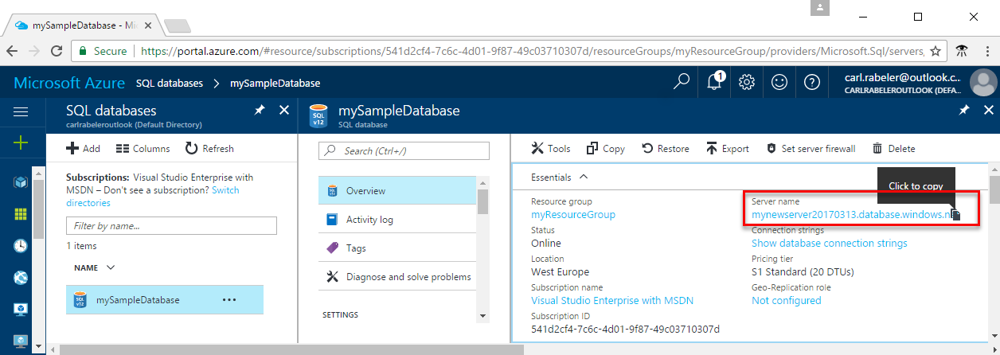
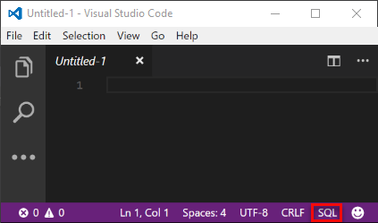
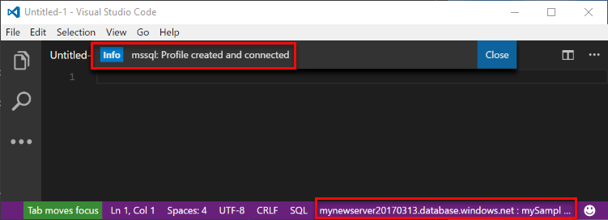
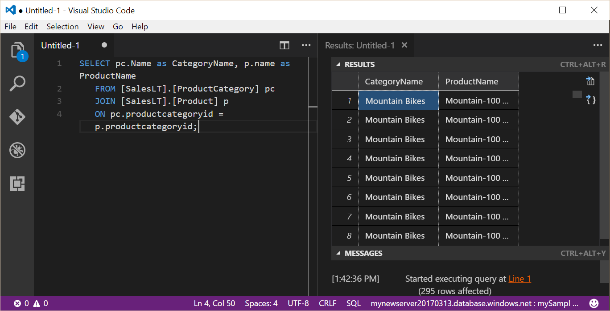

<properties
    pageTitle="VS Code：在 Azure SQL 数据库中进行连接和数据查询 | Azure"
    description="了解如何通过使用 Visual Studio Code 连接到 Azure 上的 SQL 数据库。 然后，通过运行 Transact-SQL (T-SQL) 语句来查询和编辑数据。"
    metacanonical=""
    keywords="连接到 sql 数据库"
    services="sql-database"
    documentationcenter=""
    author="CarlRabeler"
    manager="jhubbard"
    editor=""
    translationtype="Human Translation" />
<tags
    ms.assetid="676bd799-a571-4bb8-848b-fb1720007866"
    ms.service="sql-database"
    ms.custom="manage"
    ms.workload="data-management"
    ms.tgt_pltfrm="na"
    ms.devlang="na"
    ms.topic="hero-article"
    ms.date="03/17/2017"
    wacn.date="04/17/2017"
    ms.author="carlrab"
    ms.sourcegitcommit="7cc8d7b9c616d399509cd9dbdd155b0e9a7987a8"
    ms.openlocfilehash="6127a6bf7a90b1ada1ace523990d7b3882304ca5"
    ms.lasthandoff="04/07/2017" />

# Azure SQL 数据库：使用 Visual Studio Code 进行连接和数据查询

[Visual Studio Code](https://code.visualstudio.com/docs) 是一种图形代码编辑器，适用于支持扩展的 Linux、macOS 和 Windows。 将 Visual Studio Code 与 [mssql 扩展](https://aka.ms/mssql-marketplace)配合使用，以便连接到 Azure SQL 数据库并对其进行查询。 本指南详述了如何使用 Visual Studio Code 连接到 Azure SQL 数据库，然后执行查询、插入、更新和删除语句。

此快速入门使用以下某个快速入门中创建的资源作为其起点：

- [创建 DB - 门户](/documentation/articles/sql-database-get-started-portal/)
- [创建 DB - CLI](/documentation/articles/sql-database-get-started-cli/)
- [创建 DB - PowerShell](/documentation/articles/sql-database-get-started-powershell/) 

在开始之前，请确保已安装最新版 [Visual Studio Code](https://code.visualstudio.com/Download) 并加载 [mssql 扩展](https://aka.ms/mssql-marketplace)。 有关 mssql 扩展的安装指南，请参阅 [Install VS Code](https://docs.microsoft.com/sql/linux/sql-server-linux-develop-use-vscode#install-vs-code)（安装 VS Code）。 

## 获取连接信息

请在 Azure 门户中获取 Azure SQL 数据库服务器的完全限定服务器名称。 请使用 Visual Studio Code 通过完全限定的服务器名称连接到服务器。

1. 登录到 [Azure 门户](https://portal.azure.cn/)。
2. 从左侧菜单中选择“SQL 数据库”，然后单击“SQL 数据库”页上的数据库。 
3. 在数据库的“Azure 门户”页的“概要”窗格中，找到并复制以后要在此快速入门中使用的“服务器名称”。

    

## 将语言模式设置为 SQL

在 Visual Studio Code 中将语言模式设置为 **SQL**，以便启用 mssql 命令和 T-SQL IntelliSense。

1. 打开新的 Visual Studio Code 窗口。 

2. 按 **CTRL+K,M**，键入 **SQL** 并按 **ENTER**，将语言模式设置为 SQL。 

## 连接到服务器

使用 Visual Studio Code 建立到 Azure SQL 数据库服务器的连接。

1. 在 VS Code 中，按 **CTRL+SHIFT+P**（或 **F1**）打开命令面板。

2. 键入 **sqlcon** 并按 **ENTER**。

3. 单击“是”将语言设置为 **SQL**。

4. 按 **ENTER** 选择“创建连接配置文件”。 这将为 SQL Server 实例创建连接配置文件。

5. 按照提示为新的连接配置文件指定连接属性。 指定每个值后，按 **ENTER** 继续。 

   下表介绍了连接配置文件的属性。

   | 设置 | 说明 |
   |-----|-----|
   | **服务器名称** | 输入完全限定的服务器名称，例如 **mynewserver20170313.database.chinacloudapi.cn** |
   | **数据库名称** | 输入数据库名称，例如 **mySampleDatabase** |
   | **身份验证** | 选择 SQL 登录名 |
   | **用户名** | 输入服务器管理员帐户 |
   | **密码(SQL 登录名)** | 输入服务器管理员帐户的密码 | 
   | **保存密码?** | 选择“是”或“否” |
   | **[可选] 输入此配置文件的名称** | 输入连接配置文件名称，例如 **mySampleDatabase**。 

6. 按 **ESC** 键关闭信息消息，该消息通知你，配置文件已创建并连接。

7. 验证状态栏中的连接。

   

## 查询数据

使用 [SELECT](https://msdn.microsoft.com/zh-cn/library/ms189499.aspx) Transact-SQL 语句查询 Azure SQL 数据库中的数据。

1. 在“编辑器”窗口的空查询窗口中，输入以下查询：

        SELECT pc.Name as CategoryName, p.name as ProductName
        FROM [SalesLT].[ProductCategory] pc
        JOIN [SalesLT].[Product] p
        ON pc.productcategoryid = p.productcategoryid;

3. 按 **CTRL+SHIFT+E** 从 Product 表和 ProductCategory 表检索数据。

    

## 插入数据

使用 [INSERT](https://msdn.microsoft.com/zh-cn/library/ms174335.aspx) Transact-SQL 语句将数据插入 Azure SQL 数据库。

1. 在“编辑器”窗口中删除以前的查询，然后输入以下查询：

        INSERT INTO [SalesLT].[Product]
                ( [Name]
                , [ProductNumber]
                , [Color]
                , [ProductCategoryID]
                , [StandardCost]
                , [ListPrice]
                , [SellStartDate]
                )
            VALUES
                ('myNewProduct'
                ,123456789
                ,'NewColor'
                ,1
                ,100
                ,100
                ,GETDATE() );

3. 按 **CTRL+SHIFT+E** 在 Product 表中插入新行。

## 更新数据

使用 [UPDATE](https://msdn.microsoft.com/zh-cn/library/ms177523.aspx) Transact-SQL 语句更新 Azure SQL 数据库中的数据。

1.  在“编辑器”窗口中删除以前的查询，然后输入以下查询：

        UPDATE [SalesLT].[Product]
        SET [ListPrice] = 125
        WHERE Name = 'myNewProduct';

3. 按 **CTRL+SHIFT+E** 更新 Product 表中的指定行。

## 删除数据

使用 [DELETE](https://msdn.microsoft.com/zh-cn/library/ms189835.aspx) Transact-SQL 语句删除 Azure SQL 数据库中的数据。

1. 在“编辑器”窗口中删除以前的查询，然后输入以下查询：

        DELETE FROM [SalesLT].[Product]
        WHERE Name = 'myNewProduct';

3. 按 **CTRL+SHIFT+E** 删除 Product 表中的指定行。

## 后续步骤

- 有关 Visual Studio Code 的信息，请参阅 [Visual Studio Code](https://code.visualstudio.com/docs)
- 若要了解如何使用 SQL Server Management Studio 查询和编辑数据，请参阅 [SSMS](https://msdn.microsoft.com/zh-cn/library/ms174173.aspx)。