<properties
    pageTitle="SQL 身份验证：Azure SQL 数据库防火墙、身份验证和访问权限 | Azure"
    description="本入门教程介绍如何在 SQL Server Management Studio 和 Transact-SQL 中使用授予 Azure SQL 数据库服务器和数据库访问权限与控制权限的服务器级和数据库级防火墙规则、SQL 身份验证、登录名、用户与数据库角色。"
    keywords=""
    services="sql-database"
    documentationcenter=""
    author="CarlRabeler"
    manager="jhubbard"
    editor="" />
<tags
    ms.assetid="67797b09-f5c3-4ec2-8494-fe18883edf7f"
    ms.service="sql-database"
    ms.custom="authentication and authorization"
    ms.workload="data-management"
    ms.tgt_pltfrm="na"
    ms.devlang="na"
    ms.topic="hero-article"
    ms.date="02/17/2017"
    wacn.date="03/24/2017"
    ms.author="carlrab" />  

# SQL Server 身份验证、访问和数据库级防火墙规则

本教程介绍如何在 SQL Server Management Studio 中使用授予 Azure SQL 数据库服务器和数据库访问权限与许可权限的 SQL Server 身份验证、登录名、用户与数据库角色。完成本教程后，便知道如何执行以下操作：

- 基于 SQL Server 身份验证创建登录名和用户
- 将用户添加到角色并向角色授予权限。
- 使用 T-SQL 创建数据库级和服务器级防火墙规则
- 使用 SSMS 以用户身份连接到特定的数据库
- 查看 master 数据库和用户数据库中的用户权限

**时间估计**：完成本教程大约需要 45 分钟（假设满足先决条件）。

> [AZURE.NOTE]
>本教程帮助你了解以下主题的内容：[SQL 数据库访问和控制](/documentation/articles/sql-database-control-access/)，[登录名、用户和数据库角色](/documentation/articles/sql-database-manage-logins/)、[主体](https://msdn.microsoft.com/zh-cn/library/ms181127.aspx)、[数据库角色](https://msdn.microsoft.com/zh-cn/library/ms189121.aspx)和 [SQL 数据库防火墙规则](/documentation/articles/sql-database-firewall-configure/)。有关 Azure Active Directory 身份验证的教程，请参阅 [Azure AD 身份验证入门](/documentation/articles/sql-database-control-access-aad-authentication-get-started/)。
>  

## 先决条件

* **一个 Azure 帐户**。需要一个 Azure 帐户。可以[注册 Azure 1 元试用帐户](/pricing/1rmb-trial/)。

* **Azure create 权限**。必须能够使用帐户连接到 Azure 门户，该帐户是订阅所有者或参与者角色的成员。有关基于角色的访问控制 (RBAC) 的详细信息，请参阅[开始在 Azure 门户中进行访问管理](/documentation/articles/role-based-access-control-what-is/)。

* **SQL Server Management Studio**。可以通过[下载 SQL Server Management Studio](https://msdn.microsoft.com/zh-cn/library/mt238290.aspx) 下载并安装最新版本的 SQL Server Management Studio (SSMS)。连接到 Azure SQL 数据库时，请始终使用最新版本的 SSMS，因为其中会不断地发布新功能。

* **已完成基础教程**。你已完成本教程的[开始使用 Azure 门户和 SQL Server Management Studio 了解 Azure SQL 数据库服务器、数据库和防火墙规则](/documentation/articles/sql-database-get-started/)部分或与之类似的 [PowerShell 版本](/documentation/articles/sql-database-get-started-powershell/)部分。请完成此必学教程或在完成本教程的 [PowerShell 版本](/documentation/articles/sql-database-get-started-powershell/)部分时执行 PowerShell 脚本（如果尚未进行），然后再继续。

## 使用 Azure 帐户登录到 Azure 门户
本过程中的步骤说明如何使用 [Azure 帐户](https://account.windowsazure.cn/Home/Index) 连接到 Azure 门户。

1. 打开所选浏览器并连接到 [Azure 门户预览](https://portal.azure.cn/)。
2. 登录到 [Azure 门户预览](https://portal.azure.cn/)。
3. 在“登录”页上，提供订阅的凭据。
   
     

## 在 Azure 门户预览中查看逻辑服务器安全信息

本过程中的步骤说明如何在 Azure 门户预览中查看有关逻辑服务器安全配置的信息。

1. 打开服务器的“SQL Server”边栏选项卡，在“概述”页中查看信息。

   	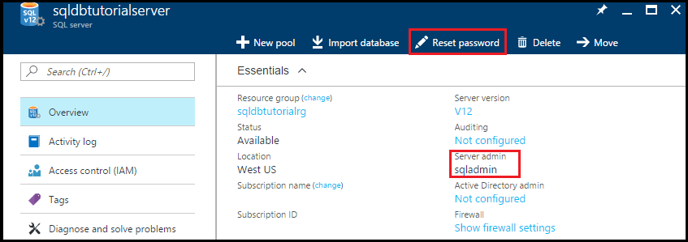  

2. 记下逻辑服务器上服务器管理员的名称。

3. 如果不记得密码，请单击“重置密码”设置新密码。

4. 如需获取此服务器的连接信息，请单击“属性”。

## 使用 SSMS 查看服务器管理员权限

本过程中的步骤说明如何查看有关 master 数据库和用户数据库中服务器管理员帐户及其权限的信息。

1. 打开 SQL Server Management Studio，使用 SQL Server 身份验证和服务器管理员帐户以服务器管理员的身份连接到服务器。

   	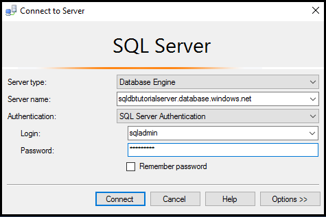  

2. 单击“连接”。

   	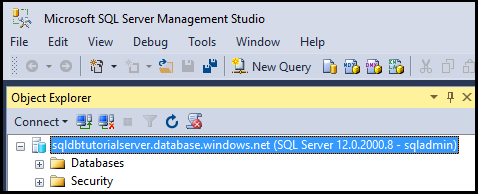  

3. 在对象资源管理器中展开“安全性”，然后展开“登录名”查看服务器的现有登录名 - 新服务器上的唯一登录名就是服务器管理员帐户的登录名。

   	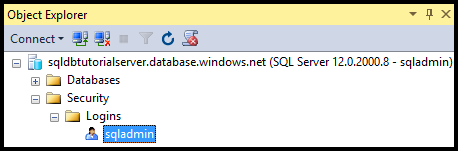 

4. 在对象资源管理器中，依次展开“数据库”、“系统数据库”、“master”、“安全性”、“用户”，查看为此数据库的服务器管理员登录名创建的用户帐户。

   	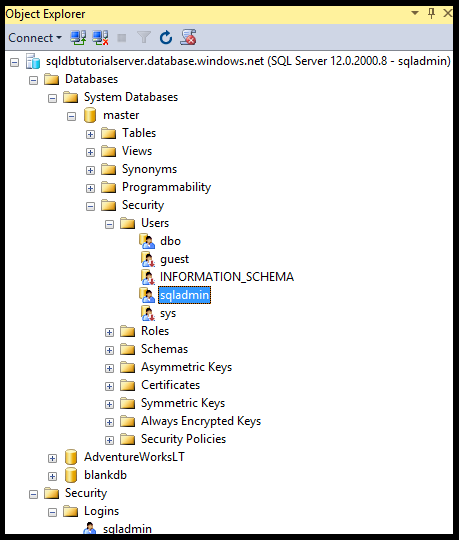  

   	> [AZURE.NOTE]
   	>有关“用户”节点中显示的其他用户帐户的信息，请参阅[主体](https://msdn.microsoft.com/zh-cn/library/ms181127.aspx)。
   	>

5. 在对象资源管理器中右键单击“master”，然后单击“新建查询”打开一个连接到 master 数据库的查询窗口。
6. 在查询窗口中执行以下查询，返回有关执行查询的用户的信息。

		SELECT USER;

   	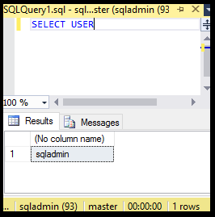  

7. 在查询窗口中执行以下查询，返回有关 **master** 数据库中 sqladmin 用户权限的信息。

		SELECT prm.permission_name
			, prm.class_desc
			, prm.state_desc
			, p2.name as 'Database role'
			, p3.name as 'Additional database role' 
		FROM sys.database_principals p
		JOIN sys.database_permissions prm
			ON p.principal_id = prm.grantee_principal_id
			LEFT JOIN sys.database_principals p2
			ON prm.major_id = p2.principal_id
			LEFT JOIN sys.database_role_members r
			ON p.principal_id = r.member_principal_id
			LEFT JOIN sys.database_principals p3
			ON r.role_principal_id = p3.principal_id
		WHERE p.name = 'sqladmin';

   	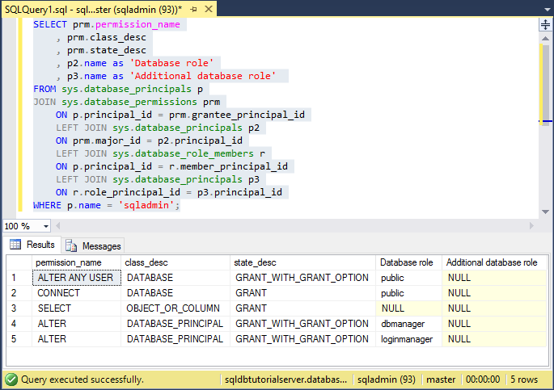  

   	>[AZURE.NOTE]
   	>服务器管理员有权连接到 master 数据库、创建登录名和用户、从 sys.sql\_logins 表中选择信息，以及将用户添加到 dbmanager 和 dbcreator 数据库角色。这些权限是对授予公共角色的权限的补充（所有用户从这些公共角色权限继承权限，例如，从特定的表中选择信息的权限）。有关详细信息，请参阅[权限](https://msdn.microsoft.com/zh-cn/library/ms191291.aspx)。
   	>

8. 在对象资源管理器中，依次展开“blankdb”、“安全性”、“用户”，查看为此数据库（以及每个用户数据库）中的服务器管理员登录名创建的用户帐户。

   	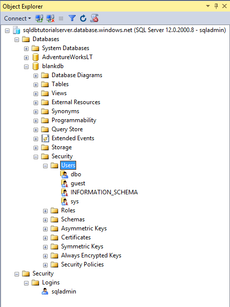  

9. 在对象资源管理器中右键单击“blankdb”，然后单击“新建查询”。

10. 在查询窗口中执行以下查询，返回有关执行查询的用户的信息。

		SELECT USER;

   	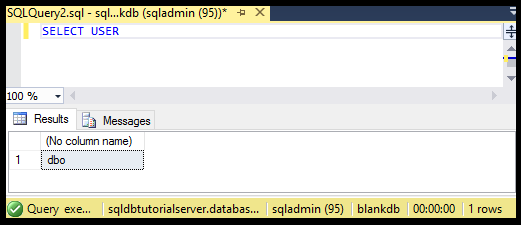  

11. 在查询窗口中执行以下查询，返回有关 dbo 用户权限的信息。

		SELECT prm.permission_name
			, prm.class_desc
			, prm.state_desc
			, p2.name as 'Database role'
			, p3.name as 'Additional database role' 
		FROM sys.database_principals AS p
		JOIN sys.database_permissions AS prm
			ON p.principal_id = prm.grantee_principal_id
			LEFT JOIN sys.database_principals AS p2
			ON prm.major_id = p2.principal_id
			LEFT JOIN sys.database_role_members r
			ON p.principal_id = r.member_principal_id
			LEFT JOIN sys.database_principals AS p3
			ON r.role_principal_id = p3.principal_id
		WHERE p.name = 'dbo';

   	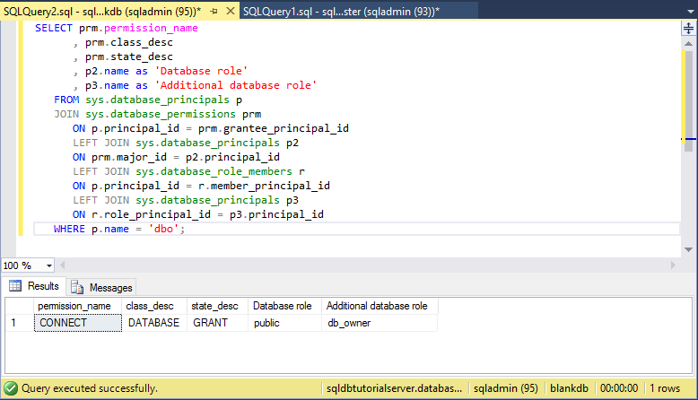  

   	> [AZURE.NOTE]
   	>dbo 用户是公共角色的成员，也是 db\_owner 固定数据库角色的成员。有关详细信息，请参阅[数据库级角色](https://msdn.microsoft.com/zh-cn/library/ms189121.aspx)。
   	>

## 创建具有 SELECT 权限的新用户

本过程中的步骤说明如何创建数据库级用户、测试新用户的默认权限（通过公共角色）、向用户授予 **SELECT** 权限，以及查看这些修改的权限。

> [AZURE.NOTE]
>数据库级用户也称为[包含的用户](https://msdn.microsoft.com/zh-cn/library/ff929188.aspx)，可以提高数据库的可移植性。有关可移植性的优势的信息，请参阅 [配置和管理 Azure SQL 数据库的安全性以便异地还原或故障转移到辅助服务器](/documentation/articles/sql-database-geo-replication-security-config/)。
>

1. 在对象资源管理器中右键单击“sqldbtutorialdb”，然后单击“新建查询”。
2. 在此查询窗口中执行以下语句，在 sqldbtutorialdb 数据库中创建名为 **user1** 的用户。

		CREATE USER user1
		WITH PASSWORD = 'p@ssw0rd';

   	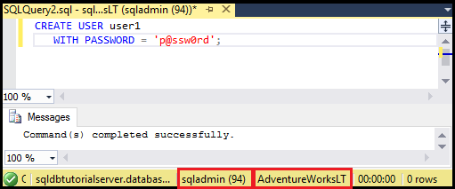  

3. 在查询窗口中执行以下查询，返回有关 user1 的权限的信息。

		SELECT prm.permission_name
			, prm.class_desc
			, prm.state_desc
			, p2.name as 'Database role'
			, p3.name as 'Additional database role' 
		FROM sys.database_principals AS p
		JOIN sys.database_permissions AS prm
			ON p.principal_id = prm.grantee_principal_id
			LEFT JOIN sys.database_principals AS p2
			ON prm.major_id = p2.principal_id
			LEFT JOIN sys.database_role_members r
			ON p.principal_id = r.member_principal_id
			LEFT JOIN sys.database_principals AS p3
			ON r.role_principal_id = p3.principal_id
		WHERE p.name = 'user1';

   	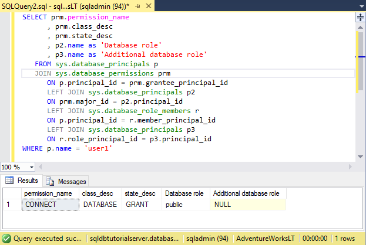  

   	> [AZURE.NOTE]
   	>数据库中的新用户只拥有从公共角色继承的权限。
   	>

4. 以只拥有从公共角色继承的权限的 **user1** 身份，使用 **EXECUTE AS USER** 语句执行以下查询，尝试查询 sqldbtutorialdb 数据库中的 SalesLT.ProductCategory 表。

		EXECUTE AS USER = 'user1'; SELECT * FROM [SalesLT].[ProductCategory]; REVERT;

   	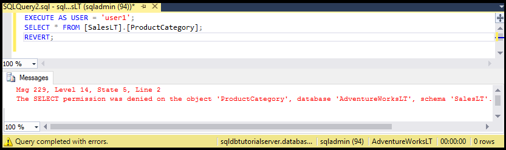  

   	> [AZURE.NOTE]
   	>默认情况下，公共角色不会授予对用户对象的 **SELECT** 权限。
   	>

5. 执行以下语句，向 **user1** 授予对 SalesLT.ProductCategory 表的 **SELECT** 权限。

 
		GRANT SELECT ON OBJECT::[SalesLT].[ProductCategory] to user1;

   	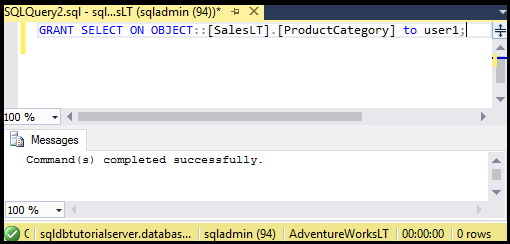  

6. 以 **user1** 的身份执行以下查询可以成功查询 sqldbtutorialdb 数据库中的 SalesLT.ProductCategory 表。

		EXECUTE AS USER = 'user1';  
		SELECT * FROM [SalesLT].[ProductCategory];
		REVERT;

   	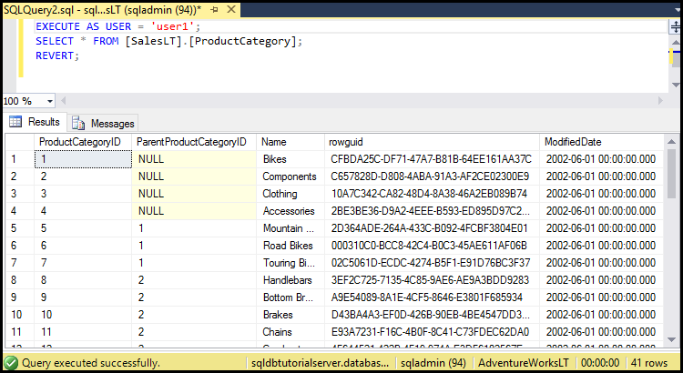  

## 使用 T-SQL 创建数据库级防火墙规则

本过程中的步骤说明如何使用 [sp\_set\_database\_firewall\_rule](https://msdn.microsoft.com/zh-cn/library/dn270010.aspx) 系统存储过程创建数据库级防火墙规则。服务器管理员可以使用数据库级防火墙规则来做到只允许用户通过 Azure SQL 数据库防火墙访问特定的数据库。

> [AZURE.NOTE]
> [Database-level firewall rules](/documentation/articles/sql-database-firewall-configure/) 能够提高数据库的可移植性。有关可移植性的优势的信息，请参阅 [配置和管理 Azure SQL 数据库的安全性以便异地还原或故障转移到辅助服务器](/documentation/articles/sql-database-geo-replication-security-config/)。
>

> [AZURE.IMPORTANT]
>若要测试数据库级防火墙规则，请从另一台计算机建立连接（或者在 Azure 门户中删除服务器级防火墙规则。）
>

1. 在尚未创建服务器级防火墙规则的计算机上打开 SQL Server Management Studio。

2. 在“连接到服务器”窗口中，输入服务器名称和身份验证信息，以便使用 **user1** 帐户通过 SQL Server 身份验证进行连接。
    
   	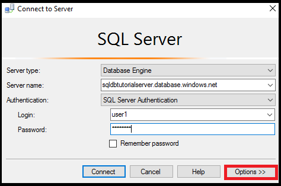  

3. 单击“选项”指定要连接到的数据库，然后在“连接属性”选项卡上的“连接到数据库”下拉框中键入 **sqldbtutorialdb**。
   
   	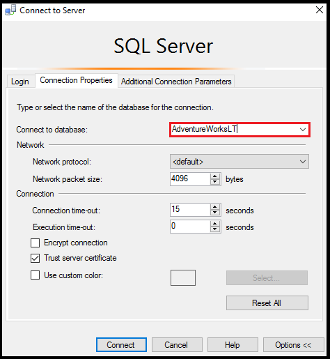  

4. 单击“连接”。

   此时会出现一个对话框，告知从中尝试连接到 SQL 数据库的计算机上不存在允许访问该数据库的防火墙规则。

   	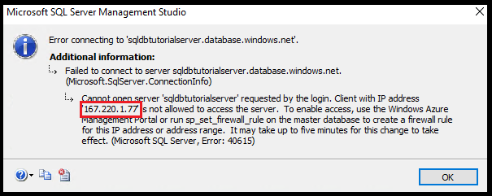  

5. 复制此对话框中的客户端 IP 地址，以便在步骤 8 中使用。

6. 单击“确定”关闭错误对话框，但不要关闭“连接到服务器”对话框。

7. 切换回到已创建服务器级防火墙规则的计算机。

8. 以服务器管理员的身份连接到 SSMS 中的 sqldbtutorialdb 数据库，然后执行以下语句，使用步骤 5 中的 IP 地址（或地址范围）创建数据库级防火墙。

		EXEC sp_set_database_firewall_rule @name = N'sqldbtutorialdbFirewallRule', 
			@start_ip_address = 'x.x.x.x', @end_ip_address = 'x.x.x.x';

   	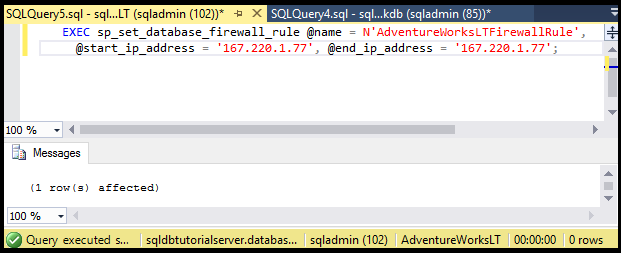  

9. 再次切换计算机，然后在“连接到服务器”对话框中单击“连接”，以 user1 身份连接到 sqldbtutorialdb。

   	> [AZURE.NOTE]
   	>创建数据库级防火墙规则后，它最长可能需要 5 分钟才会激活。
   	>

10. 成功连接后，在对象资源管理器中展开“数据库”。可以看到，**user1** 只能查看 **sqldbtutorialdb** 数据库。

   	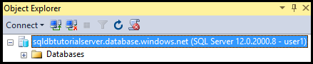  

11. 依次展开“sqldbtutorialdb”、“表”。可以看到，user1 仅有权查看单个表，即 **SalesLT.ProductCategory** 表。

   	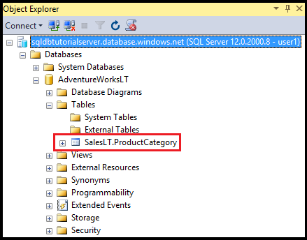  

## 创建名为 db\_owner 的新用户和数据库级防火墙规则

本过程中的步骤说明如何在另一个数据库中创建拥有 db\_owner 数据库角色权限的用户，并为此数据库创建数据库级防火墙。这个拥有 **db\_owner** 角色成员身份的新用户只能连接和管理此单一数据库。

1. 使用服务器管理员帐户，通过与 SQL 数据库建立的连接切换到你的计算机。
2. 打开连接到 **blankdb** 数据库的查询窗口并执行以下语句，在 blankdb 数据库中创建一个名为 blankdbadmin 的用户。

		CREATE USER blankdbadmin
		WITH PASSWORD = 'p@ssw0rd';

3. 在同一查询窗口中执行以下语句，将 blankdbadmin 用户添加到 db\_owner 数据库角色。现在，此用户可以执行所有必要的操作来管理 blankdb 数据库。

		ALTER ROLE db\_owner ADD MEMBER blankdbadmin;

4. 在同一查询窗口中执行以下语句，通过使用前一过程的步骤 4 中的 IP 地址（针对此数据库的用户使用一系列 IP 地址）执行 [sp\_set\_database\_firewall\_rule](https://msdn.microsoft.com/zh-cn/library/dn270010.aspx)，来创建数据库级防火墙：

		EXEC sp_set_database_firewall_rule @name = N'blankdbFirewallRule', 
			@start_ip_address = 'x.x.x.x', @end_ip_address = 'x.x.x.x';

5. 将计算机切换到创建了数据库级防火墙规则的计算机，然后使用 blankdbadmin 用户帐户连接到 blankdb 数据库。
6. 打开连接到 blankdb 数据库的查询窗口并执行以下语句，在 blankdb 数据库中创建一个名为 blankdbuser1 的用户。

		CREATE USER blankdbuser1
		WITH PASSWORD = 'p@ssw0rd';

 
7. 根据学习环境的需要，为此用户创建其他数据库级防火墙规则。但是，如果数据库级防火墙规则是使用 IP 地址范围创建的，则不一定要这样做。

## 授予 dbmanager 权限并创建服务器级防火墙规则

本过程中的步骤说明如何在 master 数据库中创建有权创建和管理新用户数据库的登录名与用户。此外，这些步骤还说明如何在 Transact-SQL 中使用 [sp\_set\_firewall\_rule](https://msdn.microsoft.com/zh-cn/library/dn270017.aspx) 创建其他服务器级防火墙规则。

> [AZURE.NOTE]
>第一个服务器级防火墙规则始终必须在 Azure 中创建（使用 Azure 门户、PowerShell 或 REST API）。
>
> [AZURE.IMPORTANT]
>只有在 master 数据库中创建登录名并基于登录名创建用户帐户，服务器管理员才能向其他用户委派数据库创建权限。但是，如果创建登录名，然后基于登录名创建用户，则会降低环境的可移植性。
>

1. 使用服务器管理员帐户，通过与 SQL 数据库建立的连接切换到你的计算机。
2. 打开连接到 master 数据库的查询窗口并执行以下语句，在 master 数据库中创建一个名为 dbcreator 的登录名。

		CREATE LOGIN dbcreator
		WITH PASSWORD = 'p@ssw0rd';

3. 在同一查询窗口中执行以下语句：

		CREATE USER dbcreator
		FROM LOGIN dbcreator;

3. 在同一查询窗口中执行以下查询，将 dbcreator 用户添加到 dbmanager 数据库角色。现在，此用户可以创建数据库并管理其他用户创建的数据库。

		ALTER ROLE dbmanager ADD MEMBER dbcreator;

4. 在同一查询窗口中执行以下查询，通过使用适用于环境的 IP 地址执行 [sp\_set\_firewall\_rule](https://msdn.microsoft.com/zh-cn/library/dn270017.aspx)，来创建服务器级防火墙：

		EXEC sp_set_firewall_rule @name = N'dbcreatorFirewallRule', 
			@start_ip_address = 'x.x.x.x', @end_ip_address = 'x.x.x.x';

5. 将计算机切换到创建了服务器级防火墙规则的计算机，然后使用 dbcreator 用户帐户连接到 master 数据库。
6. 打开连接到 master 数据库的查询窗口并执行以下查询，创建名为 foo 的数据库。

		CREATE DATABASE FOO (EDITION = 'basic');

 7. （可选）使用以下语句删除此数据库，以节省费用：

		DROP DATABASE FOO;

## 完整脚本

若要创建登录名和用户、将其添加到角色、向其授予权限、创建数据库级防火墙规则和创建服务器级防火墙规则，请在服务器上的相应数据库中执行以下语句。

### master 数据库
请使用服务器管理员帐户并添加相应的 IP 地址或范围，在 master 数据库中执行这些语句。

	CREATE LOGIN dbcreator WITH PASSWORD = 'p@ssw0rd';
	CREATE USER dbcreator FROM LOGIN dbcreator;
	ALTER ROLE dbmanager ADD MEMBER dbcreator;
	EXEC sp_set_firewall_rule @name = N'dbcreatorFirewallRule', 
	     @start_ip_address = 'x.x.x.x', @end_ip_address = 'x.x.x.x';

### sqldbtutorialdb 数据库
使用服务器管理员帐户并添加相应的 IP 地址或范围，在 sqldbtutorialdb 数据库中执行这些语句。

	CREATE USER user1 WITH PASSWORD = 'p@ssw0rd';
	GRANT SELECT ON OBJECT::[SalesLT].[ProductCategory] to user1;
	EXEC sp_set_database_firewall_rule @name = N'sqldbtutorialdbFirewallRule', 
	     @start_ip_address = 'x.x.x.x', @end_ip_address = 'x.x.x.x';

### blankdb 数据库
请使用服务器管理员帐户并添加相应的 IP 地址或范围，在 blankdb 数据库中执行这些语句。

	CREATE USER blankdbadmin
	   WITH PASSWORD = 'p@ssw0rd';
	ALTER ROLE db_owner ADD MEMBER blankdbadmin;
	EXEC sp_set_database_firewall_rule @name = N'blankdbFirewallRule', 
	     @start_ip_address = 'x.x.x.x', @end_ip_address = 'x.x.x.x';
	CREATE USER blankdbuser1
	   WITH PASSWORD = 'p@ssw0rd';

## 后续步骤
- 有关 SQL 数据库中的访问和控制的概述，请参阅 [SQL 数据库访问和控制](/documentation/articles/sql-database-control-access/)。
- 有关 SQL 数据库中的登录名、用户和数据库角色的概述，请参阅[登录名、用户和数据库角色](/documentation/articles/sql-database-manage-logins/)。
- 有关数据库主体的详细信息，请参阅[主体](https://msdn.microsoft.com/zh-cn/library/ms181127.aspx)。
- 有关数据库角色的详细信息，请参阅[数据库角色](https://msdn.microsoft.com/zh-cn/library/ms189121.aspx)。
- 有关 SQL 数据库中的防火墙规则的详细信息，请参阅 [SQL 数据库防火墙规则](/documentation/articles/sql-database-firewall-configure/)。
- 有关如何使用 Azure Active Directory 身份验证的教程，请参阅 [Azure AD 身份验证和授权](/documentation/articles/sql-database-control-access-aad-authentication-get-started/)。

<!---HONumber=Mooncake_0320_2017-->
