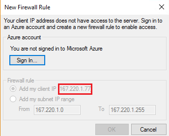
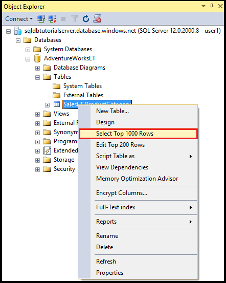
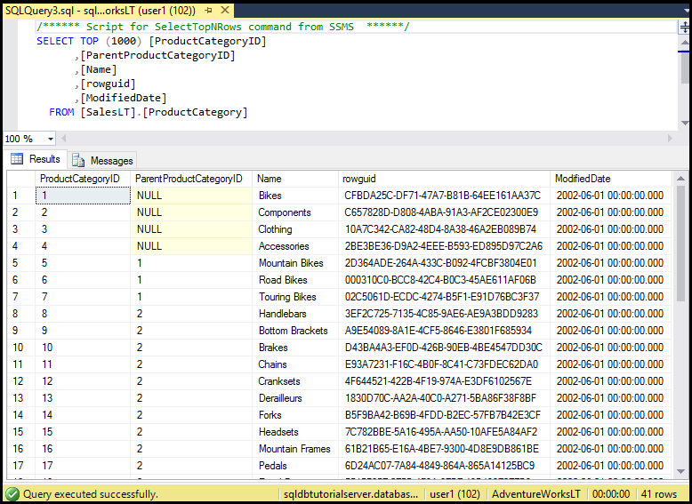

<properties
    pageTitle="SQL 身份验证：Azure SQL 数据库防火墙、身份验证和访问权限 | Azure"
    description="本入门教程介绍如何在 SQL Server Management Studio 和 Transact-SQL 中使用授予 Azure SQL 数据库服务器和数据库访问权限与控制权限的服务器级和数据库级防火墙规则、SQL 身份验证、登录名、用户与数据库角色。"
    keywords=""
    services="sql-database"
    documentationcenter=""
    author="CarlRabeler"
    manager="jhubbard"
    editor="" />
<tags
    ms.assetid="67797b09-f5c3-4ec2-8494-fe18883edf7f"
    ms.service="sql-database"
    ms.custom="authentication and authorization"
    ms.workload="data-management"
    ms.tgt_pltfrm="na"
    ms.devlang="na"
    ms.topic="hero-article"
    ms.date="01/17/2017"
    wacn.date="01/25/2017"
    ms.author="carlrab" />  

# SQL 数据库教程：SQL Server 身份验证、登录名和用户帐户、数据库角色、权限、服务器级防火墙规则和数据库级防火墙规则
本入门教程介绍如何在 SQL Server Management Studio 中使用授予 Azure SQL 数据库服务器和数据库访问权限与许可权限的 SQL Server 身份验证、登录名、用户与数据库角色。学习内容：

- 查看 master 数据库和用户数据库中的用户权限
- 基于 SQL Server 身份验证创建登录名和用户
- 向用户授予服务器范围的权限和特定于数据库的权限
- 以非管理员用户身份登录到用户数据库
- 针对数据库用户创建数据库级防火墙规则
- 针对服务器管理员创建服务器级防火墙规则

**时间估计**：完成本教程大约需要 45 分钟（假设满足先决条件）。

## 先决条件

* 需要一个 Azure 帐户。可以[注册 Azure 1 元试用帐户](/pricing/1rmb-trial/?WT.mc_id=A261C142F)。

* 必须能够使用帐户连接到 Azure 门户预览，该帐户是订阅所有者或参与者角色的成员。有关基于角色的访问控制 (RBAC) 的详细信息，请参阅[开始在 Azure 门户预览中进行访问管理](/documentation/articles/role-based-access-control-what-is/)。

* 你已完成本教程的[开始使用 Azure 门户预览和 SQL Server Management Studio 了解 Azure SQL 数据库服务器、数据库和防火墙规则](/documentation/articles/sql-database-get-started/)部分或与之类似的 [PowerShell 版本](/documentation/articles/sql-database-get-started-powershell/)部分。请完成此必学教程或在完成本教程的 [PowerShell 版本](/documentation/articles/sql-database-get-started-powershell/)部分时执行 PowerShell 脚本（如果尚未进行），然后再继续。

> [AZURE.NOTE]
本教程帮助读者了解以下学习主题的内容：[SQL 数据库访问和控制](/documentation/articles/sql-database-control-access/)，[登录名、用户和数据库角色](/documentation/articles/sql-database-manage-logins/)、[主体](https://msdn.microsoft.com/zh-cn/library/ms181127.aspx)、[数据库角色](https://msdn.microsoft.com/zh-cn/library/ms189121.aspx)和 [SQL 数据库防火墙规则](/documentation/articles/sql-database-firewall-configure/)。
>  

## 使用 Azure 帐户登录到 Azure 门户预览
使用[现有订阅](https://account.windowsazure.cn/Home/Index)，按照以下步骤连接到 Azure 门户预览。

1. 打开所选浏览器并连接到 [Azure 门户预览](https://portal.azure.cn/)。
2. 登录到 [Azure 门户预览](https://portal.azure.cn/)。
3. 在“登录”页上，提供订阅的凭据。
   
     

## 查看有关逻辑服务器安全配置的信息

本教程部分介绍如何在 Azure 门户预览中查看有关逻辑服务器安全配置的信息。

1. 打开逻辑服务器的“SQL Server”边栏选项卡，在“概述”页中查看信息。

     

2. 记下逻辑服务器的服务器管理员帐户名称。如果不记得密码，请单击“重置密码”设置新密码。

> [AZURE.NOTE]
若要查看此服务器的连接信息，请转到[查看或更新服务器设置](/documentation/articles/sql-database-view-update-server-settings/)。在本系列教程中，完全限定的服务器名称为“sqldbtutorialserver.database.chinacloudapi.cn”。
>

## 使用 SQL Server Management Studio (SSMS) 连接到 SQL Server

1. 请在[下载 SQL Server Management Studio](https://msdn.microsoft.com/zh-cn/library/mt238290.aspx) 中下载并安装最新版 SSMS（如果尚未这样做）。为了保持版本最新，当有新版本可供下载时 SSMS 最新版本会提示你。

2. 安装后，在 Windows 搜索框中键入 **Microsoft SQL Server Management Studio**，然后单击 **Enter** 打开 SSMS。

     

3. 在“连接到服务器”对话框中输入所需的信息，以便能够使用 SQL Server 身份验证和服务器管理员帐户连接到 SQL Server。

     

4. 单击“连接”。

     

## 查看服务器管理员帐户及其权限 
本教程部分介绍如何查看有关 master 数据库和用户数据库中服务器管理员帐户及其权限的信息。

1. 在对象资源管理器中展开“安全性”，然后展开“登录名”，查看 Azure SQL 数据库服务器的现有登录名。可以看到，已针对预配期间指定的服务器管理员帐户显示了一个登录名 - 在本系列教程中，该登录名为 sqladmin。

     

2. 在对象资源管理器中，依次展开“数据库”、“系统数据库”、“master”、“安全性”、“用户”。可以看到，已在 master 数据库中为服务器管理员登录名创建了一个用户帐户，其名称与登录用户帐户的名称相同（这两个名称不一定要相同，但最好是避免混淆）。

     

   > [AZURE.NOTE]
   有关显示的其他用户帐户的信息，请参阅[主体](https://msdn.microsoft.com/zh-cn/library/ms181127.aspx)。
   >

3. 在对象资源管理器中右键单击“master”，然后单击“新建查询”打开一个连接到 master 数据库的查询窗口。
4. 在查询窗口中执行以下查询，返回有关执行查询的用户的信息。可以看到，针对执行此查询的用户帐户返回了 sqladmin（稍后使用此过程查询用户数据库时，将看到不同的结果）。

   	SELECT USER;

     

5. 在查询窗口中执行以下查询，返回有关 sqladmin 用户权限的信息。可以看到，sqladmin 有权连接到 master 数据库、创建登录名和用户、从 sys.sql\_logins 表中选择信息，以及将用户添加到 dbmanager 和 dbcreator 数据库角色。这些权限是对授予公共角色的权限的补充（所有用户从这些公共角色权限继承权限，例如，从特定的表中选择信息的权限）。有关详细信息，请参阅[权限](https://msdn.microsoft.com/zh-cn/library/ms191291.aspx)。

	   SELECT prm.permission_name
	      , prm.class_desc
	      , prm.state_desc
	      , p2.name as 'Database role'
	      , p3.name as 'Additional database role' 
	   FROM sys.database_principals p
	   JOIN sys.database_permissions prm
	      ON p.principal_id = prm.grantee_principal_id
	      LEFT JOIN sys.database_principals p2
	      ON prm.major_id = p2.principal_id
	      LEFT JOIN sys.database_role_members r
	      ON p.principal_id = r.member_principal_id
	      LEFT JOIN sys.database_principals p3
	      ON r.role_principal_id = p3.principal_id
	   WHERE p.name = 'sqladmin';

     

6. 在对象资源管理器中，依次展开“blankdb”、“安全性”、“用户”。可以看到，此数据库中不存在名为 sqladmin 的用户帐户。

     

7. 在对象资源管理器中右键单击“blankdb”，然后单击“新建查询”。

8. 在查询窗口中执行以下查询，返回有关执行查询的用户的信息。可以看到，已针对执行此查询的用户帐户返回了 dbo（默认情况下，服务器管理员登录名将映射到每个用户数据库中的 dbo 用户帐户）。

   	SELECT USER;

     

9. 在查询窗口中执行以下查询，返回有关 dbo 用户权限的信息。请注意，dbo 是公共角色的成员，也是 db\_owner 固定数据库角色的成员。有关详细信息，请参阅[数据库级角色](https://msdn.microsoft.com/zh-cn/library/ms189121.aspx)。

	   SELECT prm.permission_name
	      , prm.class_desc
	      , prm.state_desc
	      , p2.name as 'Database role'
	      , p3.name as 'Additional database role' 
	   FROM sys.database_principals AS p
	   JOIN sys.database_permissions AS prm
	      ON p.principal_id = prm.grantee_principal_id
	      LEFT JOIN sys.database_principals AS p2
	      ON prm.major_id = p2.principal_id
	      LEFT JOIN sys.database_role_members r
	      ON p.principal_id = r.member_principal_id
	      LEFT JOIN sys.database_principals AS p3
	      ON r.role_principal_id = p3.principal_id
	   WHERE p.name = 'dbo';

     

10. （可选）针对 AdventureWorksLT 用户数据库重复前三个步骤。

## 在 AdventureWorksLT 数据库中创建具有 SELECT 权限的新用户

本教程部分介绍如何在 AdventureWorksLT 数据库中创建一个用户帐户，测试此用户作为公共角色成员的权限，向此用户授予 SELECT 权限，然后再次测试此用户的权限。

> [AZURE.NOTE]
数据库级用户（[包含的用户](https://msdn.microsoft.com/zh-cn/library/ff929188.aspx)）可以提高数据库的可移植性，后续教程将介绍此功能。
>

1. 在对象资源管理器中右键单击“AdventureWorksLT”，然后单击“新建查询”打开一个连接到 AdventureWorksLT 数据库的查询窗口。
2. 执行以下语句，在 AdventureWorksLT 数据库中创建名为 user1 的用户。

	   CREATE USER user1
	   WITH PASSWORD = 'p@ssw0rd';

     

3. 在查询窗口中执行以下查询，返回有关 user1 的权限的信息。可以看到，user1 拥有的权限无非就是从公共角色继承的权限。

	   SELECT prm.permission_name
	      , prm.class_desc
	      , prm.state_desc
	      , p2.name as 'Database role'
	      , p3.name as 'Additional database role' 
	   FROM sys.database_principals AS p
	   JOIN sys.database_permissions AS prm
	      ON p.principal_id = prm.grantee_principal_id
	      LEFT JOIN sys.database_principals AS p2
	      ON prm.major_id = p2.principal_id
	      LEFT JOIN sys.database_role_members r
	      ON p.principal_id = r.member_principal_id
	      LEFT JOIN sys.database_principals AS p3
	      ON r.role_principal_id = p3.principal_id
	   WHERE p.name = 'user1';

     

4. 执行以下查询，尝试以 user1 的身份查询 AdventureWorksLT 数据库中的某个表。

	   EXECUTE AS USER = 'user1';  
	   SELECT * FROM [SalesLT].[ProductCategory];
	   REVERT;

     

5. 执行以下语句，向 user1 授予对 SalesLT 架构中 ProductCategory 表的 SELECT 权限。

 
   	GRANT SELECT ON OBJECT::[SalesLT].[ProductCategory] to user1;

     

6. 执行以下查询，尝试以 user1 的身份查询 AdventureWorksLT 数据库中的某个表。

	   EXECUTE AS USER = 'user1';  
	   SELECT * FROM [SalesLT].[ProductCategory];
	   REVERT;

     

## 针对 AdventureWorksLT 数据库用户创建数据库级防火墙规则

在本教程部分，你要尝试通过一台具有不同 IP 地址的计算机登录，以服务器管理员身份创建数据库级防火墙规则，然后使用这个新的数据库级防火墙规则登录。

> [AZURE.NOTE]
> [Database-level firewall rules](/documentation/articles/sql-database-firewall-configure/) 可以提高数据库的可移植性，后续教程将介绍此功能。
>

1. 在尚未创建服务器级防火墙规则的另一台计算机上，打开 SQL Server Management Studio。

   > [AZURE.IMPORTANT]
   请始终使用最新版本的 SSMS（[下载 SQL Server Management Studio](https://msdn.microsoft.com/zh-cn/library/mt238290.aspx)）。
   >

2. 在“连接到服务器”窗口中，输入服务器名称和身份验证信息，以便使用 user1 帐户通过 SQL Server 身份验证进行连接。
    
     

3. 单击“选项”指定要连接到的数据库，然后在“连接属性”选项卡上的“连接到数据库”下拉框中键入 **AdventureWorksLT**。
   
     

4. 单击“连接”。此时会出现一个对话框，告知从中尝试连接到 SQL 数据库的计算机上不存在允许访问该数据库的防火墙规则。根据前面在配置防火墙时执行的步骤，会出现两种不同形式的对话框，但一般情况下会显示第一种形式的对话框。

     

     

   > [AZURE.NOTE]
   最新版本的 SSMS 提供相应的功能让订阅所有者和参与者登录到 Azure 以及创建服务器级防火墙规则。
   > 

4. 复制此对话框中的客户端 IP 地址，以便在步骤 7 中使用。
5. 单击“取消”，但不要关闭“连接到服务器”对话框。
6. 切换回到已创建服务器级防火墙规则的计算机，然后使用服务器管理员帐户连接到服务器。
7. 在连接到 AdventureWorksLT 数据库的新查询窗口中，以服务器管理员的身份执行以下语句，通过使用步骤 4 中的 IP 地址执行 [sp\_set\_database\_firewall\_rule](https://msdn.microsoft.com/zh-cn/library/dn270010.aspx)，来创建数据库级防火墙：

	   EXEC sp_set_database_firewall_rule @name = N'AdventureWorksLTFirewallRule', 
	     @start_ip_address = 'x.x.x.x', @end_ip_address = 'x.x.x.x';

     

8. 再次切换计算机，然后在“连接到服务器”对话框中单击“连接”，以 user1 身份连接到 AdventureWorksLT。

     

9. 在对象资源管理器，依次展开“数据库”、“AdventureWorksLT”、“表”。可以看到，user1 仅有权查看单个表，即 **SalesLT.ProductCategory** 表。

     

10. 在对象资源管理器中右键单击“SalesLT.ProductCategory”，然后单击“选择前 1000 行”。

     

     

## 在 blankdb 数据库中创建拥有 db\_owner 数据库角色权限的新用户并创建数据库级防火墙规则

本教程部分介绍如何在 blankdb 数据库中创建拥有 db\_owner 数据库角色权限的用户，并使用服务器管理员帐户为此数据库创建数据库级防火墙。

1. 使用服务器管理员帐户，通过与 SQL 数据库建立的连接切换到你的计算机。
2. 打开连接到 blankdb 数据库的查询窗口并执行以下语句，在 blankdb 数据库中创建一个名为 blankdbadmin 的用户。

	   CREATE USER blankdbadmin
	   WITH PASSWORD = 'p@ssw0rd';

3. 在同一查询窗口中执行以下语句，将 blankdbadmin 用户添加到 db\_owner 数据库角色。现在，此用户可以执行所有必要的操作来管理 blankdb 数据库。

	   ALTER ROLE db\_owner ADD MEMBER blankdbadmin;

4. 在同一查询窗口中执行以下语句，通过使用前一过程的步骤 4 中的 IP 地址（针对此数据库的用户使用一系列 IP 地址）执行 [sp\_set\_database\_firewall\_rule](https://msdn.microsoft.com/zh-cn/library/dn270010.aspx)，来创建数据库级防火墙：

	   EXEC sp_set_database_firewall_rule @name = N'blankdbFirewallRule', 
	     @start_ip_address = 'x.x.x.x', @end_ip_address = 'x.x.x.x';

5. 将计算机切换到创建了数据库级防火墙规则的计算机，然后使用 blankdbadmin 用户帐户连接到 blankdb 数据库。
6. 打开连接到 blankdb 数据库的查询窗口并执行以下语句，在 blankdb 数据库中创建一个名为 blankdbuser1 的用户。

	   CREATE USER blankdbuser1
	   WITH PASSWORD = 'p@ssw0rd';

 
7. 根据学习环境的需要，为此用户创建其他数据库级防火墙规则。

## 在 master 数据库中创建拥有 dbmanager 权限的新登录名和用户并创建服务器级防火墙规则

在本教程部分，我们将在 master 数据库中创建有权创建和管理新用户数据库的拥有登录名与用户。此外，将在 Transact-SQL 中使用 [sp\_set\_firewall\_rule](https://msdn.microsoft.com/zh-cn/library/dn270017.aspx) 创建其他服务器级防火墙规则。

> [AZURE.NOTE]
只有在 master 数据库中创建登录名并基于登录名创建用户帐户，服务器管理员帐户持有者才能向其他用户委托数据库创建权限。但是，基于登录名创建登录名和用户会降低环境的可移植性（后续教程将探讨其后果，包括灾难恢复规划过程中如何预测和处理风险）。
>

1. 使用服务器管理员帐户，通过与 SQL 数据库建立的连接切换到你的计算机。
2. 打开连接到 master 数据库的查询窗口并执行以下语句，在 master 数据库中创建一个名为 dbcreator 的登录名。

	   CREATE LOGIN dbcreator
	   WITH PASSWORD = 'p@ssw0rd';

3. 在同一查询窗口中执行以下语句：

	   CREATE USER dbcreator
	   FROM LOGIN dbcreator;

3. 在同一查询窗口中执行以下查询，将 dbcreator 用户添加到 dbmanager 数据库角色。现在，此用户可以创建数据库并管理其他用户创建的数据库。

	   ALTER ROLE dbmanager ADD MEMBER dbcreator;

4. 在同一查询窗口中执行以下查询，通过使用适用于环境的 IP 地址执行 [sp\_set\_database\_firewall\_rule](https://msdn.microsoft.com/zh-cn/library/dn270010.aspx)，来创建服务器级防火墙：

	   EXEC sp_set_firewall_rule @name = N'dbcreatorFirewallRule', 
	     @start_ip_address = 'x.x.x.x', @end_ip_address = 'x.x.x.x';

5. 将计算机切换到创建了服务器级防火墙规则的计算机，然后使用 dbcreator 用户帐户连接到 master 数据库。
6. 打开连接到 master 数据库的查询窗口并执行以下查询，创建名为 foo 的数据库。

	   CREATE DATABASE FOO (EDITION = 'basic');

 7. （可选）使用以下语句删除此数据库，以节省费用：

	   DROP DATABASE FOO;

## 完整脚本

若要创建登录名和用户、将其添加到角色、向其授予权限、创建数据库级防火墙规则和创建服务器级防火墙规则，请在服务器上的相应数据库中执行以下语句。

### master 数据库
请使用服务器管理员帐户并添加相应的 IP 地址或范围，在 master 数据库中执行这些语句。

	CREATE LOGIN dbcreator WITH PASSWORD = 'p@ssw0rd';
	CREATE USER dbcreator FROM LOGIN dbcreator;
	ALTER ROLE dbmanager ADD MEMBER dbcreator;
	EXEC sp_set_firewall_rule @name = N'dbcreatorFirewallRule', 
	     @start_ip_address = 'x.x.x.x', @end_ip_address = 'x.x.x.x';

### AdventureWorksLT 数据库
请使用服务器管理员帐户并添加相应的 IP 地址或范围，在 AdventureWorksLT 数据库中执行这些语句。

	CREATE USER user1 WITH PASSWORD = 'p@ssw0rd';
	GRANT SELECT ON OBJECT::[SalesLT].[ProductCategory] to user1;
	EXEC sp_set_database_firewall_rule @name = N'AdventureWorksLTFirewallRule', 
	     @start_ip_address = 'x.x.x.x', @end_ip_address = 'x.x.x.x';

### blankdb 数据库
请使用服务器管理员帐户并添加相应的 IP 地址或范围，在 blankdb 数据库中执行这些语句。

	CREATE USER blankdbadmin
	   WITH PASSWORD = 'p@ssw0rd';
	ALTER ROLE db_owner ADD MEMBER blankdbadmin;
	EXEC sp_set_database_firewall_rule @name = N'blankdbFirewallRule', 
	     @start_ip_address = 'x.x.x.x', @end_ip_address = 'x.x.x.x';
	CREATE USER blankdbuser1
	   WITH PASSWORD = 'p@ssw0rd';

## 后续步骤
- 有关 SQL 数据库中的访问和控制的概述，请参阅 [SQL 数据库访问和控制](/documentation/articles/sql-database-control-access/)。
- 有关 SQL 数据库中的登录名、用户和数据库角色的概述，请参阅[登录名、用户和数据库角色](/documentation/articles/sql-database-manage-logins/)。
- 有关数据库主体的详细信息，请参阅[主体](https://msdn.microsoft.com/zh-cn/library/ms181127.aspx)。
- 有关数据库角色的详细信息，请参阅[数据库角色](https://msdn.microsoft.com/zh-cn/library/ms189121.aspx)。
- 有关 SQL 数据库中的防火墙规则的详细信息，请参阅 [SQL 数据库防火墙规则](/documentation/articles/sql-database-firewall-configure/)。
- 有关使用 Azure Active Directory 身份验证的教程，请参阅 [SQL 数据库教程：AAD 身份验证、登录名和用户帐户、数据库角色、权限、服务器级防火墙规则和数据库级防火墙规则](/documentation/articles/sql-database-control-access-sql-authentication-get-started/)。

<!---HONumber=Mooncake_0120_2017-->