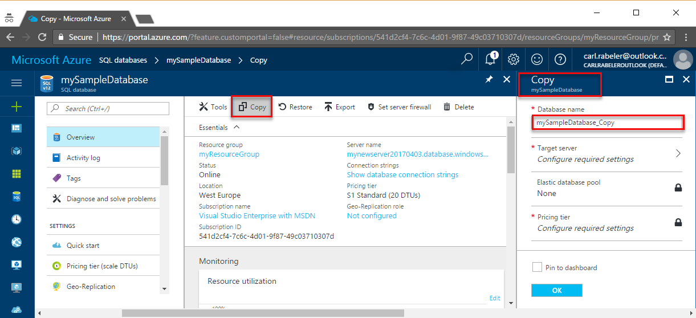

<properties
    pageTitle="复制 Azure SQL 数据库 | Azure"
    description="创建 Azure SQL 数据库的副本"
    services="sql-database"
    documentationcenter=""
    author="anosov1960"
    manager="jhubbard"
    editor="" />
<tags
    ms.assetid="5aaf6bcd-3839-49b5-8c77-cbdf786e359b"
    ms.service="sql-database"
    ms.custom="move data"
    ms.devlang="NA"
    ms.date="04/05/2017"
    wacn.date="05/22/2017"
    ms.author="sashan;carlrab"
    ms.workload="data-management"
    ms.topic="article"
    ms.tgt_pltfrm="NA"
    ms.translationtype="Human Translation"
    ms.sourcegitcommit="8fd60f0e1095add1bff99de28a0b65a8662ce661"
    ms.openlocfilehash="c0f569bfe82c6d367133fce9fc0e56751c52ffbc"
    ms.contentlocale="zh-cn"
    ms.lasthandoff="05/12/2017" />

# 复制 Azure SQL 数据库

通过 Azure SQL 数据库，可以以多种方式在相同或不同的服务器上创建现有 Azure SQL 数据库的事务一致性副本。 可以使用 Azure 门户、PowerShell 或 T-SQL 复制 SQL 数据库。 

## 概述

数据库副本是源数据库截至复制请求发出时的快照。 可以选择相同或不同的服务器、其服务层和性能级别、相同服务层中的不同性能级别（版本）。 在完成复制后，副本将成为能够完全行使功能的独立数据库。 此时，可以将其升级或降级为任何版本。 登录名、用户和权限可单独进行管理。  

## 数据库副本中的登录名

将某个数据库复制到同一逻辑服务器时，可以在这两个数据库上使用相同的登录名。 用于复制该数据库的安全主体将成为新数据库上的数据库所有者 (DBO)。 所有数据库用户、其权限及安全标识符 (SID) 都将复制到数据库副本中。  

将数据库复制到不同的逻辑服务器时，新服务器上的安全主体将成为新数据库上的数据库所有者。 如果使用[包含的数据库用户](/documentation/articles/sql-database-manage-logins/)进行数据访问，请确保主数据库和辅助数据库始终具有相同的用户凭据，这样在复制完成后，便可以使用相同的凭据立即访问。 

如果使用 [Azure Active Directory](/documentation/articles/active-directory-whatis/)，则完全无需管理副本中的凭据。 但是，将数据库复制到新服务器时，基于登录名的访问可能不起作用，因为登录名在新服务器上不存在。 若要了解如何在将数据库复制到其他逻辑服务器时管理登录名，请参阅[灾难恢复后如何管理 Azure SQL 数据库安全性](/documentation/articles/sql-database-geo-replication-security-config/)。 

复制成功之后，重新映射其他用户之前，只有启动复制的登录名，即数据库所有者 (DBO)，才能登录到新数据库。 若要在复制操作完成后解析登录名，请参阅[解析登录名](/documentation/articles/sql-database-copy/#resolve-logins.md)

## 使用 Azure 门户复制数据库

若要使用 Azure 门户复制数据库，请打开数据库页，并在工具栏上单击“复制”。 

   

## 使用 PowerShell 复制数据库

若要使用 PowerShell 复制数据库，请使用 [New-AzureRmSqlDatabaseCopy](https://docs.microsoft.com/zh-cn/powershell/module/azurerm.sql/new-azurermsqldatabasecopy) cmdlet。 

    New-AzureRmSqlDatabaseCopy -ResourceGroupName "myResourceGroup" `
        -ServerName $sourceserver `
        -DatabaseName "MySampleDatabase" `
        -CopyResourceGroupName "myResourceGroup" `
        -CopyServerName $targetserver `
        -CopyDatabaseName "CopyOfMySampleDatabase"

如需完整的示例脚本，请参阅[将数据库复制到新的服务器](/documentation/articles/sql-database-copy-database-to-new-server-powershell/)

## 使用 Transact-SQL 复制数据库

使用服务器级别主体登录名或创建了你要复制的数据库的登录名登录到 master 数据库。 非服务器级主体的登录名必须是 dbmanager 角色的成员才能复制数据库。 有关登录名和链接到服务器的详细信息，请参阅[管理登录名](/documentation/articles/sql-database-manage-logins/)。

使用 [CREATE DATABASE](https://msdn.microsoft.com/zh-cn/library/ms176061.aspx) 语句开始复制源数据库。 执行此语句将启动数据库复制过程。 因为复制数据库是一个异步过程，所以，CREATE DATABASE 语句将在数据库完成复制前返回。

### 将 SQL 数据库复制到同一台服务器
使用服务器级别主体登录名或创建了你要复制的数据库的登录名登录到 master 数据库。 非服务器级主体的登录名必须是 dbmanager 角色的成员才能复制数据库。

此命令将 Database1 复制到同一服务器上名为 Database2 的新数据库。 根据数据库的大小，复制操作可能需要一些时间才能完成。

    -- Execute on the master database.
    -- Start copying.
    CREATE DATABASE Database1_copy AS COPY OF Database1;

### 将 SQL 数据库复制到不同的服务器

登录到目标服务器（即要创建新数据库的 Azure SQL 数据库服务器）的 master 数据库。 所用登录名的名称和密码应该与源 Azure SQL 数据库服务器上源数据库的数据库所有者 (DBO) 的名称和密码相同。 目标服务器上的登录名也必须是 dbmanager 角色的成员或服务器级主体登录名。

此命令将 server1 上的 Database1 复制到 server2 上名为 Database2 的新数据库。 根据数据库的大小，复制操作可能需要一些时间才能完成。

    -- Execute on the master database of the target server (server2)
    -- Start copying from Server1 to Server2
    CREATE DATABASE Database1_copy AS COPY OF server1.Database1;

### 监视复制操作的进度

通过查询 sys.databases 和 sys.dm_database_copies 视图来监视复制过程。 在复制过程中，新数据库的 sys.databases 视图的 state_desc 列将设置为 COPYING。

* 如果复制失败，新数据库的 sys.databases 视图的 state_desc 列将设置为 SUSPECT。 在这种情况下，对新数据库执行 DROP 语句并稍后重试。
* 如果复制成功，新数据库的 sys.databases 视图的 state_desc 列将设置为 ONLINE。 在这种情况下，复制已完成并且新数据库是一个常规数据库，可独立于源数据库进行更改。

> [AZURE.NOTE]
> * 如果决定在复制过程中取消复制，请对新数据库执行 [DROP DATABASE](https://msdn.microsoft.com/zh-cn/library/ms178613.aspx) 语句。 此外，对源数据库执行 DROP DATABASE 语句也将取消复制过程。
> 

## 解析登录名

当新数据库在目标服务器上联机后，使用 [ALTER USER](https://msdn.microsoft.com/zh-cn/library/ms176060.aspx) 语句将新数据库中的用户重新映射到目标服务器上的登录名。 若要解析孤立用户，请参阅[孤立用户疑难解答](https://msdn.microsoft.com/zh-cn/library/ms175475.aspx)。 另请参阅[灾难恢复后如何管理 Azure SQL 数据库安全性](/documentation/articles/sql-database-geo-replication-security-config/)。

新数据库中的所有用户都保持他们在源数据库中已有的权限。 启动数据库复制过程的用户将成为新数据库的数据库所有者，并且会为该用户分配一个新的安全标识符 (SID)。 复制成功之后，重新映射其他用户之前，只有启动复制的登录名，即数据库所有者 (DBO)，才能登录到新数据库。

若要了解如何在将数据库复制到其他逻辑服务器时管理用户和登录名，另请参阅[灾难恢复后如何管理 Azure SQL 数据库安全性](/documentation/articles/sql-database-geo-replication-security-config/)。

## 后续步骤

* 有关登录名的信息，请参阅[管理登录名](/documentation/articles/sql-database-manage-logins/)和[灾难恢复后如何管理 Azure SQL 数据库安全性](/documentation/articles/sql-database-geo-replication-security-config/)。
* 若要导出数据库，请参阅[将数据库导出到 BACPAC](/documentation/articles/sql-database-export/)
<!--Update_Description:content structure reorganize, introduce detailed steps of copying database for PowerShell,T-SQL,portal-->