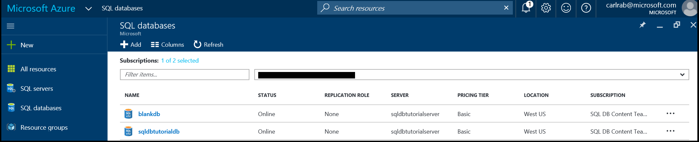

<properties
    pageTitle="创建 Azure SQL 数据库 | Azure"
    description="有关如何使用 Azure 门户预览、PowerShell、Transact-SQL 创建 Azure SQL 数据库的快速参考。"
    services="sql-database"
    documentationcenter=""
    author="CarlRabeler"
    manager="jhubbard"
    editor="" />
<tags
    ms.service="sql-database"
    ms.custom="single databases"
    ms.devlang="NA"
    ms.workload="data-management"
    ms.topic="article"
    ms.tgt_pltfrm="NA"
    ms.date="11/14/2016"
    wacn.date="01/20/2017"
    ms.author="carlrab" />  

# 创建 Azure SQL 数据库

可以使用 [Azure 门户预览](https://portal.azure.cn/)、PowerShell、Transact-SQL、REST API 或 C# 创建 Azure SQL 数据库。

## 使用 Azure 门户预览创建 Azure SQL 数据库

1. 在 [Azure 门户预览](https://portal.azure.cn/)中打开“SQL 数据库”边栏选项卡。

      

2. 在“SQL 数据库”边栏选项卡上，单击“添加”。

      

> [AZURE.TIP]
有关使用 Azure 门户预览和 SQL Server Management Studio 的入门教程，请参阅 [Get started with Azure SQL Database servers, databases and firewall rules by using the Azure portal and SQL Server Management Studio](/documentation/articles/sql-database-get-started/)（开始使用 Azure 门户预览和 SQL Server Management Studio 了解 Azure SQL 数据库服务器、数据库和防火墙规则）。
>

## 使用 PowerShell 创建 Azure SQL 数据库

若要创建 SQL 数据库，请使用 [New-AzureRmSqlDatabase](https://docs.microsoft.com/powershell/resourcemanager/azurerm.sql/v2.3.0/new-azurermsqldatabase) cmdlet。资源组和服务器必须已存在于订阅中。

	$resourceGroupName = "resourcegroup1"
	$sqlServerName = "server1"

	$databaseName = "database1"
	$databaseEdition = "Standard"
	$databaseServiceLevel = "S0"

	$currentDatabase = New-AzureRmSqlDatabase -ResourceGroupName $resourceGroupName `
	 -ServerName $sqlServerName -DatabaseName $databaseName `
	 -Edition $databaseEdition -RequestedServiceObjectiveName $databaseServiceLevel

> [AZURE.TIP]
有关示例脚本，请参阅[创建 SQL 数据库 PowerShell 脚本](/documentation/articles/sql-database-get-started-powershell/)。
>

## 在 SQL Server Management Studio 中使用 Transact-SQL 创建 Azure SQL 数据库

若要在 SQL Server Management Studio 中使用 Transact-SQL 创建 SQL 数据库，请执行以下操作：

1. 使用服务器级主体登录名或属于 **dbmanager** 角色的登录名通过 SQL Server Management Studio 连接到 Azure 数据库服务器。有关登录名的详细信息，请参阅[管理登录名](/documentation/articles/sql-database-manage-logins/)。
2. 在对象资源管理器中，打开“数据库”节点，展开“系统数据库”文件夹，右键单击“master”，然后单击“新建查询”。
3. 使用 **CREATE DATABASE** 语句可创建数据库。有关详细信息，请参阅 [CREATE DATABASE（SQL 数据库）](https://msdn.microsoft.com/zh-cn/library/dn268335.aspx)。以下语句将创建名为 **myTestDB** 的数据库，并指定它是默认大小上限为 250 GB 的“标准 S0 版本”数据库。
  
      CREATE DATABASE myTestDB
      (EDITION='Standard',
       SERVICE_OBJECTIVE='S0');

4. 单击“执行”运行查询。
5. 在对象资源管理器中，右键单击“数据库”节点，然后单击“刷新”在对象资源管理器中查看新的数据库。

> [AZURE.TIP]
有关使用 Azure 门户预览和 SQL Server Management Studio 的入门教程，请参阅 [Get started with Azure SQL Database servers, databases and firewall rules by using the Azure portal and SQL Server Management Studio](/documentation/articles/sql-database-get-started/)（开始使用 Azure 门户预览和 SQL Server Management Studio 了解 Azure SQL 数据库服务器、数据库和防火墙规则）。
>

## 其他资源
* 有关管理工具的概述，请参阅[管理工具概述](/documentation/articles/sql-database-manage-overview/)。
* 若要了解如何使用 Azure 门户预览执行管理任务，请参阅[使用 Azure 门户预览管理 Azure SQL 数据库](/documentation/articles/sql-database-manage-portal/)。
* 若要了解如何使用 PowerShell 执行管理任务，请参阅[使用 PowerShell 管理 Azure SQL 数据库](/documentation/articles/sql-database-manage-powershell/)。
* 若要了解如何使用 SQL Server Management Studio 执行管理任务，请参阅 [SQL Server Management Studio](/documentation/articles/sql-database-manage-azure-ssms/)。
* 有关 SQL 数据库服务的信息，请参阅[什么是 SQL 数据库](/documentation/articles/sql-database-technical-overview/)。
* 有关 Azure 数据库服务器和数据库功能的信息，请参阅[功能](/documentation/articles/sql-database-features/)。

<!---HONumber=Mooncake_0116_2017-->