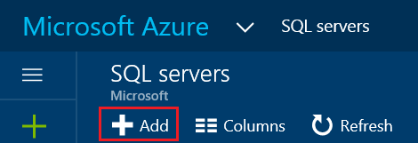

<properties
    pageTitle="创建 Azure SQL 数据库服务器 | Azure"
    description="有关如何使用 Azure 门户和 PowerShell 创建 Azure SQL 数据库服务器的快速参考。"
    services="sql-database"
    documentationcenter=""
    author="CarlRabeler"
    manager="jhubbard"
    editor="" />
<tags
    ms.service="sql-database"
    ms.custom="servers"
    ms.devlang="NA"
    ms.workload="data-management"
    ms.topic="article"
    ms.tgt_pltfrm="NA"
    ms.date="11/23/2016"
    wacn.date="01/20/2017"
    ms.author="carlrab" />  

# 创建 Azure SQL 数据库服务器

可以使用 [Azure 门户](https://portal.azure.cn/)、PowerShell、REST API 或 C# 创建 Azure SQL 数据库服务器。

## 使用 Azure 门户创建 Azure SQL 数据库服务器

1. 在 [Azure 门户](https://portal.azure.cn/)中打开“SQL Server”边栏选项卡。

      

2. 单击“添加”创建 SQL Server

      

> [AZURE.TIP]
有关使用 Azure 门户和 SQL Server Management Studio 的入门教程，请参阅 [Get started with Azure SQL Database servers, databases and firewall rules by using the Azure portal and SQL Server Management Studio](/documentation/articles/sql-database-get-started/)（开始使用 Azure 门户和 SQL Server Management Studio 了解 Azure SQL 数据库服务器、数据库和防火墙规则）。
>

## 使用 PowerShell 创建 Azure SQL 数据库服务器

若要创建 SQL 数据库服务器，请使用 [New-AzureRmSqlServer](https://docs.microsoft.com/powershell/resourcemanager/azurerm.sql/v2.3.0/new-azurermsqlserver) cmdlet。将 *server1* 替换为服务器的名称。服务器名称必须在所有 Azure SQL 数据库服务器中都是唯一的。如果服务器名称已使用，将出现错误。此命令可能需要几分钟才能完成。资源组必须已存在于订阅中。

	$resourceGroupName = "resourcegroup1"

	$sqlServerName = "server1"
	$sqlServerVersion = "12.0"
	$sqlServerLocation = "China North"
	$serverAdmin = "loginname"
	$serverPassword = "password" 
	$securePassword = ConvertTo-SecureString –String $serverPassword –AsPlainText -Force
	$creds = New-Object –TypeName System.Management.Automation.PSCredential –ArgumentList $serverAdmin, $securePassword

	$sqlServer = New-AzureRmSqlServer -ServerName $sqlServerName `
	 -SqlAdministratorCredentials $creds -Location $sqlServerLocation `
	 -ResourceGroupName $resourceGroupName -ServerVersion $sqlServerVersion

> [AZURE.TIP]
有关示例脚本，请参阅[创建 SQL 数据库 PowerShell 脚本](/documentation/articles/sql-database-get-started-powershell/)。
>

## 其他资源
* 有关管理工具的概述，请参阅[管理工具概述](/documentation/articles/sql-database-manage-overview/)
* 若要了解如何使用 Azure 门户执行管理任务，请参阅[使用 Azure 门户管理 Azure SQL 数据库](/documentation/articles/sql-database-manage-portal/)
* 若要了解如何使用 PowerShell 执行管理任务，请参阅[使用 PowerShell 管理 Azure SQL 数据库](/documentation/articles/sql-database-manage-powershell/)
* 若要了解如何使用 SQL Server Management Studio 执行其他任务，请参阅 [SQL Server Management Studio](/documentation/articles/sql-database-manage-azure-ssms/)。
* 有关 SQL 数据库服务的信息，请参阅[什么是 SQL 数据库](/documentation/articles/sql-database-technical-overview/)。
* 有关 Azure 数据库服务器和数据库功能的信息，请参阅[功能](/documentation/articles/sql-database-features/)。

<!---HONumber=Mooncake_0116_2017-->