<properties
    pageTitle="设计你的第一个 Azure SQL 数据库 | Azure"
    description="了解如何设计你的第一个 Azure SQL 数据库。"
    services="sql-database"
    documentationcenter=""
    author="janeng"
    manager="jstrauss"
    editor=""
    tags="" />
<tags
    ms.assetid=""
    ms.service="sql-database"
    ms.custom="tutorial-develop"
    ms.devlang="na"
    ms.topic="article"
    ms.tgt_pltfrm="na"
    ms.workload=""
    ms.date="03/30/2017"
    wacn.date="05/22/2017"
    ms.author="janeng"
    ms.translationtype="Human Translation"
    ms.sourcegitcommit="8fd60f0e1095add1bff99de28a0b65a8662ce661"
    ms.openlocfilehash="5acda1b0711f62e38c7f1916ec68770232bacf84"
    ms.contentlocale="zh-cn"
    ms.lasthandoff="05/12/2017" />

# 设计你的第一个 Azure SQL 数据库

在本教程中，你将为大专院校建立一个数据库以跟踪学生成绩和选课情况。 本教程将演示如何使用 [Azure 门户预览](https://portal.azure.cn/)和 [SQL Server Management Studio](https://msdn.microsoft.com/zh-cn/library/ms174173.aspx) (SSMS) 在 Azure SQL 数据库逻辑服务器上创建 Azure SQL 数据库、将表添加到数据库、将数据加载到表，以及查询数据库。 它还将演示如何使用 SQL 数据库[时间点还原](/documentation/articles/sql-database-recovery-using-backups/#point-in-time-restore)功能将数据库还原到以前的时间点。

若要完成本教程，请确保已安装最新版的 [ SQL Server Management Studio](https://msdn.microsoft.com/zh-cn/library/ms174173.aspx) (SSMS)。 

## 步骤 1：登录到 Azure 门户预览

登录到 [Azure 门户预览](https://portal.azure.cn/)。

## 步骤 2：在 Azure 中创建空的 SQL 数据库

创建 Azure SQL 数据库时，会使用定义好的一组[计算和存储资源](/documentation/articles/sql-database-service-tiers/)。 数据库在 [Azure 资源组](/documentation/articles/resource-group-overview/)和 [Azure SQL 数据库逻辑服务器](/documentation/articles/sql-database-features/)中创建。 

按照以下步骤创建空的 SQL 数据库。 

1. 单击 Azure 门户预览版左上角的“新建”按钮。

2. 从“新建”页中选择“数据库”，然后从“数据库”页中选择“SQL 数据库”。 

    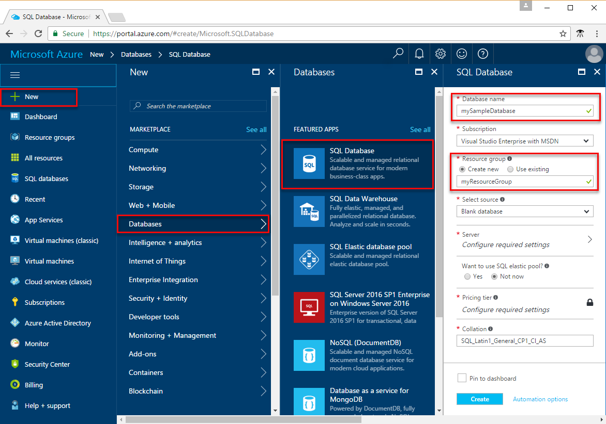

3. 如上图所示，在“SQL 数据库”窗体中填写以下信息：     

   - 数据库名称：**mySampleDatabase**
   - 资源组：**myResourceGroup**
   - 源：**空白数据库**

4. 单击“服务器”，为新数据库创建并配置新服务器。 填写“新建服务器”窗体，指定全局唯一的服务器名称，提供服务器管理员登录名，然后指定所选的密码。 

    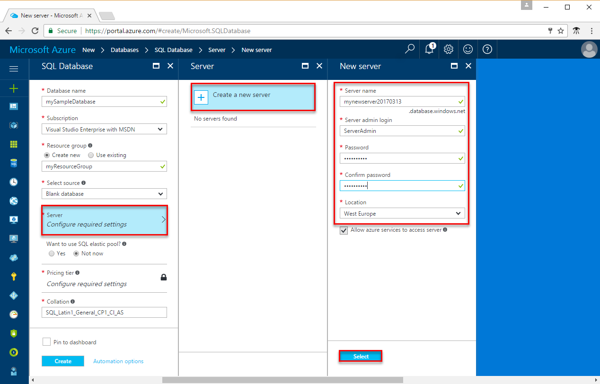
5. 单击“选择”。

6. 单击“定价层”为新数据库指定服务层和性能级别。 对于本教程，请选择 **20 DTU** 和 **250** GB 存储。

    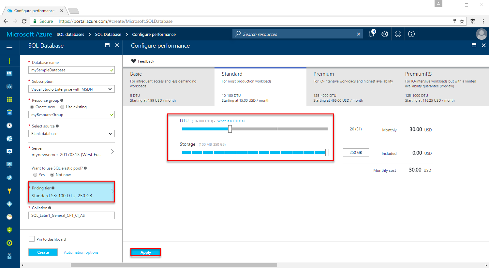

7. 单击“应用” 。  

8. 单击“创建”预配数据库。 大约需要一分半的时间才能完成预配。 

9. 在工具栏上，单击“通知”可监视部署过程。

    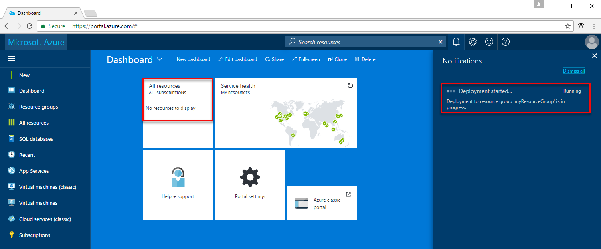

## 步骤 3：创建服务器级防火墙规则

Azure SQL 数据库受防火墙保护。 默认情况下，将拒绝与服务器和服务器内数据库的所有连接。 按照以下步骤为服务器创建 [SQL 数据库服务器级防火墙规则](/documentation/articles/sql-database-firewall-configure/)，允许从客户端的 IP 地址进行连接。 

1. 部署完成后，在左侧菜单中单击“SQL 数据库”，然后在“SQL 数据库”页上单击新数据库 **mySampleDatabase**。 此时会打开数据库的概览页，显示完全限定的服务器名称（例如 **mynewserver-20170313.database.chinacloudapi.cn**），并且会提供进行进一步配置所需的选项。

      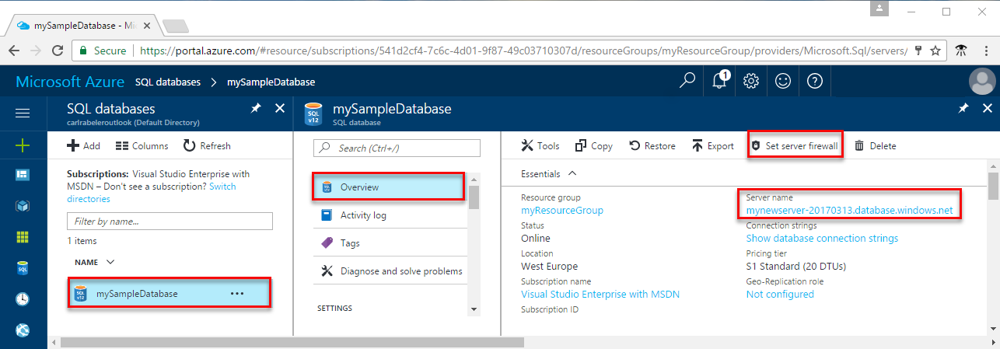 

2. 如上图所示，在工具栏上单击“设置服务器防火墙”。 此时会打开 SQL 数据库服务器的“防火墙设置”页。 

3. 在工具栏上单击“添加客户端 IP”，然后单击“保存”。 此时会针对当前的 IP 地址创建服务器级防火墙规则。

      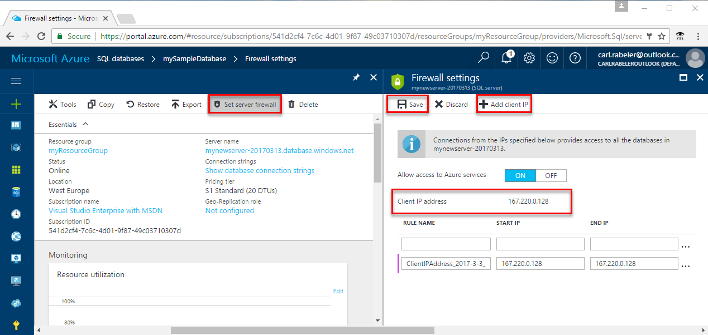 

4. 单击“确定”，然后单击“X”关闭“防火墙设置”页。

现在可以使用 SQL Server Management Studio 或其他所选工具连接到数据库及其服务器。

> [AZURE.NOTE]
> 通过端口 1433 进行的 SQL 数据库通信。 如果尝试从企业网络内部进行连接，则该网络的防火墙可能不允许经端口 1433 的出站流量。 如果是这样，则无法连接到 Azure SQL 数据库服务器，除非 IT 部门打开了端口 1433。
>

## 步骤 4 - 获取连接信息

请在 Azure 门户预览中获取 Azure SQL 数据库服务器的完全限定服务器名称。 请使用 SQL Server Management Studio 通过完全限定的服务器名称连接到服务器。

1. 登录到 [Azure 门户预览](https://portal.azure.cn/)。
2. 从左侧菜单中选择“SQL 数据库”，然后单击“SQL 数据库”页上的数据库。 
3. 在数据库的“Azure 门户预览”页的“概要”窗格中，找到并复制“服务器名称”。

     

## 步骤 5 - 使用 SQL Server Management Studio 连接到数据库

使用 [SQL Server Management Studio](https://docs.microsoft.com/sql/ssms/sql-server-management-studio-ssms) 建立到 Azure SQL 数据库服务器的连接。

1. 打开 SQL Server Management Studio。

2. 在“连接到服务器”对话框中，输入以下信息：
    - **服务器类型**：指定数据库引擎
    - **服务器名称**：输入完全限定的服务器名称，例如 **mynewserver20170313.database.chinacloudapi.cn**
    - **身份验证**：指定 SQL Server 身份验证
    - **登录名**：输入服务器管理员帐户
    - **密码**：输入服务器管理员帐户的密码

    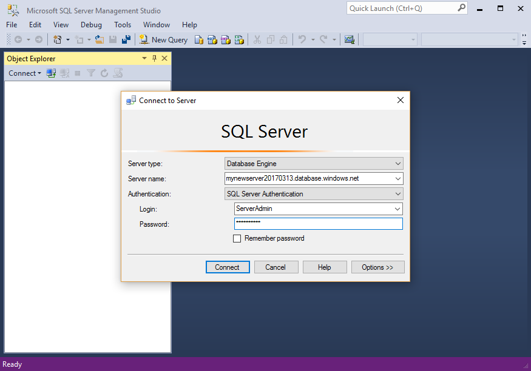

3. 单击“连接到服务器”对话框中的“选项”。 在“连接到数据库”部分输入 **mySampleDatabase**，以连接到此数据库。

    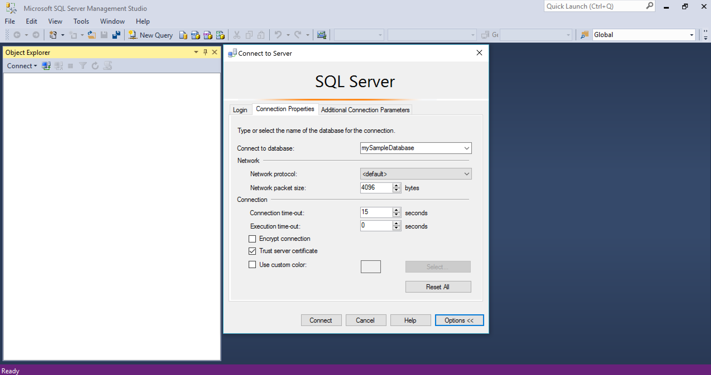  

4. 单击“连接”。 此时会在 SSMS 中打开“对象资源管理器”窗口。 

5. 在对象资源管理器中展开“数据库”，然后展开 **mySampleDatabase**，查看示例数据库中的对象。

    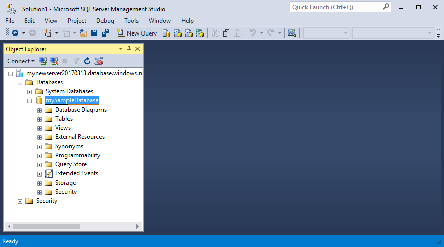  

## 步骤 6 - 在数据库中创建表 

使用 [Transact-SQL](https://docs.microsoft.com/sql/t-sql/language-reference) 创建具有 4 个表格的数据库架构，这些表格是大专院校的学生管理系统的模型：

- 人员
- 课程
- 学生
- 学分，用于为大专院校的学生管理系统建模

以下关系图显示了这些表的相互关系。 其中一些表引用其他表中的列。 例如，Student 表引用 **Person** 表的 **PersonId** 列。 请研究此关系图，了解本教程中各种表的相互关系。 若要深入了解如何创建有效的数据库表，请参阅 [Create effective database tables](https://msdn.microsoft.com/zh-cn/library/cc505842.aspx)（创建有效的数据库表）。 有关如何选择数据类型的信息，请参阅 [Data types](https://docs.microsoft.com/sql/t-sql/data-types/data-types-transact-sql)（数据类型）。

> [AZURE.NOTE]
> 还可以使用 [SQL Server Management Studio 中的表设计器](https://msdn.microsoft.com/zh-cn/library/hh272695.aspx)来创建和设计表。 

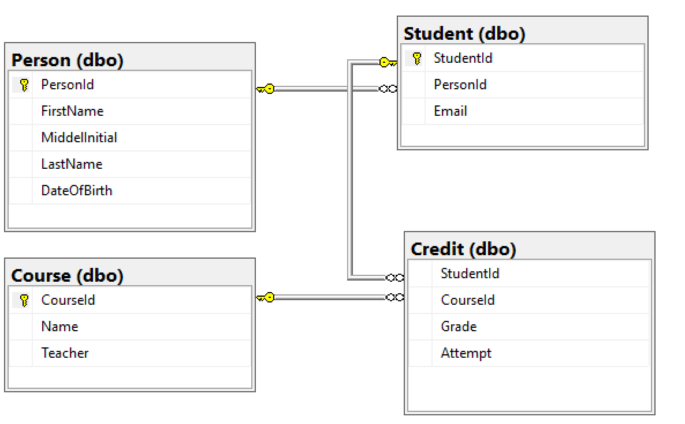

1. 在“对象资源管理器”中，右键单击“mySampleDatabase”，然后单击“新建查询”。 此时会打开一个空白查询窗口，该窗口连接到数据库。

2. 在查询窗口中执行以下查询，在数据库中创建 4 个表： 

        -- Create Person table

        CREATE TABLE Person
        (
          PersonId      INT IDENTITY PRIMARY KEY,
          FirstName     NVARCHAR(128) NOT NULL,
          MiddelInitial NVARCHAR(10),
          LastName      NVARCHAR(128) NOT NULL,
          DateOfBirth   DATE NOT NULL
        )
   
        -- Create Student table
 
        CREATE TABLE Student
        (
          StudentId INT IDENTITY PRIMARY KEY,
          PersonId  INT REFERENCES Person (PersonId),
          Email     NVARCHAR(256)
        )
    
        -- Create Course table
 
        CREATE TABLE Course
        (
          CourseId  INT IDENTITY PRIMARY KEY,
          Name      NVARCHAR(50) NOT NULL,
          Teacher   NVARCHAR(256) NOT NULL
        ) 

        -- Create Credit table
 
        CREATE TABLE Credit
        (
          StudentId   INT REFERENCES Student (StudentId),
          CourseId    INT REFERENCES Course (CourseId),
          Grade       DECIMAL(5,2) CHECK (Grade <= 100.00),
          Attempt     TINYINT,
          CONSTRAINT  [UQ_studentgrades] UNIQUE CLUSTERED
          (
            StudentId, CourseId, Grade, Attempt
          )
        )

    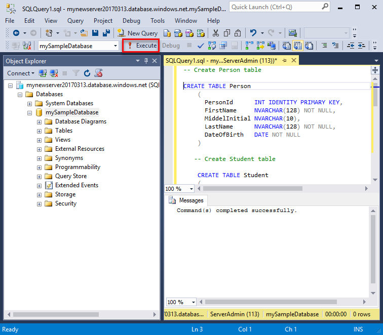

3. 展开 SQL Server Management Studio 对象资源管理器中的“表”节点，查看所创建的表。

    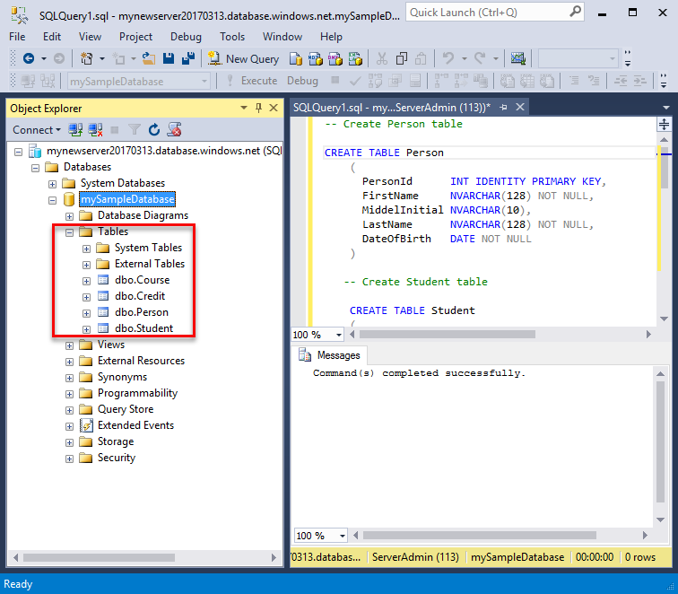

## 步骤 7：将数据加载到表

1. 在“下载”文件夹中创建名为 **SampleTableData** 的文件夹，为数据库存储示例数据。 

2. 右键单击以下链接并将它们保存到 **SampleTableData** 文件夹。 

   - [SampleCourseData](https://sqldbtutorial.blob.core.windows.net/tutorials/SampleCourseData)
   - [SamplePersonData](https://sqldbtutorial.blob.core.windows.net/tutorials/SamplePersonData)
   - [SampleStudentData](https://sqldbtutorial.blob.core.windows.net/tutorials/SampleStudentData)
   - [SampleCreditData](https://sqldbtutorial.blob.core.windows.net/tutorials/SampleCreditData)

3. 打开命令提示符窗口并导航到 SampleTableData 文件夹。

4. 执行以下命令，将示例数据插入表，使用环境值替换 **ServerName**、**DatabaseName**、**UserName** 和 **Password** 的值。

        bcp Course in SampleCourseData -S <ServerName>.database.chinacloudapi.cn -d <DatabaseName> -U <Username> -P <password> -q -c -t ","
        bcp Person in SamplePersonData -S <ServerName>.database.chinacloudapi.cn -d <DatabaseName> -U <Username> -P <password> -q -c -t ","
        bcp Student in SampleStudentData -S <ServerName>.database.chinacloudapi.cn -d <DatabaseName> -U <Username> -P <password> -q -c -t ","
        bcp Credit in SampleCreditData -S <ServerName>.database.chinacloudapi.cn -d <DatabaseName> -U <Username> -P <password> -q -c -t ","

现已将示例数据加载到了之前创建的表中。

## 步骤 8 - 查询表

执行以下查询，从数据库表中检索信息。 有关写入 SQL 查询的详细信息，请参阅[写入 SQL 查询](https://technet.microsoft.com/zh-cn/library/bb264565.aspx)。 第一个查询将联接所有 4 个表，以查找由“Dominick Pope”授课的班级中分数高于 75% 的所有学生。 第二个查询将联接所有 4 个表，以查找“Noe Coleman”注册过的所有课程。

1. 在 SQL Server Management Studio 查询窗口中，执行以下查询：

        -- Find the students taught by Dominick Pope who have a grade higher than 75%

        SELECT  person.FirstName,
            person.LastName,
            course.Name,
            credit.Grade
        FROM  Person AS person
            INNER JOIN Student AS student ON person.PersonId = student.PersonId
            INNER JOIN Credit AS credit ON student.StudentId = credit.StudentId
            INNER JOIN Course AS course ON credit.CourseId = course.courseId
        WHERE course.Teacher = 'Dominick Pope' 
            AND Grade > 75

2. 在 SQL Server Management Studio 查询窗口中，执行以下查询：

        -- Find all the courses in which Noe Coleman has ever enrolled

        SELECT  course.Name,
            course.Teacher,
            credit.Grade
        FROM  Course AS course
            INNER JOIN Credit AS credit ON credit.CourseId = course.CourseId
            INNER JOIN Student AS student ON student.StudentId = credit.StudentId
            INNER JOIN Person AS person ON person.PersonId = student.PersonId
        WHERE person.FirstName = 'Noe'
            AND person.LastName = 'Coleman'

## 步骤 9 - 将数据库还原到以前的时间点 

假设意外删除了某个表。 这是不能轻易还原的内容。 借助 Azure SQL 数据库，可返回到最近 35 天内的任意时间点并将此时间点还原到新的数据库。 可以通过此数据库恢复已删除的数据。 以下步骤将示例数据库还原到添加这些表之前的时间点。

1. 在数据库的“SQL 数据库”页上，单击工具栏上的“还原”。 此时会打开“还原”页。

    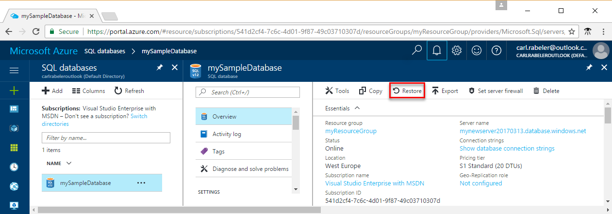

2. 使用必需信息填充“还原”窗体：
    * 数据库名称：提供数据库名称 
    * 时间点：选择“还原”窗体上的“时间点”选项卡 
    * 还原点：选择更改数据库前的时间
    * 目标服务器：还原数据库时不能更改此值 
    * 弹性数据库池：选择“无”  
    * 定价层：选择“20 DTU”和“250 GB”存储。

    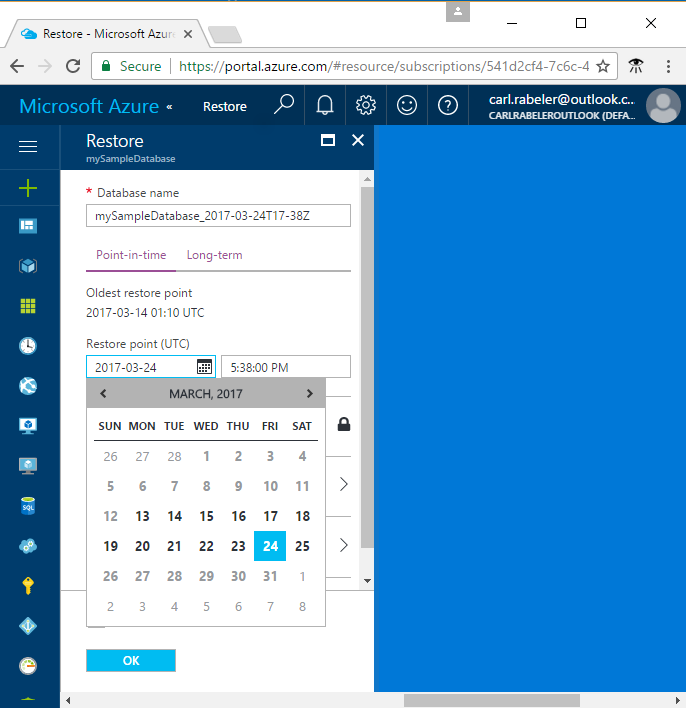

3. 单击“确定”，将数据库[还原到添加这些表之前的时间点](/documentation/articles/sql-database-recovery-using-backups/#point-in-time-restore)。 将数据库还原到不同的时间点时，会在指定时间点（前提是在[服务层](/documentation/articles/sql-database-service-tiers/)保留时间段内）原始数据库所在的服务器中创建一个备份数据库。

## 后续步骤 

若要了解常见任务的 PowerShell 示例，请参阅 [SQL 数据库 PowerShell 示例](/documentation/articles/sql-database-powershell-samples/)