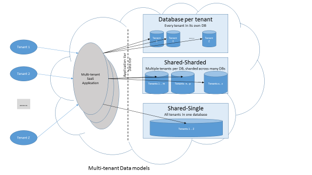
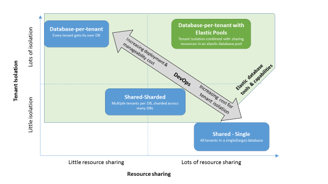

<properties
    pageTitle="多租户 SaaS 应用程序与 Azure SQL 数据库的设计模式 | Azure"
    description="本文讨论云环境中运行的多租户数据库应用程序需要考虑的要求和常见数据体系结构模式，以及与这些模式相关的各种权衡取舍。此外，还说明了 Azure SQL 数据库及其弹性池与弹性工具如何在不造成损害的情况下满足这些要求。"
    keywords=""
    services="sql-database"
    documentationcenter=""
    author="CarlRabeler"
    manager="jhubbard"
    editor="" />
<tags
    ms.assetid="1dd20c6b-ddbb-40ef-ad34-609d398d008a"
    ms.service="sql-database"
    ms.devlang="NA"
    ms.topic="article"
    ms.tgt_pltfrm="NA"
    ms.workload="sqldb-design"
    ms.date="11/08/2016"
    wacn.date="12/19/2016"
ms.author="carlrab" />

# 多租户 SaaS 应用程序与 Azure SQL 数据库的设计模式
可以在本文中了解云环境中运行的多租户软件即服务 (SaaS) 数据库应用程序的要求和通用数据体系结构模式。其中还说明了需要考虑的因素，以及不同设计模式的权衡取舍。借助 Azure SQL 数据库中的弹性池和弹性工具，可以在不影响其他目标的情况下达到特定的要求。

开发人员在设计多租户应用程序的数据层租用模型时，有时会做出对其长期最佳利益不利的选择。至少在一开始，开发人员会认为开发的便利性和较低的云服务提供程序成本比应用程序的租户隔离或可伸缩性更重要。这种选择可能会在日后导致客户满意度出现问题，因过程矫正而付出代价。

多租户应用程序是指云环境中托管的应用程序，它向不共享或看不到彼此数据的数百或数千个租户提供一组相同的服务。例如向云托管环境中的租户提供服务的 SaaS 应用程序。

## 多租户应用程序
在多租户应用程序中，可以轻松将数据和工作负荷分区。由于大多数请求发生在租户的限定范围内，因此可以将数据和工作负荷分区（例如，沿租户边界）。这是数据与工作负荷与生俱来的属性，它支持本文中所述的应用程序模式。

开发人员可在基于云的应用程序的整个范畴内使用此类型的应用程序，包括：

* 正在过渡到云即 SaaS 应用程序的合作伙伴数据库应用程序
* 从无到有针对云构建的 SaaS 应用程序
* 直接面向客户的应用程序
* 面向员工的企业应用程序

专为云设计的 SaaS 应用程序，以及以合作伙伴数据库应用程序为根基的应用程序通常是多租户应用程序。这些 SaaS 应用程序向其租户提供专用的软件应用程序即服务。租户可以访问应用程序服务，对于随应用程序一起存储的关联数据有完全的所有权。但是，为了利用 SaaS 的优点，租户在其本身的数据上必须让出一定程度的控制权。他们需信任 SaaS 服务提供程序可以保证其数据的安全且与其他租户的数据隔离。此类多租户 SaaS 应用程序的例子包括 MYOB、SnelStart 和 Salesforce.com。每个应用程序可以沿租户边界进行分区，且支持本文中所述的应用程序设计模式。

向客户或组织内员工（通常称为用户，而不是租户）提供直接服务的应用程序是在多租户应用程序范畴内的另一种类别。客户只订阅服务，而不拥有服务提供程序所收集和存储的数据。除非基于政府强制规定的隐私法规，服务提供程序不严格要求隔离客户彼此的数据。此类面向客户的多租户应用程序示例包括 Netflix、Spotify 和 Xbox LIVE 等媒体内容提供程序。其他可轻松分区的应用程序示例包括面向客户的 Internet 级应用程序，或物联网 (IoT) 应用程序，其中，每个客户或设备都可充当分区。可在不同的用户或设备之间划出分区边界。

并非所有应用程序都可轻松地沿着单个属性来分区，例如租户、客户、用户或设备。例如，复杂的企业资源计划 (ERP) 应用程序包含产品、订单和客户。它通常使用复杂的架构，具有数千个相互之间紧密连接的表。

单个分区策略不可能适用于所有表和运用于应用程序的整个工作负荷。本文侧重于包含可轻松分区的数据和工作负荷的多租户应用程序。

## 多租户应用程序设计权衡
多租户应用程序开发人员选择的设计模式通常是出于以下考虑因素：

* **租户隔离**。开发人员需要确保租户不越权访问其他租户的数据。这种隔离要求同时也针对其他属性，例如避开干扰性邻居、能够还原租户的数据，以及实现租户特定的自定义。
* **云资源成本**。SaaS 应用程序需要具有成本竞争力。多租户应用程序开发人员可能选择优化以降低云资源的使用成本，例如存储和计算成本。
* **简化 DevOps。**多租户应用程序开发人员需要结合考虑隔离保护、维护和监视其应用程序与数据库架构的运行状况，以及排解租户的疑难问题。应用程序开发与运营的复杂性会直接导致成本增加和租户满意度难题。
* **可缩放性**。以累加方式添加更多租户的能力，对于需要此能力的租户而言，这是 SaaS 运营成功不可或缺的能力。

上述每个因素都有其各自的利弊。成本最低的云产品不见得提供最方便的开发体验。开发人员一定要在应用程序设计过程中，对这些选项及其利弊做出明智的选择。

一种流行的开发模式是将多个租户打包到一个或多个数据库中。此方法的优点是成本较低，因为只需支付少量数据库的费用，并且处理有限数目的数据库相对简单。但久而久之，SaaS 多租户应用程序开发人员会认识到这种选择在租户隔离与可伸缩性方面有所欠缺。如果租户隔离非常重要，则需要付出额外的努力，才能使共享存储中的租户数据免于遭到未经授权的访问或避开干扰性邻居。这种额外的努力可能大幅增加开发工作和隔离维护的成本。同样，如果需要添加租户，这种设计模式通常需要凭借专业知识，将租户数据重新分布到数据库，以适当缩放应用程序的数据层。

在面向企业和组织的 SaaS 多租户应用程序中，租户隔离通常是基本要求。开发人员可能在简单性和成本考虑方面短视近利，而不重视隔离和可伸缩性。随着服务不断发展，以及租户隔离要求变得更加重要且需要在应用程序层进行管理时，此取舍使情况更趋于复杂且代价昂贵。但是，在向客户提供直接面向消费者的服务的多租户应用程序中，很可能为了让云资源成本发挥最高效益，而不那么重视租户隔离。

## 多租户数据模型
放置租户数据的常见设计实践都遵循图 1 中所示的三种不同模型。

  
    图 1：多租户数据模型的常见设计实践

-	**租户各有数据库**。每个租户都有自己的数据库。租户特定的所有数据局限在该租户的数据库内，与其他租户及其数据隔离。
-	**共享分片数据库**。多个租户共享多个数据库中的一个。使用分区策略（例如哈希、范围或列表分区），可将一组不同的租户分配到每个数据库。这种数据分布策略通常称为分片。
-	**共享单一数据库**。单一数据库有时很大，包含按租户 ID 列区分的所有租户的数据。

> [AZURE.NOTE] 应用程序开发人员可以选择将不同的租户放在不同的数据库架构中，然后使用架构名称来区分不同的租户。此方法通常需要使用动态 SQL，并且无法有效使用计划缓存，因此不建议采用。本文的余下部分侧重于此多租户应用程序类别的共享表方法。

## 流行的多租户数据模型
请务必根据前面列出的应用程序设计利弊，评估不同类型的多租户数据模型。这些因素有助于描绘上述三种最常见多租户数据模型及其数据库用法的特征（如图 2 所示）。

* **隔离**。以租户之间的隔离程度衡量数据模型可实现的租户隔离效果。
* **云资源成本**。在租户之间共享的资源规则可以使云资源成本发挥最高效益。资源可定义为计算和存储成本。
* **DevOps 成本**。简化应用程序开发、部署和管理性可降低整体 SaaS 运营成本。

在图 2 中，Y 轴表示租户隔离的程度。X 轴表示资源共享的程度。中间的灰色对角线箭头表示 DevOps 成本的方向（倾向于增加或减少）。

图 2：流行的多租户数据模型

图 2 的右下象限显示使用可能很大的共享单一数据库和共享表（或另一个架构）方法的应用程序模式。由于所有租户都使用单个数据库中相同的数据库资源（CPU、内存、输入/输出），因此适合进行资源共享。但是，租户隔离是有限的。可能需要采取额外的措施来保护应用程序层的各个租户互相之间免受干扰。这些额外措施可能大幅增加开发和管理应用程序的 DevOps 成本。可伸缩性受限于用于托管数据库的硬件规模。

图 2 左下象限演示跨多个数据库分片的多个租户（通常为不同的硬件缩放单位）。每个数据库托管一部分租户，解决其他模式的可伸缩性需求。如果需要更大的容量来应对更多的租户，只需将租户放在分配给新硬件缩放单位的新数据库中。但是，资源共享量会降低。只有放在相同缩放单位中的租户共享资源。此方法也无助于改善租户隔离，因为仍有许多租户共置于相同位置，自然无法免于彼此操作的干扰。应用程序复杂性仍然很高。

图 2 左上方的象限是第三种方法。它将每个租户的数据放在自身的数据库中。此方法有良好的租户隔离特性，但是当每个数据库提供自身专用的资源时，就会限制资源共享。如果所有租户有可预测的工作负荷，这是个好方法。如果租户工作负荷变得更难预测，提供程序就无法优化资源共享。不可预测性是 SaaS 应用程序共有的特点。提供程序必须过度预配才能满足要求，或减少资源。任何一个操作都会导致成本提高或租户满意度降低。租户之间的资源共享程度越高，才能使解决方案越符合成本效益。增加数据库数目也会使部署和维护应用程序的 DevOps 成本增加。尽管有上述顾虑，但此方法提供最佳且最简单的租户隔离。

以下因素也会影响客户选择设计模式：

* **租户数据的所有权**。租户保留自己数据的所有权的应用程序应该选择每个租户各有一个数据库的模式。
* **扩展**。面向数十万甚至数百万个租户的应用程序应该选择数据库共享方法，例如分片。隔离要求仍可能会带来难题。
* **价值和业务模型**。如果应用程序的每个租户的营收很少（少于一美元），隔离要求就变得不那么重要，而共享数据库会比较有利。如果每个租户的营收有几美元或更多，则“租户各有数据库”模型比较可行。它有助于降低开发成本。

根据图 2 所示的设计利弊，理想的多租户模型必须兼顾良好的租户隔离特性，使租户之间资源共享实现优化。此模型符合图 2 右上象限中所述类别的模型。

## Azure SQL 数据库中的多租户支持

Azure SQL 数据库支持图 2 所示的所有多租户应用程序模式。配合弹性池，它也支持一种应用程序模式，其结合“租户各有数据库”方法（请参阅图 3 的右上象限）的良好资源共享和隔离优点。Azure SQL 数据库中的弹性数据库工具和功能有助于降低开发和运营包含许多数据库的应用程序的成本（如图 3 的阴影区所示）。这些工具有助于构建和管理采用任何多数据库模式的应用程序。

图 3：Azure SQL 数据库中的多租户应用程序模式

## 包含弹性池和工具的“租户各有数据库”模型
SQL 数据库中的弹性池结合租户隔离与租户数据库之间的资源共享，可更好地支持“租户各有数据库”方法。SQL 数据库是数据层解决方案，可供构建多租户应用程序的 SaaS 提供程序使用。在租户之间共享资源的负担从应用程序层转移到数据库服务层。弹性查询、弹性事务和弹性数据库客户端库可简化跨数据库大规模管理和查询的复杂性。

| 应用程序要求 | SQL 数据库功能 |
| --- | --- |
| 租户隔离与资源共享 | [弹性池](/documentation/articles/sql-database-elastic-pool/)：分配 SQL 数据库资源池，使多个数据库可共享这些资源。此外，单个数据库可以按需要从池提取资源，以应对租户工作负荷变化而造成的容量需求剧增。弹性池本身可根据需要扩展或收缩。弹性池还支持在池级别轻松管理、监视和故障排除。 |
| 跨数据库简化 DevOps | [弹性池](/documentation/articles/sql-database-elastic-pool/)：如前所述。|
| [弹性查询](/documentation/articles/sql-database-elastic-query-horizontal-partitioning/)：跨数据库查询，进行报告或跨租户分析。| |

| [弹性事务](/documentation/articles/sql-database-elastic-transactions-overview/)：以原子隔离的方式处理多个数据库的更改。当应用程序在多个数据库操作之间需要保证“全有或全无”时，就需要弹性事务功能。 | |
| [弹性数据库客户端库](/documentation/articles/sql-database-elastic-database-client-library/)：管理数据分布，将租户映射到数据库。 | |

## 共享模型
如前所述，对于大多数 SaaS 提供程序，“共享模型”方法可能造成租户隔离问题，以及应用程序开发和维护的复杂性。然而，对于直接向消费者提供服务的多租户应用程序，租户隔离要求的优先性可能低于降低成本。它们也许能够以高密度将租户打包在一个或多个数据库中来降低成本。使用单一数据库或多个分片数据库的共享数据库模型可以提高资源共享的效率，降低总体成本。Azure SQL 数据库提供的一些功能可帮助客户在数据层中大规模构建隔离，改善安全和管理。

| 应用程序要求 | SQL 数据库功能 |
| --- | --- |
| 安全隔离功能 | [行级别安全性](https://msdn.microsoft.com/zh-cn/library/dn765131.aspx) |
| [数据库架构](https://msdn.microsoft.com/zh-cn/library/dd207005.aspx) | |
| 跨数据库简化 DevOps | [弹性查询](/documentation/articles/sql-database-elastic-query-horizontal-partitioning/) |

| [弹性事务](/documentation/articles/sql-database-elastic-transactions-overview/) | |
| [弹性数据库客户端库](/documentation/articles/sql-database-elastic-database-client-library/) | |
| [弹性数据库拆分/合并](/documentation/articles/sql-database-elastic-scale-overview-split-and-merge/) | |

## 摘要
对于大多数 SaaS 多租户应用程序，租户隔离要求非常重要。提供隔离的最佳选项严重依赖于“租户各有数据库”方法。其他两种方法需要在复杂的应用程序层投入心力，并需要有熟练的开发人员来提供隔离，因而大幅增加成本与风险。如果在服务开发初期不重视隔离要求，在前两个模型中进行改造会付出更大的代价。“租户各有数据库”模型的缺点在于，因为共享和维护不足以及管理大量数据库，导致云资源成本增加。SaaS 应用程序开发人员经常挣扎于这些取舍之中。

尽管这些取舍可能是大多数云数据库服务提供商的主要障碍，但 Azure SQL 数据库能够凭借弹性池和弹性数据库功能消除这些阻碍。SaaS 开发人员可以结合“租户各有数据库”模型的隔离特征，同时优化资源共享，使用弹性池和相关的工具，改善许多数据库的管理效率。

如果多租户应用程序提供程序没有租户隔离要求，还能够以高密度将租户打包在数据库中，则共享数据模型可能会提高资源共享的效率，降低总体成本。Azure SQL 数据库弹性数据库工具、分片库和安全功能可帮助 SaaS 提供商构建和管理多租户应用程序。

## 后续步骤
有关演示客户端库的示例应用，请参阅 [弹性数据库工具入门](/documentation/articles/sql-database-elastic-scale-get-started/)。

使用一个示例应用创建 [SaaS 的弹性池自定义仪表板](https://github.com/Microsoft/sql-server-samples/tree/master/samples/manage/azure-sql-db-elastic-pools-custom-dashboard)。该示例使用弹性池构建符合成本效益、可缩放的数据库解决方案。

使用 Azure SQL 数据库工具来[迁移要扩展的现有数据库](/documentation/articles/sql-database-elastic-convert-to-use-elastic-tools/)。

查看教程，了解如何[创建弹性池](/documentation/articles/sql-database-elastic-pool-create-portal/)。

了解如何[监视和管理弹性池](/documentation/articles/sql-database-elastic-pool-manage-portal/)。

## 其他资源

- [什么是 Azure 弹性池？](/documentation/articles/sql-database-elastic-pool/)
- [Scaling out with Azure SQL Database（使用 Azure SQL 数据库进行扩展）](/documentation/articles/sql-database-elastic-scale-introduction/)
- [具有弹性数据库工具和行级安全性的多租户应用程序](/documentation/articles/sql-database-elastic-tools-multi-tenant-row-level-security/)

- [解决方案快速入门](/documentation/articles/sql-database-solution-quick-starts/)

	

<!---HONumber=Mooncake_1010_2016-->