<properties
    pageTitle="使用 C 和 C++ 连接到 SQL 数据库 | Azure"
    description="使用本快速入门教程中的示例代码，生成一个包含 C++ 代码的新式应用程序，该应用程序由云中强大的关系数据库 Azure SQL 数据库提供支持。"
    services="sql-database"
    documentationcenter=""
    author="asthana86"
    manager="danmoth"
    editor="" />  

<tags
    ms.assetid="07d9e0b1-3234-4f17-a252-a7559160a9db"
    ms.service="sql-database"
    ms.workload="drivers"
    ms.tgt_pltfrm="na"
    ms.devlang="cpp"
    ms.topic="article"
    ms.date="11/01/2016"
    wacn.date="12/19/2016"
    ms.author="tobiast" />  

# 使用 C 和 C++ 连接到 SQL 数据库
本文面向尝试连接到 Azure SQL DB 的 C 和 C++ 开发人员，它分为多个部分，方便大家选择最感兴趣的部分进行查看。

## C/C++ 教程的先决条件
确保具有以下内容：

* 有效的 Azure 帐户。如果没有，可以注册 [Azure 试用版](/pricing/1rmb-trial/)。
* [Visual Studio](https://www.visualstudio.com/downloads/)。必须安装 C++ 语言组件才能生成和运行此示例。
* [Visual Studio Linux 开发](https://visualstudiogallery.msdn.microsoft.com/725025cf-7067-45c2-8d01-1e0fd359ae6e)。如果基于 Linux 开发，还必须安装 Visual Studio Linux 扩展。

## Azure SQL 数据库和虚拟机上的 SQL Server
Azure SQL 基于 Microsoft SQL Server 构建，旨在提供高可用性、高性能和可缩放的服务。在本地运行的专有数据库中使用 SQL Azure 有很多好处。使用 SQL Azure 时，需要安装、设置、维护或管理的不是数据库，而是数据库的内容和结构。我们通常担心的数据库容错和冗余等功能全都内置其中。

Azure 目前有两个用于托管 SQL Server 工作负荷的选项：Azure SQL 数据库（数据库即服务）以及虚拟机 (VM) 上的 SQL Server。我们不会详细介绍两者之间的差异，但需要了解的是，如果想要利用云服务提供的成本节省和性能优化，那么 Azure SQL 数据库是使用新的基于云的应用程序的最佳选择。如果正在考虑将本地应用程序迁移或扩展到云中，Azure 虚拟机上的 SQL Server 可能更适合。为简单起见，让我们创建一个 Azure SQL 数据库。

## 数据访问技术：ODBC 和 OLE DB
连接到 Azure SQL DB 并没有什么不同，目前有两种方法可以连接到数据库：ODBC（开放式数据库连接）和 OLE DB（对象链接和嵌入数据库）。近几年来，Microsoft 与[用于本机关系数据访问的 ODBC](https://blogs.msdn.microsoft.com/sqlnativeclient/2011/08/29/microsoft-is-aligning-with-odbc-for-native-relational-data-access/) 保持一致。ODBC 相对简单，并且比 OLE DB 快得多。唯一需要注意的是，ODBC 使用旧的 C 样式 API。

## 步骤 1：创建 Azure SQL 数据库
请参阅[入门页](/documentation/articles/sql-database-get-started/)，以了解如何创建示例数据库。

## 步骤 2：获取连接字符串
预配 Azure SQL 数据库后，需要执行以下步骤，确定连接信息及添加用于防火墙访问的客户端 IP。

在 [Azure 门户预览](https://portal.azure.cn/)中，使用数据库概述部分列出的“显示数据库连接字符串”，转到 Azure SQL 数据库 ODBC 连接字符串：

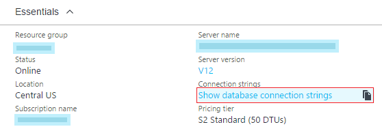  

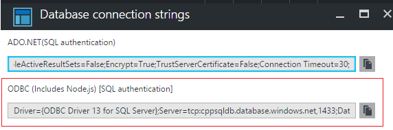  

复制 **ODBC (Includes Node.js) [SQL authentication]** 字符串的内容。我们稍后会使用此字符串从 C++ ODBC 命令行解释器进行连接。此字符串提供详细信息，例如驱动程序、服务器和其他数据库连接参数。

## 步骤 3：向防火墙添加 IP
转到数据库服务器的防火墙部分，[使用以下步骤向防火墙添加客户端 IP](/documentation/articles/sql-database-configure-firewall-settings/)，确保我们可以建立成功的连接：

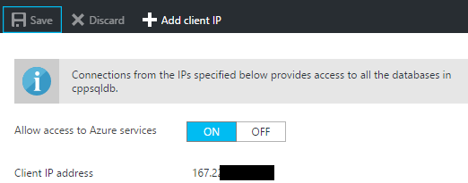  

此时，已配置好 Azure SQL DB，并已准备好通过 C++ 代码连接。

## 步骤 4：从 Windows C/C++ 应用程序连接
可以[使用通过 Visual Studio 生成的此示例在 Windows 上轻松连接到使用 ODBC 的 Azure SQL DB](https://github.com/Microsoft/VCSamples/tree/master/VC2015Samples/ODBC%20database%20sample%20%28windows%29)。该示例实现可用于连接到 Azure SQL DB 的 ODBC 命令行解释器。此示例使用数据库源名称文件 (DSN) 文件作为命令行参数，或使用之前从 Azure 门户预览复制的详细连接字符串。打开此项目的属性页，然后将连接字符串作为命令行参数粘贴，如下所示：

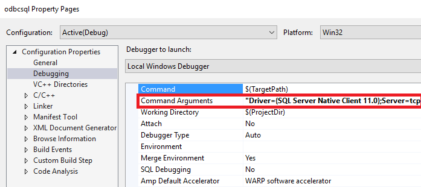  

确保在该数据库连接字符串中为数据库提供正确的身份验证详细信息。

启动用于生成的应用程序。应看到如下所示确认成功连接的窗口。甚至可以运行一些基本的 SQL 命令（例如 **create table**）来验证数据库连接：

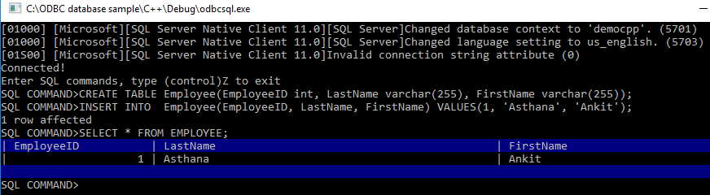  

或者，可以使用未提供命令行参数时启动的向导创建 DSN 文件。我们也建议尝试此选项。可以使用此 DSN 文件进行自动化以及保护身份验证设置：

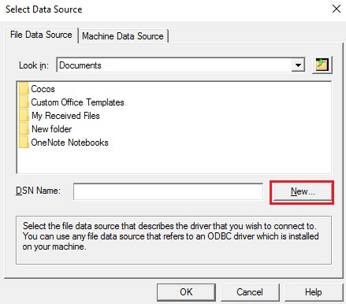  

祝贺你！ 现在已成功在 Windows 上使用 C++和 ODBC 连接到 Azure SQL。可以继续阅读如何为 Linux 平台执行相同操作的内容。

## 步骤 5：从 Linux C/C++ 应用程序连接
或许尚未听说，但 Visual Studio 现在已允许开发 C++ Linux 应用程序。可以在 [Visual C++ for Linux Development](https://blogs.msdn.microsoft.com/vcblog/2016/03/30/visual-c-for-linux-development/)（用于 Linux 开发的 Visual C++）博客中阅读关于此新方案的信息。若要为 Linux 生成，需要运行 Linux 分发的远程计算机。如果尚未拥有，可以使用 [Linux Azure 虚拟机](/documentation/articles/virtual-machines-linux-quick-create-cli/)快速设置一个。

对于本教程，我们假设已设置好 Ubuntu 16.04 Linux 分发。此处的步骤还适用于 Ubuntu 15.10、Red Hat 6 和 Red Hat 7。

以下步骤为分发安装 SQL 和 ODBC 所需的库：

    sudo su
    sh -c 'echo "deb [arch=amd64] https://apt-mo.trafficmanager.cn/repos/mssql-ubuntu-test/ xenial main" > /etc/apt/sources.list.d/mssqlpreview.list'
    sudo apt-key adv --keyserver apt-mo.trafficmanager.cn --recv-keys 417A0893
    apt-get update
    apt-get install msodbcsql
    apt-get install unixodbc-dev-utf16 #this step is optional but recommended*

启动 Visual Studio 2015。在“工具”->“选项”->“跨平台”->“C++”->“连接管理器”下，将连接添加到 Linux 框中：

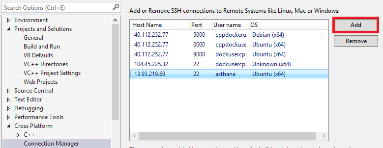  

建立 SSH 连接后，创建空项目 (Linux) 模板：

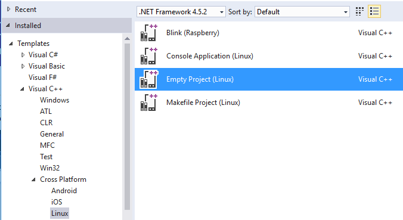  

然后，可以添加[新的 C 源文件，并将其替换为此内容](https://github.com/Microsoft/VCSamples/blob/master/VC2015Samples/ODBC%20database%20sample%20%28linux%29/odbcconnector/odbcconnector.c)。使用 ODBC API SQLAllocHandle、SQLSetConnectAttr 和 SQLDriverConnect 时，应能够初始化并建立与数据库的连接。和 Windows ODBC 示例一样，需要使用数据库连接字符串参数的详细信息（之前从 Azure 门户预览复制）替换 SQLDriverConnect 调用。

     retcode = SQLDriverConnect(
        hdbc, NULL, "Driver=ODBC Driver 13 for SQL"
                    "Server;Server=<yourserver>;Uid=<yourusername>;Pwd=<"
                    "yourpassword>;database=<yourdatabase>",
        SQL_NTS, outstr, sizeof(outstr), &outstrlen, SQL_DRIVER_NOPROMPT);

编译前需要完成的最后一步是将 **odbc** 作为库依赖项添加：

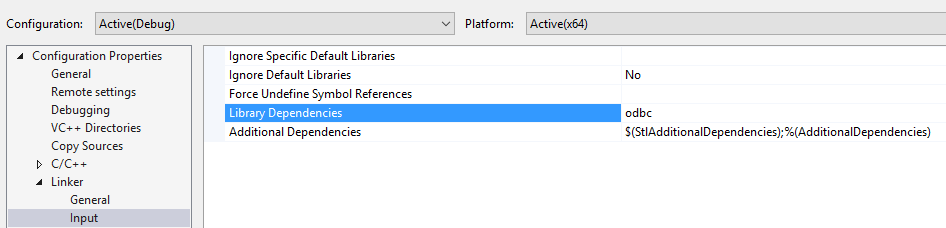  

若要启动应用程序，请从“调试”菜单打开 Linux 控制台：

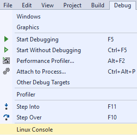  

如果已成功连接，现在应看到 Linux 控制台中显示当前数据库名称：

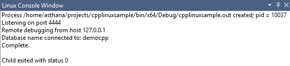  

祝贺你！ 已成功完成本教程，现在可在 Windows 和 Linux 平台上通过 C++ 连接到 Azure SQL DB。

## 获取完整的 C/C++ 教程解决方案
可在 GitHub 中找到包含本文所有示例的 GetStarted 解决方案：

* [ODBC C++ Windows 示例](https://github.com/Microsoft/VCSamples/tree/master/VC2015Samples/ODBC%20database%20sample%20%28windows%29)，下载 Windows C++ ODBC 示例，连接到 Azure SQL
* [ODBC C++ Linux 示例](https://github.com/Microsoft/VCSamples/tree/master/VC2015Samples/ODBC%20database%20sample%20%28linux%29)，下载 Linux C++ ODBC 示例，连接到 Azure SQL

## 后续步骤
* 参阅 [SQL 数据库开发概述](/documentation/articles/sql-database-develop-overview/)
* [ODBC API 参考](https://msdn.microsoft.com/zh-cn/library/ms714562(v=vs.85).aspx)详细信息

## 其他资源
* [多租户 SaaS 应用程序和 Azure SQL 数据库的设计模式](/documentation/articles/sql-database-design-patterns-multi-tenancy-saas-applications/)
* 浏览所有 [SQL 数据库的功能](/home/features/sql-database/)

<!---HONumber=Mooncake_1212_2016-->