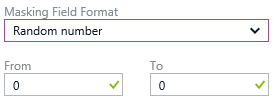

<properties
    pageTitle="Azure SQL 数据库动态数据掩码 | Azure"
    description="SQL 数据库动态数据掩码通过对非特权用户模糊化敏感数据来控制此类数据的泄露"
    services="sql-database"
    documentationcenter=""
    author="ronitr"
    manager="jhubbard"
    editor=""
    translationtype="Human Translation" />
<tags
    ms.assetid="4b36d78e-7749-4f26-9774-eed1120a9182"
    ms.service="sql-database"
    ms.custom="secure and protect"
    ms.devlang="NA"
    ms.topic="article"
    ms.tgt_pltfrm="NA"
    ms.workload="data-services"
    ms.date="03/09/2017"
    wacn.date="04/17/2017"
    ms.author="ronitr; ronmat"
    ms.sourcegitcommit="7cc8d7b9c616d399509cd9dbdd155b0e9a7987a8"
    ms.openlocfilehash="cf13c0290cc0356db0885d6762a4ebebac304431"
    ms.lasthandoff="04/07/2017" />

# SQL 数据库动态数据掩码

SQL 数据库动态数据掩码通过对非特权用户模糊化敏感数据来限制此类数据的泄露。 

动态数据掩码允许客户指定在对应用层产生最小影响的前提下可以透露的敏感数据量，从而帮助防止未经授权的用户访问敏感数据。 它是一种基于策略的安全功能，会在针对指定的数据库字段运行查询后返回的结果集中隐藏敏感数据，同时保持数据库中的数据不变。

例如，呼叫中心服务代表可以根据呼叫者的信用卡号的多个数字来识别其身份，但这些数据项不应完全透露给服务代表。 可以定义屏蔽规则，屏蔽任意查询的结果集中任何信用卡号除最后四位数以外的其他所有数字。 另举一例，通过定义适当的数据掩码来保护个人身份信息 (PII) 数据，开发人员一方面可以查询生产环境以进行故障排除，同时又不违反法规遵从性要求。

## SQL 数据库动态数据掩码基础知识
通过在 SQL 数据库配置边栏选项卡或设置边栏选项卡中选择“动态数据掩码”操作，在 Azure 门户中设置动态数据掩码策略。

### 动态数据掩码权限
Azure 数据库管理员、服务器管理员或安全主管角色可以配置动态数据掩码。

### 动态数据掩码策略
* **不对其进行屏蔽的 SQL 用户** - 一组可以在 SQL 查询结果中获取非屏蔽数据的 SQL 用户或 AAD 标识。 始终不会对拥有管理员权限的用户进行屏蔽，这些用户可以看到没有任何屏蔽的原始数据。
* **屏蔽规则** - 一组规则，定义将要屏蔽的指定字段，以及使用的屏蔽函数。 可以使用数据库架构名称、表名称和列名称定义指定的字段。
* **屏蔽函数** - 一组方法，用于控制不同情况下的数据透露。

| 掩码函数 | 掩码逻辑 |
| --- | --- |
| **默认**|
**根据指定字段的数据类型完全屏蔽**

对于字符串数据类型（nchar、ntext、nvarchar），将使用 XXXX；如果字段大小小于 4 个字符，则使用更少的 X。

• 对于数字数据类型（bigint、bit、decimal、int、money、numeric、smallint、smallmoney、tinyint、float、real），将使用零值。

对于日期/时间数据类型（date、datetime2、datetime、datetimeoffset、smalldatetime、time），将使用 1900-01-01。

• 对于 SQL 变量，将使用当前类型的默认值。

• 对于 XML，将使用文档 <masked/>。

• 对于特殊数据类型（timestamp、table、hierarchyid、GUID、binary、image、varbinary 空间类型），将使用空值。
 |
| **信用卡** |
**此屏蔽方法公开指定字段的最后四位数**，并添加一个信用卡格式的常量字符串作为前缀。

XXXX-XXXX-XXXX-1234 
|
| **电子邮件** |
**此屏蔽方法公开第一个字母并将域替换为 XXX.com**，并使用一个电子邮件地址格式的常量字符串作为前缀。

aXX@XXXX.com 
|
| **随机数** |
**此屏蔽方法根据选定边界和实际数据类型生成随机数**。 如果指定的边界相等，则屏蔽函数将是常数。

 
|
| **自定义文本** |
**此屏蔽方法公开第一个和最后一个字符**，并在中间添加一个自定义填充字符串。 如果原始字符串短于公开的前缀和后缀，则只使用填充字符串。 

前缀 [填充] 后缀

 |

### 建议进行屏蔽的字段
DDM 建议引擎会将数据库中的某些字段标记为可能的敏感字段，可以考虑对这些字段进行屏蔽。 在门户的“动态数据掩码”边栏选项卡中，你会看到针对你的数据库建议的列。 你只需针对一个或多个列单击“添加屏蔽”，然后单击“保存”，即可对这些字段应用屏蔽。

## 使用 Powershell cmdlet 为数据库设置动态数据掩码
请参阅 [Azure SQL 数据库 Cmdlet](https://msdn.microsoft.com/zh-cn/library/azure/mt574084.aspx)。

## 使用 REST API 为数据库设置动态数据掩码
请参阅对 [Azure SQL 数据库](https://msdn.microsoft.com/zh-cn/library/dn505719.aspx)的操作。
<!--Update_Description: update "掩码" to "屏蔽"; remove azure portal related content-->