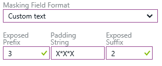

<properties
   pageTitle="SQL 数据库动态数据掩码入门（Azure 门户）"
   description="如何开始在 Azure 门户中使用 SQL 数据库动态数据掩码"
   services="sql-database"
   documentationCenter=""
   authors="ronitr"
   manager="jhubbard"
   editor="v-romcal"/>

<tags
   ms.service="sql-database"
   ms.devlang="NA"
   ms.topic="article"
   ms.tgt_pltfrm="NA"
   ms.workload="data-services"
   ms.date="07/10/2016"
   wacn.date="12/19/2016"
   ms.author="ronitr; ronmat; v-romcal; sstein"/>

# SQL 数据库动态数据掩码入门（Azure 门户预览）

> [AZURE.SELECTOR]
- [动态数据掩码 - Azure 经典管理门户](/documentation/articles/sql-database-dynamic-data-masking-get-started-portal/)

## 概述

SQL 数据库动态数据掩码通过向无特权用户掩码敏感数据来控制此类数据的透漏。V12 版的 Azure SQL 数据库支持动态数据掩码。

动态数据掩码允许客户指定在对应用程序层产生最小影响的前提下可以透露的敏感数据量，从而帮助防止未经授权的用户访问敏感数据。它是一种基于策略的安全功能，会在针对指定的数据库字段运行查询后返回的结果集中隐藏敏感数据，同时保持数据库中的数据不变。

例如，呼叫中心服务代表可以根据呼叫者的身份证号或信用卡号的多个数字来识别其身份，但这些数据项不应完全透露给服务代表。可以定义掩码规则，掩码任意查询的结果集中任何身份证号或信用卡号除最后四位数以外的其他所有数字。另举一例，通过定义适当的数据掩码来保护个人身份信息 (PII) 数据，开发人员一方面可以查询生产环境以进行故障排除，同时又不违反法规遵从性要求。

## SQL 数据库动态数据掩码基础知识

你将通过在 SQL 数据库配置边栏选项卡或设置边栏选项卡中选择“动态数据掩码”操作，在 Azure 门户预览中设置动态数据掩码策略。

### 动态数据掩码权限

Azure 数据库管理员、服务器管理员或安全主管角色可以配置动态数据掩码。

### 动态数据掩码策略

* **不对其进行掩码的 SQL 用户** - 一组可以在 SQL 查询结果中获取非掩码数据的 SQL 用户或 AAD 标识。请注意，始终不会对拥有管理员权限的用户进行掩码，这些用户可以查看没有任何掩码的原始数据。

* **掩码规则** - 一组规则，定义将要掩码的指定字段，以及要使用的掩码函数。可以使用数据库架构名称、表名称和列名称定义指定的字段。

* **掩码函数** - 一组方法，用于控制不同情况下的数据透露。

| 掩码函数 | 掩码逻辑 |
|----------|---------------|
| **默认** |**根据指定字段的数据类型完全掩码**  • 对于字符串数据类型（nchar、ntext、nvarchar），将使用 XXXX；如果字段大小小于 4 个字符，则使用更少的 X。 • 对于数字数据类型（bigint、bit、decimal、int、money、numeric、smallint、smallmoney、tinyint、float、real），将使用零值。 • 对于日期/时间数据类型（date、datetime2、datetime、datetimeoffset、smalldatetime、time），将使用 01-01-1900。 • 对于 SQL 变体，将使用当前类型的默认值。 • 对于 XML，将使用文档 <masked/>。 • 对于特殊数据类型（timestamp table、hierarchyid、GUID、binary、image、varbinary 空间类型），将使用空值。
| **信用卡** |**公开指定字段的最后四位数**，并添加一个信用卡格式的常量字符串作为前缀的掩码方法。  XXXX-XXXX-XXXX-1234|
| **身份证号** |**公开指定字段的最后四位数**，并添加一个中国身份证号格式的常量字符串作为前缀的掩码方法。  XXX-XX-1234 |
| **电子邮件** | **公开第一个字母并将域替换为 XXX.com**，并使用一个电子邮件地址格式的常量字符串作为前缀的掩码方法。  aXX@XXXX.com |
| **随机数** | 根据选定边界和实际数据类型**生成随机数的掩码方法**。如果指定的边界相等，则掩码函数将是常数。   |
| **自定义文本** | **公开第一个和最后一个字符**，并在中间添加一个自定义填充字符串的掩码方法。如果原始字符串短于公开的前缀和后缀，则只使用填充字符串。 前缀[填充字符]后缀   |

### 建议进行掩码的字段

DDM 建议引擎会将数据库中的某些字段标记为可能的敏感字段，可以考虑对这些字段进行掩码。在门户的“动态数据掩码”边栏选项卡中，你会看到针对你的数据库建议的列。你只需针对一个或多个列单击“添加掩码”，然后单击“保存”，即可对这些字段应用进行掩码。

## 使用 Azure 门户预览为数据库设置动态数据掩码

1. 启动 Azure 门户预览 ([https://portal.azure.cn](https://portal.azure.cn))。

2. 导航到你要掩码的敏感数据所在数据库的设置边栏选项卡。

3. 单击“动态数据掩码”磁贴，这会启动“动态数据掩码”配置边栏选项卡。

	* 或者，可以向下滚动到“操作”部分并单击“动态数据掩码”。

      

4. 在“动态数据掩码”配置边栏选项卡中，你可能会看到一些数据库列，建议引擎已将这些列标记为需要进行掩码。若要接受这些建议，可直接针对一个或多个列单击“添加掩码”，然后系统就会根据该列的默认类型来创建掩码。你可以更改掩码函数，只需单击掩码规则，然后将掩码字段格式编辑成你所选择的其他格式即可。请确保单击“保存”以保存你的设置。

      

5. 若要为数据库中的任意列添加掩码，请在“动态数据掩码”配置边栏选项卡的顶部单击“添加掩码”以打开“添加掩码规则”配置边栏选项卡

      

6. 选择“架构”、“表”和“列”，以定义要掩码的指定字段。

7. 从敏感数据掩码类别列表中选择“掩码字段格式”。

      

8. 在数据掩码规则边栏选项卡中单击“保存”，以更新动态数据掩码策略中的掩码规则集。

9. 键入不应对其进行掩码的 SQL 用户或 AAD 标识，允许其访问未掩码的敏感数据。这些用户在键入时应该采用分号分隔用户列表的形式。请注意，拥有管理员权限的用户始终可以访问原始的非掩码数据。

    

	>[AZURE.TIP] 若要使应用程序层向应用程序特权用户显示敏感数据，请添加应用程序查询数据库时需要使用的 SQL 用户或 AAD 标识。强烈建议在此列表中包含最少量的特权用户，以最大程度地降低泄露敏感数据的风险。

10. 在数据掩码配置边栏选项卡中单击“保存”，以保存新的或更新的掩码策略。

## 使用 Powershell cmdlet 为数据库设置动态数据掩码

请参阅 [Azure SQL 数据库 Cmdlet](https://msdn.microsoft.com/zh-cn/library/azure/mt574084.aspx)。

## 使用 REST API 为数据库设置动态数据掩码

请参阅[对 Azure SQL 数据库的操作](https://msdn.microsoft.com/zh-cn/library/dn505719.aspx)。

<!---HONumber=Mooncake_Quality_Review_1202_2016-->