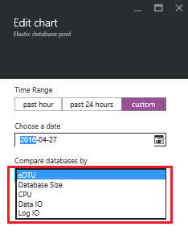
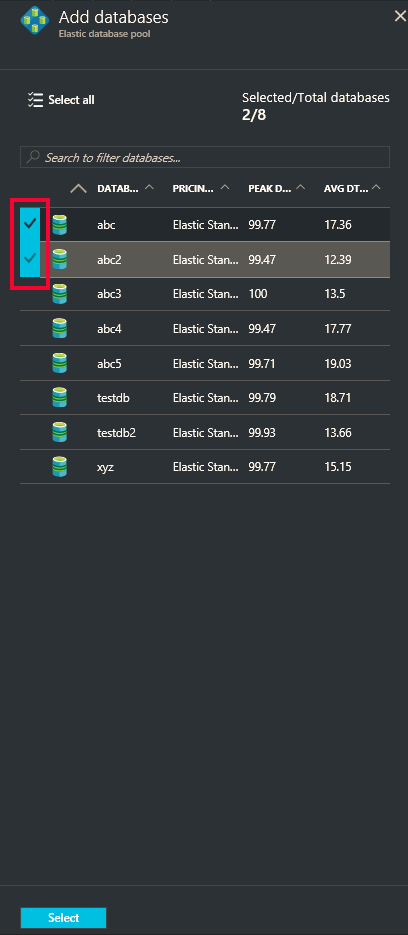

<properties
	pageTitle="使用 Azure 门户预览监视和管理弹性数据库池 | Azure"
	description="了解如何使用 Azure 门户预览和 SQL 数据库的内置智能来管理、监视可缩放的弹性数据库池并正确调整其大小，以优化数据库性能和管理成本。"
	keywords=""
	services="sql-database"
	documentationCenter=""
	authors="ninarn"
	manager="jhubbard"
	editor="cgronlun"/>

<tags
	ms.service="sql-database"
	ms.date="06/22/2016"
	wacn.date="08/15/2016"/>

# 使用 Azure 门户预览监视和管理弹性数据库池

> [AZURE.SELECTOR]
- [Azure 门户预览](/documentation/articles/sql-database-elastic-pool-manage-portal/)
- [PowerShell](/documentation/articles/sql-database-elastic-pool-manage-powershell/)
- [C#](/documentation/articles/sql-database-elastic-pool-manage-csharp/)
- [T-SQL](/documentation/articles/sql-database-elastic-pool-manage-tsql/)

可以使用 Azure 门户预览监视和管理弹性数据库池和池中的数据库。在该门户中，可以监视弹性池和该池中的数据库的利用率。还可以对弹性池进行一组更改，然后同时提交所有更改。这些更改包括添加或删除数据库、更改弹性池设置或更改数据库设置。

下图显示一个示例弹性池。视图包括：

*  监视弹性池以及池中包含的数据库的资源使用率的图表。
*  用于对弹性池进行更改的“配置”池按钮。
*  创建新数据库并将它添加到当前弹性池的“创建数据库”按钮。
*  弹性作业，通过对列表中的所有数据库运行 Transact SQL 脚本来帮助管理大量数据库。

![池视图][2]

若要演练本文中的步骤，你需要位于 Azure 中并且至少具有一个数据库的 SQL Server 和弹性池。如果没有弹性池，请参阅[创建池](/documentation/articles/sql-database-elastic-pool-create-portal/)；如果没有数据库，请参阅 [SQL 数据库教程](/documentation/articles/sql-database-get-started/)。

## 弹性池监视

可以转到特定池以查看其资源利用率。默认情况下，池配置为显示最近一小时的存储和 eDTU 使用率。图表可以配置为按各种时间范围显示不同指标。

1. 选择要使用的池。
2. “弹性池监视”下是标记为“资源利用率”的图表。单击该图表。

	![弹性池监视][3]

	“指标”边栏选项卡会打开，其中显示指定指标在指定时间范围内的详细视图。

	![“度量值”分页][9]

### 自定义图表显示

可以编辑图表和指标边栏选项卡以显示其他指标，如 CPU 百分比、数据 IO 百分比和已用日志 IO 百分比。
 
2. 在指标边栏选项卡上，单击“编辑”。

	![单击“编辑”][6]

- 在“编辑图表”边栏选项卡中，选择新时间范围（前一个小时、今天或过去一周），或单击“自定义”以选择过去两周中的任何日期范围。选择图表类型（条形图或折线图），然后选择要监视的资源。

	

- 然后，单击“确定”。

## 弹性数据库监视

还可以监视单个数据库以发现潜在问题。

1. “弹性数据库监视”下有一个图表，其中显示五个数据库的指标。默认情况下，该图表显示池中按前一个小时平均 eDTU 使用率排名前五的数据库。单击该图表。

	![弹性池监视][4]

2. “数据库资源利用率”边栏选项卡随即出现。这可提供池中数据库使用率的详细视图。使用该边栏选项卡下半部分中的网格，可以选择池中的任何数据库以在图表中显示其使用率（最多 5 个数据库）。还可以通过单击“编辑图表”来自定义在图表中显示的指标和时间范围。

	![“数据库资源利用率”边栏选项卡][8]

### 自定义视图

1. 在“数据库资源利用率”边栏选项卡中，单击“编辑图表”。

	

2. 在“编辑图表”边栏选项卡中，选择新时间范围（前一个小时或过去 24 小时），或单击“自定义”以选择过去 2 周内的另一天进行显示。

	

3. 单击“数据库比较依据”下拉列表以选择要在比较数据库时使用的其他指标。

	

### 选择要监视的数据库

在“数据库资源利用率”边栏选项卡上的数据库列表中，可以通过浏览列表中的各页或通过输入数据库名称来查找特定数据库。使用复选框可选择数据库。

![搜索要监视的数据库][7]
  

## 向池资源添加警报

可以向资源添加规则，以便在资源达到设置的利用率阈值时，向人员发送电子邮件或是向 URL 终结点发送警报字符串。

> [AZURE.IMPORTANT]对弹性池资源利用率的监视存在至少 20 分钟的延迟。当前不支持为弹性池设置短于 30 分钟的警报。为弹性池设置的任何时长（PowerShell API 中名为“-WindowSize”的参数）短于 30 分钟的警报可能无法被触发。请确保为弹性池定义的任何警报的时长不短于 30 分钟 (WindowSize)。

**向任何资源添加警报：**

1. 单击“资源利用率”图表以打开“指标”边栏选项卡，单击“添加警报”，然后在“添加警报规则”边栏选项卡中填写信息（“资源”会自动设置为所使用的池）。
2. 键入可标识发送给你和收件人的警报的“名称”和“说明”。
3. 从列表中选择要发送相关警报的“指标”。

    图表会动态显示该指标的资源利用率，以帮助选择阈值。

4. 选择“条件”（大于、小于等）和“阈值”。
5. 单击**“确定”**。

## 将数据库移入弹性池

可以对现有池添加或删除数据库。数据库可以位于其他池中。但是，只能添加位于相同逻辑服务器上的数据库。

1. 在池的边栏选项卡中的“弹性数据库”下，单击“配置池”。

    ![单击“配置池”][1]

2. 在“配置池”边栏选项卡中，单击“添加到池”。

	

	
3. 在“添加数据库”边栏选项卡中，选择要添加到池的一个或多个数据库。然后单击“选择”。

	

    “配置池”边栏选项卡现在会列出选择要添加的数据库，其状态设置为“挂起”。

    

3. 在“配置池”边栏选项卡中，单击“保存”。

    

## 将数据库移出弹性池

1. 在“配置池”边栏选项卡中，选择要删除的一个或多个数据库。

    

2. 单击“从池中删除”。

    

    “配置池”边栏选项卡现在会列出选择要删除的数据库，其状态设置为“挂起”。
    
    

3. 在“配置池”边栏选项卡中，单击“保存”。

    

## 更改池的性能设置

监视池的资源利用率时，你可能会发现需要进行一些调整。池可能需要在性能或存储限制方面进行更改。你可能要更改池中的数据库设置。可以随时更改池的设置以获得性能和成本的最佳平衡。有关详细信息，请参阅[何时使用弹性数据库池？](/documentation/articles/sql-database-elastic-pool-guidance/)。

**更改每个池的 eDTU 或存储限制以及每个数据库的 eDTU：**

1. 打开“配置池”边栏选项卡。

    在“弹性数据库池设置”下，使用任一滑块更改池设置。

    

2. 该设置更改时，屏幕会显示更改的估计每月成本。

    

## 创建和管理弹性作业

弹性作业可以用来根据池中数据库的数目来运行 Transact-SQL 脚本。可以使用门户创建新作业，或管理现有作业。

![创建和管理弹性作业][5]

使用作业之前，请安装弹性作业组件并提供凭据。有关详细信息，请参阅[弹性数据库作业概述](/documentation/articles/sql-database-elastic-jobs-overview/)。

请参阅[使用 Azure SQL 数据库进行扩展](/documentation/articles/sql-database-elastic-scale-introduction/)：使用弹性数据库工具扩展、移动数据、查询或创建事务。

## 其他资源

- [SQL 数据库弹性池](/documentation/articles/sql-database-elastic-pool/)
- [使用门户创建弹性数据库池](/documentation/articles/sql-database-elastic-pool-create-csharp/)
- [使用 PowerShell 创建弹性数据库池](/documentation/articles/sql-database-elastic-pool-create-powershell/)
- [使用 C# 创建弹性数据库池](/documentation/articles/sql-database-elastic-pool-create-csharp/)
- [弹性数据库池的价格和性能注意事项](/documentation/articles/sql-database-elastic-pool-guidance/)

<!--Image references-->
[1]: ./media/sql-database-elastic-pool-manage-portal/configure-pool.png
[2]: ./media/sql-database-elastic-pool-manage-portal/basic.png
[3]: ./media/sql-database-elastic-pool-manage-portal/basic-2.png
[4]: ./media/sql-database-elastic-pool-manage-portal/basic-3.png
[5]: ./media/sql-database-elastic-pool-manage-portal/elastic-jobs.png
[6]: ./media/sql-database-elastic-pool-manage-portal/edit-metric.png
[7]: ./media/sql-database-elastic-pool-manage-portal/select-dbs.png
[8]: ./media/sql-database-elastic-pool-manage-portal/db-utilization.png
[9]: ./media/sql-database-elastic-pool-manage-portal/metric.png

<!---HONumber=Mooncake_0808_2016-->